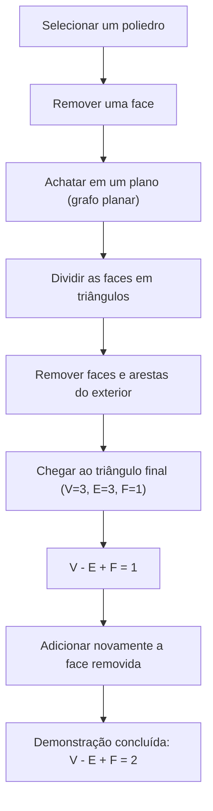
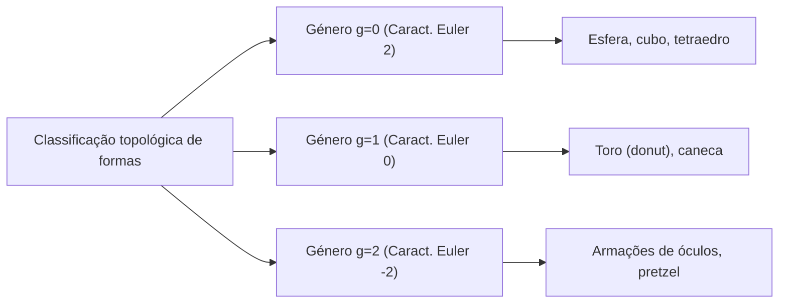

## Introdução: Um dos Teoremas Mais Belos da Matemática

No mundo da matemática, existem algumas fórmulas mágicas que revelam conexões surpreendentes entre fenômenos aparentemente não relacionados. Entre elas, a **Fórmula de Euler para poliedros**, descoberta por [Leonhard Euler](https://kenji.blog/pt/p/euler/), destaca-se por sua simplicidade e universalidade.

A fórmula é simplesmente esta:

$$V - E + F = 2$$

Aqui, cada letra representa um elemento do poliedro:
- **$V$** (Vértices): Número de vértices
- **$E$** (Arestas, Edges em inglês): Número de arestas
- **$F$** (Faces): Número de faces

Não importa como você distorça a forma, ou quão complexo seja o poliedro, contanto que seja um sólido sem "buracos", o resultado deste cálculo será sempre **$2$**. Este fato não é apenas um mero quebra-cabeça geométrico; tornou-se uma chave crucial que abriu um campo massivo da matemática conhecido mais tarde como "Topologia".

Neste artigo, aprofundaremos como esse misterioso teorema funciona, sua demonstração e os conceitos da topologia que se conectam à ciência moderna.

## Verificando a Fórmula com os Poliedros Regulares

Primeiro, vamos verificar se $V - E + F = 2$ realmente se sustenta usando os cinco poliedros regulares, também conhecidos como "Sólidos Platônicos".

| Nome do Poliedro | Vértices ($V$) | Arestas ($E$) | Faces ($F$) | $V - E + F$ |
| --- | --- | --- | --- | --- |
| Tetraedro | 4 | 6 | 4 | $4 - 6 + 4 = 2$ |
| Hexaedro / Cubo | 8 | 12 | 6 | $8 - 12 + 6 = 2$ |
| Octaedro | 6 | 12 | 8 | $6 - 12 + 8 = 2$ |
| Dodecaedro | 20 | 30 | 12 | $20 - 30 + 12 = 2$ |
| Icosaedro | 12 | 30 | 20 | $12 - 30 + 20 = 2$ |

De fato, independentemente de qual poliedro regular escolhamos, o resultado é esplendidamente **$2$**. Isso não é mera coincidência. Seja um cubo usado como dado ou um icosaedro familiar em jogos de RPG, o número **$2$** é derivado como uma verdade universal.

## Uma Demonstração Intuitiva da Fórmula de Euler

Por que é sempre igual a **$2$**? Vejamos uma demonstração intuitiva pelo matemático francês [Augustin-Louis Cauchy](https://kenji.blog/pt/p/cauchy/) (1811). Esta demonstração adota uma abordagem revolucionária ao transformar um sólido 3D em um "grafo planar".

### Passo 1: Achatando o Sólido em um Plano

Primeiro, remova uma face do poliedro. Por exemplo, imagine remover a face superior de um cubo. Estique a caixa restante como se fosse borracha e pressione-a em uma superfície plana. Você obterá um "Diagrama de Schlegel" (um grafo planar) onde as faces restantes são desenhadas como polígonos menores dentro de uma moldura exterior maior.

Como removemos uma face, a equação que precisamos demonstrar muda para $V - E + F = 1$.

### Passo 2: Triangulando as Faces

Desenhe diagonais para dividir cada polígono no grafo planar em triângulos.
Desenhar uma diagonal adiciona 1 aresta ($E$) e 1 face ($F$).
Portanto, $V - (E + 1) + (F + 1) = V - E + F$, mantendo inalterado o valor da fórmula.

### Passo 3: Removendo [Tri](https://kenji.blog/pt/p/sorting-algorithms/)ângulos do Exterior

Quando todas as faces forem triângulos, comece a removê-las uma por uma a partir do exterior.
Ao removê-las, um dos dois padrões a seguir ocorrerá:

1. **Remover uma aresta exterior**: 1 aresta ($E$) é perdida, e 1 face ($F$) é perdida. O valor da fórmula permanece inalterado.
2. **Remover duas arestas exteriores e o vértice entre elas**: 1 vértice ($V$) é perdido, 2 arestas ($E$) são perdidas, e 1 face ($F$) é perdida. $(V - 1) - (E - 2) + (F - 1) = V - E + F$, de modo que o valor também permanece inalterado.

### Passo 4: O Último [Tri](https://kenji.blog/pt/p/sorting-algorithms/)ângulo

Ao repetir esta operação, restará apenas um único triângulo.
Este triângulo tem 3 vértices, 3 arestas e 1 face.
Calculando, obtemos $3 - 3 + 1 = 1$.

Lembrando que removemos uma face no início, restaurá-la na equação original nos dá $1 + 1 = 2$, demonstrando magnificamente que $V - E + F = 2$!

## O Manuscrito Secreto de [Descartes](https://kenji.blog/pt/p/descartes/): Outra História de Descoberta

Na verdade, cerca de um século antes de Euler publicar este teorema, o filósofo e matemático francês [René Descartes](https://kenji.blog/pt/p/descartes/) já havia chegado essencialmente ao mesmo resultado.
[Descartes](https://kenji.blog/pt/p/descartes/) concentrou-se no conceito de "defeito angular" nos vértices de um poliedro.
A soma dos ângulos que se encontram em um único vértice é de $360^\circ$ em um plano, mas no vértice de um sólido, é sempre menor que $360^\circ$. A essa diferença para chegar a $360^\circ$ dá-se o nome de "defeito angular".

[Descartes](https://kenji.blog/pt/p/descartes/) descobriu um teorema surpreendente: "Se você somar os defeitos angulares de todos os vértices, o total será sempre de $720^\circ$ para qualquer poliedro."
Expresso como uma fórmula:

$$ \sum (\text{Defeito angular}) = 720^\circ $$

Este teorema é matematicamente equivalente à fórmula de Euler $V - E + F = 2$. No entanto, [Descartes](https://kenji.blog/pt/p/descartes/) nunca publicou esta descoberta, mantendo-a oculta num manuscrito encriptado. Após a sua morte, o manuscrito foi decifrado por Leibniz, mas não se tornou amplamente conhecido. Consequentemente, esta grande propriedade foi redescoberta por Euler e passou à história como a "Fórmula de Euler".

## O Nascimento da Topologia: "Geometria da Folha de Borracha"

O aspeto mais inovador do teorema de Euler é que ele **não depende de todo de "comprimentos" ou "ângulos"**.
Quer esculpa um cubo redondo como uma esfera, ou o estique longo e fino como uma agulha, a fórmula de Euler permanece verdadeira, desde que o número de vértices, arestas e faces permaneça inalterado.

O ramo da matemática que estuda estas propriedades, que permanecem inalteradas mesmo quando uma forma é deformada continuamente como argila, chama-se **Topologia**. No mundo da topologia, uma chávena de café e um donut são considerados como tendo a "mesma forma" (homeomorfos) porque partilham a estrutura comum de ter "um buraco".

### Poliedros com Buracos e a "Característica de Euler"

Então, o que acontece ao valor de $V - E + F$ no caso de um poliedro com um "buraco" como um donut (um poliedro toroidal)?
Na verdade, este valor muda à medida que o número de buracos (género: $g$) aumenta.

A fórmula geral expande-se da seguinte forma:

$$V - E + F = 2 - 2g$$

Este valor de $V - E + F$ chama-se a **Característica de Euler** ($\chi$, chi).

- Homeomorfo a uma esfera (sem buracos): $g = 0 \implies \chi = 2$
- Homeomorfo a um toro (1 buraco): $g = 1 \implies \chi = 0$
- Sólido com 2 buracos: $g = 2 \implies \chi = -2$

## A Fórmula de Euler-[Poincaré](https://kenji.blog/pt/p/poincare/): Um Salto para as Multidimensões

Desde o final do século XIX até ao século XX, matemáticos como [Henri Poincaré](https://kenji.blog/pt/p/poincare/) expandiram ainda mais o teorema de Euler para espaços de maior dimensão. Isto tornou-se na **Fórmula de Euler-[Poincaré](https://kenji.blog/pt/p/poincare/)**.
Ao generalizar os elementos de um poliedro, consideraram a soma alternada do número de elementos numa forma de $n$-dimensões.

$$ \chi = k_0 - k_1 + k_2 - k_3 + \dots + (-1)^n k_n $$

Aqui, $k_i$ representa o número de elementos de $i$-dimensões.
[Poincaré](https://kenji.blog/pt/p/poincare/) provou que este $\chi$ está profundamente ligado a invariantes topológicas chamadas "Números de Betti".
Intuitivamente, o número de Betti $b_i$ representa "o número de buracos de $i$-dimensões".

$$ \chi = b_0 - b_1 + b_2 - b_3 + \dots $$

Esta descoberta provou que a abordagem combinatória de "contar elementos" coincide perfeitamente com a abordagem algébrica de "contar buracos no espaço".

## Aplicações na Ciência Moderna

Os conceitos de topologia, que começaram com a simples equação $V - E + F = 2$, aplicam-se hoje para além da matemática em vários campos científicos.

### 1. Fulerenos ($C_{60}$) e a Química
O "fulereno" é uma molécula em que os átomos de carbono se unem sob a forma de uma bola de futebol. Os químicos utilizaram o teorema de Euler para provar teoricamente o facto de que "não se pode criar uma molécula esférica fechada sem 12 pentágonos".

### 2. Teoria de Redes e Teoria de Grafos
A sociedade moderna está repleta de "redes", como o encaminhamento da internet e a conceção de redes de transportes. A fórmula de Euler serve de base para determinar se estas redes podem ser desenhadas num plano sem interseções. É também indispensável para provar o "Teorema das quatro cores".

### 3. Análise de Dados Topológicos (TDA)
Recentemente, despertou interesse na IA e na aprendizagem automática um método de análise da "forma" do big data utilizando técnicas topológicas. Ao calcular a característica de Euler a partir de dados complexos de alta dimensão, os investigadores tentam descobrir padrões ocultos cruciais.

## Conclusão

**$V - E + F = 2$** 

Uma equação de subtração e adição que até uma criança pode calcular parte dos sólidos platónicos, liga chávenas de café e donuts, e chega até à vanguarda da ciência de dados. Este mesmo facto é o maior encanto da matemática.

Não importa como mudem as formas dos objetos que vemos diariamente, existe uma "essência" que nunca muda. O teorema dos poliedros de Euler fala-nos de tão belas verdades através de mais de 300 anos de história.
