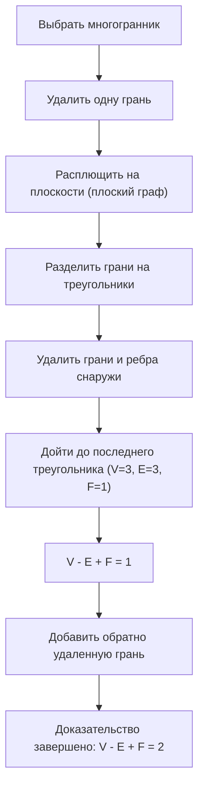
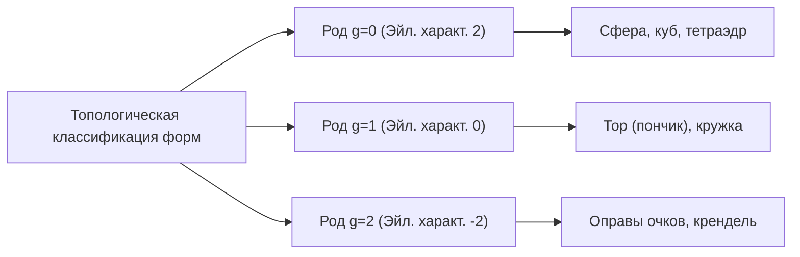

## Введение: Одна из самых красивых теорем в математике

В мире математики есть несколько магических формул, которые раскрывают удивительные связи между, казалось бы, не связанными явлениями. Среди них **формула Эйлера для многогранников**, открытая Леонардом Эйлером, выделяется своей абсолютной простотой и универсальностью.

Формула выглядит так:

$$V - E + F = 2$$

Здесь каждая буква обозначает элемент многогранника:
- **$V$** (Vertices/Вершины): Количество вершин
- **$E$** (Edges/Ребра): Количество ребер
- **$F$** (Faces/Грани): Количество граней

Как бы вы ни искажали форму, или каким бы сложным ни был многогранник, до тех пор, пока он представляет собой фигуру без «дыр», результат этого вычисления всегда будет равен **$2$**. Этот факт — не просто геометрическая головоломка; он стал важнейшим ключом, открывшим огромную область математики, позже получившую название «топология».

В этой статье мы подробно рассмотрим, как работает эта таинственная теорема, ее доказательство и концепции топологии, связанные с современной наукой.

## Проверка формулы на правильных многогранниках

Сначала давайте проверим, действительно ли выполняется $V - E + F = 2$, используя пять правильных многогранников, также известных как «Платоновы тела».

| Название многогранника | Вершины ($V$) | Ребра ($E$) | Грани ($F$) | $V - E + F$ |
| --- | --- | --- | --- | --- |
| Тетраэдр | 4 | 6 | 4 | $4 - 6 + 4 = 2$ |
| Гексаэдр / Куб | 8 | 12 | 6 | $8 - 12 + 6 = 2$ |
| Октаэдр | 6 | 12 | 8 | $6 - 12 + 8 = 2$ |
| Додекаэдр | 20 | 30 | 12 | $20 - 30 + 12 = 2$ |
| Икосаэдр | 12 | 30 | 20 | $12 - 30 + 20 = 2$ |

Действительно, какой бы правильный многогранник мы ни выбрали, результат неизменно равен **$2$**. Это не просто совпадение. Будь то куб, используемый в качестве игральной кости, или икосаэдр, знакомый по ролевым играм, число **$2$** выводится как универсальная истина.

## Интуитивное доказательство формулы Эйлера

Почему результат всегда равен **$2$**? Давайте рассмотрим интуитивное доказательство французского математика Огюстена Луи Коши (1811). В этом доказательстве применяется новаторский подход к преобразованию трехмерного тела в «плоский граф».

### Шаг 1: Расплющивание тела на плоскости

Сначала удалите одну грань многогранника. Например, представьте, что вы удаляете верхнюю грань куба. Растяните оставшуюся коробку, как резину, и прижмите её к плоскости. Вы получите «диаграмму Шлегеля» (плоский граф), где оставшиеся грани нарисованы как меньшие многоугольники внутри большой внешней рамки.

Поскольку мы удалили одну грань, доказываемое нами уравнение меняется на $V - E + F = 1$.

### Шаг 2: Триангуляция граней

Нарисуйте диагонали, чтобы разделить каждый многоугольник в плоском графе на треугольники.
Проведение одной диагонали добавляет 1 ребро ($E$) и 1 грань ($F$).
Таким образом, $V - (E + 1) + (F + 1) = V - E + F$, а значит значение формулы остается неизменным.

### Шаг 3: Удаление треугольников снаружи

Как только все грани станут треугольниками, начните удалять их по одному снаружи.
При их удалении возникнет одна из двух следующих ситуаций:

1. **Удаление внешнего ребра**: теряется 1 ребро ($E$) и теряется 1 грань ($F$). Значение формулы остается неизменным.
2. **Удаление двух внешних ребер и вершины между ними**: теряется 1 вершина ($V$), теряются 2 ребра ($E$) и 1 грань ($F$). $(V - 1) - (E - 2) + (F - 1) = V - E + F$, поэтому значение снова остается неизменным.

### Шаг 4: Последний треугольник

Повторяя эту операцию, в конце концов у вас останется только один единственный треугольник.
У этого треугольника 3 вершины, 3 ребра и 1 грань.
Ее расчет дает $3 - 3 + 1 = 1$.

Вспомнив, что в самом начале мы удалили одну грань, восстановление её в первоначальном уравнении дает $1 + 1 = 2$, что блестяще доказывает: $V - E + F = 2$!

## Секретная рукопись Декарта: Еще одна история открытия

На самом деле, примерно за столетие до того, как Эйлер опубликовал эту теорему, французский философ и математик [Рене Декарт](https://kenji.blog/ru/p/descartes/) по сути пришел к той же теореме.
Декарт сосредоточился на концепции «углового дефекта» в вершинах многогранника.
Сумма углов, сходящихся в одной вершине, на плоскости составляет $360^\circ$, но в вершине объемной фигуры она всегда меньше $360^\circ$. Этот недостаток до $360^\circ$ называется «угловым дефектом».

Декарт открыл удивительную теорему: «Если сложить угловые дефекты всех вершин, в сумме всегда будет получаться $720^\circ$ для любого многогранника».
В виде формулы это выглядит так:

$$ \sum (\text{Угловой дефект}) = 720^\circ $$

Эта теорема математически абсолютно эквивалентна формуле Эйлера $V - E + F = 2$. Однако Декарт так и не опубликовал это открытие, скрыв его в зашифрованной рукописи. После его смерти рукопись была расшифрована Лейбницем, но не получила широкой известности. Впоследствии это великое свойство было переоткрыто Эйлером и вошло в историю как «формула Эйлера».

## Рождение топологии: «Геометрия резинового листа»

Самый новаторский аспект теоремы Эйлера заключается в том, что она **абсолютно не зависит от «длин» или «углов»**.
Вылепите ли вы куб круглым, как сферу, или вытяните его длинным и тонким, как игла, формула Эйлера остается верной, пока количество вершин, ребер и граней не меняется.

Раздел математики, изучающий такие свойства, которые остаются неизменными даже при непрерывной деформации формы, как из глины, называется **топологией**. В мире топологии кофейная чашка и пончик считаются имеющими «одинаковую форму» (гомеоморфными), поскольку они имеют общую структуру: наличие «одного отверстия».

### Многогранники с отверстиями и «Эйлерова характеристика»

Итак, что же происходит со значением $V - E + F$ в случае многогранника с «отверстием», похожего на пончик (тороидального многогранника)?
Фактически, это значение меняется по мере увеличения числа отверстий (род: $g$).

Общая формула расширяется следующим образом:

$$V - E + F = 2 - 2g$$

Это значение $V - E + F$ называется **эйлеровой характеристикой** ($\chi$, хи).

- Гомеоморфен сфере (нет отверстий): $g = 0 \implies \chi = 2$
- Гомеоморфен тору (1 отверстие): $g = 1 \implies \chi = 0$
- Тело с 2 отверстиями: $g = 2 \implies \chi = -2$

## Формула Эйлера-Пуанкаре: Прыжок в многомерность

С конца 19-го по 20-й век математики, в том числе [Анри Пуанкаре](https://kenji.blog/ru/p/poincare/), распространили теорему Эйлера на пространства еще более высокой размерности. Это стало **формулой Эйлера-Пуанкаре**.
Обобщая элементы многогранника, они рассмотрели знакочередующуюся сумму числа элементов в $n$-мерной форме.

$$ \chi = k_0 - k_1 + k_2 - k_3 + \dots + (-1)^n k_n $$

Здесь $k_i$ представляет количество $i$-мерных элементов.
Пуанкаре доказал, что этот параметр $\chi$ тесно связан с топологическими инвариантами, называемыми «числами Бетти».
Интуитивно понятно, что число Бетти $b_i$ представляет собой «количество $i$-мерных отверстий».

$$ \chi = b_0 - b_1 + b_2 - b_3 + \dots $$

Это открытие доказало, что комбинаторный подход к «подсчету элементов» идеально сочетается с алгебраическим подходом к «подсчету отверстий в пространстве».

## Применение в современной науке

Концепции топологии, начавшиеся с простого уравнения $V - E + F = 2$, теперь применяются не только в математике, но и в различных областях науки.

### 1. Фуллерены ($C_{60}$) и химия
«Фуллерен» — это молекула, в которой атомы углерода связаны в форме футбольного мяча. Химики использовали теорему Эйлера, чтобы теоретически доказать тот факт, что «невозможно создать закрытую сферическую молекулу без 12 пятиугольников».

### 2. Теория сетей и теория графов
Современное общество наполнено «сетями», такими как маршрутизация в Интернете и проектирование транспортных сетей. Формула Эйлера служит основой для определения того, можно ли нарисовать эти сети на плоскости без пересечений. Она также незаменима для доказательства «Теоремы о четырех красках».

### 3. Топологический анализ данных (TDA)
В последнее время в области ИИ и машинного обучения внимание привлекает метод анализа «формы» больших данных с использованием топологических методов. Рассчитывая эйлерову характеристику на основе сложных многомерных данных, исследователи пытаются выявить важные скрытые закономерности.

## Заключение

**$V - E + F = 2$** 

Уравнение вычитания и сложения, которое может рассчитать даже ребенок, начинается от платоновых тел, связывает кофейные чашки и пончики и доходит до самых передовых рубежей науки о данных. Именно этот факт и является главным очарованием математики.

Как бы ни менялись формы предметов, которые мы видим каждый день, существует «суть», которая никогда не меняется. [Формула Эйлера для многогранников](https://kenji.blog/ru/p/eulers-polyhedron-formula/) рассказывает нам о таких прекрасных истинах на протяжении более чем 300 лет истории.
