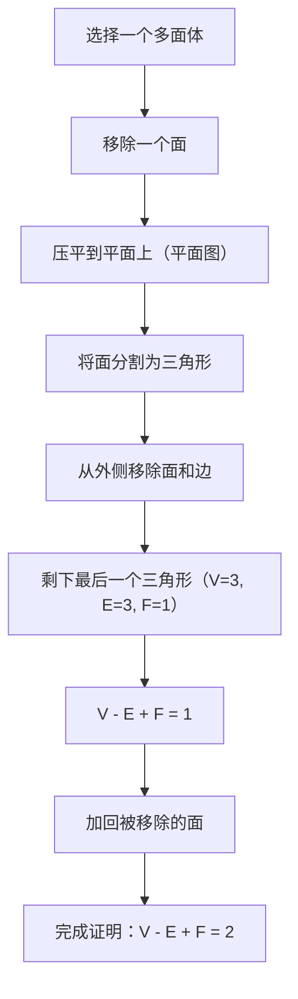
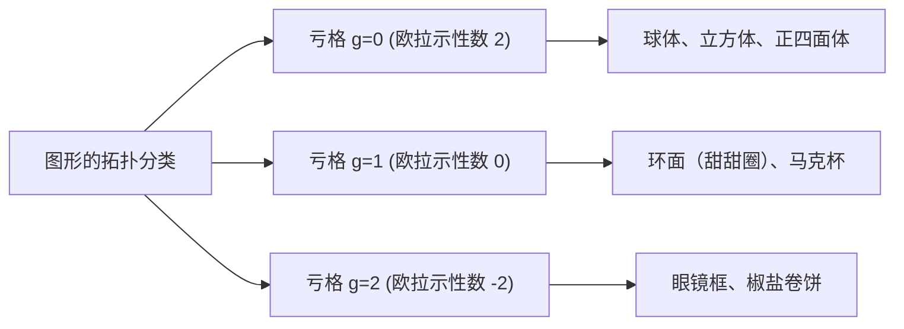

## 引言：数学中最美的定理之一

在数学世界里，有一些犹如魔法般的公式，能在看似毫不相干的事物之间建立起令人惊叹的联系。其中，由[莱昂哈德·欧拉](https://kenji.blog/zh-cn/p/euler/)（Leonhard Euler）发现的 **[欧拉多面体定理](https://kenji.blog/zh-cn/p/eulers-polyhedron-formula/)** （Euler's polyhedron formula），以其无与伦比的简洁性和普适性脱颖而出。

这个公式非常简单：

$$V - E + F = 2$$

在这里，每个字母代表多面体的一个元素：
- **$V$** (Vertices)：顶点的数量
- **$E$** (Edges)：边的数量
- **$F$** (Faces)：面的数量

无论你如何扭曲形状，或者多面体有多么复杂，只要它是一个没有“洞”的立体，计算结果永远是 **$2$** 。这一事实不仅仅是一个几何学上的谜题，它后来成为了开启被称为“拓扑学”（Topology）这一庞大数学分支的关键钥匙。

在本文中，我们将深入探讨这个神秘定理的运作原理、它的证明，以及连接现代科学的拓扑学概念。

## 用正多面体验证公式

首先，让我们用最基本的立体——也就是被称为“柏拉图立体”的五个正多面体——来验证 $V - E + F = 2$ 是否真的成立。

| 多面体名称 | 顶点 ($V$) | 边 ($E$) | 面 ($F$) | $V - E + F$ |
| --- | --- | --- | --- | --- |
| 正四面体 (Tetrahedron) | 4 | 6 | 4 | $4 - 6 + 4 = 2$ |
| 正六面体 / 立方体 (Cube) | 8 | 12 | 6 | $8 - 12 + 6 = 2$ |
| 正八面体 (Octahedron) | 6 | 12 | 8 | $6 - 12 + 8 = 2$ |
| 正十二面体 (Dodecahedron) | 20 | 30 | 12 | $20 - 30 + 12 = 2$ |
| 正二十面体 (Icosahedron) | 12 | 30 | 20 | $12 - 30 + 20 = 2$ |

的确，无论选择哪种正多面体，结果都完美地等于 **$2$** 。这绝非巧合。无论是作为骰子使用的立方体，还是角色扮演游戏中常见的正二十面体，数字 **$2$** 就像宇宙真理一般被推导出来。

## 欧拉公式的直观证明

为什么结果总是 **$2$** 呢？让我们来看看法国数学家[奥古斯丁-路易·柯西](https://kenji.blog/zh-cn/p/cauchy/)（[Augustin-Louis Cauchy](https://kenji.blog/zh-cn/p/cauchy/)）在1811年提出的直观证明。这个证明采用了一种突破性的方法，将三维立体转换为“二维平面上的图”。

### 步骤1：将立体压平到平面上

首先，移除多面体的一个面。例如，想象移除一个立方体的顶面。然后像拉伸橡胶一样将剩下的盒子拉伸并压平在平面上。你会得到一个“施莱格尔图”（平面图），其中剩余的面被画成大外框内的小多边形。

因为我们移除了一个面，需要证明的公式变为 $V - E + F = 1$。

### 步骤2：将面分割成三角形

在平面图中画对角线，将每一个多边形面都分割成三角形。
每画一条对角线，会增加1条边 ($E$) 和1个面 ($F$)。
因此，$V - (E + 1) + (F + 1) = V - E + F$，公式的值保持不变。

### 步骤3：从外部移除三角形

当所有的面都变成三角形后，开始从外侧逐一移除它们。
在移除时，会出现以下两种情况之一：

1. **移除一条外侧的边** ：减少1条边 ($E$)，减少1个面 ($F$)。公式的值保持不变。
2. **移除两条外侧的边及其之间的顶点** ：减少1个顶点 ($V$)，减少2条边 ($E$)，减少1个面 ($F$)。$(V - 1) - (E - 2) + (F - 1) = V - E + F$，公式的值依然保持不变。

### 步骤4：最后的一个三角形

重复这个操作，最终只会剩下一个单一的三角形。
这个三角形有3个顶点、3条边和1个面。
计算得出 $3 - 3 + 1 = 1$。

回想我们最开始移除的那个面，将它加回到原公式中，得到 $1 + 1 = 2$，完美证明了 $V - E + F = 2$！

## 笛卡尔的秘密手稿：另一个发现的故事

其实，在欧拉发表这个定理的大约一个世纪前，法国哲学家兼数学家[勒内·笛卡尔](https://kenji.blog/zh-cn/p/descartes/)（[René Descartes](https://kenji.blog/zh-cn/p/descartes/)）就已经得出了本质上相同的定理。
笛卡尔关注的是多面体顶点处的“角亏”概念。
汇聚在单一顶点处的所有面的角度总和，在平面上是 $360^\circ$，但在立体的顶点上总是小于 $360^\circ$。与 $360^\circ$ 相比所缺少的这一部分被称为“角亏”。

笛卡尔发现了一个惊人的定理：“如果将所有顶点的角亏加起来，任何多面体的总和永远是 $720^\circ$。”
用数学公式表示如下：

$$ \sum (\text{角亏}) = 720^\circ $$

这个定理在数学上与欧拉公式 $V - E + F = 2$ 是完全等价的。然而，笛卡尔从未公开发表这一发现，而是将其隐藏在一份加密的手稿中。他去世后，这份手稿被莱布尼茨破译，但并未被广泛知晓。因此，这一伟大的性质后来由欧拉重新发现，并以“欧拉公式”之名载入史册。

## 拓扑学的诞生：“橡皮带几何学”

欧拉定理最具革命性的一点是，它 **完全不依赖于“长度”或“角度”** 。
无论你是把立方体削成球形，还是拉伸成像针一样细长，只要顶点、边和面的数量不发生改变，欧拉公式就始终成立。

像这样，研究图形“即使像黏土一样被连续变形也不会改变的性质”的数学分支被称为 **拓扑学** 。在拓扑学的世界里，咖啡杯和甜甜圈被视为“形状相同”（同胚）。因为它们都共享着“有一个洞”这一共同结构。

### 带洞的多面体与“欧拉示性数”

那么，对于像甜甜圈那样有“洞”的多面体（环状多面体），$V - E + F$ 的值会变成多少呢？
事实上，随着洞的数量（亏格：$g$）增加，这个值也会随之改变。

一般的公式被扩展为如下形式：

$$V - E + F = 2 - 2g$$

这个 $V - E + F$ 的值被称为 **欧拉示性数** （$\chi$，卡伊）。

- 与球面同胚（没有洞）：$g = 0 \implies \chi = 2$
- 与环面同胚（1个洞）：$g = 1 \implies \chi = 0$
- 有2个洞的立体：$g = 2 \implies \chi = -2$

## 欧拉-庞加莱公式：向多维度的飞跃

从19世纪末到20世纪，包括[亨利·庞加莱](https://kenji.blog/zh-cn/p/poincare/)（[Henri Poincaré](https://kenji.blog/zh-cn/p/poincare/)）在内的数学家们，将欧拉定理进一步扩展到了更高维度的空间。这就是 **欧拉-庞加莱公式** 。
通过推广多面体的元素，他们考虑了在 $n$ 维图形中元素数量的交错和。

$$ \chi = k_0 - k_1 + k_2 - k_3 + \dots + (-1)^n k_n $$

这里，$k_i$ 代表 $i$ 维元素的数量。
庞加莱证明了这个 $\chi$ 与被称为“贝蒂数（Betti numbers）”的拓扑不变量密切相关。
直观地说，贝蒂数 $b_i$ 代表了“ $i$ 维洞的数量”。

$$ \chi = b_0 - b_1 + b_2 - b_3 + \dots $$

这一发现证明了，“计算元素的数量”这种组合学方法，与“计算空间中洞的数量”这种代数学方法，达成了完美的统一。

## 在现代科学中的应用

始于 $V - E + F = 2$ 这一简单公式的拓扑学概念，如今已超越了数学的范畴，被广泛应用于各种科学领域。

### 1. 富勒烯（ $C_{60}$ ）与化学
“富勒烯”是一种碳原子结合成足球形状的分子。化学家们利用欧拉定理，在理论上证明了“如果没有12个五边形，就不可能制造出闭合的球状分子”这一事实。

### 2. 网络理论与图论
现代社会充满了各种“网络”，如互联网路由和交通网络设计。欧拉公式是判断这些网络能否在平面上不交叉地绘制出来的基础。同时，它在“[四色定理](https://kenji.blog/zh-cn/p/four-color-theorem/)”的证明中也是不可或缺的。

### 3. 拓扑数据分析（TDA）
近年来在人工智能和机器学习领域备受瞩目的是，利用拓扑学技术分析大数据“形状”的方法。通过计算高维复杂数据中的欧拉示性数，研究人员试图揭示隐藏在数据中的关键模式。

## 结语

**$V - E + F = 2$** 

这个连小学生都会算的加减法公式，从柏拉图立体出发，连接了咖啡杯与甜甜圈，并最终触及了最前沿的数据科学。这一事实，正是数学这门学科最大的魅力所在。

无论我们日常所见物体的形状如何改变，总存在着某种绝不改变的“本质”。[欧拉多面体定理](https://kenji.blog/zh-cn/p/eulers-polyhedron-formula/)，跨越了300多年的时光，正向我们诉说着这样美丽的真理。
