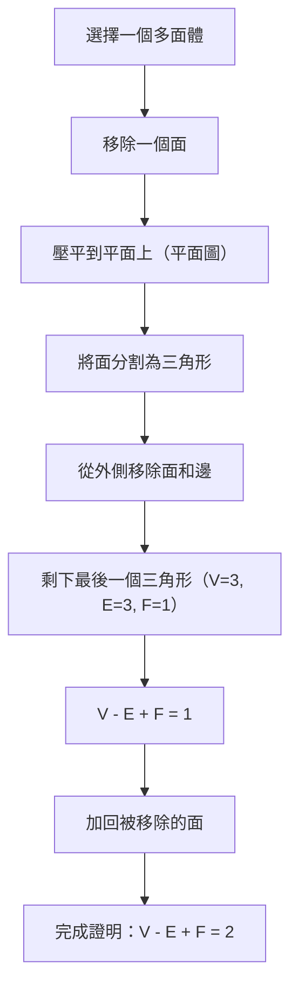
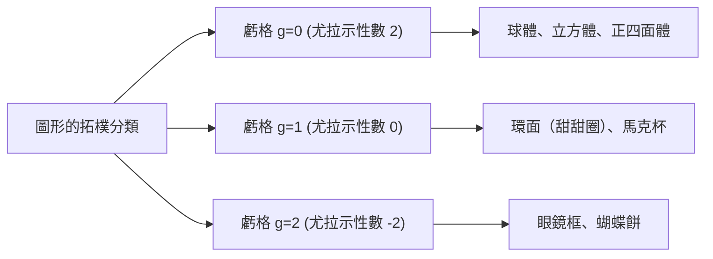

## 引言：數學中最美的定理之一

在數學世界裡，有一些猶如魔法般的公式，能在看似毫不相干的事物之間建立起令人驚嘆的聯繫。其中，由李昂哈德·尤拉（[Leonhard Euler](https://kenji.blog/zh-tw/p/euler/)）發現的 **[尤拉多面體定理](https://kenji.blog/zh-tw/p/eulers-polyhedron-formula/)** （Euler's polyhedron formula），以其無與倫比的簡潔性和普適性脫穎而出。

這個公式非常簡單：

$$V - E + F = 2$$

在這裡，每個字母代表多面體的一個元素：
- **$V$** (Vertices)：頂點的數量
- **$E$** (Edges)：邊的數量
- **$F$** (Faces)：面的數量

無論你如何扭曲形狀，或者多面體有多麼複雜，只要它是一個沒有「洞」的立體，計算結果永遠是 **$2$** 。這一事實不僅僅是一個幾何學上的謎題，它後來成為了開啟被稱為「拓樸學」（Topology）這一龐大數學分支的關鍵鑰匙。

在本文中，我們將深入探討這個神秘定理的運作原理、它的證明，以及連接現代科學的拓樸學概念。

## 用正多面體驗證公式

首先，讓我們用最基本的立體——也就是被稱為「柏拉圖立體」的五個正多面體——來驗證 $V - E + F = 2$ 是否真的成立。

| 多面體名稱 | 頂點 ($V$) | 邊 ($E$) | 面 ($F$) | $V - E + F$ |
| --- | --- | --- | --- | --- |
| 正四面體 (Tetrahedron) | 4 | 6 | 4 | $4 - 6 + 4 = 2$ |
| 正六面體 / 立方體 (Cube) | 8 | 12 | 6 | $8 - 12 + 6 = 2$ |
| 正八面體 (Octahedron) | 6 | 12 | 8 | $6 - 12 + 8 = 2$ |
| 正十二面體 (Dodecahedron) | 20 | 30 | 12 | $20 - 30 + 12 = 2$ |
| 正二十面體 (Icosahedron) | 12 | 30 | 20 | $12 - 30 + 20 = 2$ |

的確，無論選擇哪種正多面體，結果都完美地等於 **$2$** 。這絕非巧合。無論是作為骰子使用的立方體，還是角色扮演遊戲中常見的正二十面體，數字 **$2$** 就像宇宙真理一般被推導出來。

## 尤拉公式的直觀證明

為什麼結果總是 **$2$** 呢？讓我們來看看法國數學家[奧古斯丁-路易·柯西](https://kenji.blog/zh-tw/p/cauchy/)（[Augustin-Louis Cauchy](https://kenji.blog/zh-tw/p/cauchy/)）在1811年提出的直觀證明。這個證明採用了一種突破性的方法，將三維立體轉換為「二維平面上的圖」。

### 步驟1：將立體壓平到平面上

首先，移除多面體的一個面。例如，想像移除一個立方體的頂面。然後像拉伸橡膠一樣將剩下的盒子拉伸並壓平在平面上。你會得到一個「施萊格爾圖」（平面圖），其中剩餘的面被畫成大外框內的小多邊形。

因為我們移除了一個面，需要證明的公式變為 $V - E + F = 1$。

### 步驟2：將面分割成三角形

在平面圖中畫對角線，將每一個多邊形面都分割成三角形。
每畫一條對角線，會增加1條邊 ($E$) 和1個面 ($F$)。
因此，$V - (E + 1) + (F + 1) = V - E + F$，公式的值保持不變。

### 步驟3：從外部移除三角形

當所有的面都變成三角形後，開始從外側逐一移除它們。
在移除時，會出現以下兩種情況之一：

1. **移除一條外側的邊** ：減少1條邊 ($E$)，減少1個面 ($F$)。公式的值保持不變。
2. **移除兩條外側的邊及其之間的頂點** ：減少1個頂點 ($V$)，減少2條邊 ($E$)，減少1個面 ($F$)。$(V - 1) - (E - 2) + (F - 1) = V - E + F$，公式的值依然保持不變。

### 步驟4：最後的一個三角形

重複這個操作，最終只會剩下一個單一的三角形。
這個三角形有3個頂點、3條邊和1個面。
計算得出 $3 - 3 + 1 = 1$。

回想我們最開始移除的那個面，將它加回到原公式中，得到 $1 + 1 = 2$，完美證明了 $V - E + F = 2$！

## 笛卡兒的秘密手稿：另一個發現的故事

其實，在尤拉發表這個定理的大約一個世紀前，法國哲學家兼數學家[勒內·笛卡兒](https://kenji.blog/zh-tw/p/descartes/)（[René Descartes](https://kenji.blog/zh-tw/p/descartes/)）就已經得出了本質上相同的定理。
笛卡兒關注的是多面體頂點處的「角虧」概念。
匯聚在單一頂點處的所有面的角度總和，在平面上是 $360^\circ$，但在立體的頂點上總是小於 $360^\circ$。與 $360^\circ$ 相比所缺少的這一部份被稱為「角虧」。

笛卡兒發現了一個驚人的定理：「如果將所有頂點的角虧加起來，任何多面體的總和永遠是 $720^\circ$。」
用數學公式表示如下：

$$ \sum (\text{角虧}) = 720^\circ $$

這個定理在數學上與尤拉公式 $V - E + F = 2$ 是完全等價的。然而，笛卡兒從未公開發表這一發現，而是將其隱藏在一份加密的手稿中。他去世後，這份手稿被萊布尼茲破譯，但並未被廣泛知曉。因此，這一偉大的性質後來由尤拉重新發現，並以「尤拉公式」之名載入史冊。

## 拓樸學的誕生：「橡皮帶幾何學」

尤拉定理最具革命性的一點是，它 **完全不依賴於「長度」或「角度」** 。
無論你是把立方體削成球形，還是拉伸成像針一樣細長，只要頂點、邊和面的數量不發生改變，尤拉公式就始終成立。

像這樣，研究圖形「即使像黏土一樣被連續變形也不會改變的性質」的數學分支被稱為 **拓樸學** 。在拓樸學的世界裡，咖啡杯和甜甜圈被視為「形狀相同」（同胚）。因為它們都共享著「有一個洞」這一共同結構。

### 帶洞的多面體與「尤拉示性數」

那麼，對於像甜甜圈那樣有「洞」的多面體（環狀多面體），$V - E + F$ 的值會變成多少呢？
事實上，隨著洞的數量（虧格：$g$）增加，這個值也會隨之改變。

一般的公式被擴展為如下形式：

$$V - E + F = 2 - 2g$$

這個 $V - E + F$ 的值被稱為 **尤拉示性數** （$\chi$，卡伊）。

- 與球面同胚（沒有洞）：$g = 0 \implies \chi = 2$
- 與環面同胚（1個洞）：$g = 1 \implies \chi = 0$
- 有2個洞的立體：$g = 2 \implies \chi = -2$

## 尤拉-龐加萊公式：向多維度的飛躍

從19世紀末到20世紀，包括[亨利·龐加萊](https://kenji.blog/zh-tw/p/poincare/)（[Henri Poincaré](https://kenji.blog/zh-tw/p/poincare/)）在內的數學家們，將尤拉定理進一步擴展到了更高維度的空間。這就是 **尤拉-龐加萊公式** 。
透過推廣多面體的元素，他們考慮了在 $n$ 維圖形中元素數量的交錯和。

$$ \chi = k_0 - k_1 + k_2 - k_3 + \dots + (-1)^n k_n $$

這裡，$k_i$ 代表 $i$ 維元素的數量。
龐加萊證明了這個 $\chi$ 與被稱為「貝蒂數（Betti numbers）」的拓樸不變量密切相關。
直觀地說，貝蒂數 $b_i$ 代表了「 $i$ 維洞的數量」。

$$ \chi = b_0 - b_1 + b_2 - b_3 + \dots $$

這一發現證明了，「計算元素的數量」這種組合學方法，與「計算空間中洞的數量」這種代數學方法，達成了完美的統一。

## 在現代科學中的應用

始於 $V - E + F = 2$ 這一簡單公式的拓樸學概念，如今已超越了數學的範疇，被廣泛應用於各種科學領域。

### 1. 富勒烯（ $C_{60}$ ）與化學
「富勒烯」是一種碳原子結合成足球形狀的分子。化學家們利用尤拉定理，在理論上證明了「如果沒有12個五邊形，就不可能製造出閉合的球狀分子」這一事實。

### 2. 網絡理論與圖論
現代社會充滿了各種「網絡」，如網際網路路由和交通網絡設計。尤拉公式是判斷這些網絡能否在平面上不交叉地繪製出來的基礎。同時，它在「[四色定理](https://kenji.blog/zh-tw/p/four-color-theorem/)」的證明中也是不可或缺的。

### 3. 拓樸資料分析（TDA）
近年來在人工智慧和機器學習領域備受矚目的是，利用拓樸學技術分析大數據「形狀」的方法。透過計算高維複雜資料中的尤拉示性數，研究人員試圖揭示隱藏在資料中的關鍵模式。

## 結語

**$V - E + F = 2$** 

這個連小學生都會算的加減法公式，從柏拉圖立體出發，連接了咖啡杯與甜甜圈，並最終觸及了最前沿的資料科學。這一事實，正是數學這門學科最大的魅力所在。

無論我們日常所見物體的形狀如何改變，總存在著某種絕不改變的「本質」。[尤拉多面體定理](https://kenji.blog/zh-tw/p/eulers-polyhedron-formula/)，跨越了300多年的時光，正向我們訴說著這樣美麗的真理。
