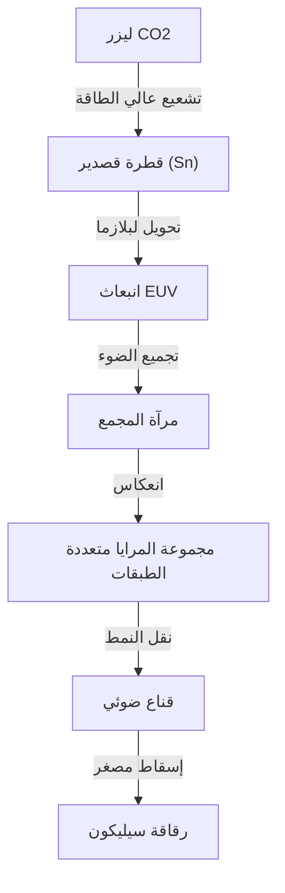

## مقدمة

الهواتف الذكية التي تدعم المجتمع الحديث، التطور الانفجاري للذكاء الاصطناعي التوليدي، تقنية القيادة الذاتية، والحوسبة السحابية. في مركز كل هذه الأشياء توجد "أشباه الموصلات (الرقائق الدقيقة)". وما لا غنى عنه لتصنيع أحدث الرقائق التي تحدد أداء هذه الأشباه الموصلات هو "آلة الطباعة الحجرية EUV". EUV هو اختصار لـ "الأشعة فوق البنفسجية القصوى (Extreme Ultraviolet)"، وتسمى تقنية رسم دوائر متناهية الصغر على رقائق السيليكون باستخدام هذا الضوء الخاص بالطباعة الحجرية EUV.

في هذه المقالة، سنشرح بالتفصيل الآلية المذهلة لآلة الطباعة الحجرية EUV، التي نجحت شركة ASML الهولندية وحدها في العالم في وضعها موضع التنفيذ العملي ويُطلق عليها أيضاً "الآلة الأكثر تعقيداً في العالم"، بالإضافة إلى تاريخ تقنية أشباه الموصلات حتى تطويرها، وكيفية التغلب على الحواجز الفيزيائية والتقنية.

## 1. تاريخ تصغير أشباه الموصلات وحدود "قانون مور"

تاريخ أشباه الموصلات هو تاريخ التصغير نفسه. ووفقاً لـ "قانون مور (يتضاعف معدل تكامل أشباه الموصلات كل 18 إلى 24 شهراً تقريباً)" الذي اقترحه المؤسس المشارك لشركة إنتل جوردون مور، كرست الشركات المصنعة لأشباه الموصلات جهودها لجعل الترانزستورات أصغر حجماً وترتيبها بكثافة أكبر. كلما صغر حجم الترانزستور، قصرت مسافة انتقال الإلكترونات، مما يؤدي إلى زيادة سرعة الحساب وفي الوقت نفسه تقليل استهلاك الطاقة.

المفتاح الأكبر في دفع عملية التصغير هو عملية "الطباعة الحجرية (الليثوغرافيا)". وهي عملية يتم فيها نقل نمط الدائرة الكهربائية إلى مادة حساسة للضوء (مقاوم الضوء) على الرقاقة باستخدام الضوء، على غرار تحميض الصور. ولرسم دوائر أكثر دقة، يتطلب الأمر ضوءاً ذو طول موجي أقصر.

في الثمانينيات، كانت تُستخدم مصابيح الزئبق (خط g: 436 نانومتر، خط i: 365 نانومتر)، لكنها تطورت لاحقاً إلى ليزر الإكسيمر (KrF: 248 نانومتر، ArF: 193 نانومتر). علاوة على ذلك، من خلال الاستفادة الكاملة من تقنيات مثل "الطباعة الحجرية الغاطسة" التي تملأ الفراغ بين العدسة والرقاقة بالماء لزيادة معامل الانكسار، و"الزخرفة المتعددة" التي تقوم بالتعريض الضوئي على عدة مراحل، تم اختراق حواجز التصغير التي كانت تُعتبر حدوداً واحداً تلو الآخر.

ومع ذلك، عندما أصبح عرض خط الدائرة أقل من 7 نانومتر (nm)، أصبح حد الطباعة الحجرية الغاطسة ArF واضحاً للعيان. أدت الزخرفة المتعددة إلى زيادة هائلة في عدد العمليات، مما تسبب في ارتفاع تكاليف التصنيع وتدهور العائد (نسبة المنتجات الجيدة). ولذلك، كان هناك حاجة إلى مصدر ضوء ذو طول موجي من بُعد جديد تماماً. هذا هو EUV.

## 2. التقنية المذهلة للطباعة الحجرية EUV

يبلغ الطول الموجي لـ EUV 13.5 نانومتر فقط. تم تقصير الطول الموجي فجأة إلى أقل من العُشر مقارنة بليزر الإكسيمر ArF السابق (193 نانومتر). وبفضل هذا، أصبح من الممكن رسم دوائر دقيقة جداً بتعريض ضوئي واحد (زخرفة مفردة)، وكان من المتوقع أن يبسط عملية التصنيع ويحسن العائد.

ومع ذلك، فإن الضوء ذو الطول الموجي 13.5 نانومتر يمتلك خصائص قريبة من الأشعة السينية في الطبيعة. كان لهذا الضوء مشكلة قاتلة تتمثل في أنه يُمتص من قبل أي مادة، بما في ذلك الهواء والزجاج (العدسات). لذلك، كان من الضروري تصميم يختلف جذرياً عن آلات الطباعة الحجرية السابقة.

### آلية توليد مصدر الضوء باستخدام البلازما

إن آلية توليد ضوء EUV تشبه تماماً إنشاء "شمس اصطناعية" داخل الآلة.
1. داخل غرفة محفوظة في حالة فراغ عالية، يتم إسقاط قطرات (دروبليت) من القصدير السائل (Sn) بسرعة هائلة تبلغ 50,000 مرة في الثانية.
2. يتم تسليط ليزر ثاني أكسيد الكربون (CO2) فائق الطاقة مرتين على قطرة القصدير تلك.
3. يقوم الليزر الأول (النبضة التمهيدية) بتسوية قطرة القصدير لتصبح مسطحة مثل الفطيرة، ويقوم الليزر الثاني (النبضة الرئيسية) بتحويلها إلى بلازما.
4. من الضوء المنبعث من هذه البلازما شديدة الحرارة، يتم استخراج ضوء EUV ذي الـ 13.5 نانومتر فقط.

من خلال إجراء هذه العملية بشكل مستمر 50,000 مرة في الثانية، يمكن لأول مرة الحفاظ على طاقة ضوء EUV اللازمة للتعريض الضوئي.

### نظام المرايا متعددة الطبقات الخاص

نظراً لأن ضوء EUV لا يمكنه المرور عبر العدسات الزجاجية التقليدية، فمن الضروري التحكم في مسار الضوء عن طريق عكسه بالكامل بواسطة "المرايا". ومع ذلك، حتى المرايا العادية تمتص ضوء EUV.

لذلك، تم تطوير "مرآة متعددة الطبقات" خاصة تتكون من عشرات الطبقات المتناوبة من الموليبدينوم (Mo) والسيليكون (Si) بسمك على المستوى الذري. باستخدام هذه المرآة المصقولة بسلاسة فائقة، يمكن عكس الضوء ذي الأطوال الموجية المحددة فقط. ومع ذلك، نظراً لفقدان حوالي 30% من الضوء في انعكاس واحد، إذا تكرر الانعكاس أكثر من 10 مرات قبل أن يصل الضوء من المصدر إلى الرقاقة، فإن شدة الضوء تضعف إلى بضعة بالمائة فقط من قوتها الأصلية. وهذا هو السبب في الحاجة إلى طاقة عالية بشكل لا يصدق في المرحلة الأولية.

## 3. احتكار ASML والنظام البيئي التكنولوجي الضخم

الشركة التي نجحت في وضع هذه التقنية الصعبة للغاية موضع التنفيذ العملي هي شركة ASML الهولندية. في الماضي، كانت شركتا نيكون وكانون اليابانيتان أيضاً منافسين قويين في سوق الطباعة الحجرية، ولكن بسبب الصعوبة البالغة في تطوير EUV، ومخاطر الاستثمار الهائلة، وعدم اليقين التقني، انتهى الأمر في النهاية باحتكار ASML وحدها للسوق.

ومع ذلك، لم تكمل ASML تقنية EUV بمفردها. كان تطوير آلة EUV بمثابة تجميع للمعرفة العالمية.
- **تقنية مصدر الضوء**: استحوذت على شركة Cymer الأمريكية للحصول على تقنية مصدر ضوء البلازما.
- **النظام البصري (المرايا)**: أنشأت نظام تعاون وثيق مع شركة تصنيع البصريات الألمانية العريقة Carl Zeiss لتصنيع مرايا ذات نعومة فائقة.
- **نظام التحكم**: توريد الأجزاء من خلال شبكة تضم آلاف الموردين الدقيقين المتمركزين بشكل رئيسي في أوروبا.

لا تعمل ASML كشركة تصنيع مجردة، بل كـ "مدمج أنظمة يوحد أفضل التقنيات في العالم". تتكون آلة الطباعة الحجرية EUV، التي يُقال إن تكلفتها تتراوح بين 20 إلى 30 مليار ين للوحدة، من أكثر من 100,000 قطعة، وهو ما يعادل عدة طائرات جامبو، ويتطلب نقلها عشرات الطائرات من طراز بوينج 747.

## 4. التأثير الجيوسياسي وأمن أشباه الموصلات

في الوقت الحاضر، تجاوزت آلة الطباعة الحجرية EUV حدود كونها مجرد منتج صناعي لتصبح مادة استراتيجية تحدد الأمن القومي. ويرجع ذلك إلى أن EUV لا غنى عنه لتصنيع أحدث الرقائق التي تحدد التفوق في الذكاء الاصطناعي والتكنولوجيا العسكرية.

على خلفية التوترات الأمريكية الصينية، تقيد الولايات المتحدة بشدة تصدير تكنولوجيا أشباه الموصلات المتطورة إلى الصين. ونتيجة لذلك، وبناءً على رغبة الحكومتين الهولندية والأمريكية، لا تستطيع ASML تصدير آلات الطباعة الحجرية EUV إلى الشركات الصينية. ونتيجة لذلك، وُضِع التصنيع الذاتي لأشباه الموصلات المتطورة في الصين في وضع صعب للغاية. وهكذا، أصبحنا في وضع تتحكم فيه تقنية شركة واحدة في مسار السياسة الدولية.

## 5. مستقبل صناعة أشباه الموصلات والجيل القادم من EUV (High-NA EUV)

مع إدخال الطباعة الحجرية EUV، تندفع أفضل مسابك تصنيع أشباه الموصلات في العالم (شركات تصنيع أشباه الموصلات التعاقدية) مثل TSMC وسامسونج وإنتل نحو الإنتاج الضخم لرقائق فائقة الدقة من أجيال 5 نانومتر، و 3 نانومتر، و 2 نانومتر. وقد أدى هذا إلى تحقيق وحدات معالجة الرسومات NVIDIA التي تدعم تطور الذكاء الاصطناعي، والمعالجات عالية الأداء الموجودة في هواتف iPhone من Apple.

والآن، بدأت ASML بالفعل في شحن الجيل التالي من آلات الطباعة الحجرية "High-NA EUV". من خلال رفع الفتحة العددية (NA) من 0.33 التقليدية إلى 0.55، يصبح من الممكن التقاط المزيد من الضوء ورسم دوائر أكثر دقة. بفضل هذا، أصبح تصنيع أشباه الموصلات في منطقة أقل من 2 نانومتر، أي "أنجستروم (عُشر 1 نانومتر)"، على وشك أن يصبح حقيقة واقعة.

## خاتمة

تعتبر آلة الطباعة الحجرية EUV واحدة من أكثر الآلات دقة وتعقيداً التي صنعتها البشرية على الإطلاق. هذه التقنية، التي يمكن القول إنها تتويج لميكانيكا الكم، وفيزياء البلازما، وعلوم المواد، والهندسة فائقة الدقة، لم تُبتكر بفضل جهود شركة واحدة فقط، بل من خلال تجميع المعرفة من العلماء والمهندسين حول العالم على مدى عقود.

يجب ألا ننسى أن وراء تطور التكنولوجيا التي نستفيد منها يومياً، تكمن "هندسة الحدود القصوى" هذه. إن تطور تقنية أشباه الموصلات التي تستمر في تحدي الحدود الفيزيائية، سيستمر في قيادة العالم وفتح آفاق مستقبل مجهول.
