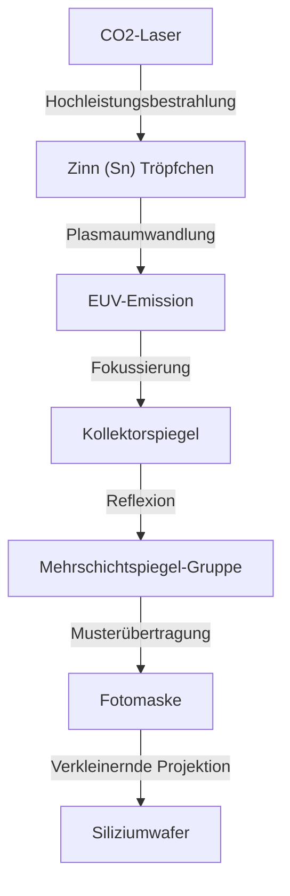

## Einleitung

Smartphones, die explosive Entwicklung von generativer KI, autonomes Fahren und Cloud-Computing – sie alle prägen unsere moderne Gesellschaft. Im Zentrum all dieser Technologien stehen „Halbleiter (Mikrochips)“. Und um die modernsten Chips herzustellen, die die Leistung dieser Halbleiter bestimmen, ist ein „EUV-Lithografiesystem“ unverzichtbar. EUV steht für „Extreme Ultraviolet“ (extremes Ultraviolett), und die Technologie, mit der dieses spezielle Licht verwendet wird, um mikroskopisch kleine Schaltkreise auf Siliziumwafern zu zeichnen, wird als EUV-Lithografie bezeichnet.

In diesem Artikel werden wir den erstaunlichen Mechanismus des EUV-Lithografiesystems, das als die „komplexeste Maschine der Welt“ bezeichnet wird und das bisher nur das niederländische Unternehmen ASML weltweit kommerzialisieren konnte, im Detail erläutern. Wir beleuchten auch die Geschichte der Halbleitertechnologie, die zu seiner Entwicklung führte, und wie physische und technologische Barrieren überwunden wurden.

## 1. Die Geschichte der Halbleiterminiaturisierung und die Grenzen des "Mooreschen Gesetzes"

Die Geschichte der Halbleiter ist gleichbedeutend mit der Geschichte der Miniaturisierung. Gemäß dem „Mooreschen Gesetz“ (die Integrationsdichte von Halbleitern verdoppelt sich etwa alle 18 bis 24 Monate), das von Intel-Mitbegründer Gordon Moore postuliert wurde, haben die Halbleiterhersteller all ihre Energie darauf verwendet, Transistoren kleiner und dichter anzuordnen. Je kleiner der Transistor wird, desto kürzer wird die Distanz, die die Elektronen zurücklegen müssen, was die Rechengeschwindigkeit erhöht und gleichzeitig den Stromverbrauch senkt.

Der wichtigste Schlüssel zur Miniaturisierung ist der „Lithografie“-Prozess (Belichtung). Wie bei der Entwicklung von Fotos ist dies der Prozess, bei dem mithilfe von Licht ein Schaltungsmuster auf ein lichtempfindliches Material (Fotolack) auf einem Wafer übertragen wird. Um feinere Schaltkreise zu zeichnen, wird Licht mit einer kürzeren Wellenlänge benötigt.

In den 1980er Jahren wurden Quecksilberlampen (g-Linie: 436 nm, i-Linie: 365 nm) verwendet, später entwickelte sich dies zu Excimer-Lasern (KrF: 248 nm, ArF: 193 nm). Darüber hinaus wurden als unüberwindbar geltende Barrieren der Miniaturisierung durch Technologien wie die „Immersionslithografie“, bei der der Raum zwischen Linse und Wafer mit Wasser gefüllt wird, um den Brechungsindex zu erhöhen, und das „Multi-Patterning“, bei dem die Belichtung in mehreren Schritten erfolgt, durchbrochen.

Als die Linienbreite der Schaltkreise jedoch unter 7 Nanometer (nm) fiel, wurden die Grenzen der ArF-Immersionslithografie offensichtlich. Multi-Patterning ließ die Anzahl der Prozessschritte explosionsartig ansteigen, was zu explodierenden Herstellungskosten und einer Verschlechterung der Ausbeute (Yield) führte. Daher war eine Lichtquelle mit einer völlig neuen Wellenlängendimension erforderlich. Das war EUV.

## 2. Die erstaunliche Technologie der EUV-Lithografie

Die Wellenlänge von EUV beträgt nur 13,5 nm. Sie wurde vom bisherigen ArF-Excimer-Laser (193 nm) drastisch auf weniger als ein Zehntel verkürzt. Dies ermöglichte es, extrem feine Schaltkreise in einer einzigen Belichtung (Single-Patterning) zu zeichnen, was zu einer Vereinfachung des Herstellungsprozesses und einer Verbesserung der Ausbeute führen sollte.

Allerdings hat Licht mit einer Wellenlänge von 13,5 nm Eigenschaften, die in der Natur den Röntgenstrahlen ähneln. Es gab das fatale Problem, dass dieses Licht von fast allen Materialien, einschließlich Luft und Glas (Linsen), absorbiert wird. Daher war ein grundlegend anderes Design als bei bisherigen Lithografiesystemen erforderlich.

### Der Mechanismus der Lichtquellenerzeugung durch Plasma

Der Mechanismus zur Erzeugung von EUV-Licht gleicht der Erschaffung einer „künstlichen Sonne“ im Inneren der Maschine.
1. In einer Kammer, die unter hohem Vakuum gehalten wird, werden Tropfen aus flüssigem Zinn (Sn) mit einer rasenden Geschwindigkeit von 50.000 Mal pro Sekunde fallen gelassen.
2. Diese Zinntropfen werden zweimal mit einem extrem leistungsstarken Kohlendioxid (CO2)-Laser bestrahlt.
3. Der erste Laser (Prepulse) flacht den Zinntropfen pfannkuchenartig ab, und der zweite Laser (Mainpulse) verwandelt ihn in Plasma.
4. Aus dem Licht, das von diesem extrem heißen Plasma emittiert wird, wird nur das EUV-Licht von 13,5 nm extrahiert.

Nur durch die kontinuierliche Wiederholung dieses Prozesses 50.000 Mal pro Sekunde kann EUV-Licht mit der für die Belichtung erforderlichen Leistung aufrechterhalten werden.

### Ein spezielles Mehrschicht-Spiegelsystem

Da EUV-Licht herkömmliche Glaslinsen nicht durchdringen kann, muss der Strahlengang vollständig durch Reflexion an „Spiegeln“ gesteuert werden. Allerdings wird EUV-Licht auch von normalen Spiegeln absorbiert.

Daher wurden spezielle „Mehrschichtspiegel“ entwickelt, bei denen Molybdän (Mo) und Silizium (Si) in dutzenden Schichten von atomarer Dünne abwechselnd übereinandergelegt sind. Durch die Verwendung dieser extrem glatt polierten Spiegel ist es möglich, nur Licht bestimmter Wellenlängen zu reflektieren. Dennoch gehen bei jeder Reflexion etwa 30 % des Lichts verloren. Wenn das Licht auf dem Weg von der Quelle zum Wafer mehr als 10 Mal reflektiert wird, verringert sich die Lichtintensität auf nur noch wenige Prozent des ursprünglichen Wertes. Dies ist der Grund, warum in der Anfangsphase eine so enorm hohe Ausgangsleistung erforderlich ist.

## 3. Das Monopol von ASML und das riesige Technologie-Ökosystem

Das Unternehmen, das diese unfassbar schwierige Technologie kommerzialisiert hat, ist die niederländische ASML. Früher waren die japanischen Unternehmen Nikon und Canon mächtige Rivalen auf dem Lithografiemarkt, aber aufgrund der extremen Schwierigkeit der EUV-Entwicklung, des enormen Investitionsrisikos und der technologischen Unsicherheiten monopolisiert ASML den Markt letztendlich als einziger Anbieter.

ASML hat EUV jedoch nicht im Alleingang perfektioniert. Die Entwicklung von EUV-Systemen war eine Bündelung globalen Wissens.
- **Lichtquellentechnologie**: Durch die Übernahme des amerikanischen Unternehmens Cymer wurde die Technologie für Plasma-Lichtquellen erworben.
- **Optisches System (Spiegel)**: Aufbau einer engen Kooperation mit dem deutschen Traditions-Optikhersteller Carl Zeiss zur Herstellung von Spiegeln mit ultimativer Glätte.
- **Steuerungssystem**: Lieferung von Komponenten durch ein Netzwerk von Tausenden von Präzisionszulieferern, hauptsächlich in Europa.

ASML fungiert nicht nur als bloßes Fertigungsunternehmen, sondern als „Systemintegrator, der die besten Technologien der Welt vereint“. Ein EUV-Lithografiesystem, dessen Preis auf 20 bis 30 Milliarden Yen pro Einheit geschätzt wird, besteht aus über 100.000 Teilen – das entspricht mehreren Jumbo-Jets – und für den Transport werden Dutzende Flugzeuge vom Typ Boeing 747 benötigt.

## 4. Geopolitische Auswirkungen und Halbleitersicherheit

Heute sind EUV-Lithografiesysteme nicht mehr nur Industrieprodukte, sondern strategische Güter, die die nationale Sicherheit eines Landes bestimmen können. Dies liegt daran, dass EUV für die Herstellung modernster Chips unverzichtbar ist, die die Überlegenheit bei KI und Militärtechnologie bestimmen.

Vor dem Hintergrund des Konflikts zwischen den USA und China schränken die USA den Export modernster Halbleitertechnologie nach China streng ein. Infolgedessen kann ASML auf Geheiß der niederländischen und der US-Regierung keine EUV-Lithografiesysteme an chinesische Unternehmen exportieren. Dies macht die autonome Herstellung modernster Halbleiter in China extrem schwierig. So ist eine Situation entstanden, in der die Technologie eines einzigen Unternehmens den Kurs der internationalen Politik bestimmt.

## 5. Die Zukunft der Halbleiterindustrie und EUV der nächsten Generation (High-NA EUV)

Mit der Einführung der EUV-Lithografie treiben die weltbesten Foundries (Halbleiter-Auftragsfertiger) wie TSMC, Samsung und Intel die Massenproduktion von ultrafeinen Chips der 5-nm-, 3-nm- und 2-nm-Generation voran. Dies ermöglicht die GPUs von NVIDIA, die die Evolution der KI unterstützen, sowie die Hochleistungsprozessoren, die in den iPhones von Apple verbaut sind.

Und aktuell hat ASML bereits mit der Auslieferung der nächsten Generation von EUV-Lithografiesystemen, dem „High-NA EUV“, begonnen. Durch die Erhöhung der NA (Numerische Apertur) von bisher 0,33 auf 0,55 kann mehr Licht eingefangen und noch feinere Schaltkreise können gezeichnet werden. Damit wird die Halbleiterfertigung im Bereich von unter 2 nm, also im „Angström“-Bereich (ein Zehntel eines Nanometers), zur Realität.

## Schlusswort

Das EUV-Lithografiesystem gehört zu den präzisesten und komplexesten Maschinen, die die Menschheit je gebaut hat. Diese Technologie, die man als Kristallisation aus Quantenmechanik, Plasmaphysik, Materialwissenschaft und ultrapräziser Technik bezeichnen kann, ist das Ergebnis nicht nur der Bemühungen eines einzigen Unternehmens, sondern der jahrzehntelangen Anhäufung von Wissen von Wissenschaftlern und Ingenieuren auf der ganzen Welt.

Wir dürfen nicht vergessen, dass hinter der technologischen Evolution, von der wir täglich profitieren, dieses "extreme Engineering" steht. Die Weiterentwicklung der Halbleitertechnologie, die weiterhin physikalische Grenzen herausfordert, wird die Welt auch in Zukunft vorantreiben und den Weg in eine noch unbekannte Zukunft ebnen.
