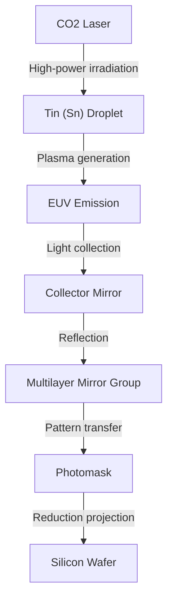

## Introduction

Smartphones, the explosive evolution of generative AI, autonomous driving technology, and cloud computing that support modern society. At the center of all these is the "semiconductor (microchip)." And the "EUV lithography system" is indispensable for manufacturing the cutting-edge chips that determine the performance of these semiconductors. EUV stands for "Extreme Ultraviolet," and the technology that draws ultra-fine circuits on silicon wafers using this special light is called EUV lithography.

This article will explain in detail the amazing mechanism of the EUV lithography system, which the Dutch company ASML is the only one in the world to have successfully commercialized and is sometimes called the "world's most complex machine," the history of semiconductor technology leading up to its development, and how physical and technical barriers were overcome.

## 1. The History of Semiconductor Miniaturization and the Limits of "Moore's Law"

The history of semiconductors is the history of miniaturization itself. In accordance with "Moore's Law" proposed by Intel co-founder Gordon Moore (the integration density of semiconductors doubles every 18 to 24 months), semiconductor manufacturers have poured their hearts and souls into making transistors smaller and packing them more densely. The smaller the transistor, the shorter the distance electrons travel, which improves calculation speed and reduces power consumption at the same time.

The biggest key to advancing miniaturization is the "lithography (exposure)" process. This is the process of transferring circuit patterns onto a photosensitive material (photoresist) on a wafer using light, like developing a photograph. In order to draw finer circuits, light with a shorter wavelength is required.

In the 1980s, mercury lamps (g-line: 436nm, i-line: 365nm) were used, but later evolved to excimer lasers (KrF: 248nm, ArF: 193nm). Furthermore, by making full use of technologies such as "immersion lithography," which increases the refractive index by filling water between the lens and the wafer, and "multi-patterning," which performs exposure in multiple steps, the barriers to miniaturization that were once considered the limit have been broken through one after another.

However, as the circuit line width fell below 7 nanometers (nm), the limits of ArF immersion lithography became obvious. Multi-patterning explosively increased the number of processes, leading to skyrocketing manufacturing costs and deteriorating yield (good product rate). Therefore, a light source with a completely new dimension of wavelength was required. That is EUV.

## 2. The Amazing Technology of EUV Lithography

The wavelength of EUV is only 13.5nm. This is a dramatic shortening of the wavelength to less than one-tenth of the conventional ArF excimer laser (193nm). This made it possible to draw extremely fine circuits in a single exposure (single patterning), which was expected to simplify the manufacturing process and improve the yield.

However, light with a wavelength of 13.5nm has properties close to X-rays in the natural world. This light had a fatal problem in that it was absorbed by all substances, including air and glass (lenses). Therefore, a fundamentally different design from conventional lithography systems was required.

### The Mechanism of Generating a Light Source Using Plasma

The mechanism for generating EUV light is exactly like creating an "artificial sun" inside the equipment.
1. In a highly vacuumed chamber, droplets of liquid tin (Sn) are dropped at an incredible speed of 50,000 times per second.
2. An ultra-high output carbon dioxide (CO2) laser is irradiated twice onto the tin droplet.
3. The first laser (pre-pulse) spreads the tin droplet into a flat pancake shape, and the second laser (main pulse) turns it into a plasma.
4. From the light emitted by this extremely high-temperature plasma, only the 13.5nm EUV light is extracted.

By continuously performing this process 50,000 times a second, the EUV light output required for exposure can be maintained for the first time.

### A Special Multilayer Mirror System

Since EUV light cannot pass through conventional glass lenses, its light path must be completely controlled by reflecting it with "mirrors." However, even normal mirrors absorb EUV light.

Therefore, a special "multilayer mirror" was developed by alternately stacking dozens of layers of molybdenum (Mo) and silicon (Si) at an atomic level of thinness. By using this extremely smoothly polished mirror, only light of a specific wavelength can be reflected. Even so, about 30% of the light is lost in a single reflection, so if it is reflected more than 10 times before it reaches the wafer from the light source, the light intensity attenuates to a few percent of the original. This is why a tremendously high output is required in the initial stage.

## 3. ASML's Monopoly and the Giant Technological Ecosystem

It is the Dutch company ASML that commercialized this incredibly difficult technology. In the past, Japanese companies like Nikon and Canon were also strong rivals in the lithography market, but due to the extreme difficulty, enormous investment risks, and technological uncertainties of EUV development, ASML ultimately monopolized the market.

However, ASML did not perfect EUV alone. The development of EUV equipment was a global concentration of knowledge.
- **Light source technology**: Acquired the American company Cymer and obtained plasma light source technology.
- **Optical system (mirrors)**: Built a tight collaboration system with the long-established German optical manufacturer Carl Zeiss to manufacture mirrors with ultimate smoothness.
- **Control system**: Supply of parts by a precision supplier network of thousands of companies centered in Europe.

ASML functions not just as a manufacturing industry but as a "system integrator that integrates the world's best technology." The EUV lithography system, which is said to cost between 20 billion and 30 billion yen per unit, consists of over 100,000 parts, equivalent to several jumbo jets, and requires dozens of Boeing 747s to transport it.

## 4. Geopolitical Impact and Semiconductor Security

Today, EUV lithography systems have gone beyond being mere industrial products and have become strategic materials that dictate national security. This is because EUV is indispensable for the manufacture of cutting-edge chips that determine the superiority of AI and military technology.

Against the backdrop of the US-China conflict, the United States is strictly restricting the export of cutting-edge semiconductor technology to China. As a result, ASML cannot export EUV lithography systems to Chinese companies due to the intentions of the Dutch and US governments. This has placed the autonomous manufacturing of cutting-edge semiconductors in China in an extremely difficult situation. In this way, the technology of a single company has come to influence the course of international politics.

## 5. The Future of the Semiconductor Industry and Next-Generation EUV (High-NA EUV)

With the introduction of EUV lithography, the world's top foundries (semiconductor contract manufacturing companies) such as TSMC, Samsung, and Intel are rushing to mass-produce ultra-fine chips of the 5nm, 3nm, and 2nm generations. This has made possible the NVIDIA GPUs that support the evolution of AI and the high-performance processors installed in Apple's iPhones.

And currently, ASML has already started shipping its next-generation EUV lithography system, "High-NA EUV." By raising the NA (numerical aperture) from the conventional 0.33 to 0.55, it is possible to take in more light and draw even finer circuits. As a result, semiconductor manufacturing in the region below 2nm, that is, the "angstrom (one-tenth of 1nm)" region, is about to become a reality.

## Conclusion

The EUV lithography system is one of the most precise and complex machines mankind has ever created. This technology, which can be said to be the crystallization of quantum mechanics, plasma physics, materials science, and ultra-precision engineering, was born not only from the efforts of a single company but from the accumulation of knowledge of scientists and engineers around the world over decades.

We must not forget that such "extreme engineering" exists behind the evolution of technology from which we benefit every day. The evolution of semiconductor technology, which continues to challenge physical limits, will continue to drive the world and open up an unknown future.
