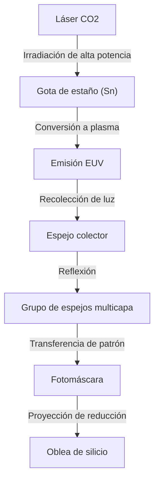

## Introducción

Los teléfonos inteligentes, la evolución explosiva de la IA generativa, la tecnología de conducción autónoma y la computación en la nube que sustentan la sociedad moderna. En el centro de todo esto se encuentra el "semiconductor (microchip)". Y para fabricar los chips de vanguardia que determinan el rendimiento de estos semiconductores, es indispensable la "máquina de litografía EUV". EUV es la abreviatura de "Ultravioleta Extremo" (Extreme Ultraviolet, en inglés), y la tecnología que utiliza esta luz especial para dibujar circuitos minúsculos sobre una oblea de silicio se denomina litografía EUV.

En este artículo, explicaremos en detalle el asombroso mecanismo de la máquina de litografía EUV, a menudo llamada "la máquina más compleja del mundo", cuya comercialización fue lograda exclusivamente por la empresa neerlandesa ASML. También exploraremos la historia de la tecnología de semiconductores que condujo a su desarrollo y cómo se superaron las barreras físicas y técnicas.

## 1. La Historia de la Miniaturización de los Semiconductores y los Límites de la "Ley de Moore"

La historia de los semiconductores es la historia misma de su miniaturización. Siguiendo la "Ley de Moore" (la densidad de los circuitos integrados se duplica aproximadamente cada 18 a 24 meses), propuesta por el cofundador de Intel, Gordon Moore, los fabricantes de semiconductores se han esforzado incansablemente por colocar transistores más pequeños y de forma más densa. A medida que los transistores se vuelven más pequeños, la distancia que recorren los electrones se acorta, lo que mejora la velocidad de cálculo y reduce el consumo de energía simultáneamente.

La clave principal para avanzar en la miniaturización es el proceso de "exposición (litografía)". Este proceso, similar al revelado de fotografías, utiliza la luz para transferir el patrón del circuito a un material fotosensible (fotorresistencia) en la oblea. Para dibujar circuitos más finos, se requiere luz con una longitud de onda más corta.

En la década de 1980, se utilizaban lámparas de mercurio (línea g: 436 nm, línea i: 365 nm), pero luego evolucionaron a los láseres excímeros (KrF: 248 nm, ArF: 193 nm). Además, se rompieron sucesivamente las barreras de miniaturización utilizando tecnologías como la "litografía de inmersión", que aumenta el índice de refracción llenando de agua el espacio entre la lente y la oblea, y el "patrón múltiple" (multi-patterning), que realiza la exposición en múltiples pasos.

Sin embargo, cuando el ancho de línea del circuito cayó por debajo de los 7 nanómetros (nm), los límites de la litografía de inmersión ArF se volvieron evidentes. El patrón múltiple aumentó exponencialmente el número de procesos, lo que provocó un aumento de los costos de fabricación y un deterioro del rendimiento (tasa de productos buenos). Por lo tanto, se necesitaba una fuente de luz con una longitud de onda en una dimensión completamente nueva. Esa fue EUV.

## 2. La Asombrosa Tecnología de la Litografía EUV

La longitud de onda de EUV es de tan solo 13,5 nm. Esto representó una reducción drástica de la longitud de onda a menos de una décima parte del láser excímero ArF anterior (193 nm). Esto hizo posible dibujar circuitos extremadamente finos en una sola exposición (patrón único), lo que se esperaba que simplificara el proceso de fabricación y mejorara el rendimiento.

Sin embargo, la luz con una longitud de onda de 13,5 nm tiene propiedades cercanas a los rayos X en el mundo natural. Esta luz tenía el problema fatal de ser absorbida por cualquier sustancia, incluyendo el aire y el vidrio (lentes). Por lo tanto, se requería un diseño fundamentalmente diferente de las máquinas de litografía anteriores.

### Mecanismo de Generación de la Fuente de Luz Mediante Plasma

El mecanismo para generar luz EUV es como crear un "sol artificial" dentro de la máquina.
1. Dentro de una cámara mantenida en un alto estado de vacío, caen gotitas (droplets) de estaño líquido (Sn) a una velocidad increíble de 50.000 veces por segundo.
2. Cada gota de estaño es irradiada dos veces con un láser de dióxido de carbono (CO2) de ultra alta potencia.
3. El primer láser (pre-pulso) aplana la gota de estaño en forma de panqueque, y el segundo láser (pulso principal) la convierte en plasma.
4. Solo la luz EUV de 13,5 nm se extrae de la luz emitida por este plasma a temperaturas extremadamente altas.

Al realizar este proceso continuamente 50.000 veces por segundo, es posible mantener la salida de luz EUV necesaria para la exposición por primera vez.

### Sistema Especial de Espejos Multicapa

Dado que la luz EUV no puede atravesar las lentes de vidrio convencionales, debe ser reflejada enteramente por "espejos" para controlar la trayectoria óptica. Sin embargo, incluso los espejos normales absorben la luz EUV.

Por lo tanto, se desarrolló un "espejo multicapa" especial en el que molibdeno (Mo) y silicio (Si) se apilan alternativamente en docenas de capas con un grosor a nivel atómico. Mediante el uso de este espejo pulido con extrema suavidad, es posible reflejar solo la luz de una longitud de onda específica. Aún así, aproximadamente el 30% de la luz se pierde en una sola reflexión, por lo que si se repiten más de 10 reflexiones antes de llegar a la oblea desde la fuente de luz, la intensidad de la luz se atenúa a un pequeño porcentaje de la original. Esta es la razón por la que se requiere una potencia tan absurdamente alta en la etapa inicial.

## 3. El Monopolio de ASML y el Ecosistema Tecnológico Gigante

La empresa que comercializó esta tecnología inmensamente difícil fue la neerlandesa ASML. En el pasado, Nikon y Canon de Japón también eran fuertes competidores en el mercado de la litografía, pero debido a la extrema dificultad del desarrollo de EUV, el enorme riesgo de inversión y la incertidumbre técnica, ASML finalmente monopolizó el mercado.

Sin embargo, ASML no completó EUV por sí sola. El desarrollo del equipo EUV fue una confluencia global de conocimientos.
- **Tecnología de fuente de luz**: Adquirió la empresa estadounidense Cymer para obtener tecnología de fuente de luz de plasma.
- **Sistema óptico (espejos)**: Construyó un sistema de colaboración estrecha con el antiguo fabricante de óptica alemán Carl Zeiss para producir espejos con la máxima suavidad.
- **Sistema de control**: Suministro de piezas por una red de miles de proveedores de precisión centrada en Europa.

ASML no es solo una empresa de fabricación, sino que funciona como un "integrador de sistemas que reúne la mejor tecnología del mundo". Se dice que un solo sistema de litografía EUV cuesta entre 20 mil millones y 30 mil millones de yenes, consta de más de 100.000 piezas, lo que equivale a varios aviones jumbo, y requiere decenas de aviones Boeing 747 para su transporte.

## 4. El Impacto Geopolítico y la Seguridad de los Semiconductores

Hoy en día, las máquinas de litografía EUV han trascendido los límites de los simples productos industriales para convertirse en materiales estratégicos que influyen en la seguridad nacional. Esto se debe a que EUV es esencial para la fabricación de los chips de vanguardia que determinan la superioridad en IA y tecnología militar.

Con el trasfondo del conflicto entre Estados Unidos y China, Estados Unidos ha restringido estrictamente la exportación de tecnología de semiconductores de vanguardia a China. Como resultado, debido a las intenciones de los gobiernos neerlandés y estadounidense, ASML no puede exportar máquinas de litografía EUV a empresas chinas. Esto ha colocado a China en una situación extremadamente difícil para la fabricación autónoma de semiconductores de vanguardia. De esta manera, la tecnología de una sola empresa está dictando el curso de la política internacional.

## 5. El Futuro de la Industria de los Semiconductores y la EUV de Próxima Generación (High-NA EUV)

Con la introducción de la litografía EUV, las principales fundiciones (empresas de fabricación por contrato de semiconductores) del mundo, como TSMC, Samsung e Intel, avanzan hacia la producción en masa de chips ultra finos de las generaciones de 5 nm, 3 nm y 2 nm. Esto ha hecho realidad las GPU de NVIDIA que respaldan la evolución de la IA y los procesadores de alto rendimiento integrados en los iPhones de Apple.

Y actualmente, ASML ya ha comenzado a enviar el equipo de litografía EUV de próxima generación, "High-NA EUV". Al aumentar la NA (Apertura Numérica) del 0,33 convencional al 0,55, es posible capturar más luz y dibujar circuitos aún más finos. Como resultado, la fabricación de semiconductores en la región de menos de 2 nm, es decir, "angstroms (una décima de 1 nm)", está a punto de convertirse en realidad.

## Conclusión

La máquina de litografía EUV es una de las máquinas más precisas y complejas jamás creadas por la humanidad. Esta tecnología, que puede considerarse la culminación de la mecánica cuántica, la física del plasma, la ciencia de los materiales y la ingeniería de ultra precisión, no nació del esfuerzo de una sola empresa, sino de la acumulación de conocimientos de científicos e ingenieros de todo el mundo durante décadas.

No debemos olvidar que detrás de la evolución de la tecnología de la que nos beneficiamos cada día, existe esta "ingeniería extrema". La evolución de la tecnología de los semiconductores, que continúa desafiando los límites físicos, sin duda seguirá impulsando al mundo y abriendo el camino hacia un futuro desconocido.
