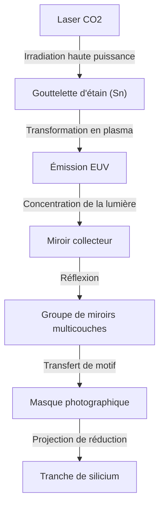

## Introduction

Les smartphones, l'évolution explosive de l'IA générative, la technologie de conduite autonome et le cloud computing qui soutiennent la société moderne. Au centre de tout cela se trouvent les « semi-conducteurs (puces électroniques) ». Et pour fabriquer les puces de pointe qui déterminent les performances de ces semi-conducteurs, l'« équipement de lithographie EUV » est indispensable. EUV signifie « extrême ultraviolet » (Extreme Ultraviolet), et la technologie qui utilise cette lumière spéciale pour dessiner des circuits minuscules sur des tranches de silicium (wafers) est appelée lithographie EUV.

Dans cet article, nous expliquerons en détail l'incroyable mécanisme de l'équipement de lithographie EUV, également connu sous le nom de « machine la plus complexe au monde », dont la société néerlandaise ASML est la seule au monde à avoir réussi la mise en pratique. Nous aborderons également l'histoire de la technologie des semi-conducteurs qui a conduit à son développement, ainsi que la manière dont les barrières physiques et technologiques ont été surmontées.

## 1. L'histoire de la miniaturisation des semi-conducteurs et les limites de la « loi de Moore »

L'histoire des semi-conducteurs est celle de la miniaturisation elle-même. Conformément à la « loi de Moore » proposée par Gordon Moore, cofondateur d'Intel (la densité d'intégration des semi-conducteurs double environ tous les 18 à 24 mois), les fabricants de semi-conducteurs se sont consacrés à rendre les transistors plus petits et plus denses. Plus les transistors sont petits, plus la distance parcourue par les électrons est courte, ce qui améliore la vitesse de calcul tout en réduisant la consommation d'énergie.

La clé principale pour faire progresser la miniaturisation est le processus d'« exposition » (lithographie). Comme pour le développement d'une photographie, il s'agit d'un processus qui utilise la lumière pour transférer un motif de circuit sur un matériau photosensible (résine photosensible) placé sur la tranche de silicium. Pour dessiner des circuits plus fins, une lumière avec une longueur d'onde plus courte est nécessaire.

Dans les années 1980, les lampes à mercure (raie g : 436 nm, raie i : 365 nm) étaient utilisées, mais elles ont ensuite évolué vers les lasers à excimère (KrF : 248 nm, ArF : 193 nm). De plus, en utilisant des technologies telles que la « lithographie par immersion », qui remplit l'espace entre la lentille et la tranche avec de l'eau pour augmenter l'indice de réfraction, et le « multi-patterning », qui effectue l'exposition en plusieurs étapes, les barrières de la miniaturisation considérées comme des limites ont été franchies les unes après les autres.

Cependant, lorsque la largeur des lignes de circuit est tombée en dessous de 7 nanomètres (nm), les limites de la lithographie par immersion ArF sont devenues évidentes. Le multi-patterning a entraîné une augmentation explosive du nombre d'étapes de processus, entraînant une flambée des coûts de fabrication et une détérioration du rendement (taux de bons produits). Par conséquent, une source de lumière avec une longueur d'onde d'une dimension totalement nouvelle était requise. C'est là qu'intervient l'EUV.

## 2. L'incroyable technologie de la lithographie EUV

La longueur d'onde de l'EUV n'est que de 13,5 nm. Elle a été considérablement raccourcie, passant à moins d'un dixième du laser à excimère ArF précédent (193 nm). Cela a permis de dessiner des circuits extrêmement fins en une seule exposition (single patterning), simplifiant ainsi le processus de fabrication et améliorant le rendement.

Cependant, la lumière d'une longueur d'onde de 13,5 nm possède des propriétés proches des rayons X dans la nature. Cette lumière avait un problème fatal : elle est absorbée par toutes les substances, y compris l'air et le verre (lentilles). Une conception fondamentalement différente des équipements de lithographie précédents était donc nécessaire.

### Mécanisme de génération de source lumineuse par plasma

Le mécanisme de génération de la lumière EUV équivaut à créer un « soleil artificiel » à l'intérieur de l'équipement.
1. À l'intérieur d'une chambre maintenue dans un vide poussé, des gouttelettes (droplets) d'étain (Sn) liquide tombent à une vitesse vertigineuse de 50 000 fois par seconde.
2. Un laser au dioxyde de carbone (CO2) de très haute puissance est irradié deux fois sur ces gouttelettes d'étain.
3. Le premier laser (pré-impulsion) aplatit la gouttelette d'étain en forme de crêpe, et le second laser (impulsion principale) la transforme en plasma.
4. Seule la lumière EUV de 13,5 nm est extraite de la lumière émise par ce plasma à des températures extrêmement élevées.

En répétant ce processus 50 000 fois par seconde, on peut maintenir une lumière EUV d'une puissance suffisante pour la lithographie.

### Système de miroirs multicouches spécial

La lumière EUV ne pouvant traverser les lentilles en verre conventionnelles, il faut utiliser des « miroirs » pour la réfléchir et contrôler son trajet optique. Cependant, la lumière EUV est également absorbée par des miroirs ordinaires.

Par conséquent, un « miroir multicouche » spécial a été développé, composé de dizaines de couches de molybdène (Mo) et de silicium (Si) empilées alternativement à une épaisseur atomique. En utilisant ce miroir poli de manière extrêmement lisse, il est possible de réfléchir uniquement la lumière d'une longueur d'onde spécifique. Néanmoins, comme environ 30 % de la lumière est perdue à chaque réflexion, si la réflexion est répétée plus de 10 fois avant d'atteindre la tranche depuis la source lumineuse, l'intensité de la lumière chute à quelques pourcents de sa valeur initiale. C'est pourquoi une puissance initiale phénoménale est requise.

## 3. Le monopole d'ASML et le gigantesque écosystème technologique

C'est la société néerlandaise ASML qui a mis en pratique cette technologie incroyablement difficile. Autrefois, les entreprises japonaises Nikon et Canon étaient également de redoutables concurrents sur le marché de la lithographie, mais en raison de la difficulté extrême du développement de l'EUV, des risques d'investissement énormes et des incertitudes technologiques, ASML a fini par monopoliser le marché.

Cependant, ASML n'a pas mis au point l'EUV toute seule. Le développement de l'équipement EUV a été le résultat d'un rassemblement mondial de connaissances.
- **Technologie de source lumineuse** : Acquisition de la société américaine Cymer pour obtenir la technologie de la source lumineuse plasma.
- **Système optique (miroirs)** : Établissement d'une structure de collaboration étroite avec le fabricant historique d'optique allemand Carl Zeiss pour produire des miroirs d'une planéité ultime.
- **Système de contrôle** : Fourniture de pièces par un réseau de milliers de fournisseurs de précision principalement en Europe.

ASML ne fonctionne pas comme une simple entreprise manufacturière, mais comme un « intégrateur de systèmes réunissant les meilleures technologies du monde ». Un équipement de lithographie EUV, dont on dit qu'il coûte entre 20 et 30 milliards de yens (plusieurs centaines de millions de dollars) par unité, est composé de plus de 100 000 pièces, ce qui équivaut à plusieurs avions de ligne, et son transport nécessite des dizaines de Boeing 747.

## 4. L'impact géopolitique et la sécurité des semi-conducteurs

Aujourd'hui, l'équipement de lithographie EUV a dépassé le cadre d'un simple produit industriel pour devenir un matériau stratégique influençant la sécurité nationale. En effet, l'EUV est indispensable à la fabrication de puces de pointe qui déterminent la supériorité de l'IA et des technologies militaires.

Dans le contexte des tensions sino-américaines, les États-Unis restreignent sévèrement l'exportation de technologies de pointe en matière de semi-conducteurs vers la Chine. Par conséquent, ASML, suivant les intentions des gouvernements néerlandais et américain, ne peut pas exporter d'équipements de lithographie EUV vers les entreprises chinoises. Ainsi, la fabrication autonome de semi-conducteurs de pointe en Chine est placée dans une situation extrêmement difficile. La technologie d'une seule entreprise influence désormais l'avenir de la politique internationale.

## 5. L'avenir de l'industrie des semi-conducteurs et l'EUV de nouvelle génération (High-NA EUV)

Grâce à l'introduction de la lithographie EUV, les meilleures fonderies mondiales (entreprises de fabrication de semi-conducteurs sous contrat) telles que TSMC, Samsung et Intel se dirigent vers la production de masse de puces ultra-fines des générations 5 nm, 3 nm et 2 nm. C'est ce qui rend possibles les GPU de NVIDIA soutenant l'évolution de l'IA et les processeurs hautes performances équipant l'iPhone d'Apple.

Et actuellement, ASML a déjà commencé l'expédition de son équipement de lithographie EUV de nouvelle génération, le « High-NA EUV ». En augmentant l'ON (ouverture numérique) de 0,33 à 0,55, il devient possible de capter plus de lumière et de dessiner des circuits encore plus fins. Grâce à cela, la fabrication de semi-conducteurs dans la région de moins de 2 nm, c'est-à-dire l'« angström (un dixième de nanomètre) », est en train de devenir une réalité.

## Conclusion

L'équipement de lithographie EUV est l'une des machines les plus précises et les plus complexes que l'humanité ait jamais créées. Cette technologie, qui peut être considérée comme la cristallisation de la mécanique quantique, de la physique des plasmas, de la science des matériaux et de l'ingénierie ultra-précise, n'est pas seulement le fruit des efforts d'une seule entreprise, mais le résultat de décennies de connaissances accumulées par des scientifiques et des ingénieurs du monde entier.

Nous ne devons pas oublier que derrière l'évolution de la technologie dont nous bénéficions au quotidien, il y a cette « ingénierie de l'extrême ». L'évolution de la technologie des semi-conducteurs, qui continue de repousser les limites physiques, continuera de stimuler le monde et d'ouvrir la voie vers un avenir inconnu.
