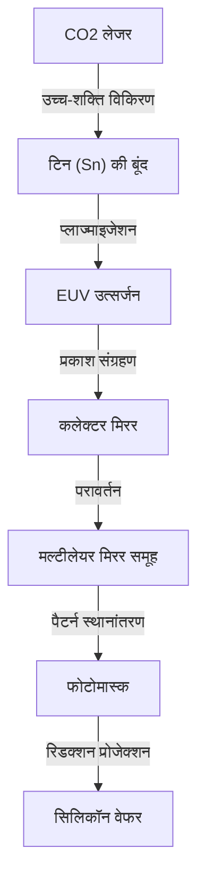

## परिचय

आधुनिक समाज को सहारा देने वाले स्मार्टफोन, जेनरेटिव AI का विस्फोटक विकास, ऑटोनॉमस ड्राइविंग तकनीक, और क्लाउड कंप्यूटिंग। इन सभी के केंद्र में "सेमीकंडक्टर (माइक्रोचिप)" मौजूद है। और उन अत्याधुनिक चिप्स के निर्माण के लिए, जो सेमीकंडक्टर्स के प्रदर्शन को निर्धारित करते हैं, "EUV लिथोग्राफी सिस्टम" अनिवार्य है। EUV का अर्थ "एक्सट्रीम अल्ट्रावायलेट (Extreme Ultraviolet)" है, और इस विशेष प्रकाश का उपयोग करके सिलिकॉन वेफर पर सूक्ष्म सर्किट बनाने की तकनीक को EUV लिथोग्राफी कहा जाता है।

इस लेख में, हम नीदरलैंड की ASML कंपनी द्वारा दुनिया में एकमात्र सफल व्यावहारिक अनुप्रयोग और "दुनिया की सबसे जटिल मशीन" के रूप में जाने जाने वाले EUV लिथोग्राफी सिस्टम के अद्भुत तंत्र, इसके विकास तक सेमीकंडक्टर तकनीक के इतिहास, और भौतिक और तकनीकी बाधाओं को कैसे पार किया गया, इसके बारे में विस्तार से बताएंगे।

## 1. सेमीकंडक्टर मिनिएचराइजेशन का इतिहास और "मूर के नियम" की सीमाएं

सेमीकंडक्टर का इतिहास, वास्तव में मिनिएचराइजेशन (लघुकरण) का इतिहास है। इंटेल के सह-संस्थापक गॉर्डन मूर द्वारा प्रस्तावित "मूर के नियम (सेमीकंडक्टर्स का एकीकरण दर लगभग 18 से 24 महीनों में दोगुना हो जाता है)" का पालन करते हुए, सेमीकंडक्टर निर्माताओं ने ट्रांजिस्टर को छोटा और अधिक सघन बनाने पर अपना पूरा ध्यान केंद्रित किया है। ट्रांजिस्टर जितना छोटा होता है, इलेक्ट्रॉनों की यात्रा की दूरी उतनी ही कम होती है, जिससे गणना की गति में सुधार होता है और साथ ही बिजली की खपत भी कम होती है।

मिनिएचराइजेशन को आगे बढ़ाने में सबसे महत्वपूर्ण कुंजी "लिथोग्राफी" प्रक्रिया है। यह फोटोग्राफ को विकसित करने की तरह है, जहां प्रकाश का उपयोग करके वेफर पर प्रकाश-संवेदनशील सामग्री (फोटोरेसिस्ट) पर सर्किट पैटर्न को स्थानांतरित किया जाता है। अधिक सूक्ष्म सर्किट बनाने के लिए, कम तरंग दैर्ध्य (वेवलेंथ) वाले प्रकाश की आवश्यकता होती है।

1980 के दशक में मरकरी लैंप (g-लाइन: 436nm, i-लाइन: 365nm) का उपयोग किया जाता था, लेकिन बाद में यह एक्सिमर लेजर (KrF: 248nm, ArF: 193nm) में विकसित हुआ। इसके अलावा, लेंस और वेफर के बीच पानी भरकर रिफ्रैक्टिव इंडेक्स बढ़ाने वाली "इमर्शन लिथोग्राफी" और कई बार एक्सपोज़र करने वाली "मल्टीपल पैटर्निंग" जैसी तकनीकों का उपयोग करके, एक के बाद एक मिनिएचराइजेशन की सीमाओं को तोड़ा गया।

हालांकि, जब सर्किट लाइन की चौड़ाई 7 नैनोमीटर (nm) से कम हो गई, तो ArF इमर्शन लिथोग्राफी की सीमाएं स्पष्ट हो गईं। मल्टीपल पैटर्निंग ने प्रक्रियाओं की संख्या में भारी वृद्धि की, जिससे निर्माण लागत में वृद्धि हुई और उत्पादन दर (यील्ड) में गिरावट आई। इसलिए, पूरी तरह से नए आयाम के तरंग दैर्ध्य वाले प्रकाश स्रोत की मांग की गई। वही EUV है।

## 2. EUV लिथोग्राफी की अद्भुत तकनीक

EUV की तरंग दैर्ध्य केवल 13.5nm है। पिछले ArF एक्सिमर लेजर (193nm) की तुलना में इसे एक बार में 10वें हिस्से से भी कम कर दिया गया। इससे 1 एक्सपोज़र (सिंगल पैटर्निंग) में बेहद सूक्ष्म सर्किट बनाना संभव हो गया, जिससे निर्माण प्रक्रिया के सरलीकरण और उत्पादन दर में सुधार की उम्मीद थी।

हालांकि, 13.5nm की तरंग दैर्ध्य वाले प्रकाश में प्रकृति में एक्स-रे (X-ray) के समान गुण होते हैं। इस प्रकाश के साथ एक घातक समस्या थी कि यह हवा और कांच (लेंस) सहित किसी भी सामग्री द्वारा अवशोषित हो जाता है। इसलिए, पिछले लिथोग्राफी उपकरणों से मौलिक रूप से अलग डिज़ाइन की आवश्यकता थी।

### प्लाज्मा के माध्यम से प्रकाश स्रोत उत्पादन का तंत्र

EUV प्रकाश उत्पन्न करने का तंत्र वास्तव में उपकरण के अंदर एक "कृत्रिम सूर्य" बनाने जैसा है।
1. एक अत्यधिक वैक्यूम वाले कक्ष (चैंबर) के अंदर, तरल टिन (Sn) की बूंदों (ड्रॉपलेट्स) को प्रति सेकंड 50,000 बार की तीव्र गति से गिराया जाता है।
2. टिन की उन बूंदों पर उच्च शक्ति वाले कार्बन डाइऑक्साइड (CO2) लेजर से 2 बार प्रहार किया जाता है।
3. पहला लेजर (प्री-पल्स) टिन की बूंद को एक चपटे पैनकेक के आकार में फैलाता है, और दूसरा लेजर (मेन-पल्स) इसे प्लाज्मा में बदल देता है।
4. इस अत्यधिक उच्च तापमान वाले प्लाज्मा द्वारा उत्सर्जित प्रकाश में से, केवल 13.5nm के EUV प्रकाश को निकाला जाता है।

इस प्रक्रिया को प्रति सेकंड 50,000 बार लगातार करने से ही, लिथोग्राफी के लिए आवश्यक आउटपुट के EUV प्रकाश को बनाए रखा जा सकता है।

### विशेष मल्टीलेयर मिरर सिस्टम

चूंकि EUV प्रकाश पारंपरिक कांच के लेंस से नहीं गुजर सकता है, इसलिए प्रकाश पथ को नियंत्रित करने के लिए सब कुछ "दर्पण (मिरर)" से प्रतिबिंबित करना आवश्यक है। हालांकि, सामान्य दर्पणों में भी EUV प्रकाश अवशोषित हो जाता है।

इसलिए, एक विशेष "मल्टीलेयर मिरर" विकसित किया गया था जिसमें मोलिब्डेनम (Mo) और सिलिकॉन (Si) को परमाणु-स्तर की मोटाई में बारी-बारी से दर्जनों परतों में रखा जाता है। अत्यंत चिकनी पॉलिश वाले इस दर्पण का उपयोग करके, केवल विशिष्ट तरंग दैर्ध्य के प्रकाश को प्रतिबिंबित किया जा सकता है। फिर भी, 1 प्रतिबिंब (रिफ्लेक्शन) में लगभग 30% प्रकाश नष्ट हो जाता है, इसलिए जब यह प्रकाश स्रोत से वेफर तक पहुंचने के लिए 10 से अधिक बार परावर्तित होता है, तो प्रकाश की तीव्रता मूल के कुछ प्रतिशत तक कम हो जाती है। यही कारण है कि प्रारंभिक चरण में अत्यधिक उच्च आउटपुट की आवश्यकता होती है।

## 3. ASML का एकाधिकार और विशाल प्रौद्योगिकी इकोसिस्टम

इस अविश्वसनीय रूप से कठिन तकनीक का व्यावसायीकरण नीदरलैंड की ASML कंपनी ने किया था। एक समय जापान की निकॉन और कैनन भी लिथोग्राफी बाजार में शक्तिशाली प्रतिद्वंद्वी थीं, लेकिन EUV विकास की अत्यधिक कठिनाई, भारी निवेश जोखिम, और तकनीकी अनिश्चितता के कारण, अंततः ASML ने बाजार पर एकाधिकार कर लिया।

हालांकि, ASML ने अकेले EUV को पूरा नहीं किया। EUV उपकरण का विकास वैश्विक ज्ञान का संकलन था।
- **प्रकाश स्रोत तकनीक**: अमेरिकी कंपनी Cymer का अधिग्रहण करके, प्लाज्मा प्रकाश स्रोत तकनीक प्राप्त की गई।
- **ऑप्टिकल सिस्टम (मिरर)**: दर्पणों के निर्माण के लिए जो परम चिकनाई रखते हैं, जर्मनी के पुराने ऑप्टिकल निर्माता Carl Zeiss के साथ घनिष्ठ सहयोग प्रणाली स्थापित की गई।
- **नियंत्रण प्रणाली**: मुख्य रूप से यूरोप में स्थित हजारों सटीक आपूर्तिकर्ता नेटवर्क के माध्यम से भागों की आपूर्ति।

ASML केवल एक विनिर्माण कंपनी नहीं है, बल्कि "दुनिया की सर्वश्रेष्ठ तकनीक को एकीकृत करने वाले सिस्टम इंटीग्रेटर" के रूप में कार्य करती है। एक EUV लिथोग्राफी प्रणाली, जिसकी कीमत 20 अरब से 30 अरब येन प्रति यूनिट बताई जाती है, में कई जंबो जेट विमानों के बराबर 100,000 से अधिक हिस्से होते हैं, और इसके परिवहन के लिए दर्जनों बोइंग 747 विमानों की आवश्यकता होती है।

## 4. भू-राजनीतिक प्रभाव और सेमीकंडक्टर सुरक्षा

वर्तमान में, EUV लिथोग्राफी उपकरण मात्र औद्योगिक उत्पादों के दायरे से बाहर जाकर, राष्ट्रीय सुरक्षा को प्रभावित करने वाली एक रणनीतिक सामग्री बन गया है। ऐसा इसलिए है क्योंकि EUV अत्याधुनिक चिप्स के निर्माण के लिए अपरिहार्य है जो AI और सैन्य तकनीक में श्रेष्ठता निर्धारित करते हैं।

अमेरिका-चीन संघर्ष की पृष्ठभूमि में, अमेरिका ने चीन को अत्याधुनिक सेमीकंडक्टर प्रौद्योगिकी के निर्यात को सख्ती से प्रतिबंधित कर दिया है। परिणामस्वरूप, ASML डच सरकार और अमेरिकी सरकार के इरादों के कारण चीनी कंपनियों को EUV लिथोग्राफी उपकरणों का निर्यात नहीं कर सकती है। इससे चीन में अत्याधुनिक सेमीकंडक्टर्स का स्वायत्त निर्माण बेहद कठिन स्थिति में आ गया है। इस तरह, एक कंपनी की तकनीक अंतरराष्ट्रीय राजनीति की दिशा तय करने वाली स्थिति बन गई है।

## 5. सेमीकंडक्टर उद्योग का भविष्य और नेक्स्ट-जेनरेशन EUV (High-NA EUV)

EUV लिथोग्राफी की शुरुआत के साथ, TSMC, सैमसंग और इंटेल जैसे दुनिया के शीर्ष फाउंड्री (सेमीकंडक्टर कॉन्ट्रैक्ट मैन्युफैक्चरिंग कंपनियां) 5nm, 3nm और 2nm पीढ़ी के अल्ट्रा-फाइन चिप्स के बड़े पैमाने पर उत्पादन की ओर बढ़ रहे हैं। इसके कारण, NVIDIA के GPU जो AI के विकास का समर्थन करते हैं, और Apple के iPhone में स्थापित उच्च-प्रदर्शन प्रोसेसर को साकार किया गया है।

और अब, ASML ने पहले ही अगली पीढ़ी के EUV लिथोग्राफी सिस्टम "High-NA EUV" का शिपमेंट शुरू कर दिया है। NA (न्यूमेरिकल अपर्चर) को पिछले 0.33 से बढ़ाकर 0.55 करने से, अधिक प्रकाश कैप्चर करना और अधिक सूक्ष्म सर्किट बनाना संभव हो जाता है। इसके परिणामस्वरूप, 2nm से कम, यानी "एंगस्ट्रॉम (1nm का 10वां हिस्सा)" क्षेत्र में सेमीकंडक्टर निर्माण एक वास्तविकता बनने जा रहा है।

## निष्कर्ष

EUV लिथोग्राफी सिस्टम उन सबसे सटीक और जटिल मशीनों में से एक है जिसे मानवता ने अब तक बनाया है। यह तकनीक, जिसे क्वांटम यांत्रिकी, प्लाज्मा भौतिकी, सामग्री विज्ञान, और अल्ट्रा-प्रिसिजन इंजीनियरिंग का क्रिस्टलीकरण कहा जा सकता है, केवल एक कंपनी के प्रयासों से नहीं, बल्कि दशकों के दुनिया भर के वैज्ञानिकों और इंजीनियरों के ज्ञान के संचय द्वारा बनाई गई थी।

हमें यह नहीं भूलना चाहिए कि तकनीक के विकास के पीछे, जिसका हम हर दिन लाभ उठाते हैं, ऐसी "चरम इंजीनियरिंग" मौजूद है। भौतिक सीमाओं को लगातार चुनौती देने वाली सेमीकंडक्टर तकनीक का विकास आगे भी दुनिया का नेतृत्व करता रहेगा और एक अज्ञात भविष्य का मार्ग प्रशस्त करेगा।
