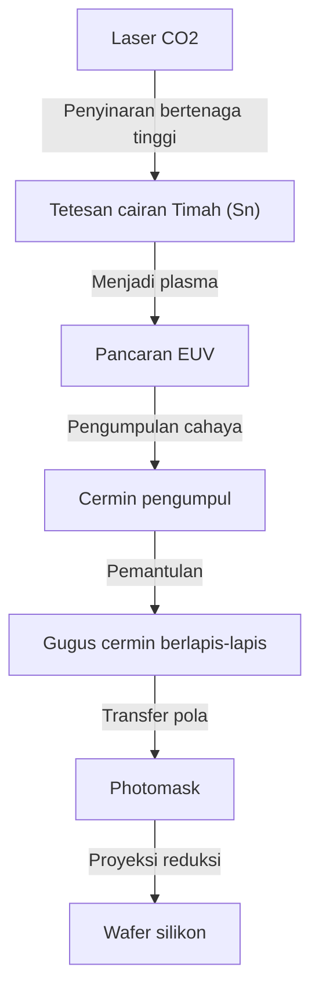

## Pendahuluan

Ponsel cerdas yang menopang masyarakat modern, evolusi eksplosif dari AI generatif, teknologi mengemudi otonom, dan komputasi awan. Di pusat semua ini terdapat "semikonduktor (mikrochip)". Dan untuk memproduksi chip tercanggih yang menentukan kinerja semikonduktor tersebut, "mesin litografi EUV" sangat diperlukan. EUV adalah singkatan dari "Extreme Ultraviolet" (Ultraviolet Ekstrem), dan teknologi yang menggunakan cahaya khusus ini untuk menggambar sirkuit mikroskopis pada wafer silikon disebut litografi EUV.

Artikel ini akan menjelaskan secara rinci mekanisme luar biasa dari mesin litografi EUV, yang sering disebut sebagai "mesin paling kompleks di dunia" dan yang berhasil dikomersialkan oleh satu-satunya perusahaan di dunia, yaitu ASML dari Belanda, serta sejarah teknologi semikonduktor yang mengarah pada pengembangannya, dan bagaimana rintangan fisik maupun teknologi berhasil diatasi.

## 1. Sejarah Miniaturisasi Semikonduktor dan Batasan "Hukum Moore"

Sejarah semikonduktor pada dasarnya adalah sejarah miniaturisasi. Mengikuti "Hukum Moore" yang dikemukakan oleh salah satu pendiri Intel, Gordon Moore (kepadatan sirkuit terpadu semikonduktor berlipat ganda setiap sekitar 18 hingga 24 bulan), produsen semikonduktor telah mencurahkan seluruh tenaganya untuk membuat transistor lebih kecil dan menempatkannya lebih padat. Semakin kecil transistor, semakin pendek jarak perpindahan elektron, yang meningkatkan kecepatan komputasi sekaligus menurunkan konsumsi daya.

Kunci utama dalam memajukan miniaturisasi adalah proses "litografi". Proses ini ibarat mencetak foto, menggunakan cahaya untuk mentransfer pola sirkuit ke bahan peka cahaya (photoresist) pada wafer. Untuk menggambar sirkuit yang lebih mikroskopis, dibutuhkan cahaya dengan panjang gelombang yang lebih pendek.

Pada tahun 1980-an, lampu merkuri (garis g: 436nm, garis i: 365nm) digunakan, tetapi kemudian berevolusi menjadi laser excimer (KrF: 248nm, ArF: 193nm). Selanjutnya, dengan memanfaatkan teknologi seperti "litografi celup (immersion lithography)", di mana ruang antara lensa dan wafer diisi air untuk meningkatkan indeks bias, serta "multi-patterning", di mana proses pencahayaan dilakukan dalam beberapa tahap, batasan miniaturisasi terus-menerus berhasil ditembus.

Namun, ketika lebar garis sirkuit berada di bawah 7 nanometer (nm), batasan litografi celup ArF menjadi semakin jelas. Multi-patterning meningkatkan jumlah proses secara eksplosif, menyebabkan lonjakan biaya produksi dan memburuknya yield (tingkat produk tanpa cacat). Oleh karena itu, sumber cahaya dengan dimensi panjang gelombang yang sama sekali baru sangat dibutuhkan. Itulah EUV.

## 2. Teknologi Litografi EUV yang Menakjubkan

Panjang gelombang EUV hanya 13,5nm. Ini adalah pemendekan panjang gelombang yang drastis, menjadi kurang dari 1/10 dari laser excimer ArF (193nm) sebelumnya. Hal ini memungkinkan penggambaran sirkuit yang sangat mikroskopis dalam satu kali pencahayaan (single patterning), yang diharapkan dapat menyederhanakan proses manufaktur dan meningkatkan yield.

Namun, cahaya dengan panjang gelombang 13,5nm memiliki sifat yang mendekati sinar-X di alam. Terdapat masalah fatal di mana cahaya ini diserap oleh semua materi, termasuk udara dan kaca (lensa). Oleh karena itu, desain yang secara fundamental berbeda dari mesin litografi sebelumnya sangat diperlukan.

### Mekanisme Menghasilkan Sumber Cahaya dengan Plasma

Mekanisme untuk menghasilkan cahaya EUV sama seperti menciptakan "matahari buatan" di dalam mesin.
1. Ke dalam bilik yang dijaga pada kondisi vakum tinggi, tetesan cairan (droplet) timah (Sn) dijatuhkan dengan kecepatan luar biasa yaitu 50.000 kali per detik.
2. Tetesan timah tersebut ditembak dengan laser karbon dioksida (CO2) bertenaga ultra-tinggi sebanyak 2 kali.
3. Laser pertama (pre-pulse) meratakan tetesan timah menjadi bentuk pipih seperti panekuk, dan laser kedua (main pulse) mengubahnya menjadi plasma.
4. Dari cahaya yang dipancarkan oleh plasma bersuhu sangat tinggi ini, hanya cahaya EUV 13,5nm yang diekstrak.

Dengan melakukan proses ini secara terus-menerus sebanyak 50.000 kali dalam 1 detik, barulah output cahaya EUV yang dibutuhkan untuk litografi dapat dipertahankan.

### Sistem Cermin Berlapis-lapis Khusus

Karena cahaya EUV tidak dapat melewati lensa kaca konvensional, jalurnya harus dikendalikan dengan memantulkannya sepenuhnya menggunakan "cermin (mirror)". Namun, cermin biasa pun akan menyerap cahaya EUV.

Oleh karena itu, sebuah "cermin berlapis-lapis (multilayer mirror)" khusus dikembangkan dengan menumpuk molibdenum (Mo) dan silikon (Si) secara bergantian hingga puluhan lapis pada ketebalan tingkat atom. Dengan menggunakan cermin yang dipoles sangat halus ini, hanya cahaya dengan panjang gelombang tertentu yang dapat dipantulkan. Meskipun demikian, sekitar 30% cahaya hilang pada satu kali pantulan, sehingga setelah mengulangi pantulan lebih dari 10 kali dari sumber cahaya hingga mencapai wafer, intensitas cahaya menyusut hingga menjadi hanya beberapa persen dari aslinya. Inilah alasan mengapa daya output yang luar biasa tinggi dibutuhkan pada tahap awal.

## 3. Monopoli ASML dan Ekosistem Teknologi yang Raksasa

Perusahaan yang berhasil mengkomersialkan teknologi yang luar biasa sulit ini adalah ASML dari Belanda. Dulu, Nikon dan Canon dari Jepang juga merupakan pesaing kuat di pasar litografi, tetapi karena kesulitan pengembangan EUV, risiko investasi yang sangat besar, dan ketidakpastian teknologi, pada akhirnya hanya ASML yang berhasil memonopoli pasar.

Namun, ASML tidak mengembangkan EUV sendirian. Pengembangan mesin EUV merupakan gabungan pengetahuan global.
- **Teknologi sumber cahaya**: Mengakuisisi perusahaan Amerika Cymer untuk mendapatkan teknologi sumber cahaya plasma.
- **Sistem optik (cermin)**: Membangun sistem kolaborasi erat dengan produsen optik mapan asal Jerman, Carl Zeiss, untuk memproduksi cermin dengan tingkat kehalusan tertinggi.
- **Sistem kontrol**: Pasokan suku cadang dari jaringan ribuan pemasok presisi tinggi yang berpusat di Eropa.

ASML bukan sekadar perusahaan manufaktur, melainkan berfungsi sebagai "sistem integrator yang menggabungkan teknologi terbaik dunia". Sebuah mesin litografi EUV yang harganya diperkirakan mencapai 20 miliar hingga 30 miliar yen, terdiri dari lebih dari 100.000 komponen yang setara dengan beberapa pesawat jet jumbo, dan untuk mengangkutnya dibutuhkan puluhan pesawat Boeing 747.

## 4. Dampak Geopolitik dan Keamanan Nasional Semikonduktor

Saat ini, mesin litografi EUV bukan sekadar produk industri belaka, melainkan telah menjadi komoditas strategis yang menentukan keamanan nasional suatu negara. Hal ini karena EUV sangat penting untuk memproduksi chip mutakhir yang menentukan keunggulan AI maupun teknologi militer.

Dengan latar belakang konflik AS-Tiongkok, Amerika Serikat memberlakukan pembatasan ketat terhadap ekspor teknologi semikonduktor mutakhir ke Tiongkok. Akibatnya, ASML tidak dapat mengekspor mesin litografi EUV ke perusahaan-perusahaan Tiongkok akibat kehendak dari pemerintah Belanda dan pemerintah Amerika Serikat. Dengan demikian, pembuatan semikonduktor mutakhir secara mandiri di Tiongkok menjadi sangat sulit. Begitulah teknologi dari satu perusahaan bisa memengaruhi jalannya politik internasional.

## 5. Masa Depan Industri Semikonduktor dan EUV Generasi Berikutnya (High-NA EUV)

Dengan pengenalan litografi EUV, pabrik peleburan (foundry) top dunia seperti TSMC, Samsung, dan Intel tengah melaju menuju produksi massal chip ultra-mikroskopis generasi 5nm, 3nm, dan 2nm. Hal ini mewujudkan GPU NVIDIA yang mendukung evolusi AI, maupun prosesor berkinerja tinggi yang disematkan pada iPhone milik Apple.

Saat ini, ASML telah mulai mengirimkan mesin litografi EUV generasi berikutnya yang disebut "High-NA EUV". Dengan meningkatkan NA (Numerical Aperture) dari 0,33 menjadi 0,55, mesin ini dapat menangkap lebih banyak cahaya dan menggambar sirkuit yang lebih mikroskopis lagi. Dengan ini, pembuatan semikonduktor di bawah ukuran 2nm, atau dalam wilayah "Angstrom (sepersepuluh dari 1nm)", akan segera menjadi kenyataan.

## Penutup

Mesin litografi EUV adalah salah satu mesin paling presisi dan kompleks yang pernah diciptakan oleh umat manusia. Teknologi ini, yang dapat disebut sebagai kristalisasi mekanika kuantum, fisika plasma, ilmu material, dan rekayasa ultra-presisi, tidak hanya lahir dari upaya satu perusahaan saja, melainkan gabungan pengetahuan dari para ilmuwan dan insinyur di seluruh dunia selama puluhan tahun.

Kita tidak boleh lupa bahwa di balik evolusi teknologi yang manfaatnya kita rasakan sehari-hari, terdapat "rekayasa tingkat ekstrem" semacam ini. Evolusi teknologi semikonduktor yang terus menantang batasan fisik akan terus memimpin dunia dan membuka jalan menuju masa depan yang belum terpetakan.
