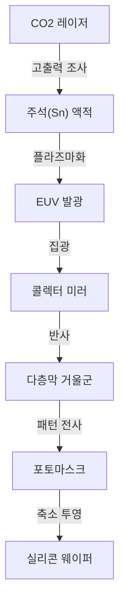

## 머리말

현대 사회를 지탱하는 스마트폰, 생성형 AI의 폭발적 진화, 자율주행 기술, 그리고 클라우드 컴퓨팅. 이 모든 것의 중심에는 '반도체(마이크로칩)'가 존재합니다. 그리고 그 반도체의 성능을 결정짓는 최첨단 칩을 제조하기 위해 필수불가결한 것이 바로 'EUV 노광 장비'입니다. EUV란 '극단자외선(Extreme Ultraviolet)'의 약자이며, 이 특수한 빛을 사용해 실리콘 웨이퍼 위에 극소형 회로를 그려내는 기술을 EUV 리소그래피라고 부릅니다.

본 기사에서는 네덜란드의 ASML사가 세계에서 유일하게 실용화에 성공하여 '세계에서 가장 복잡한 기계'라고도 불리는 EUV 노광 장비의 경이로운 구조와, 그 개발에 이르기까지의 반도체 기술의 역사, 그리고 물리적·기술적 장벽을 어떻게 극복해 왔는지 자세히 해설합니다.

## 1. 반도체 미세화의 역사와 '무어의 법칙'의 한계

반도체의 역사는 미세화의 역사 그 자체입니다. 인텔의 공동 창업자 고든 무어가 제창한 '무어의 법칙(반도체의 집적도는 약 18~24개월마다 배가된다)'에 따라 반도체 제조업체들은 트랜지스터를 더 작고 빽빽하게 배치하는 데 심혈을 기울여 왔습니다. 트랜지스터가 작아질수록 전자의 이동 거리가 짧아져 계산 속도가 향상됨과 동시에 소비 전력이 낮아집니다.

미세화를 진행하는 데 있어 가장 중요한 열쇠가 되는 것이 '노광(리소그래피)' 공정입니다. 이는 사진 현상처럼 빛을 사용하여 웨이퍼 상의 감광재(포토레지스트)에 회로 패턴을 전사하는 공정입니다. 더 미세한 회로를 그리기 위해서는 파장이 더 짧은 빛이 필요합니다.

1980년대에는 수은 램프(g선: 436nm, i선: 365nm)가 사용되었지만, 그 후 엑시머 레이저(KrF: 248nm, ArF: 193nm)로 진화했습니다. 나아가 렌즈와 웨이퍼 사이에 물을 채워 굴절률을 높이는 '액침 리소그래피'나, 여러 번에 나누어 노광을 진행하는 '멀티 패터닝' 등의 기술을 구사하여 한계라 여겨졌던 미세화의 벽을 차례로 돌파해 왔습니다.

그러나 회로 선폭이 7나노미터(nm) 밑으로 내려가자 더 이상 ArF 액침 리소그래피의 한계가 명백해졌습니다. 멀티 패터닝은 공정 수를 폭발적으로 증가시켜 제조 비용의 급등과 수율(양품률) 악화를 초래한 것입니다. 그래서 전혀 새로운 차원의 파장을 가진 광원이 요구되었습니다. 그것이 EUV입니다.

## 2. EUV 리소그래피의 경이로운 기술

EUV의 파장은 불과 13.5nm. 기존의 ArF 엑시머 레이저(193nm)에서 단숨에 10분의 1 이하로 짧은 파장화가 이루어졌습니다. 이로 인해 매우 미세한 회로를 단 1회의 노광(싱글 패터닝)으로 묘화하는 것이 가능해져, 제조 공정의 간략화와 수율 향상이 기대되었습니다.

그러나 13.5nm라는 파장의 빛은 자연계에서는 X선에 가까운 성질을 가집니다. 이 빛은 공기나 유리(렌즈)를 포함한 모든 물질에 흡수되어 버린다는 치명적인 문제가 있었습니다. 그 때문에 기존의 노광 장비와는 근본적으로 다른 설계가 필요했습니다.

### 플라즈마를 통한 광원 생성의 원리

EUV 빛을 발생시키는 원리는 그야말로 '인공 태양'을 장비 내부에 만들어내는 것과 같습니다.
1. 고도의 진공 상태로 유지된 챔버 내부에, 초당 5만 번이라는 맹렬한 속도로 액상의 주석(Sn) 액적(드롭렛)을 낙하시킵니다.
2. 그 주석 액적에 초고출력의 탄산가스(CO2) 레이저를 2회 조사합니다.
3. 1차 레이저(프리 펄스)로 주석 액적을 납작한 팬케이크 모양으로 펴고, 2차 레이저(메인 펄스)로 플라즈마화시킵니다.
4. 이 극도로 고온인 플라즈마가 발산하는 빛 중에서 13.5nm의 EUV 빛만을 추출합니다.

이 과정을 1초에 5만 번 연속으로 수행함으로써, 비로소 노광에 필요한 출력의 EUV 빛을 유지할 수 있습니다.

### 특수한 다층막 거울 시스템

EUV 빛은 기존의 유리 렌즈를 통과할 수 없기 때문에, 모두 '거울(미러)'로 반사시켜 광로를 제어해야 합니다. 그러나 일반적인 거울에서도 EUV 빛은 흡수되어 버립니다.

그래서 몰리브덴(Mo)과 실리콘(Si)을 원자 수준의 두께로 교대로 수십 층이나 겹겹이 쌓아 올린 특수한 '다층막 거울'이 개발되었습니다. 매우 매끄럽게 연마된 이 거울을 사용함으로써 특정 파장의 빛만을 반사시킬 수 있습니다. 그럼에도 1회 반사 시 약 30%의 빛이 손실되기 때문에, 광원에서 웨이퍼에 도달하기까지 10번 이상의 반사를 반복하면 빛의 강도는 원래의 몇 % 수준으로 감쇠되어 버립니다. 초기 단계에서 터무니없이 높은 출력이 요구되는 것은 이 때문입니다.

## 3. ASML의 독점과 거대한 기술 생태계

이 터무니없이 곤란한 기술을 실용화한 것이 네덜란드의 ASML사입니다. 한때는 일본의 니콘이나 캐논도 리소그래피 시장에서 강력한 라이벌이었으나, EUV 개발의 너무나도 큰 어려움과 막대한 투자 위험, 그리고 기술적 불확실성으로 인해 최종적으로 ASML만이 시장을 독점하게 되었습니다.

그러나 ASML 단독으로 EUV를 완성시킨 것은 아닙니다. EUV 장비의 개발은 글로벌한 지식의 결집이었습니다.
- **광원 기술**: 미국의 사이머(Cymer)사를 인수하여 플라즈마 광원 기술을 획득.
- **광학계(거울)**: 독일의 전통 있는 광학 제조업체인 칼 자이스(Carl Zeiss)사와 긴밀한 협업 체제를 구축하여 궁극의 평활도를 가진 거울을 제조.
- **제어 시스템**: 유럽을 중심으로 한 수천 개사에 달하는 정밀 공급업체 네트워크에 의한 부품 공급.

ASML은 단순한 제조업체가 아니라 '세계 최고의 기술을 통합하는 시스템 인테그레이터'로서 기능하고 있는 것입니다. 1대당 200억 엔에서 300억 엔이라고도 일컬어지는 EUV 노광 장비는 점보 제트기 여러 대 분량에 해당하는 10만 점 이상의 부품으로 구성되며, 그 수송에는 수십 대의 보잉 747형 항공기가 필요하게 됩니다.

## 4. 지정학적인 영향과 반도체의 안전 보장

현재 EUV 노광 장비는 단순한 공업 제품의 틀을 넘어 국가의 안전 보장을 좌우하는 전략 물자가 되었습니다. AI나 군사 기술의 우위성을 결정짓는 최첨단 칩의 제조에는 EUV가 불가결하기 때문입니다.

미중 대립을 배경으로 미국은 중국으로의 최첨단 반도체 기술 수출을 엄격하게 제한하고 있습니다. 그 결과, ASML은 네덜란드 정부 및 미국 정부의 의향에 따라 중국 기업에 대해 EUV 노광 장비 수출을 할 수 없게 되었습니다. 이로 인해 중국에서의 최첨단 반도체의 자율적인 제조는 지극히 곤란한 상황에 처해 있습니다. 이처럼 한 기업의 기술이 국제 정치의 행방을 좌우하는 사태가 벌어지고 있는 것입니다.

## 5. 반도체 산업의 미래와 차세대 EUV(High-NA EUV)

EUV 리소그래피의 도입으로 TSMC, 삼성, 인텔과 같은 세계 최상위 파운드리(반도체 위탁 제조 기업)는 5nm, 3nm, 그리고 2nm 세대의 초미세 칩 양산을 향해 돌진하고 있습니다. 이를 통해 AI의 진화를 뒷받침하는 NVIDIA의 GPU나 Apple의 iPhone에 탑재되는 고성능 프로세서가 실현되고 있습니다.

그리고 현재 ASML은 이미 차세대 EUV 노광 장비 'High-NA EUV'의 출하를 시작했습니다. NA(개구수)를 기존의 0.33에서 0.55로 끌어올림으로써 더 많은 빛을 받아들여 더욱 미세한 회로를 그려내는 것이 가능해집니다. 이로써 2nm 미만, 즉 '옹스트롬(1nm의 10분의 1)' 영역에서의 반도체 제조가 현실이 되려 하고 있습니다.

## 맺음말

EUV 노광 장비는 인류가 지금까지 만들어낸 기계 중에서 가장 정밀하고 복잡한 것 중 하나입니다. 양자역학, 플라즈마 물리학, 재료과학, 그리고 초정밀 공학의 결정체라고도 할 수 있는 이 기술은 한 기업의 노력뿐만 아니라 수십 년에 걸친 전 세계 과학자와 기술자들의 지식 집적을 통해 탄생했습니다.

우리가 매일 혜택을 받고 있는 테크놀로지 진화의 이면에는 이러한 '극한의 엔지니어링'이 존재하고 있음을 잊어서는 안 됩니다. 물리적 한계에 계속해서 도전하는 반도체 기술의 진화는 앞으로도 세계를 견인하며 미지의 미래를 개척해 나갈 것입니다.
