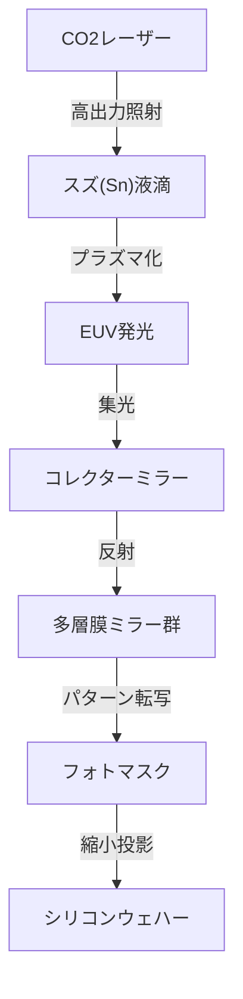

## はじめに

現代社会を支えるスマートフォン、生成AIの爆発的進化、自動運転技術、そしてクラウドコンピューティング。これらすべての中心には「半導体（マイクロチップ）」が存在しています。そして、その半導体の性能を決定づける最先端のチップを製造するために不可欠なのが、「EUV露光装置」です。EUVとは「極端紫外線（Extreme Ultraviolet）」の略称であり、この特殊な光を使ってシリコンウェハー上に極小の回路を描き出す技術をEUVリソグラフィと呼びます。

本記事では、オランダのASML社が世界で唯一実用化に成功し、「世界で最も複雑な機械」とも称されるEUV露光装置の驚異的な仕組みと、その開発に至るまでの半導体技術の歴史、そして物理的・技術的な壁をどのように乗り越えてきたのかを詳しく解説します。

## 1. 半導体微細化の歴史と「ムーアの法則」の限界

半導体の歴史は、微細化の歴史そのものです。インテルの共同創業者ゴードン・ムーアが提唱した「ムーアの法則（半導体の集積率は約18〜24か月で倍増する）」に従い、半導体メーカーはトランジスタをより小さく、より密集して配置することに心血を注いできました。トランジスタが小さくなればなるほど、電子の移動距離が短くなり、計算速度が向上すると同時に消費電力が下がります。

微細化を進める上で最大の鍵となるのが「露光（リソグラフィ）」工程です。これは、写真の現像のように、光を使ってウェハー上の感光材（フォトレジスト）に回路パターンを転写する工程です。より微細な回路を描くためには、より波長の短い光が必要となります。

1980年代には水銀ランプ（g線: 436nm, i線: 365nm）が使われていましたが、その後、エキシマレーザー（KrF: 248nm, ArF: 193nm）へと進化しました。さらに、レンズとウェハーの間に水を満たして屈折率を上げる「液浸リソグラフィ」や、複数回に分けて露光を行う「マルチパターニング」などの技術を駆使して、限界とされた微細化の壁を次々と突破してきました。

しかし、回路線幅が7ナノメートル（nm）を下回るようになると、もはやArF液浸リソグラフィの限界が明白になりました。マルチパターニングは工程数を爆発的に増加させ、製造コストの高騰と歩留まり（良品率）の悪化を招いたのです。そこで、全く新しい次元の波長を持つ光源が求められました。それがEUVです。

## 2. EUVリソグラフィの驚異的な技術

EUVの波長はわずか13.5nm。これまでのArFエキシマレーザー（193nm）から一気に10分の1以下へと短波長化されました。これにより、非常に微細な回路を1回の露光（シングルパターニング）で描画することが可能になり、製造プロセスの簡略化と歩留まりの向上が期待されました。

しかし、13.5nmという波長の光は、自然界ではX線に近い性質を持ちます。この光は、空気やガラス（レンズ）を含むあらゆる物質に吸収されてしまうという致命的な問題がありました。そのため、これまでの露光装置とは根本的に異なる設計が必要でした。

### プラズマによる光源生成の仕組み

EUV光を発生させる仕組みは、まさに「人工太陽」を装置内に作り出すようなものです。
1. 高度な真空状態に保たれたチャンバー内に、毎秒5万回という猛烈なスピードで液状のスズ（Sn）のドロップレット（液滴）を落下させます。
2. そのスズの液滴に対し、超高出力の炭酸ガス（CO2）レーザーを2回照射します。
3. 1回目のレーザー（プレパルス）でスズの液滴を平らなパンケーキ状に広げ、2回目のレーザー（メインパルス）でプラズマ化させます。
4. この極めて高温のプラズマが発する光の中から、13.5nmのEUV光だけを抽出します。

このプロセスを1秒間に5万回連続で行うことで、初めて露光に必要な出力のEUV光を維持することができます。

### 特殊な多層膜ミラーシステム

EUV光は従来のガラスレンズを通過できないため、すべて「鏡（ミラー）」で反射させて光路を制御する必要があります。しかし、通常の鏡でもEUV光は吸収されてしまいます。

そこで、モリブデン（Mo）とシリコン（Si）を原子レベルの薄さで交互に何十層も重ね合わせた特殊な「多層膜ミラー」が開発されました。非常に滑らかに研磨されたこのミラーを使うことで、特定の波長の光だけを反射させることができます。それでも1回の反射で約30%の光が失われるため、光源からウェハーに到達するまでに10回以上の反射を繰り返すと、光の強度は元の数%にまで減衰してしまいます。初期段階で途方もない高出力が求められるのはこのためです。

## 3. ASMLの独占と巨大な技術エコシステム

この途方もなく困難な技術を実用化したのが、オランダのASML社です。かつては日本のニコンやキヤノンもリソグラフィ市場で強力なライバルでしたが、EUV開発のあまりの難しさと莫大な投資リスク、そして技術的な不確実性により、最終的にASMLのみが市場を独占することになりました。

しかし、ASML単独でEUVを完成させたわけではありません。EUV装置の開発は、グローバルな知の結集でした。
- **光源技術**: アメリカのサイマー（Cymer）社を買収し、プラズマ光源の技術を獲得。
- **光学系（ミラー）**: ドイツの老舗光学メーカー、カール・ツァイス（Carl Zeiss）社と緊密な協業体制を構築し、究極の平滑度を持つミラーを製造。
- **制御システム**: ヨーロッパを中心とした数千社に及ぶ精密サプライヤーネットワークによる部品供給。

ASMLは単なる製造業ではなく、「世界最高の技術を統合するシステムインテグレーター」として機能しているのです。1台あたり200億円から300億円とも言われるEUV露光装置は、ジャンボジェット機数機分に相当する10万点以上の部品で構成され、その輸送には数十機のボーイング747型機が必要になります。

## 4. 地政学的な影響と半導体の安全保障

現在、EUV露光装置は単なる工業製品の枠を超え、国家の安全保障を左右する戦略物資となっています。AIや軍事技術の優位性を決定づける最先端チップの製造にはEUVが不可欠であるためです。

米中対立を背景に、アメリカは中国への最先端半導体技術の輸出を厳しく制限しています。その結果、ASMLはオランダ政府およびアメリカ政府の意向により、中国企業に対してEUV露光装置の輸出を行うことができません。これにより、中国における最先端半導体の自律的な製造は極めて困難な状況に置かれています。このように、1つの企業の技術が国際政治の行方を左右する事態となっているのです。

## 5. 半導体産業の未来と次世代EUV（High-NA EUV）

EUVリソグラフィの導入により、TSMC、サムスン、インテルといった世界のトップファウンドリ（半導体受託製造企業）は、5nm、3nm、そして2nm世代の超微細チップの量産へと突き進んでいます。これにより、AIの進化を支えるNVIDIAのGPUや、AppleのiPhoneに搭載される高性能プロセッサが実現しています。

そして現在、ASMLはすでに次世代のEUV露光装置「High-NA EUV」の出荷を開始しています。NA（開口数）を従来の0.33から0.55へと引き上げることで、より多くの光を取り込み、さらに微細な回路を描画することが可能になります。これにより、2nm未満、すなわち「オングストローム（1nmの10分の1）」の領域での半導体製造が現実のものになろうとしています。

## おわりに

EUV露光装置は、人類がこれまでに作り上げた機械の中で最も精密で複雑なものの一つです。量子力学、プラズマ物理学、材料科学、そして超精密工学の結晶とも言えるこの技術は、一企業の努力だけでなく、数十年におよぶ世界中の科学者と技術者の知の集積によって生み出されました。

私たちが日々恩恵を受けているテクノロジーの進化の裏には、こうした「極限のエンジニアリング」が存在していることを忘れてはなりません。物理的限界に挑み続ける半導体技術の進化は、これからも世界を牽引し、未知の未来を切り拓いていくことでしょう。
