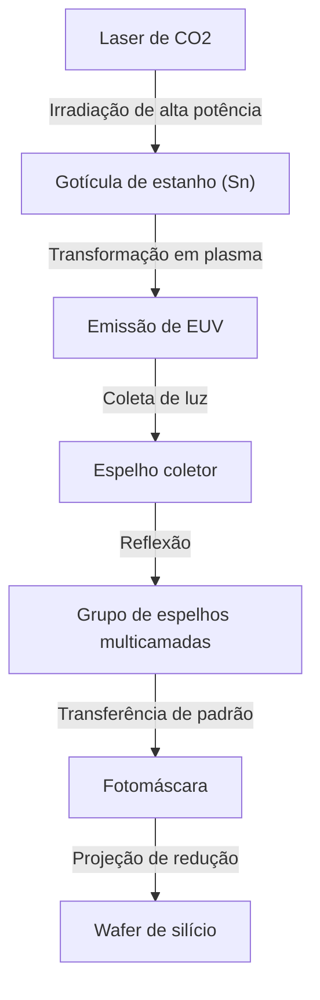

## Introdução

Smartphones, a explosiva evolução da IA gerativa, tecnologia de direção autônoma e computação em nuvem que sustentam a sociedade moderna. No centro de tudo isso, existem os "semicondutores (microchips)". E indispensável para fabricar os chips de ponta que determinam o desempenho desses semicondutores é o "equipamento de litografia EUV". EUV é a abreviação de "Ultravioleta Extremo" (Extreme Ultraviolet), e a tecnologia que usa essa luz especial para desenhar circuitos minúsculos em wafers de silício é chamada de litografia EUV.

Neste artigo, explicaremos em detalhes o mecanismo incrível do equipamento de litografia EUV, que a empresa holandesa ASML conseguiu comercializar com sucesso de forma exclusiva no mundo, muitas vezes chamada de "a máquina mais complexa do mundo", a história da tecnologia de semicondutores que levou ao seu desenvolvimento, e como eles superaram as barreiras físicas e tecnológicas.

## 1. A história da miniaturização de semicondutores e o limite da "Lei de Moore"

A história dos semicondutores é a própria história da miniaturização. Seguindo a "Lei de Moore" (a taxa de integração de semicondutores dobra aproximadamente a cada 18 a 24 meses) proposta por Gordon Moore, co-fundador da Intel, os fabricantes de semicondutores têm se dedicado de corpo e alma a tornar os transistores cada vez menores e a posicioná-los de forma mais densa. Quanto menores os transistores se tornam, menor é a distância percorrida pelos elétrons, o que melhora a velocidade de cálculo e, ao mesmo tempo, reduz o consumo de energia.

A chave principal para avançar na miniaturização é o processo de "exposição (litografia)". Este é o processo de transferir o padrão do circuito para o material fotossensível (fotorresiste) no wafer usando a luz, assim como a revelação de uma fotografia. Para desenhar circuitos mais finos, é necessária uma luz com comprimento de onda mais curto.

Na década de 1980, usavam-se lâmpadas de mercúrio (linha g: 436nm, linha i: 365nm), mas depois evoluiu para lasers de excímero (KrF: 248nm, ArF: 193nm). Além disso, fazendo uso total de tecnologias como a "litografia de imersão", que preenche o espaço entre a lente e o wafer com água para aumentar o índice de refração, e o "padrão múltiplo", que realiza a exposição dividida em várias etapas, eles superaram as barreiras de miniaturização consideradas limites uma após a outra.

No entanto, quando a largura da linha do circuito caiu abaixo de 7 nanômetros (nm), os limites da litografia de imersão ArF tornaram-se evidentes. O padrão múltiplo aumentou explosivamente o número de processos, levando ao aumento dos custos de fabricação e à deterioração do rendimento (taxa de produtos bons). Portanto, uma fonte de luz com uma dimensão de comprimento de onda completamente nova era necessária. Isso é o EUV.

## 2. A incrível tecnologia da litografia EUV

O comprimento de onda do EUV é de apenas 13,5 nm. Isso representa uma drástica redução de comprimento de onda para menos de um décimo do laser excimer ArF anterior (193 nm). Com isso, tornou-se possível desenhar circuitos extremamente finos em uma única exposição (padronização única), o que se esperava que simplificasse o processo de fabricação e melhorasse o rendimento.

No entanto, a luz com comprimento de onda de 13,5 nm tem propriedades próximas aos raios X na natureza. Essa luz tinha um problema fatal, pois era absorvida por todos os materiais, incluindo ar e vidro (lentes). Portanto, foi necessário um design fundamentalmente diferente do equipamento de exposição anterior.

### O mecanismo de geração da fonte de luz por plasma

O mecanismo para gerar luz EUV é exatamente como criar um "sol artificial" dentro do equipamento.
1. Em uma câmara mantida em alto vácuo, gotículas líquidas de estanho (Sn) caem em uma velocidade furiosa de 50.000 vezes por segundo.
2. Dessas gotículas de estanho, um laser de dióxido de carbono (CO2) de altíssima potência é irradiado duas vezes.
3. O primeiro laser (pré-pulso) achata a gota de estanho na forma de uma panqueca, e o segundo laser (pulso principal) a transforma em plasma.
4. Apenas a luz EUV de 13,5 nm é extraída da luz emitida por esse plasma extremamente quente.

Ao realizar este processo continuamente 50.000 vezes por segundo, torna-se possível manter a luz EUV com a saída necessária para a exposição pela primeira vez.

### Sistema especial de espelhos multicamadas

Como a luz EUV não pode passar pelas lentes de vidro convencionais, todo o caminho da luz deve ser controlado refletindo-a em "espelhos". No entanto, mesmo os espelhos normais absorvem a luz EUV.

Portanto, foi desenvolvido um "espelho multicamadas" especial, em que molibdênio (Mo) e silício (Si) são alternados em dezenas de camadas com espessura de nível atômico. Ao usar este espelho polido com grande suavidade, apenas a luz de um comprimento de onda específico pode ser refletida. Mesmo assim, como cerca de 30% da luz é perdida em uma única reflexão, ao repetir a reflexão mais de 10 vezes desde a fonte de luz até atingir o wafer, a intensidade da luz diminui para poucos por cento do original. É por isso que uma potência tão formidável é necessária nos estágios iniciais.

## 3. O monopólio da ASML e o enorme ecossistema de tecnologia

Quem comercializou essa tecnologia incrivelmente difícil foi a holandesa ASML. No passado, as empresas japonesas Nikon e Canon também eram fortes rivais no mercado de litografia, mas devido à extrema dificuldade do desenvolvimento de EUV, ao enorme risco de investimento e à incerteza tecnológica, no final apenas a ASML acabou monopolizando o mercado.

No entanto, a ASML não aperfeiçoou o EUV sozinha. O desenvolvimento do equipamento EUV foi a reunião da sabedoria global.
- **Tecnologia de fonte de luz**: A empresa adquiriu a americana Cymer, obtendo a tecnologia de fonte de luz de plasma.
- **Sistema óptico (espelhos)**: Construiu um sistema de cooperação íntima com a tradicional fabricante de óptica alemã, Carl Zeiss, para fabricar espelhos com o máximo de suavidade.
- **Sistema de controle**: Fornecimento de peças através de uma rede de milhares de fornecedores de precisão, centrada na Europa.

A ASML não é apenas uma indústria de manufatura, mas atua como um "integrador de sistemas integrando as melhores tecnologias do mundo". Diz-se que o equipamento de exposição EUV custa entre 20 a 30 bilhões de ienes por unidade, consistindo em mais de 100.000 peças que equivalem a vários aviões jumbo e exige o transporte de dezenas de aviões Boeing 747.

## 4. O impacto geopolítico e a segurança dos semicondutores

Hoje em dia, o equipamento de litografia EUV ultrapassou os limites de um simples produto industrial para se tornar um material estratégico que influencia a segurança nacional. Isso ocorre porque o EUV é essencial para a fabricação de chips de última geração que determinam a superioridade da IA e da tecnologia militar.

Diante do conflito entre os EUA e a China, os Estados Unidos têm restringido severamente a exportação de tecnologia de semicondutores de ponta para a China. Como resultado, a ASML não pode exportar equipamentos de litografia EUV para empresas chinesas por decisão dos governos da Holanda e dos Estados Unidos. Isso colocou a fabricação autônoma de semicondutores de ponta na China em uma situação extremamente difícil. Dessa forma, a tecnologia de uma única empresa chegou a uma situação que dita o rumo da política internacional.

## 5. O futuro da indústria de semicondutores e o EUV da próxima geração (High-NA EUV)

Com a introdução da litografia EUV, as principais fundições globais (empresas que fabricam semicondutores por contrato), como a TSMC, a Samsung e a Intel, estão avançando para a produção em massa de chips ultrafinos das gerações de 5 nm, 3 nm e 2 nm. Isso possibilita o GPU da NVIDIA, que suporta a evolução da IA, e o processador de alto desempenho equipado com o iPhone da Apple.

E agora, a ASML já começou a enviar a próxima geração de equipamentos de litografia EUV, "High-NA EUV". Ao aumentar o NA (abertura numérica) do convencional 0,33 para 0,55, é possível absorver mais luz e desenhar circuitos ainda mais finos. Com isso, a fabricação de semicondutores no reino de menos de 2 nm, ou seja, "angstrom (um décimo de 1 nm)" está prestes a se tornar uma realidade.

## Conclusão

O equipamento de litografia EUV é uma das máquinas mais precisas e complexas que a humanidade já construiu até hoje. Esta tecnologia, que pode ser dita como o cristal da mecânica quântica, da física de plasma, da ciência dos materiais e da engenharia de ultraprecisão, não é o resultado do esforço de apenas uma empresa, mas o acúmulo da sabedoria de cientistas e engenheiros de todo o mundo ao longo de décadas.

Não devemos esquecer que por trás da evolução da tecnologia de que nos beneficiamos todos os dias, existe essa "engenharia extrema". A evolução da tecnologia de semicondutores que continua a desafiar os limites físicos, sem dúvida, continuará a impulsionar o mundo e a abrir caminho para um futuro desconhecido.
