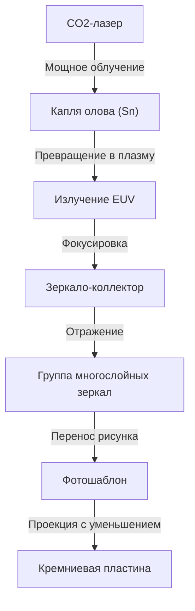

## Введение

Современное общество опирается на смартфоны, взрывное развитие генеративного ИИ, технологии автономного вождения и облачные вычисления. В центре всего этого находятся «полупроводники (микрочипы)». А для производства передовых чипов, определяющих производительность этих полупроводников, абсолютно необходимы «установки EUV-литографии». EUV — это аббревиатура от «экстремального ультрафиолета» (Extreme Ultraviolet), а технология использования этого особого света для прорисовки крошечных схем на кремниевых пластинах называется EUV-литографией.

В этой статье мы подробно расскажем об удивительном механизме оборудования EUV-литографии, которое удалось коммерциализировать только нидерландской компании ASML в мире и которое называют «самой сложной машиной в мире». Мы также рассмотрим историю развития полупроводниковых технологий, приведшую к ее созданию, и то, как были преодолены физические и технические барьеры.

## 1. История миниатюризации полупроводников и пределы «Закона Мура»

История полупроводников — это сама по себе история миниатюризации. Следуя «Закону Мура» (плотность интеграции полупроводников удваивается примерно каждые 18–24 месяца), предложенному соучредителем Intel Гордоном Муром, производители полупроводников вкладывали всю душу в то, чтобы делать транзисторы меньше и размещать их более плотно. Чем меньше транзистор, тем короче расстояние перемещения электронов, что повышает скорость вычислений и одновременно снижает энергопотребление.

Самым главным ключом к продвижению миниатюризации является процесс «экспонирования (литографии)». Это процесс переноса рисунка схемы на светочувствительный материал (фоторезист) на пластине с помощью света, подобно проявке фотографии. Для прорисовки более мелких схем нужен свет с более короткой длиной волны.

В 1980-х годах использовались ртутные лампы (g-линия: 436 нм, i-линия: 365 нм), но затем произошел переход к эксимерным лазерам (KrF: 248 нм, ArF: 193 нм). Кроме того, используя такие технологии, как «иммерсионная литография», когда пространство между линзой и пластиной заполняется водой для повышения показателя преломления, и «многократное экспонирование» (multi-patterning), когда экспонирование делится на несколько этапов, мы один за другим пробивали барьеры миниатюризации, которые считались пределами.

Однако, когда ширина линии схемы упала ниже 7 нанометров (нм), пределы ArF-иммерсионной литографии стали очевидны. Многократное экспонирование привело к взрывному росту количества процессов, резкому увеличению производственных затрат и ухудшению выхода годных изделий (yield). Поэтому потребовался источник света с совершенно другим измерением длины волны. Им стал EUV.

## 2. Удивительная технология EUV-литографии

Длина волны EUV составляет всего 13,5 нм. Она была резко укорочена — более чем в 10 раз по сравнению с предыдущим эксимерным лазером ArF (193 нм). Ожидалось, что это позволит прорисовывать очень мелкие схемы за одно экспонирование (single patterning), упростив производственный процесс и повысив выход годных изделий.

Однако свет с длиной волны 13,5 нм по своим свойствам в природе близок к рентгеновскому излучению. Фатальная проблема заключалась в том, что этот свет поглощается любыми веществами, включая воздух и стекло (линзы). Поэтому потребовалась принципиально иная конструкция, отличная от предыдущих литографических установок.

### Механизм генерации источника света с помощью плазмы

Механизм генерации EUV-света подобен созданию «искусственного солнца» внутри устройства.
1. В камеру, поддерживаемую в состоянии глубокого вакуума, с бешеной скоростью 50 000 раз в секунду падают капли (droplets) жидкого олова (Sn).
2. На эти капли олова дважды воздействуют сверхмощным углекислотным (CO2) лазером.
3. Первый лазерный импульс (пре-импульс) расплющивает каплю олова в блин, а второй лазерный импульс (основной импульс) превращает ее в плазму.
4. Из света, излучаемого этой чрезвычайно высокотемпературной плазмой, извлекается только EUV-свет с длиной волны 13,5 нм.

Непрерывно выполняя этот процесс 50 000 раз в секунду, впервые удается поддерживать мощность EUV-света, необходимую для экспонирования.

### Специальная система многослойных зеркал

Поскольку EUV-свет не может проходить через обычные стеклянные линзы, оптический путь необходимо контролировать, отражая его исключительно «зеркалами». Однако даже обычные зеркала поглощают EUV-свет.

Поэтому были разработаны специальные «многослойные зеркала», в которых молибден (Mo) и кремний (Si) чередуются десятками слоев толщиной на атомарном уровне. Используя эти чрезвычайно гладко отполированные зеркала, можно отражать только свет определенной длины волны. Тем не менее, около 30% света теряется при одном отражении, поэтому, когда свет многократно отражается более 10 раз от источника до пластины, его интенсивность падает до нескольких процентов от первоначальной. Именно поэтому на начальном этапе требуется невероятно высокая мощность.

## 3. Монополия ASML и гигантская технологическая экосистема

Нидерландская компания ASML — та, что коммерциализировала эту невероятно сложную технологию. В прошлом японские Nikon и Canon также были сильными конкурентами на рынке литографии, но из-за крайней сложности разработки EUV, огромных инвестиционных рисков и технологической неопределенности ASML в конечном итоге монополизировала рынок.

Однако ASML не завершила разработку EUV в одиночку. Создание оборудования EUV стало результатом концентрации глобальных знаний.
- **Технология источника света**: Приобретение американской компании Cymer для получения технологии плазменного источника света.
- **Оптическая система (зеркала)**: Создание тесной системы сотрудничества с немецким оптическим производителем с давней историей Carl Zeiss для производства зеркал с абсолютной гладкостью.
- **Система управления**: Поставки комплектующих от сети точных поставщиков, насчитывающей тысячи компаний, преимущественно в Европе.

ASML функционирует не просто как производственная компания, а как «системный интегратор, объединяющий лучшие мировые технологии». Установка EUV-литографии, которая, как говорят, стоит от 20 до 30 миллиардов иен за единицу, состоит из более чем 100 000 деталей, что эквивалентно нескольким реактивным лайнерам, и для ее транспортировки требуются десятки самолетов Boeing 747.

## 4. Геополитическое влияние и полупроводниковая безопасность

В настоящее время оборудование для EUV-литографии вышло за рамки обычного промышленного продукта и стало стратегическим материалом, влияющим на национальную безопасность. Это связано с тем, что EUV необходим для производства передовых чипов, определяющих превосходство в ИИ и военных технологиях.

На фоне американо-китайского противостояния США жестко ограничивают экспорт передовых полупроводниковых технологий в Китай. В результате, согласно воле правительств Нидерландов и США, ASML не может экспортировать оборудование EUV-литографии китайским компаниям. Это ставит автономное производство передовых полупроводников в Китае в крайне сложное положение. Таким образом, технологии одной компании стали определять ход международной политики.

## 5. Будущее полупроводниковой промышленности и EUV следующего поколения (High-NA EUV)

С внедрением EUV-литографии ведущие мировые литейные производства (компании по контрактному производству полупроводников), такие как TSMC, Samsung и Intel, продвигаются к массовому производству сверхмелких чипов поколений 5 нм, 3 нм и 2 нм. Это делает возможным появление графических процессоров NVIDIA, поддерживающих эволюцию ИИ, и высокопроизводительных процессоров, установленных в Apple iPhone.

И уже сейчас ASML начала поставки оборудования для EUV-литографии следующего поколения «High-NA EUV». Увеличив числовую апертуру (NA) с прежних 0,33 до 0,55, можно захватить больше света и прорисовать еще более мелкие схемы. Благодаря этому производство полупроводников в диапазоне менее 2 нм, то есть в области «ангстремов (одна десятая нанометра)», вот-вот станет реальностью.

## Заключение

Установка EUV-литографии — это одна из самых точных и сложных машин, когда-либо созданных человечеством. Эту технологию, которую можно назвать кристаллизацией квантовой механики, физики плазмы, материаловедения и сверхточной инженерии, удалось создать не только благодаря усилиям одной компании, но и благодаря накоплению знаний учеными и инженерами всего мира на протяжении десятилетий.

Мы не должны забывать, что за эволюцией технологий, благами которых мы наслаждаемся каждый день, стоит такой «экстремальный инжиниринг». Эволюция полупроводниковых технологий, которая продолжает бросать вызов физическим пределам, будет и впредь вести мир вперед и открывать неизведанное будущее.
