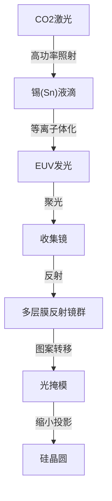

## 引言

支撑现代社会的智能手机、生成式AI的爆发性进化、自动驾驶技术以及云计算。所有这些的核心都存在着“半导体（微芯片）”。而为了制造决定该半导体性能的最尖端芯片，不可或缺的就是“EUV光刻机”。EUV是“极紫外线（Extreme Ultraviolet）”的简称，使用这种特殊的光在硅晶圆上描绘出极小电路的技术被称为EUV光刻。

本文将详细解说由荷兰ASML公司在世界上唯一成功实现实用化、被称为“世界上最复杂的机器”的EUV光刻机的惊人机制，以及发展至此的半导体技术历史，还有他们是如何克服物理与技术壁垒的。

## 1. 半导体微缩化的历史与“摩尔定律”的极限

半导体的历史就是微缩化的历史本身。遵循英特尔联合创始人戈登·摩尔提出的“摩尔定律（半导体的集成度大约每18到24个月翻一番）”，半导体制造商们倾注心血将晶体管制造得更小、排列得更密集。晶体管越小，电子的移动距离就越短，在提高计算速度的同时也能降低功耗。

推进微缩化最大的关键在于“光刻（Lithography）”工艺。这就像冲洗照片一样，是使用光将电路图案转移到晶圆上的感光材料（光刻胶）上的工艺。为了描绘更微小的电路，就需要波长更短的光。

在20世纪80年代，使用的是汞灯（g线: 436nm, i线: 365nm），之后进化为了准分子激光（KrF: 248nm, ArF: 193nm）。此外，还运用了在镜头和晶圆之间充满水以提高折射率的“浸没式光刻”，以及分多次进行曝光的“多重曝光”等技术，接连突破了被认为是极限的微缩化壁垒。

然而，当电路芯片线宽降至7纳米（nm）以下时，ArF浸没式光刻的极限已变得显而易见。多重曝光导致工艺步骤爆炸性增加，引发了制造成本的飙升和良率（合格率）的恶化。因此，需要拥有全新维度波长的光源。那就是EUV。

## 2. EUV光刻的惊人技术

EUV的波长仅为13.5nm。与之前的ArF准分子激光（193nm）相比，波长一口气缩短到了十分之一以下。由此，使得通过一次曝光（单次图形化）就能描绘出极其微小的电路成为可能，有望简化制造工艺并提高良率。

但是，13.5nm波长的光在自然界中具有接近X射线的性质。这种光有一个致命的问题，那就是会被包括空气和玻璃（镜头）在内的所有物质吸收。因此，需要采用与以往的光刻机根本不同的设计。

### 通过等离子体生成光源的机制

产生EUV光的机制，简直就像是在设备内部制造一个“人造太阳”。
1. 在保持高度真空状态的腔室内，以每秒5万次的猛烈速度让液态锡（Sn）的液滴落下。
2. 对该锡液滴进行2次超高功率的二氧化碳（CO2）激光照射。
3. 第一次激光（预脉冲）将锡液滴铺展成扁平的薄饼状，第二次激光（主脉冲）使其等离子体化。
4. 从这种极高温等离子体发出的光中，仅提取出13.5nm的EUV光。

通过以每秒5万次连续进行这个过程，才能够维持曝光所需输出功率的EUV光。

### 特殊的多层膜反射镜系统

由于EUV光无法穿过传统的玻璃镜头，因此必须全部用“镜子（反射镜）”反射来控制光路。然而，即便是普通的镜子也会吸收EUV光。

因此，开发出了将钼（Mo）和硅（Si）以原子级别的厚度交替叠加几十层的特殊“多层膜反射镜”。通过使用被研磨得极其光滑的这种反射镜，可以只反射特定波长的光。即便如此，一次反射也会损失约30%的光，因此从光源到达晶圆之前经过10次以上的反复反射后，光的强度会衰减到原来的百分之几。这就是在初期阶段需要极其庞大输出功率的原因。

## 3. ASML的垄断与巨大的技术生态系统

将这种难度极高的技术实现实用化的，是荷兰的ASML公司。曾经，日本的尼康和佳能也是光刻机市场上的强力竞争对手，但由于EUV开发的难度过高、庞大的投资风险以及技术上的不确定性，最终仅ASML垄断了该市场。

然而，ASML并非单凭一己之力完成了EUV。EUV设备的开发是全球智慧的结晶。
- **光源技术**: 收购了美国的Cymer公司，获得了等离子体光源技术。
- **光学系统（反射镜）**: 与德国老牌光学制造商卡尔·蔡司（Carl Zeiss）公司建立了紧密的合作体制，制造出具有极致平滑度的反射镜。
- **控制系统**: 依靠以欧洲为中心的数千家精密供应商网络提供零部件。

ASML并不单纯是一家制造企业，而是作为“整合世界顶尖技术的系统集成商”在发挥作用。据说单台售价达200亿至300亿日元的EUV光刻机，由相当于数架大型喷气式客机所需的10万多个零部件构成，其运输需要几十架波音747型飞机。

## 4. 地缘政治影响与半导体安全保障

如今，EUV光刻机已经超越了单纯的工业产品的范畴，成为了左右国家安全保障的战略物资。因为要制造决定AI和军事技术优势的最尖端芯片，EUV是不可或缺的。

以中美对立为背景，美国正严格限制向中国出口最尖端半导体技术。其结果是，ASML遵从荷兰政府和美国政府的意向，无法向中国企业出口EUV光刻机。这导致中国在自主制造最尖端半导体方面处于极其困难的境地。像这样，一家企业的技术左右国际政治走向的事态正在发生。

## 5. 半导体产业的未来与下一代EUV（High-NA EUV）

随着EUV光刻技术的引入，台积电（TSMC）、三星、英特尔等全球顶级代工厂（半导体委托制造企业）正朝着5nm、3nm以及2nm世代的超微小芯片量产高歌猛进。借此，支撑AI进化的NVIDIA GPU，以及搭载在苹果iPhone上的高性能处理器得以实现。

而现在，ASML已经开始出货下一代EUV光刻机“High-NA EUV”。通过将NA（数值孔径）从传统的0.33提高到0.55，能够捕捉更多的光，从而描绘出更加微小的电路。由此，在2nm以下，即“埃（1nm的十分之一）”领域的半导体制造即将成为现实。

## 结语

EUV光刻机是人类迄今为止制造出的最精密、最复杂的机器之一。这项堪称量子力学、等离子体物理学、材料科学以及超精密工程学结晶的技术，并非仅仅是一家企业努力的结果，而是由几十年来全世界科学家和工程师的智慧积累孕育而生的。

我们不应忘记，在我们每天享受技术进化恩惠的背后，存在着这样的“极限工程学”。持续挑战物理极限的半导体技术的进化，今后也将引领世界，开拓未知的未来。
