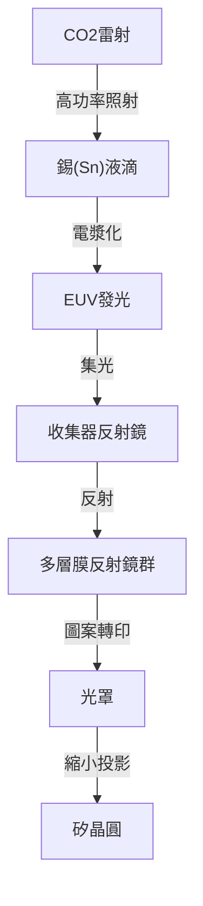

## 前言

支撐現代社會的智慧型手機、生成式AI的爆發性演進、自動駕駛技術以及雲端運算。所有這些的核心都存在著「半導體（微晶片）」。而要製造決定半導體效能的最先進晶片，不可或缺的就是「EUV極紫外光微影設備」。EUV是「極紫外光（Extreme Ultraviolet）」的縮寫，這種使用特殊光線在矽晶圓上描繪極小電路的技術被稱為EUV微影。

本文將詳細解說由荷蘭ASML公司在全球唯一成功商業化、被譽為「世界上最複雜的機器」的EUV極紫外光微影設備的驚人機制，以及直至其開發為止的半導體技術歷史，還有他們是如何克服物理與技術上的障礙。

## 1. 半導體微縮化歷史與「摩爾定律」的極限

半導體的歷史就是一部微縮化的歷史。遵循英特爾共同創辦人高登·摩爾（Gordon Moore）提出的「摩爾定律（半導體的積體度大約每18到24個月會增加一倍）」，半導體製造商傾盡全力將電晶體做得更小、排列得更密集。電晶體越小，電子的移動距離就越短，運算速度提升的同時也能降低功耗。

推進微縮化的最大關鍵在於「曝光（微影）」製程。這就像沖洗照片一樣，是使用光線將電路圖案轉印到晶圓上的感光材料（光阻劑）的過程。為了描繪出更微細的電路，需要波長更短的光。

1980年代使用的是水銀燈（g線: 436nm, i線: 365nm），之後演進為準分子雷射（KrF: 248nm, ArF: 193nm）。此外，還驅使了在鏡頭與晶圓之間注滿水以提高折射率的「浸潤式微影（Immersion Lithography）」，以及分多次進行曝光的「多重圖案化（Multi-patterning）」等技術，接連突破了被視為極限的微縮化障礙。

然而，當電路線寬降至7奈米（nm）以下時，ArF浸潤式微影的極限便顯而易見。多重圖案化導致製程步驟爆炸性增加，引發製造成本飆升與良率惡化。因此，業界需要一種擁有全新次元波長的光源。那就是EUV。

## 2. EUV微影的驚人技術

EUV的波長僅有13.5nm。相較於過去的ArF準分子雷射（193nm），波長一口氣縮短至十分之一以下。這使得透過一次曝光（單一圖案化）就能描繪出非常微細的電路成為可能，並被寄予簡化製造流程與提升良率的厚望。

不過，13.5nm波長的光在自然界中擁有接近X射線的特性。這種光有一個致命的問題，就是會被包含空氣與玻璃（鏡頭）在內的任何物質吸收。因此，需要與以往的曝光設備截然不同的根本性設計。

### 透過電漿產生光源的機制

產生EUV光的方法，簡直就像是在設備內製造出一顆「人造太陽」。
1. 在保持高度真空狀態的腔室內，以每秒5萬次的猛烈速度滴下液態錫（Sn）的液滴（Droplet）。
2. 對這錫液滴照射兩次超高功率的二氧化碳（CO2）雷射。
3. 第一次雷射（預脈衝）將錫液滴打平成鬆餅狀，第二次雷射（主脈衝）使其電漿化。
4. 從這極高溫電漿發出的光當中，只萃取出13.5nm的EUV光。

每秒連續進行5萬次這個過程，才能維持曝光所需的EUV光輸出功率。

### 特殊的多層膜反射鏡系統

由於EUV光無法穿透傳統的玻璃鏡頭，因此必須全部使用「鏡子（反射鏡）」來反射並控制光路。然而，即便是普通的鏡子也會吸收EUV光。

於是，開發出了將鉬（Mo）與矽（Si）以原子等級的厚度交替堆疊數十層的特殊「多層膜反射鏡」。使用這種經過極度平滑拋光的反射鏡，才能只反射特定波長的光。即便如此，每次反射仍會損失約30%的光，因此從光源到抵達晶圓為止，經過10次以上的反覆反射後，光的強度會衰減到只剩原本的百分之幾。這就是為何在初期階段會要求極度高功率輸出的原因。

## 3. ASML的壟斷與龐大的技術生態系統

將這項艱鉅無比的技術實用化的，就是荷蘭的ASML公司。過去日本的尼康（Nikon）與佳能（Canon）也曾是微影市場上的強大競爭對手，但由於EUV開發的難度實在太高，伴隨龐大的投資風險與技術上的不確定性，最終由ASML獨佔了整個市場。

然而，EUV並非ASML單憑一己之力完成的。EUV設備的開發，是全球智慧的結晶。
- **光源技術**：收購美國Cymer公司，獲得電漿光源技術。
- **光學系統（反射鏡）**：與德國老牌光學製造商卡爾蔡司（Carl Zeiss）建立緊密的合作體制，製造出擁有極致平滑度的反射鏡。
- **控制系統**：由以歐洲為中心的數千家精密供應商網路提供零件。

ASML與其說是一間單純的製造業，不如說發揮了作為「整合世界最頂尖技術的系統整合商」的功能。據稱一台要價200億到300億日圓的EUV極紫外光微影設備，由相當於好幾架巨無霸客機的十幾萬個零件組成，其運輸需要動用數十架波音747客機。

## 4. 地緣政治的影響與半導體安全保障

如今，EUV極紫外光微影設備已超越單純工業產品的範疇，成為左右國家安全保障的戰略物資。因為要製造決定AI與軍事技術優勢的最先進晶片，EUV是不可或缺的。

在美中對立的背景下，美國嚴格限制將最先進半導體技術出口至中國。結果，在荷蘭政府與美國政府的意向之下，ASML無法向中國企業出口EUV極紫外光微影設備。這使得中國要自主製造最先進半導體處於極度困難的境地。像這樣，一家企業的技術左右了國際政治走向的事態正在發生。

## 5. 半導體產業的未來與次世代EUV（High-NA EUV）

隨著EUV微影技術的導入，台積電（TSMC）、三星、英特爾等全球頂尖的晶圓代工廠（半導體委託製造企業），正朝著5奈米、3奈米，甚至2奈米世代的超微細晶片量產邁進。這促成了支撐AI演進的NVIDIA GPU，以及搭載於Apple iPhone的高效能處理器的實現。

而現在，ASML已經開始出貨次世代的EUV極紫外光微影設備「High-NA EUV」。透過將數值孔徑（NA）從傳統的0.33提升至0.55，能夠捕捉更多光線，從而描繪出更微細的電路。這使得2奈米以下，也就是「埃（Angstrom，1奈米的十分之一）」領域的半導體製造即將成為現實。

## 結語

EUV極紫外光微影設備是人類迄今為止所製造過最精密、最複雜的機器之一。這項堪稱量子力學、電漿物理學、材料科學與超精密工程學結晶的技術，並非僅靠一家企業的努力，而是由全世界科學家與工程師數十年的智慧積累所創造出來的。

我們必須銘記，在我們日常受惠的科技演進背後，存在著這般「極致的工程學」。持續挑戰物理極限的半導體技術演進，未來也將繼續引領世界，開拓未知的未來。
