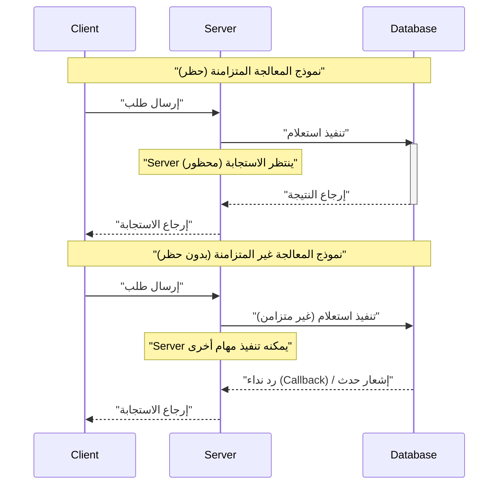
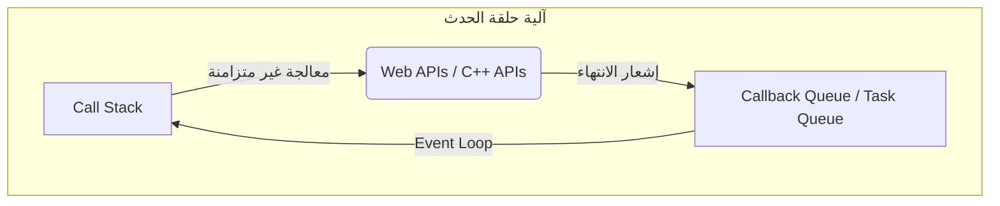
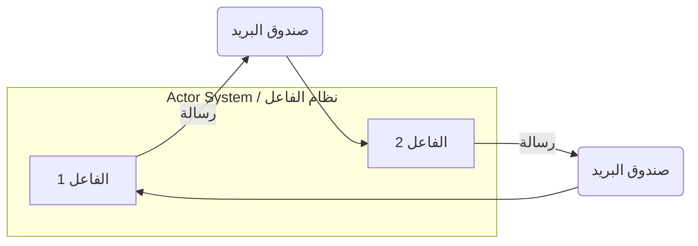
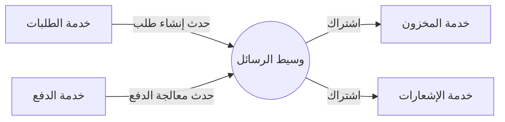
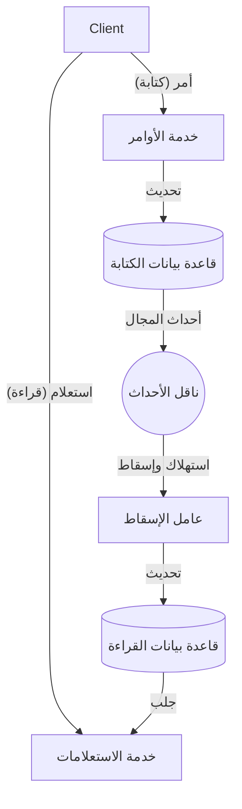

في تطوير البرمجيات الحديثة، لزيادة قابلية التوسع وتوافر النظام، من الضروري فهم **المعالجة غير المتزامنة** و **البنية الموجهة بالأحداث** (EDA: [Event-Driven](https://kenji.blog/ar/p/event-driven-architecture-message-queue-kafka-rabbitmq/) Architecture). في هذا المقال، سنتعمق في المفاهيم الأساسية التي تدعم هذه التقنيات: حلقة الحدث (Event Loop)، ونموذج الفاعل (Actor Model)، و CQRS (Command Query Responsibility Segregation)، من النظرية إلى التنفيذ وحتى تصميم مستوى البنية.

## 1. أساسيات وتحديات المعالجة غير المتزامنة

في نموذج المعالجة المتزامنة التقليدي، يتم حظر المهمة التالية حتى تكتمل المهمة الحالية. هذا بسيط كنموذج برمجة، لكن له عيب إهدار موارد وحدة المعالجة المركزية (CPU) أثناء انتظار الإدخال/الإخراج (مثل الوصول إلى قاعدة البيانات أو طلبات الشبكة).

المعالجة غير المتزامنة هي تقنية لتجنب هذا الحظر وتحسين **الإنتاجية (Throughput)** للنظام بشكل كبير. ومع ذلك، من خلال إدخال المعالجة غير المتزامنة، تبرز تحديات جديدة مثل إدارة الحالة، ومعالجة الأخطاء، وحالات السباق (Race Condition) بين سلاسل العمليات.

### 1.1 مقارنة بين النموذج المتزامن وغير المتزامن



في النموذج غير المتزامن، نظرًا لأنه يمكن الاستفادة من وقت الانتظار بشكل فعال، يمكن معالجة المزيد من الطلبات في وقت واحد. كنهج لتحقيق هذا التزامن، فإن أبرزها هي **حلقة الحدث** و **نموذج الفاعل**.

---

## 2. المعالجة غير المتزامنة باستخدام حلقة الحدث (Node.js / JavaScript)

حلقة الحدث (Event Loop) هي آلية لتحقيق تزامن عالٍ على الرغم من كونها تعتمد على سلسلة عمليات واحدة (Single Thread). وهي معتمدة على نطاق واسع في Node.js وبيئات المتصفح (JavaScript).

### 2.1 بنية حلقة الحدث

تعمل حلقة الحدث كحلقة لا نهائية على سلسلة العمليات الرئيسية وتنفذ وظائف رد النداء (Callbacks) المتراكمة في قائمة انتظار المهام بالتسلسل. يتم تفويض عمليات الإدخال/الإخراج التي تستغرق وقتًا إلى واجهات برمجة التطبيقات غير المتزامنة لنظام التشغيل أو سلاسل العمليات العاملة (Thread Pool)، ويتم إضافة رد النداء إلى قائمة الانتظار عند الانتهاء.



### 2.2 مثال التنفيذ في JavaScript

يوضح الكود التالي مثالًا نموذجيًا للمعالجة غير المتزامنة (Promise و async/await) في JavaScript.

```javascript
// وظيفة وهمية لجلب بيانات المستخدم بشكل غير متزامن
const fetchUserData = async (userId) => {
  return new Promise((resolve, reject) => {
    setTimeout(() => {
      if (userId > 0) {
        resolve({ id: userId, name: "Alice", role: "Admin" });
      } else {
        reject(new Error("معرف مستخدم غير صالح"));
      }
    }, 1000); // محاكاة انتظار إدخال/إخراج لمدة ثانية واحدة
  });
};

// المعالجة الرئيسية
const main = async () => {
  console.log("بدء المعالجة...");
  
  try {
    // انتظار اكتمال المعالجة غير المتزامنة (لا يتم الحظر بواسطة حلقة الحدث)
    const user = await fetchUserData(1);
    console.log("اكتمل الجلب:", user);
  } catch (error) {
    console.error("حدث خطأ:", error.message);
  }
  
  console.log("نهاية المعالجة");
};

main();
```

ميزة حلقة الحدث هي أن إدارة القفل ([Lock](https://kenji.blog/ar/p/rdbms-transaction-acid-isolation-level-lock/)) للحالة المشتركة غير مطلوبة. ومع ذلك، إذا تم تنفيذ معالجة ثقيلة مرتبطة بوحدة المعالجة المركزية (CPU-bound) في Call [Stack](https://kenji.blog/ar/p/c-language-pointers-memory-management-stack-heap/)، فسيتم حظر حلقة الحدث بالكامل، وهناك خطر توقف النظام (حظر حلقة الحدث). يجب قصرها على العمليات الخفيفة بتعقيد زمني من $ O(1) $ إلى $ O(N) $.

---

## 3. نموذج الفاعل وتمرير الرسائل ([Rust](https://kenji.blog/ar/p/webassembly-wasm-current-future/) / Erlang / Akka)

إذا كانت حلقة الحدث نهجًا يتحدى حدود سلسلة العمليات الواحدة، فإن **نموذج الفاعل** هو نموذج لجعل المعالجة المتزامنة في البيئات متعددة سلاسل العمليات والموزعة آمنة وقابلة للتطوير.

### 3.1 المفاهيم الأساسية لنموذج الفاعل

في نموذج الفاعل، تسمى وحدة المعالجة الأساسية "الفاعل" (Actor). كل فاعل لديه حالة ([State](https://kenji.blog/ar/p/iac-infrastructure-as-code-terraform/)) وسلوك (Behavior) مستقلين، ولا يشارك الحالة مباشرة مع الفاعلين الآخرين. يتم الاتصال بين الفاعلين بالكامل من خلال **تمرير رسائل غير متزامنة**.

- **تغليف الحالة (Encapsulation)**: لا يمكن الوصول إلى الحالة الداخلية للفاعل مباشرة من الخارج.
- **قائمة انتظار الرسائل (Mailbox)**: يتم وضع الرسائل المستلمة في صندوق البريد وتتم معالجتها بالتسلسل.
- **بدون أقفال ([Lock](https://kenji.blog/ar/p/rdbms-transaction-acid-isolation-level-lock/)-free)**: نظرًا لعدم مشاركة الحالة، لا توجد حاجة لآليات القفل مثل كائنات الاستبعاد المتبادل (Mutex).



### 3.2 مثال لتنفيذ الفاعل باستخدام [Rust](https://kenji.blog/ar/p/webassembly-wasm-current-future/)

في [Rust](https://kenji.blog/ar/p/programming-languages-history-paradigm-evolution/)، وهي لغة برمجة أنظمة، يمكن بناء نموذج الفاعل باستخدام حزم (Crates) قوية للمعالجة غير المتزامنة مثل `tokio` و `actix`. نعرض هنا تطبيقًا لنمط فاعل بسيط باستخدام قناة `mpsc` (منتجين متعددين، مستهلك واحد).

```rust
use std::sync::Arc;
use tokio::sync::{mpsc, oneshot};

// تعريف الرسائل المرسلة إلى الفاعل
enum ActorMessage {
    Increment {
        respond_to: oneshot::Sender<i32>,
    },
    GetCount {
        respond_to: oneshot::Sender<i32>,
    },
}

// هيكل الفاعل
struct CounterActor {
    receiver: mpsc::Receiver<ActorMessage>,
    count: i32,
}

impl CounterActor {
    fn new(receiver: mpsc::Receiver<ActorMessage>) -> Self {
        CounterActor { receiver, count: 0 }
    }

    // الحلقة الرئيسية للفاعل
    async fn run(&mut self) {
        // استقبال الرسائل بالتسلسل من صندوق البريد
        while let Some(msg) = self.receiver.recv().await {
            match msg {
                ActorMessage::Increment { respond_to } => {
                    self.count += 1;
                    let _ = respond_to.send(self.count);
                }
                ActorMessage::GetCount { respond_to } => {
                    let _ = respond_to.send(self.count);
                }
            }
        }
    }
}

#[tokio::main]
async fn main() {
    // إنشاء القناة (السعة 100)
    let (tx, rx) = mpsc::channel(100);

    // تشغيل الفاعل
    let mut actor = CounterActor::new(rx);
    tokio::spawn(async move {
        actor.run().await;
    });

    // إرسال رسالة واستلام النتيجة
    let (resp_tx1, resp_rx1) = oneshot::channel();
    tx.send(ActorMessage::Increment { respond_to: resp_tx1 }).await.unwrap();
    println!("العدد بعد الزيادة: {}", resp_rx1.await.unwrap());

    let (resp_tx2, resp_rx2) = oneshot::channel();
    tx.send(ActorMessage::GetCount { respond_to: resp_tx2 }).await.unwrap();
    println!("العدد الحالي: {}", resp_rx2.await.unwrap());
}
```

يضمن نظام الملكية (Ownership) ونظام الأنواع في [Rust](https://kenji.blog/ar/p/webassembly-wasm-current-future/) سلامة تمرير الرسائل بين الفاعلين في وقت التجميع. بالتعبير عن إنتاجية النظام $ S $ رياضيًا، بالنسبة لعدد الفاعلين $ N $ ومعدل معالجة الرسائل $ R $، بشكل مثالي $ S = N \times R $، مما يُظهر قابلية توسع عالية.

---

## 4. إلى عالم البنية الموجهة بالأحداث (EDA)

المعالجة غير المتزامنة ونموذج الفاعل هي تقنيات لتحسين المعالجة المتزامنة داخل تطبيق واحد. إن توسيع هذا إلى النظام بأكمله (بين الخدمات المصغرة، وما إلى ذلك) هو مفهوم **البنية الموجهة بالأحداث (EDA)**.

في EDA، يتم التعبير عن تغييرات الحالة داخل النظام كـ "أحداث"، ويتم توزيعها بشكل غير متزامن من خلال نواقل الأحداث (Event Bus) أو وسطاء الرسائل (Message Brokers) (مثل Apache [Kafka](https://kenji.blog/ar/p/event-driven-architecture-message-queue-kafka-rabbitmq/)، [RabbitMQ](https://kenji.blog/ar/p/event-driven-architecture-message-queue-kafka-rabbitmq/)، AWS EventBridge).

### 4.1 المكونات الرئيسية لـ EDA

1. **منتج الحدث (Event Producer)**: مكون يقوم بإنشاء الأحداث وإرسالها إلى الوسيط.
2. **وسيط الرسائل (Message Broker)**: بنية تحتية لتوجيه الأحداث وتخزينها وتوزيعها.
3. **مستهلك الحدث (Event Consumer)**: مكون يستقبل الأحداث وينفذ المعالجة بشكل غير متزامن.



الميزة الكبرى لهذه البنية هي **الاقتران غير المحكم (Loose Coupling)**. لا يحتاج المنتج إلى أن يكون على دراية بوجود المستهلك، وحتى إذا تعطل جزء من النظام، فإن الوسيط يحتفظ بالحدث، مما يحسن من المرونة (Resilience).

---

## 5. CQRS ومصادر الأحداث (Event Sourcing)

عند الغوص أعمق في البنية الموجهة بالأحداث، ندرك أن المتطلبات المطلوبة لكتابة البيانات (Command) وقراءة البيانات (Query) مختلفة تمامًا. النمط الذي يحل هذه المشكلة هو **CQRS (فصل مسؤولية الاستعلام والأمر)**.

### 5.1 بنية CQRS

في CQRS، يتم فصل النظام فعليًا ومنطقيًا إلى "نموذج الأوامر (Command Model)" الذي يغير الحالة، و "نموذج الاستعلام (Query Model)" الذي يجلب البيانات.

- **نموذج الأمر (Command Model)**: يتولى منطق العمل المعقد وعمليات التحقق (Validation)، ويضمن اتساق البيانات.
- **نموذج الاستعلام (Query Model)**: يوفر بيانات غير مطبعة (Read Model) محسنة للقراءة، ويحقق استجابات استعلام سريعة.



### 5.2 الدمج مع مصادر الأحداث (Event Sourcing)

يُظهر CQRS قيمته الحقيقية عند دمجه مع **مصادر الأحداث**.
في تصميم قواعد البيانات التقليدية، يتم حفظ "الحالة الحالية" للكيان فقط. لكن في مصادر الأحداث، يتم حفظ كل "سجل الأحداث التي غيّرت الحالة" (كتابة فقط Append-only)، ومن خلال إعادة تشغيلها بالتسلسل، يتم استعادة الحالة الحالية.

على سبيل المثال، يمكن التعبير عن رصيد الحساب المصرفي (الحالة الحالية) كتراكم للأحداث التالية:

$ Balance = \sum_{i=1}^{n} (Deposit_i) - \sum_{j=1}^{m} (Withdrawal_j) $

مزايا مصادر الأحداث هي كما يلي:
- **سجل تدقيق كامل**: يمكن استعادة الحالة والتحقق منها في أي وقت في الماضي.
- **السفر عبر الزمن (Time Travel)**: يمكن بناء نموذج استعلام (Read DB) جديد من الصفر بناءً على أحداث سابقة.
- **تحسين أداء الكتابة**: تكون سريعة لأنها تقتصر فقط على إلحاق الأحداث (Append) بدلًا من تحديث قاعدة البيانات (Update).

---

## 6. حالات الاستخدام واختيار البنية

تتمتع مجموعات التقنيات التي رأيناها حتى الآن بحالات الاستخدام المناسبة لها.

1. **حلقة الحدث (Node.js)**:
   - بوابات واجهة برمجة التطبيقات ([API Gateway](https://kenji.blog/ar/p/microservices-architecture-bff-api-gateway/)s) وأنظمة الدردشة في الوقت الفعلي التي تحتوي على العديد من العمليات المقيدة بالإدخال/الإخراج.
   - خوادم WebSocket التي تتعامل مع أعداد كبيرة من الاتصالات المتزامنة.
2. **نموذج الفاعل ([Rust](https://kenji.blog/ar/p/webassembly-wasm-current-future/) / Akka)**:
   - المعالجة المتزامنة ذات الحالات المعقدة (خوادم الألعاب، التتبع في الوقت الفعلي).
   - الأنظمة عالية التوافر التي تتطلب قدرات الإصلاح الذاتي من الأخطاء (شجرة المشرف).
3. **CQRS / Event Sourcing**:
   - المجالات التي تتطلب سجلات تدقيق وقابلية توسع عالية، مثل الأنظمة المالية وإدارة الطلبات في التجارة الإلكترونية.
   - الأنظمة التي تكون فيها أحمال القراءة والكتابة غير متماثلة.

### 6.1 التحديات وأفضل الممارسات

في حين أن البنى الموجهة بالأحداث وغير المتزامنة قوية، إلا أنه من الضروري قبول **الاتساق النهائي (Eventual [Consistency](https://kenji.blog/ar/p/cap-theorem-distributed-systems-tradeoff/))**. نظرًا لأن البيانات لا تنعكس فورًا في جميع الأنظمة (اتساق قوي)، فإن ذلك يتطلب إبداعًا على مستوى واجهة المستخدم/تجربة المستخدم (UI/UX) (مثل التحديث المتفائل لواجهة المستخدم).

أيضًا، من المهم ضمان **القدرة على التكرار (Idempotency)** في الأنظمة الموزعة. يجب تصميم النظام بحيث لا تتغير النتيجة حتى لو تمت معالجة الحدث نفسه عدة مرات بسبب إعادة الإرسال عبر الشبكة.

---

## 7. الخلاصة

في هذا المقال، قمنا بشرح أعماق البنية الموجهة بالأحداث والمعالجة غير المتزامنة من وجهات النظر التالية:

- آلية الإدخال/الإخراج غير المحظورة بسلسلة عمليات واحدة باستخدام **حلقة الحدث**.
- تمرير الرسائل الآمن والقابل للتطوير باستخدام **نموذج الفاعل**.
- فصل الأنظمة وقابلية التوسع من خلال **EDA**.
- نمذجة المجالات المعقدة وتحسين القراءة والكتابة باستخدام **CQRS ومصادر الأحداث**.

تعد هذه التقنيات أسلحة قوية لبناء الأنظمة الموزعة السحابية الأصلية الحديثة. إن اختيار ودمج النماذج المناسبة لتناسب خصائص النظام ومتطلبات العمل هو الخطوة الأولى نحو تصميم بنية معمارية ممتازة.
