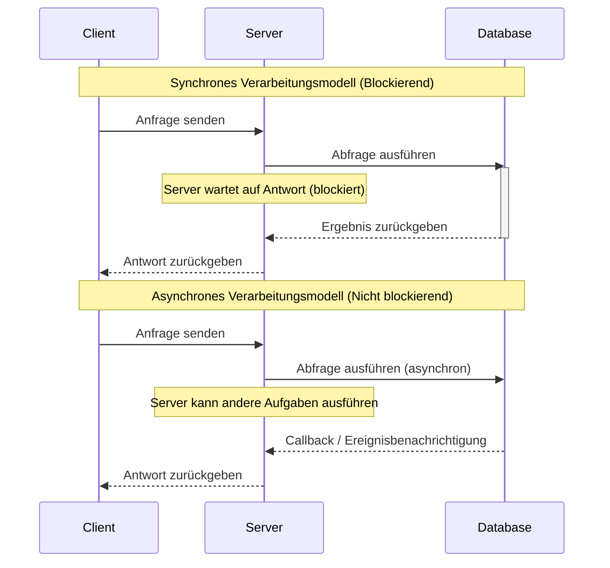
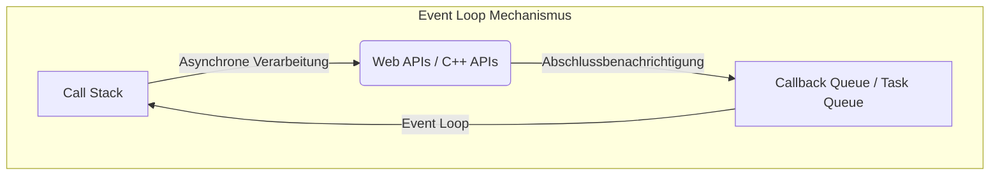
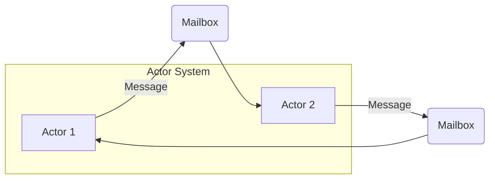
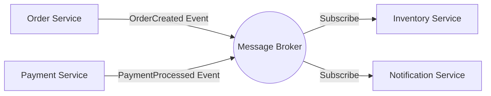
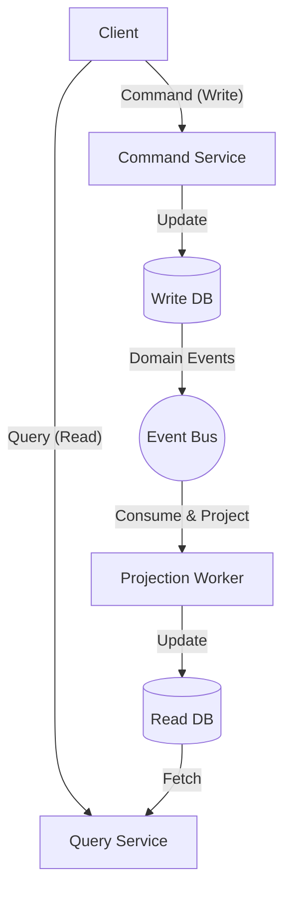

In der modernen Softwareentwicklung ist das Verständnis von **asynchroner Verarbeitung** und **[Event-Driven](https://kenji.blog/de/p/event-driven-architecture-message-queue-kafka-rabbitmq/) Architecture** (EDA) unerlässlich, um die Skalierbarkeit und Verfügbarkeit von Systemen zu verbessern. In diesem Artikel werden wir tief in die Kernkonzepte eintauchen, die diese unterstützen: Event Loop, das Actor-Modell und CQRS (Command Query Responsibility Segregation) – von der Theorie über die Implementierung bis hin zum Design auf Architekturebene.

## 1. Grundlagen und Herausforderungen der asynchronen Verarbeitung

Im herkömmlichen synchronen Verarbeitungsmodell wird die nächste Aufgabe blockiert, bis eine Aufgabe abgeschlossen ist. Dies ist als Programmiermodell einfach, hat jedoch den Nachteil, dass CPU-Ressourcen während des Wartens auf I/O (wie Datenbankzugriffe oder Netzwerkanfragen) verschwendet werden.

Asynchrone Verarbeitung ist eine Methode, um diese Blockierung zu vermeiden und den **Durchsatz** des Systems drastisch zu verbessern. Die Einführung der asynchronen Verarbeitung bringt jedoch neue Herausforderungen mit sich, wie das Statusmanagement, die Fehlerbehandlung und Race Conditions zwischen Threads.

### 1.1 Vergleich zwischen synchronen und asynchronen Modellen



Im asynchronen Modell kann die Wartezeit effektiv genutzt werden, wodurch mehr Anfragen gleichzeitig verarbeitet werden können. Zu den typischen Ansätzen zur Realisierung dieser Nebenläufigkeit gehören die **Event Loop** und das **Actor-Modell**.

---

## 2. Asynchrone Verarbeitung mit Event Loop (Node.js / JavaScript)

Die Event Loop ist ein Mechanismus, der trotz Single-Threading eine hohe Nebenläufigkeit erreicht. Sie wird in Umgebungen wie Node.js und Browsern (JavaScript) häufig eingesetzt.

### 2.1 Architektur der Event Loop

Die Event Loop läuft als Endlosschleife auf dem Haupt-Thread und führt Callback-Funktionen, die sich in der Task-Warteschlange befinden, sequenziell aus. Zeitaufwendige I/O-Operationen werden an die asynchrone API des Betriebssystems oder an Worker-Threads (Thread-Pool) delegiert, und Callbacks werden bei Abschluss zur Warteschlange hinzugefügt.



### 2.2 Implementierungsbeispiel in JavaScript

Der folgende Code ist ein typisches Beispiel für die asynchrone Verarbeitung (Promise und async/await) in JavaScript.

```javascript
// Mock-Funktion zum asynchronen Abrufen von Benutzerdaten
const fetchUserData = async (userId) => {
  return new Promise((resolve, reject) => {
    setTimeout(() => {
      if (userId > 0) {
        resolve({ id: userId, name: "Alice", role: "Admin" });
      } else {
        reject(new Error("Invalid User ID"));
      }
    }, 1000); // Simuliert eine 1-sekündige I/O-Wartezeit
  });
};

// Hauptprozess
const main = async () => {
  console.log("Verarbeitung starten...");
  
  try {
    // Auf den Abschluss der asynchronen Verarbeitung warten (wird durch Event Loop nicht blockiert)
    const user = await fetchUserData(1);
    console.log("Abruf abgeschlossen:", user);
  } catch (error) {
    console.error("Fehler aufgetreten:", error.message);
  }
  
  console.log("Verarbeitung beendet");
};

main();
```

Der Vorteil der Event Loop besteht darin, dass keine Sperrverwaltung für den gemeinsamen [Zustand](https://kenji.blog/de/p/state-management-history-redux-context-recoil-zustand/) erforderlich ist. Wenn jedoch CPU-intensive, schwere Aufgaben auf dem Call [Stack](https://kenji.blog/de/p/c-language-pointers-memory-management-stack-heap/) ausgeführt werden, wird die gesamte Event Loop blockiert, und das System läuft Gefahr, in einen Stillstand zu geraten (Blockierung der Event Loop). Die Komplexität der Aufgaben sollte auf leichte Aufgaben von $ O(1) $ bis $ O(N) $ beschränkt bleiben.

---

## 3. Actor-Modell und Message Passing ([Rust](https://kenji.blog/de/p/webassembly-wasm-current-future/) / Erlang / Akka)

Wenn die Event Loop ein Ansatz ist, der die Grenzen von Single-Threading herausfordert, dann ist das **Actor-Modell** ein Paradigma, um die parallele Verarbeitung in Multi-Thread- und verteilten Umgebungen sicher und skalierbar zu machen.

### 3.1 Grundkonzepte des Actor-Modells

Im Actor-Modell wird die grundlegende Verarbeitungseinheit als "Actor" bezeichnet. Jeder Actor hat seinen eigenen unabhängigen [Zustand](https://kenji.blog/de/p/state-management-history-redux-context-recoil-zustand/) (State) und sein eigenes Verhalten (Behavior) und teilt seinen [Zustand](https://kenji.blog/de/p/state-management-history-redux-context-recoil-zustand/) nicht direkt mit anderen Actors. Die Kommunikation zwischen Actors erfolgt vollständig durch **asynchrones Message Passing**.

- **Kapselung des Zustands**: Auf den internen Zustand eines Actors kann von außen nicht direkt zugegriffen werden.
- **Nachrichtenwarteschlange (Mailbox)**: Eingehende Nachrichten werden in einer Mailbox in die Warteschlange gestellt und sequenziell verarbeitet.
- **[Lock](https://kenji.blog/de/p/rdbms-transaction-acid-isolation-level-lock/)-frei**: Da der Zustand nicht geteilt wird, sind Locking-Mechanismen wie Mutexe nicht erforderlich.



### 3.2 Implementierungsbeispiel eines Actors mit [Rust](https://kenji.blog/de/p/webassembly-wasm-current-future/)

In der Systemprogrammiersprache [Rust](https://kenji.blog/de/p/programming-languages-history-paradigm-evolution/) können Sie leistungsstarke asynchrone Crates wie `tokio` und `actix` verwenden, um das Actor-Modell zu erstellen. Hier zeigen wir ein einfaches Actor-Pattern-Implementierungsbeispiel unter Verwendung eines `mpsc`-Kanals (Multi-Producer, Single-Consumer).

```rust
use std::sync::Arc;
use tokio::sync::{mpsc, oneshot};

// Definition der an den Actor gesendeten Nachricht
enum ActorMessage {
    Increment {
        respond_to: oneshot::Sender<i32>,
    },
    GetCount {
        respond_to: oneshot::Sender<i32>,
    },
}

// Struktur des Actors
struct CounterActor {
    receiver: mpsc::Receiver<ActorMessage>,
    count: i32,
}

impl CounterActor {
    fn new(receiver: mpsc::Receiver<ActorMessage>) -> Self {
        CounterActor { receiver, count: 0 }
    }

    // Hauptschleife des Actors
    async fn run(&mut self) {
        // Nachrichten aus der Mailbox sequenziell empfangen
        while let Some(msg) = self.receiver.recv().await {
            match msg {
                ActorMessage::Increment { respond_to } => {
                    self.count += 1;
                    let _ = respond_to.send(self.count);
                }
                ActorMessage::GetCount { respond_to } => {
                    let _ = respond_to.send(self.count);
                }
            }
        }
    }
}

#[tokio::main]
async fn main() {
    // Kanalerstellung (Kapazität 100)
    let (tx, rx) = mpsc::channel(100);

    // Actor starten
    let mut actor = CounterActor::new(rx);
    tokio::spawn(async move {
        actor.run().await;
    });

    // Nachricht senden und Ergebnis empfangen
    let (resp_tx1, resp_rx1) = oneshot::channel();
    tx.send(ActorMessage::Increment { respond_to: resp_tx1 }).await.unwrap();
    println!("Count after increment: {}", resp_rx1.await.unwrap());

    let (resp_tx2, resp_rx2) = oneshot::channel();
    tx.send(ActorMessage::GetCount { respond_to: resp_tx2 }).await.unwrap();
    println!("Current count: {}", resp_rx2.await.unwrap());
}
```

Das Ownership- und Typsystem von [Rust](https://kenji.blog/de/p/webassembly-wasm-current-future/) garantiert zur Kompilierzeit die Sicherheit des Message Passings zwischen Actors. Wenn wir den Durchsatz des Systems mathematisch als $ S $ darstellen, mit $ N $ als der Anzahl der Actors und $ R $ als Nachrichtenverarbeitungsrate, beträgt er idealerweise $ S = N \times R $, was eine hohe Skalierbarkeit zeigt.

---

## 4. Auf in die Welt der [Event-Driven](https://kenji.blog/de/p/event-driven-architecture-message-queue-kafka-rabbitmq/) Architecture (EDA)

Asynchrone Verarbeitung und das Actor-Modell sind Methoden zur Optimierung der parallelen Verarbeitung innerhalb einer einzelnen Anwendung. Das Konzept der Erweiterung auf das gesamte System (z. B. zwischen [Microservices](https://kenji.blog/de/p/microservices-architecture-bff-api-gateway/)) ist die **Event-Driven Architecture (EDA)**.

In EDA werden [Zustand](https://kenji.blog/de/p/state-management-history-redux-context-recoil-zustand/)sänderungen innerhalb des Systems als "Ereignisse" dargestellt und asynchron über einen Event-Bus oder Message-Broker (Apache Kafka, [RabbitMQ](https://kenji.blog/de/p/event-driven-architecture-message-queue-kafka-rabbitmq/), AWS EventBridge usw.) verteilt.

### 4.1 Hauptkomponenten von EDA

1. **Event Producer**: Eine Komponente, die Ereignisse generiert und an den Broker sendet.
2. **Message Broker**: Die Infrastruktur, die Ereignisse routet, speichert und verteilt.
3. **Event Consumer**: Eine Komponente, die Ereignisse empfängt und Verarbeitungen asynchron ausführt.



Der größte Vorteil dieser Architektur ist die **lose Kopplung (Loose Coupling)**. Der Producer muss sich der Existenz des Consumers nicht bewusst sein, und selbst wenn ein Teil des Systems ausfällt, behält der Broker die Ereignisse bei, was die Ausfallsicherheit (Resilience) verbessert.

---

## 5. CQRS und Event Sourcing

Wenn Sie sich eingehend mit der [Event-Driven](https://kenji.blog/de/p/event-driven-architecture-message-queue-kafka-rabbitmq/) Architecture befassen, werden Sie feststellen, dass sich die Anforderungen an das Schreiben (Command) und Lesen (Query) von Daten stark unterscheiden. Das Muster, das dieses Problem löst, ist **CQRS (Command Query Responsibility Segregation)**.

### 5.1 Architektur von CQRS

In CQRS ist das System physisch und logisch in ein "Befehlsmodell (Command Model), das den [Zustand](https://kenji.blog/de/p/state-management-history-redux-context-recoil-zustand/) ändert", und ein "Abfragemodell (Query Model), das Daten abruft", getrennt.

- **Command Model**: Ist für komplexe Geschäftslogik und Validierung verantwortlich und gewährleistet die Datenkonsistenz.
- **Query Model**: Bietet denormalisierte Daten (Read Model), die für das Lesen optimiert sind, und realisiert schnelle Abfrage-Antworten.



### 5.2 Kombination mit Event Sourcing

CQRS zeigt seinen wahren Wert in Kombination mit **Event Sourcing**.
Beim herkömmlichen Datenbankdesign wird nur der "aktuelle [Zustand](https://kenji.blog/de/p/state-management-history-redux-context-recoil-zustand/)" einer Entität gespeichert. Beim Event Sourcing wird jedoch der gesamte "Verlauf der Ereignisse, die den Zustand verändert haben" gespeichert (Append-only), und der aktuelle Zustand wird durch sequenzielles Replay wiederhergestellt.

Beispielsweise kann der Kontostand eines Bankkontos (aktueller Zustand) als Akkumulation der folgenden Ereignisse ausgedrückt werden:

$ Balance = \sum_{i=1}^{n} (Deposit_i) - \sum_{j=1}^{m} (Withdrawal_j) $

Die Vorteile von Event Sourcing sind wie folgt:
- **Vollständiges Audit-Log**: Der Zustand zu jedem vergangenen Zeitpunkt kann wiederhergestellt und überprüft werden.
- **Zeitreisen**: Ein neues Query Model (Read DB) kann basierend auf vergangenen Ereignissen von Grund auf neu erstellt werden.
- **Verbesserung der Schreibleistung**: Es ist schnell, da Ereignisse nur angehängt (Append) und die DB nicht aktualisiert (Update) wird.

---

## 6. Anwendungsfälle und Auswahl der Architektur

Jede der bisher besprochenen Technologien hat ihre eigenen geeigneten Anwendungsfälle.

1. **Event Loop (Node.js)**: 
   - API-Gateways und Echtzeit-Chat-Systeme mit vielen I/O-gebundenen Verarbeitungen.
   - WebSocket-Server, die eine große Anzahl gleichzeitiger Verbindungen verwalten.
2. **Actor-Modell ([Rust](https://kenji.blog/de/p/webassembly-wasm-current-future/) / Akka)**: 
   - Parallele Verarbeitungen mit komplexen Zuständen (Gameserver, Echtzeit-Tracking).
   - Hochverfügbarkeitssysteme, die Selbstheilungskräfte (Supervisor-Bäume) bei Fehlern erfordern.
3. **CQRS / Event Sourcing**: 
   - Bereiche, in denen Audit-Logs und hohe Skalierbarkeit unerlässlich sind, wie z. B. Finanzsysteme und die Auftragsverwaltung im E-Commerce.
   - Systeme mit asymmetrischer Lese- und Schreiblast.

### 6.1 Herausforderungen und Best Practices

[Event-Driven](https://kenji.blog/de/p/event-driven-architecture-message-queue-kafka-rabbitmq/) und asynchrone Architekturen sind leistungsstark, aber es ist notwendig, **Eventual [Consistency](https://kenji.blog/de/p/cap-theorem-distributed-systems-tradeoff/)** (letztendliche Konsistenz) zu akzeptieren. Da Daten nicht sofort auf das gesamte System angewendet werden (starke Konsistenz), sind auf der UI/UX-Seite Anpassungen erforderlich (z. B. optimistische UI-Aktualisierungen).

Zusätzlich ist die Gewährleistung von **Idempotenz** in verteilten Systemen wichtig. Es muss so konzipiert sein, dass das Ergebnis unverändert bleibt, auch wenn dasselbe Ereignis aufgrund von Netzwerk-Neuübertragungen mehrmals verarbeitet wird.

---

## 7. Zusammenfassung

In diesem Artikel haben wir tief in die asynchrone Verarbeitung und die Event-Driven Architecture unter den folgenden Aspekten eingeführt:

- Der Single-Threaded, nicht-blockierende I/O-Mechanismus mittels **Event Loop**.
- Sicheres und skalierbares Message Passing mithilfe des **Actor-Modells**.
- Lose Kopplung und Skalierbarkeit zwischen Systemen durch **EDA**.
- Modellierung komplexer Domänen und Optimierung des Lesens/Schreibens durch **CQRS und Event Sourcing**.

Diese Technologien sind leistungsstarke Werkzeuge für den Aufbau moderner Cloud-nativer, verteilter Systeme. Die Auswahl und Kombination der geeigneten Paradigmen entsprechend den Systemeigenschaften und Geschäftsanforderungen ist der erste Schritt zu einem exzellenten Architekturdesign.
