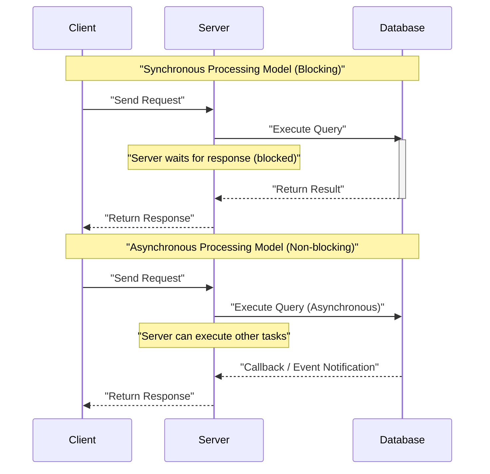
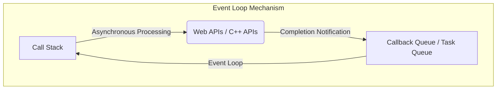
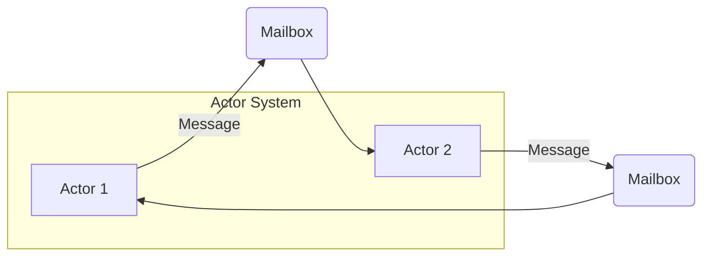
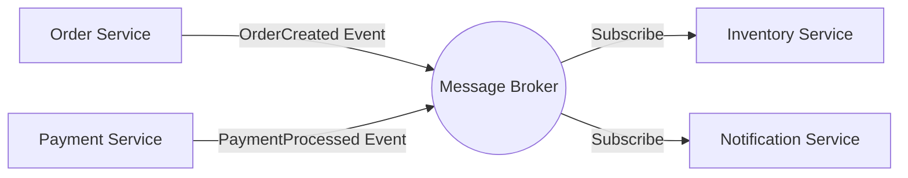
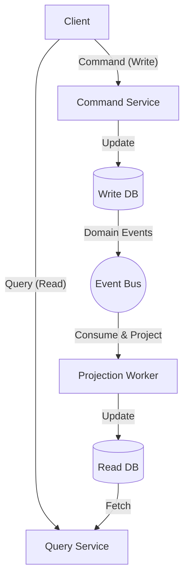

In modern software development, understanding **asynchronous processing** and **Event-Driven Architecture** (EDA) is essential for improving system scalability and availability. In this article, we will delve deeply into the core concepts supporting these: the Event Loop, the Actor model, and CQRS (Command Query Responsibility Segregation), from theory to implementation and architectural level design.

## 1. Basics and Challenges of Asynchronous Processing

In a traditional synchronous processing model, the next task is blocked until a given task is completed. While this is simple as a programming model, it has the drawback of wasting CPU resources during I/O waits (such as database accesses or network requests).

Asynchronous processing is a technique to avoid this blocking and dramatically improve system **throughput**. However, introducing asynchronous processing brings new challenges such as state management, error handling, and race conditions between threads.

### 1.1 Comparison of Synchronous and Asynchronous Models



In the asynchronous model, wait time can be utilized effectively, allowing more requests to be processed simultaneously. Representative approaches for achieving this concurrency are the **Event Loop** and the **Actor model**.

---

## 2. Asynchronous Processing with Event Loop (Node.js / JavaScript)

The Event Loop is a mechanism for achieving high concurrency while remaining single-threaded. It is widely adopted in Node.js and browser environments (JavaScript).

### 2.1 Event Loop Architecture

The Event Loop operates as an infinite loop on the main thread, sequentially executing callback functions stacked in the task queue. Time-consuming I/O processes are delegated to the OS's asynchronous APIs or worker threads (thread pool), and upon completion, callbacks are added to the queue.



### 2.2 Implementation Example in JavaScript

The following code is a typical example of asynchronous processing (Promise and async/await) in JavaScript.

```javascript
// Mock function to fetch user data asynchronously
const fetchUserData = async (userId) => {
  return new Promise((resolve, reject) => {
    setTimeout(() => {
      if (userId > 0) {
        resolve({ id: userId, name: "Alice", role: "Admin" });
      } else {
        reject(new Error("Invalid User ID"));
      }
    }, 1000); // Simulate a 1-second I/O wait
  });
};

// Main process
const main = async () => {
  console.log("Process starting...");
  
  try {
    // Wait for asynchronous processing to complete (not blocked by Event Loop)
    const user = await fetchUserData(1);
    console.log("Fetch complete:", user);
  } catch (error) {
    console.error("Error occurred:", error.message);
  }
  
  console.log("Process finished");
};

main();
```

The advantage of the Event Loop is that it does not require lock management for shared states. However, if heavy CPU-bound processing is executed on the Call Stack, the entire Event Loop will be blocked, posing a risk of the system coming to a halt (Event Loop blocking). Computational complexity should be kept to lightweight operations of $ O(1) $ to $ O(N) $.

---

## 3. Actor Model and Message Passing ([Rust](https://kenji.blog/en/p/webassembly-wasm-current-future/) / Erlang / Akka)

If the Event Loop is an approach that challenges the limits of a single thread, the **Actor model** is a paradigm for making concurrent processing in multi-threaded or distributed environments safe and scalable.

### 3.1 Basic Concepts of the Actor Model

In the Actor model, the basic unit of processing is called an "Actor". Each Actor has an independent state and behavior, and does not directly share state with other Actors. Communication between Actors is entirely done through **asynchronous message passing**.

- **[State](https://kenji.blog/en/p/iac-infrastructure-as-code-terraform/) Encapsulation**: The internal state of an Actor cannot be accessed directly from the outside.
- **Message Queue (Mailbox)**: Received messages are queued in the Mailbox and processed sequentially.
- **Lock-free**: Because states are not shared, lock mechanisms like mutexes are unnecessary.



### 3.2 Actor Implementation Example using [Rust](https://kenji.blog/en/p/webassembly-wasm-current-future/)

In Rust, a systems programming language, you can build an Actor model using powerful asynchronous crates such as `tokio` and `actix`. Here, we show a simple Actor pattern implementation using an `mpsc` (Multi-Producer, Single-Consumer) channel.

```rust
use std::sync::Arc;
use tokio::sync::{mpsc, oneshot};

// Definition of messages sent to the actor
enum ActorMessage {
    Increment {
        respond_to: oneshot::Sender<i32>,
    },
    GetCount {
        respond_to: oneshot::Sender<i32>,
    },
}

// Actor struct
struct CounterActor {
    receiver: mpsc::Receiver<ActorMessage>,
    count: i32,
}

impl CounterActor {
    fn new(receiver: mpsc::Receiver<ActorMessage>) -> Self {
        CounterActor { receiver, count: 0 }
    }

    // Actor main loop
    async fn run(&mut self) {
        // Sequentially receive messages from the Mailbox
        while let Some(msg) = self.receiver.recv().await {
            match msg {
                ActorMessage::Increment { respond_to } => {
                    self.count += 1;
                    let _ = respond_to.send(self.count);
                }
                ActorMessage::GetCount { respond_to } => {
                    let _ = respond_to.send(self.count);
                }
            }
        }
    }
}

#[tokio::main]
async fn main() {
    // Create channel (capacity 100)
    let (tx, rx) = mpsc::channel(100);

    // Start actor
    let mut actor = CounterActor::new(rx);
    tokio::spawn(async move {
        actor.run().await;
    });

    // Send message and receive result
    let (resp_tx1, resp_rx1) = oneshot::channel();
    tx.send(ActorMessage::Increment { respond_to: resp_tx1 }).await.unwrap();
    println!("Count after increment: {}", resp_rx1.await.unwrap());

    let (resp_tx2, resp_rx2) = oneshot::channel();
    tx.send(ActorMessage::GetCount { respond_to: resp_tx2 }).await.unwrap();
    println!("Current count: {}", resp_rx2.await.unwrap());
}
```

Ownership and the type system in [Rust](https://kenji.blog/en/p/webassembly-wasm-current-future/) guarantee the safety of message passing between Actors at compile time. If we express the system throughput as $ S $ in a mathematical formula, for an actor count $ N $ and message processing rate $ R $, it ideally becomes $ S = N \times R $, demonstrating high scalability.

---

## 4. Into the World of Event-Driven Architecture (EDA)

Asynchronous processing and the Actor model are techniques for optimizing concurrent processing within a single application. The concept that extends this to the entire system (such as between microservices) is **Event-Driven Architecture (EDA)**.

In EDA, state changes within the system are expressed as "events" and asynchronously delivered through an event bus or message broker (Apache Kafka, RabbitMQ, AWS EventBridge, etc.).

### 4.1 Key Components of EDA

1. **Event Producer**: A component that generates events and sends them to the broker.
2. **Message Broker**: The infrastructure that routes, accumulates, and delivers events.
3. **Event Consumer**: A component that receives events and executes asynchronous processing.



The greatest benefit of this architecture is **Loose Coupling**. Producers do not need to be aware of the existence of consumers, and even if part of the system goes down, the broker retains the events, improving resilience.

---

## 5. CQRS and Event Sourcing

When pushing event-driven architecture to its limits, you will notice that the requirements for writing data (Command) and reading data (Query) differ significantly. The pattern that solves this is **CQRS (Command Query Responsibility Segregation)**.

### 5.1 CQRS Architecture

In CQRS, the system is physically and logically separated into a "Command Model that changes state" and a "Query Model that retrieves data".

- **Command Model**: Handles complex business logic and validation, ensuring data consistency.
- **Query Model**: Provides denormalized data (Read Model) optimized for reading, enabling fast query responses.



### 5.2 Combining with Event Sourcing

CQRS shows its true value when combined with **Event Sourcing**.
In traditional database design, only the "current state" of an entity is saved. However, in Event Sourcing, the "history of events that changed the state" is all saved (Append-only), and the current state is restored by sequentially replaying them.

For example, a bank account balance (current state) can be expressed as an accumulation of the following events.

$ Balance = \sum_{i=1}^{n} (Deposit_i) - \sum_{j=1}^{m} (Withdrawal_j) $

The benefits of Event Sourcing are as follows:
- **Complete Audit Log**: The state at any given point in the past can be restored and verified.
- **Time Travel**: A new Query Model (Read DB) can be built from scratch based on past events.
- **Improved Write Performance**: It is fast because it only appends events rather than updating the DB.

---

## 6. Use Cases and Architecture Selection

The technologies we have looked at so far each have their suitable use cases.

1. **Event Loop (Node.js)**: 
   - API gateways and real-time chat systems with many I/O-bound processes.
   - WebSocket servers handling massive concurrent connections.
2. **Actor Model ([Rust](https://kenji.blog/en/p/webassembly-wasm-current-future/) / Akka)**: 
   - Concurrent processing with complex state (game servers, real-time tracking).
   - High availability systems requiring self-healing capabilities from errors (Supervisor Trees).
3. **CQRS / Event Sourcing**: 
   - Domains where audit logs and high scalability are essential, such as financial systems and e-commerce order management.
   - Systems with asymmetric read and write loads.

### 6.1 Challenges and Best Practices

While event-driven and asynchronous architectures are powerful, it is necessary to accept **Eventual Consistency**. Because data is not instantly reflected across all systems (strong consistency), ingenuity on the UI/UX side (e.g., optimistic UI updates) is required.

Additionally, ensuring **Idempotency** in distributed systems is crucial. Systems must be designed so that even if the same event is processed multiple times due to network retries, the result remains the same.

---

## 7. Summary

In this article, we explained the depths of event-driven architecture and asynchronous processing from the following perspectives:

- The mechanism of single-threaded, non-blocking I/O via the **Event Loop**.
- Safe and scalable message passing using the **Actor model**.
- Loose coupling and scalability between systems via **EDA**.
- Optimization of read/write and complex domain modeling through **CQRS and Event Sourcing**.

These technologies serve as powerful weapons for building modern cloud-native distributed systems. Selecting and combining the appropriate paradigms according to system characteristics and business requirements is the first step toward excellent architectural design.
