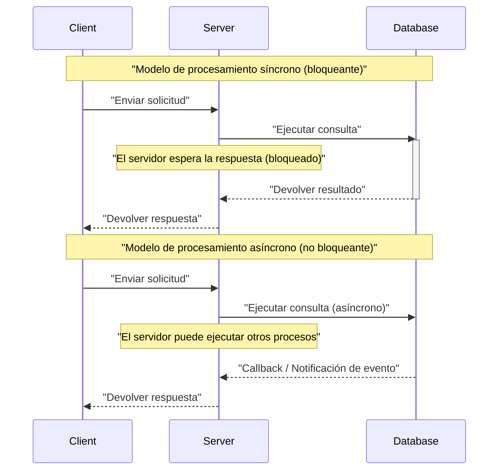
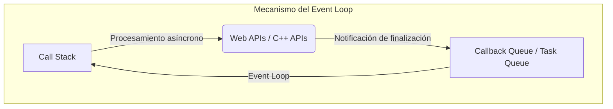
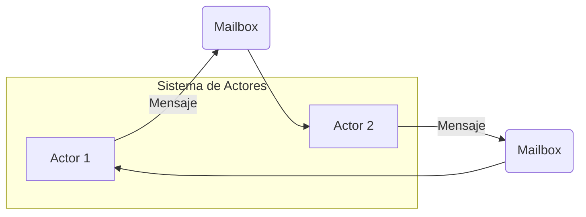
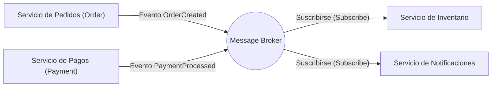
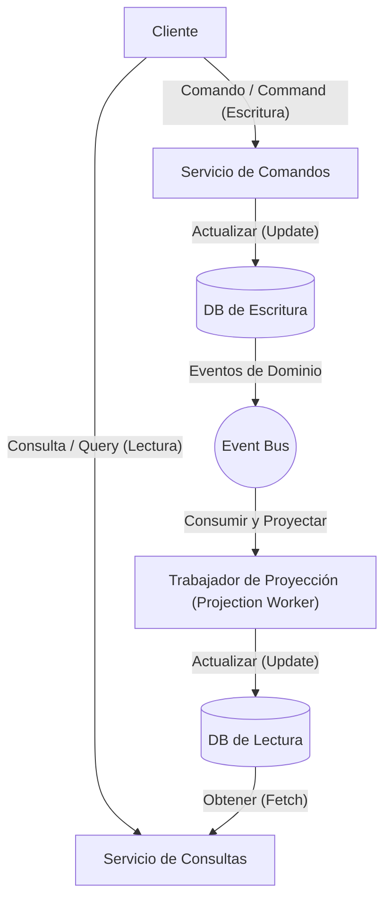

En el desarrollo de software moderno, para aumentar la escalabilidad y disponibilidad de los sistemas, es indispensable comprender el **procesamiento asíncrono** y la **arquitectura orientada a eventos** (EDA: Event-Driven Architecture). En este artículo, profundizaremos teóricamente, implementacionalmente y en el diseño a nivel de arquitectura sobre los conceptos centrales que sustentan esto: Event Loop, modelo de Actores y CQRS (Command Query Responsibility Segregation).

## 1. Fundamentos y desafíos del procesamiento asíncrono

En los modelos de procesamiento síncrono tradicionales, hasta que una tarea se completa, la siguiente tarea queda bloqueada. Esto es simple como modelo de programación, pero tiene la desventaja de que los recursos de la CPU se desperdician durante los tiempos de espera de E/S (como accesos a bases de datos o solicitudes de red).

El procesamiento asíncrono es una técnica para evitar este bloqueo y mejorar drásticamente el **rendimiento (throughput)** del sistema. Sin embargo, al introducir el procesamiento asíncrono, surgen nuevos desafíos como la gestión del estado, el manejo de errores y las condiciones de carrera (Race Condition) entre hilos.

### 1.1 Comparación entre modelos síncronos y asíncronos



En el modelo asíncrono, como se puede aprovechar el tiempo de espera, se pueden procesar más solicitudes simultáneamente. Como enfoques representativos para lograr esta concurrencia, tenemos el **Event Loop** y el **modelo de Actores**.

---

## 2. Procesamiento asíncrono con Event Loop (Node.js / JavaScript)

El Event Loop es un mecanismo para lograr alta concurrencia aunque es de un solo hilo (single-thread). Es ampliamente adoptado en Node.js y en entornos de navegador (JavaScript).

### 2.1 Arquitectura del Event Loop

El Event Loop se ejecuta como un bucle infinito en el hilo principal y ejecuta secuencialmente las funciones callback acumuladas en la cola de tareas. Las operaciones de E/S que toman tiempo se delegan a las APIs asíncronas del SO o a hilos de trabajo (pool de hilos), y una vez completadas, sus callbacks se añaden a la cola.



### 2.2 Ejemplo de implementación en JavaScript

El siguiente código es un ejemplo típico de procesamiento asíncrono (Promise y async/await) en JavaScript.

```javascript
// Función mock para obtener datos del usuario asíncronamente
const fetchUserData = async (userId) => {
  return new Promise((resolve, reject) => {
    setTimeout(() => {
      if (userId > 0) {
        resolve({ id: userId, name: "Alice", role: "Admin" });
      } else {
        reject(new Error("ID de usuario inválido"));
      }
    }, 1000); // Simula una espera de I/O de 1 segundo
  });
};

// Proceso principal
const main = async () => {
  console.log("Iniciando proceso...");
  
  try {
    // Espera a que termine el procesamiento asíncrono (no bloqueado por el Event Loop)
    const user = await fetchUserData(1);
    console.log("Obtención completada:", user);
  } catch (error) {
    console.error("Se produjo un error:", error.message);
  }
  
  console.log("Proceso finalizado");
};

main();
```

La ventaja del Event Loop es que no es necesario gestionar bloqueos (locks) para el estado compartido. Sin embargo, si se ejecuta un procesamiento pesado (CPU bound) en el Call Stack, todo el Event Loop se bloquea, con el riesgo de que el sistema se detenga (bloqueo del Event Loop). La complejidad computacional debe limitarse a operaciones ligeras, de $ O(1) $ a $ O(N) $.

---

## 3. Modelo de Actores y paso de mensajes ([Rust](https://kenji.blog/es/p/webassembly-wasm-current-future/) / Erlang / Akka)

Si el Event Loop es un enfoque que desafía los límites de un solo hilo, el **modelo de Actores** es un paradigma para hacer que el procesamiento concurrente en entornos multihilo o distribuidos sea seguro y escalable.

### 3.1 Conceptos básicos del modelo de Actores

En el modelo de Actores, la unidad básica de procesamiento se llama "Actor". Cada Actor tiene un estado ([State](https://kenji.blog/es/p/iac-infrastructure-as-code-terraform/)) y comportamiento (Behavior) independientes, y no comparte su estado directamente con otros Actores. Toda comunicación entre Actores se realiza mediante el **paso de mensajes asíncronos (message passing)**.

- **Encapsulación del estado**: El estado interno del Actor no es accesible directamente desde el exterior.
- **Cola de mensajes (Mailbox)**: Los mensajes recibidos se encolan en el Mailbox y se procesan secuencialmente.
- **Libre de bloqueos (Lock-free)**: Al no compartir el estado, no se requieren mecanismos de bloqueo como mutex.



### 3.2 Ejemplo de implementación de un Actor con [Rust](https://kenji.blog/es/p/webassembly-wasm-current-future/)

En Rust, un lenguaje de programación de sistemas, es posible construir el modelo de Actores utilizando potentes crates asíncronos como `tokio` o `actix`. Aquí se muestra una implementación sencilla del patrón Actor utilizando un canal `mpsc` (Multi-Producer, Single-Consumer).

```rust
use std::sync::Arc;
use tokio::sync::{mpsc, oneshot};

// Definición de mensajes enviados al actor
enum ActorMessage {
    Increment {
        respond_to: oneshot::Sender<i32>,
    },
    GetCount {
        respond_to: oneshot::Sender<i32>,
    },
}

// Estructura del actor
struct CounterActor {
    receiver: mpsc::Receiver<ActorMessage>,
    count: i32,
}

impl CounterActor {
    fn new(receiver: mpsc::Receiver<ActorMessage>) -> Self {
        CounterActor { receiver, count: 0 }
    }

    // Bucle principal del actor
    async fn run(&mut self) {
        // Recibir mensajes secuencialmente del Mailbox
        while let Some(msg) = self.receiver.recv().await {
            match msg {
                ActorMessage::Increment { respond_to } => {
                    self.count += 1;
                    let _ = respond_to.send(self.count);
                }
                ActorMessage::GetCount { respond_to } => {
                    let _ = respond_to.send(self.count);
                }
            }
        }
    }
}

#[tokio::main]
async fn main() {
    // Crear el canal (capacidad 100)
    let (tx, rx) = mpsc::channel(100);

    // Iniciar el actor
    let mut actor = CounterActor::new(rx);
    tokio::spawn(async move {
        actor.run().await;
    });

    // Enviar mensajes y recibir resultados
    let (resp_tx1, resp_rx1) = oneshot::channel();
    tx.send(ActorMessage::Increment { respond_to: resp_tx1 }).await.unwrap();
    println!("Cuenta después del incremento: {}", resp_rx1.await.unwrap());

    let (resp_tx2, resp_rx2) = oneshot::channel();
    tx.send(ActorMessage::GetCount { respond_to: resp_tx2 }).await.unwrap();
    println!("Cuenta actual: {}", resp_rx2.await.unwrap());
}
```

La propiedad (Ownership) y el sistema de tipos en [Rust](https://kenji.blog/es/p/webassembly-wasm-current-future/) garantizan la seguridad del paso de mensajes entre Actores en tiempo de compilación. Expresando el rendimiento del sistema como $ S $ mediante una fórmula matemática, para $ N $ Actores y una tasa de procesamiento de mensajes $ R $, idealmente se cumple que $ S = N \times R $, demostrando una alta escalabilidad.

---

## 4. Hacia el mundo de la Arquitectura Orientada a Eventos (EDA)

El procesamiento asíncrono y el modelo de Actores son técnicas para optimizar el procesamiento concurrente dentro de una única aplicación. El concepto de extender esto a todo el sistema (como entre microservicios) es la **Arquitectura Orientada a Eventos (EDA)**.

En EDA, los cambios de estado dentro del sistema se representan como "eventos" y se distribuyen asíncronamente a través de un bus de eventos o un broker de mensajes (Apache Kafka, RabbitMQ, AWS EventBridge, etc.).

### 4.1 Componentes principales de EDA

1. **Productor de eventos (Event Producer)**: Componente que genera eventos y los envía al broker.
2. **Broker de mensajes (Message Broker)**: Infraestructura que enruta, almacena y distribuye eventos.
3. **Consumidor de eventos (Event Consumer)**: Componente que recibe eventos y ejecuta el procesamiento asíncrono.



La mayor ventaja de esta arquitectura es el **bajo acoplamiento (Loose Coupling)**. El productor no necesita ser consciente de la existencia del consumidor, y si una parte del sistema falla, el broker conserva los eventos, mejorando la resiliencia (Resilience).

---

## 5. CQRS y Event Sourcing

Al llevar la arquitectura orientada a eventos al extremo, se nota que los requisitos para la escritura de datos (Command) y la lectura (Query) son muy diferentes. El patrón que resuelve esto es **CQRS (Command Query Responsibility Segregation: Separación de Responsabilidades de Comandos y Consultas)**.

### 5.1 Arquitectura de CQRS

En CQRS, el sistema se separa física o lógicamente en un "modelo de comandos que cambia el estado" y un "modelo de consultas que obtiene datos".

- **Modelo de Comandos (Command Model)**: Encargado de la lógica de negocio compleja y las validaciones, garantizando la integridad de los datos.
- **Modelo de Consultas (Query Model)**: Proporciona datos desnormalizados (Read Model) optimizados para la lectura, logrando respuestas rápidas a las consultas.



### 5.2 Combinación con Event Sourcing

CQRS demuestra su verdadero valor al combinarse con **Event Sourcing** (origen de eventos).
En el diseño tradicional de bases de datos, solo se guarda el "estado actual" de una entidad. Sin embargo, en el Event Sourcing, se guarda todo el "historial de eventos que cambiaron el estado" (Append-only), y el estado actual se restaura reproduciéndolos secuencialmente.

Por ejemplo, el saldo de una cuenta bancaria (estado actual) se puede representar como la acumulación de los siguientes eventos.

$ \text{Saldo} = \sum_{i=1}^{n} (\text{Depósito}_i) - \sum_{j=1}^{m} (\text{Retiro}_j) $

Las ventajas del Event Sourcing son las siguientes:
- **Registro de auditoría completo**: Es posible restaurar y verificar el estado en cualquier punto del pasado.
- **Viaje en el tiempo (Time-travel)**: A partir de los eventos pasados, se puede construir desde cero un nuevo Query Model (Read DB).
- **Mejora en el rendimiento de escritura**: En lugar de actualizar (Update) la base de datos, solo se agregan eventos al final (Append), lo que es más rápido.

---

## 6. Casos de uso y selección de arquitectura

Las tecnologías que hemos visto hasta ahora tienen sus propios casos de uso adecuados.

1. **Event Loop (Node.js)**: 
   - Pasarelas API (API Gateways) y sistemas de chat en tiempo real con mucho procesamiento I/O-bound.
   - Servidores WebSocket que manejan una gran cantidad de conexiones simultáneas.
2. **Modelo de Actores ([Rust](https://kenji.blog/es/p/webassembly-wasm-current-future/) / Akka)**: 
   - Procesamiento concurrente con estados complejos (servidores de juegos, seguimiento en tiempo real).
   - Sistemas de alta disponibilidad que requieren capacidades de auto-recuperación ante errores (árboles de supervisores).
3. **CQRS / Event Sourcing**: 
   - Dominios donde los registros de auditoría y alta escalabilidad son esenciales, como sistemas financieros y gestión de pedidos de e-commerce.
   - Sistemas con carga asimétrica de lectura y escritura.

### 6.1 Desafíos y mejores prácticas

La arquitectura orientada a eventos y asíncrona es potente, pero es necesario aceptar la **consistencia eventual (Eventual Consistency)**. Dado que los datos no se reflejan instantáneamente en todos los sistemas (consistencia fuerte), se requieren consideraciones del lado de UI/UX (ej. actualizaciones de interfaz de usuario optimistas).

Además, es importante garantizar la **idempotencia (Idempotency)** en los sistemas distribuidos. Debe diseñarse de manera que, incluso si el mismo evento se procesa varias veces debido a retransmisiones de red, el resultado no cambie.

---

## 7. Resumen

En este artículo, explicamos en profundidad la arquitectura orientada a eventos y el procesamiento asíncrono desde las siguientes perspectivas:

- El mecanismo de E/S no bloqueante de un solo hilo con **Event Loop**.
- Paso de mensajes seguro y escalable utilizando el **modelo de Actores**.
- Desacoplamiento y escalabilidad entre sistemas mediante **EDA**.
- Modelado de dominios complejos y optimización de lectura/escritura a través de **CQRS y Event Sourcing**.

Estas tecnologías son armas poderosas para construir sistemas distribuidos modernos y nativos de la nube. Seleccionar y combinar los paradigmas adecuados de acuerdo con las características del sistema y los requisitos empresariales es el primer paso hacia un excelente diseño de arquitectura.
