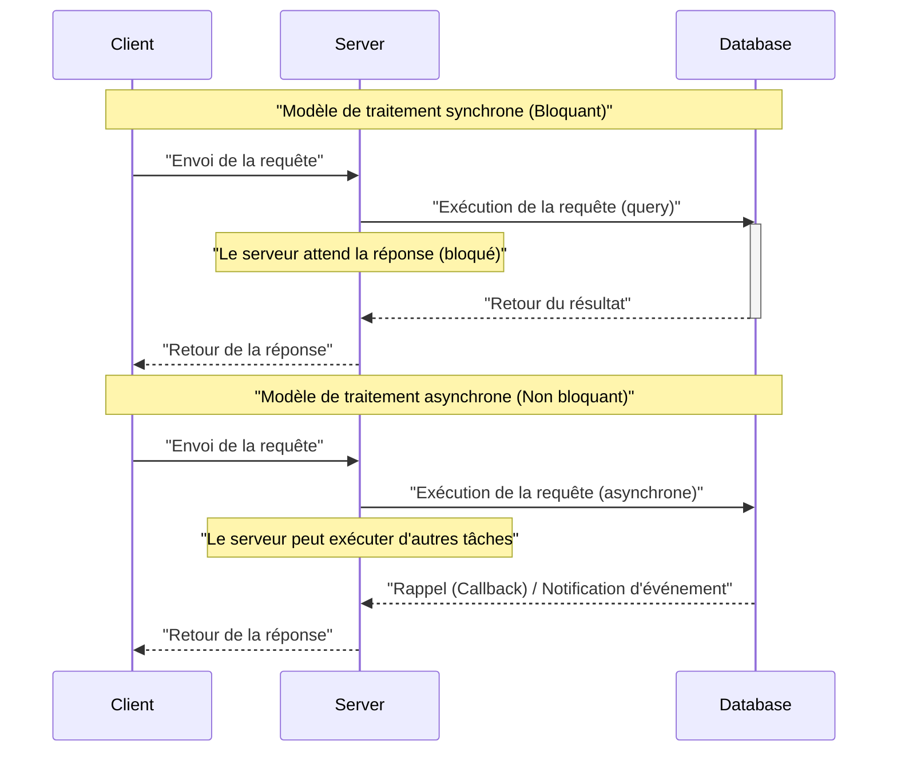
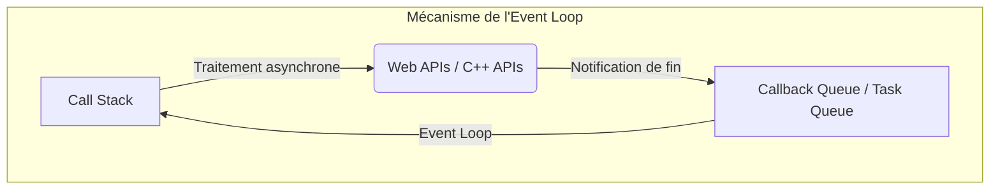
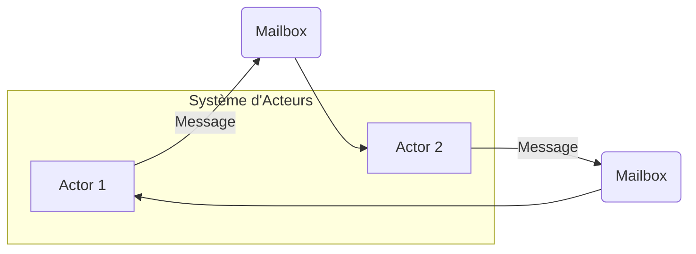
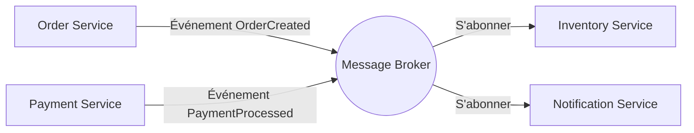
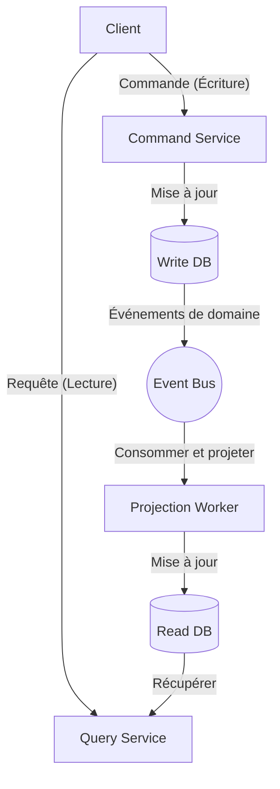

Dans le développement logiciel moderne, la compréhension du **traitement asynchrone** et de l'**architecture orientée événements** (EDA : [Event-Driven](https://kenji.blog/fr/p/event-driven-architecture-message-queue-kafka-rabbitmq/) Architecture) est essentielle pour améliorer la scalabilité et la disponibilité des systèmes. Cet article explore en profondeur les concepts fondamentaux qui les sous-tendent : la boucle d'événements (Event Loop), le modèle Acteur, et le CQRS (Command Query Responsibility Segregation), en allant de la théorie à l'implémentation, jusqu'à la conception au niveau de l'architecture.

## 1. Fondements et défis du traitement asynchrone

Dans le modèle traditionnel de traitement synchrone, la tâche suivante est bloquée jusqu'à ce qu'une tâche soit terminée. Bien que ce modèle de programmation soit simple, il présente l'inconvénient de gaspiller les ressources du processeur (CPU) pendant les attentes d'E/S (comme les accès aux bases de données ou les requêtes réseau).

Le traitement asynchrone est une technique permettant d'éviter ce blocage et d'améliorer considérablement le **débit** du système. Cependant, l'introduction du traitement asynchrone crée de nouveaux défis, tels que la gestion de l'état, la gestion des erreurs, et les conditions de concurrence (Race Condition) entre les threads.

### 1.1 Comparaison des modèles synchrone et asynchrone



Dans le modèle asynchrone, le temps d'attente peut être utilisé efficacement, ce qui permet de traiter un plus grand nombre de requêtes simultanément. Les approches représentatives pour réaliser cette concurrence sont l'**Event Loop** (boucle d'événements) et le **modèle Acteur**.

---

## 2. Traitement asynchrone avec l'Event Loop (Node.js / JavaScript)

L'Event Loop est un mécanisme permettant d'atteindre une forte concurrence tout en utilisant un seul thread (single-thread). Il est largement adopté dans Node.js et les environnements de navigateur (JavaScript).

### 2.1 Architecture de l'Event Loop

L'Event Loop fonctionne comme une boucle infinie sur le thread principal et exécute séquentiellement les fonctions de rappel (callbacks) empilées dans la file d'attente des tâches (Task Queue). Les opérations d'E/S chronophages sont déléguées aux API asynchrones du système d'exploitation ou aux threads de travail (thread pool), et un rappel est ajouté à la file d'attente à leur achèvement.



### 2.2 Exemple d'implémentation en JavaScript

Le code suivant est un exemple typique de traitement asynchrone (Promise et async/await) en JavaScript.

```javascript
// Fonction fictive (mock) pour récupérer les données utilisateur de manière asynchrone
const fetchUserData = async (userId) => {
  return new Promise((resolve, reject) => {
    setTimeout(() => {
      if (userId > 0) {
        resolve({ id: userId, name: "Alice", role: "Admin" });
      } else {
        reject(new Error("ID utilisateur invalide"));
      }
    }, 1000); // Simulation d'une attente d'E/S de 1 seconde
  });
};

// Processus principal
const main = async () => {
  console.log("Début du traitement...");
  
  try {
    // Attente de l'achèvement du traitement asynchrone (non bloqué par l'Event Loop)
    const user = await fetchUserData(1);
    console.log("Récupération terminée :", user);
  } catch (error) {
    console.error("Une erreur s'est produite :", error.message);
  }
  
  console.log("Fin du traitement");
};

main();
```

L'avantage de l'Event Loop est qu'elle ne nécessite pas de gestion des verrous pour les états partagés. Cependant, l'exécution de tâches lourdes (CPU-bound) dans la Call [Stack](https://kenji.blog/fr/p/c-language-pointers-memory-management-stack-heap/) risque de bloquer l'Event Loop entière, entraînant un état d'arrêt du système (blocage de l'Event Loop). La complexité des calculs doit être limitée à des tâches légères allant de $ O(1) $ à $ O(N) $.

---

## 3. Le modèle Acteur et le passage de messages ([Rust](https://kenji.blog/fr/p/webassembly-wasm-current-future/) / Erlang / Akka)

Si l'Event Loop est une approche visant à repousser les limites du single-thread, le **modèle Acteur** est un paradigme permettant de rendre le traitement concurrent sûr et scalable dans des environnements multi-threads ou distribués.

### 3.1 Concepts fondamentaux du modèle Acteur

Dans le modèle Acteur, l'unité de base du traitement est appelée « Acteur » (Actor). Chaque Acteur possède un état indépendant ([State](https://kenji.blog/fr/p/iac-infrastructure-as-code-terraform/)) et un comportement (Behavior), et ne partage pas directement son état avec d'autres Acteurs. La communication entre les Acteurs s'effectue exclusivement par **passage de messages asynchrone**.

- **Encapsulation de l'état** : L'état interne de l'Acteur n'est pas directement accessible de l'extérieur.
- **File d'attente de messages (Mailbox)** : Les messages reçus sont mis en file d'attente dans la Mailbox et traités séquentiellement.
- **Sans verrou ([Lock](https://kenji.blog/fr/p/rdbms-transaction-acid-isolation-level-lock/)-free)** : Comme aucun état n'est partagé, les mécanismes de verrouillage tels que les mutex ne sont pas nécessaires.



### 3.2 Exemple d'implémentation d'Acteur en [Rust](https://kenji.blog/fr/p/webassembly-wasm-current-future/)

En [Rust](https://kenji.blog/fr/p/programming-languages-history-paradigm-evolution/), un langage de programmation système, il est possible de construire le modèle Acteur en utilisant des crates asynchrones puissantes telles que `tokio` ou `actix`. Voici un exemple d'implémentation d'un modèle d'Acteur simple utilisant des canaux `mpsc` (Multi-Producer, Single-Consumer).

```rust
use std::sync::Arc;
use tokio::sync::{mpsc, oneshot};

// Définition des messages à envoyer à l'acteur
enum ActorMessage {
    Increment {
        respond_to: oneshot::Sender<i32>,
    },
    GetCount {
        respond_to: oneshot::Sender<i32>,
    },
}

// Structure de l'acteur
struct CounterActor {
    receiver: mpsc::Receiver<ActorMessage>,
    count: i32,
}

impl CounterActor {
    fn new(receiver: mpsc::Receiver<ActorMessage>) -> Self {
        CounterActor { receiver, count: 0 }
    }

    // Boucle principale de l'acteur
    async fn run(&mut self) {
        // Réception séquentielle des messages depuis la Mailbox
        while let Some(msg) = self.receiver.recv().await {
            match msg {
                ActorMessage::Increment { respond_to } => {
                    self.count += 1;
                    let _ = respond_to.send(self.count);
                }
                ActorMessage::GetCount { respond_to } => {
                    let _ = respond_to.send(self.count);
                }
            }
        }
    }
}

#[tokio::main]
async fn main() {
    // Création du canal (capacité 100)
    let (tx, rx) = mpsc::channel(100);

    // Lancement de l'acteur
    let mut actor = CounterActor::new(rx);
    tokio::spawn(async move {
        actor.run().await;
    });

    // Envoi de messages et réception des résultats
    let (resp_tx1, resp_rx1) = oneshot::channel();
    tx.send(ActorMessage::Increment { respond_to: resp_tx1 }).await.unwrap();
    println!("Compte après incrémentation : {}", resp_rx1.await.unwrap());

    let (resp_tx2, resp_rx2) = oneshot::channel();
    tx.send(ActorMessage::GetCount { respond_to: resp_tx2 }).await.unwrap();
    println!("Compte actuel : {}", resp_rx2.await.unwrap());
}
```

Le système de propriété (Ownership) et le système de types en [Rust](https://kenji.blog/fr/p/webassembly-wasm-current-future/) garantissent la sécurité du passage de messages entre Acteurs lors de la compilation. Si nous exprimons le débit du système par $ S $, pour un nombre d'acteurs $ N $ et un taux de traitement des messages $ R $, l'idéal est $ S = N \times R $, démontrant ainsi une grande scalabilité.

---

## 4. Vers le monde de l'architecture orientée événements (EDA)

Le traitement asynchrone et le modèle Acteur sont des méthodes permettant d'optimiser le traitement concurrent au sein d'une application unique. Le concept qui étend cela à l'ensemble du système (comme entre des microservices) est l'**architecture orientée événements (EDA)**.

Dans l'EDA, les changements d'état au sein du système sont représentés comme des « événements » et sont distribués de manière asynchrone via un bus d'événements ou un courtier de messages (Message Broker) (Apache [Kafka](https://kenji.blog/fr/p/event-driven-architecture-message-queue-kafka-rabbitmq/), [RabbitMQ](https://kenji.blog/fr/p/event-driven-architecture-message-queue-kafka-rabbitmq/), AWS EventBridge, etc.).

### 4.1 Principaux composants de l'EDA

1. **Event Producer (Producteur d'événements)** : Le composant qui génère des événements et les envoie au broker.
2. **Message Broker (Courtier de messages)** : L'infrastructure qui achemine, stocke et distribue les événements.
3. **Event Consumer (Consommateur d'événements)** : Le composant qui reçoit les événements et exécute des traitements de manière asynchrone.



Le plus grand avantage de cette architecture est le **couplage lâche (Loose Coupling)**. Le producteur n'a pas besoin d'être conscient de l'existence du consommateur, et même si une partie du système tombe en panne, la tolérance aux pannes (résilience) est améliorée car le broker conserve les événements.

---

## 5. CQRS et Event Sourcing

En poussant l'architecture orientée événements à l'extrême, on se rend compte que les exigences requises pour l'écriture de données (Command) et la lecture (Query) sont très différentes. Le modèle qui résout ce problème est le **CQRS (Command Query Responsibility Segregation : Séparation des responsabilités de commande et de requête)**.

### 5.1 Architecture du CQRS

Avec le CQRS, le système est séparé physiquement et logiquement en un « modèle de commande qui modifie l'état » et un « modèle de requête qui récupère les données ».

- **Command Model** : Gère la logique métier complexe et les validations, et garantit la cohérence des données.
- **Query Model** : Fournit des données dénormalisées (Read Model) optimisées pour la lecture, permettant d'obtenir des réponses aux requêtes rapides.



### 5.2 Combinaison avec l'Event Sourcing

Le CQRS révèle son véritable potentiel lorsqu'il est combiné à l'**Event Sourcing** (sourçage d'événements).
Dans la conception de bases de données traditionnelle, seul l'« état actuel » de l'entité est sauvegardé. Cependant, avec l'Event Sourcing, tout l'« historique des événements ayant modifié l'état » est sauvegardé (uniquement par ajout, Append-only), et l'état actuel est restauré en les rejouant séquentiellement.

Par exemple, le solde d'un compte bancaire (état actuel) peut être exprimé comme l'accumulation des événements suivants.

$ Balance = \sum_{i=1}^{n} (Deposit_i) - \sum_{j=1}^{m} (Withdrawal_j) $

Les avantages de l'Event Sourcing sont les suivants :
- **Journal d'audit complet** : L'état à n'importe quel moment du passé peut être restauré et vérifié.
- **Voyage dans le temps** : Un nouveau Query Model (Read DB) peut être construit à partir de zéro en se basant sur les événements passés.
- **Amélioration des performances d'écriture** : Les opérations sont rapides car elles ne consistent qu'à ajouter des événements (Append) au lieu de mettre à jour la base de données (Update).

---

## 6. Cas d'utilisation et choix d'architecture

Les groupes de technologies que nous avons examinés jusqu'à présent ont chacun des cas d'utilisation adaptés.

1. **Event Loop (Node.js)** : 
   - Passerelles d'API ([API Gateway](https://kenji.blog/fr/p/microservices-architecture-bff-api-gateway/)s) et systèmes de chat en temps réel avec beaucoup de traitements liés aux E/S (I/O bound).
   - Serveurs WebSocket gérant un grand nombre de connexions simultanées.
2. **Modèle Acteur ([Rust](https://kenji.blog/fr/p/webassembly-wasm-current-future/) / Akka)** : 
   - Traitements concurrents avec des états complexes (serveurs de jeux, suivi en temps réel).
   - Systèmes à haute disponibilité nécessitant une capacité d'auto-réparation en cas d'erreur (arbre de supervision / supervisor tree).
3. **CQRS / Event Sourcing** : 
   - Domaines où les journaux d'audit et une grande scalabilité sont indispensables, comme les systèmes financiers et la gestion des commandes de commerce électronique (e-commerce).
   - Systèmes où les charges de lecture et d'écriture sont asymétriques.

### 6.1 Défis et bonnes pratiques

L'architecture asynchrone et orientée événements est puissante, mais elle nécessite d'accepter la **cohérence à terme (Eventual [Consistency](https://kenji.blog/fr/p/cap-theorem-distributed-systems-tradeoff/))**. Comme les données ne sont pas immédiatement reflétées dans tout le système (cohérence forte), des ajustements au niveau de l'interface utilisateur / expérience utilisateur (UI/UX) sont nécessaires (par exemple : mises à jour optimistes de l'UI).

De plus, garantir l'**idempotence (Idempotency)** dans les systèmes distribués est également important. Le système doit être conçu pour que le résultat ne change pas, même si le même événement est traité plusieurs fois en raison de retransmissions réseau.

---

## 7. Conclusion

Dans cet article, nous avons expliqué en profondeur l'architecture orientée événements et le traitement asynchrone selon les points de vue suivants :

- Le mécanisme d'E/S non bloquant sur un seul thread grâce à l'**Event Loop**.
- Le passage de messages sûr et scalable à l'aide du **modèle Acteur**.
- Le couplage lâche et la scalabilité entre les systèmes grâce à l'**EDA**.
- La modélisation de domaines complexes et l'optimisation de la lecture/écriture grâce au **CQRS et à l'Event Sourcing**.

Ces technologies constituent des armes redoutables pour construire les systèmes distribués cloud-native d'aujourd'hui. Sélectionner et combiner les paradigmes appropriés en fonction des caractéristiques du système et des exigences métier est la première étape vers une excellente conception d'architecture.
