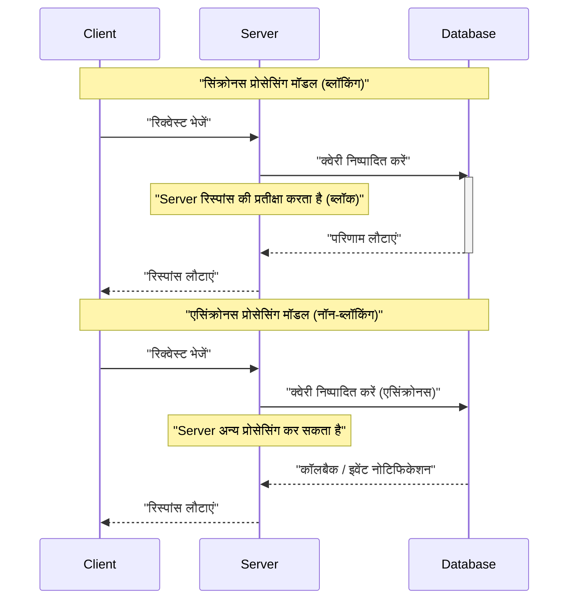
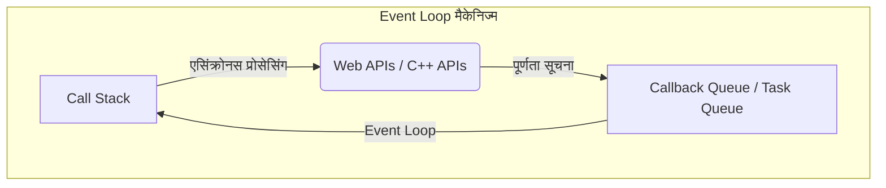
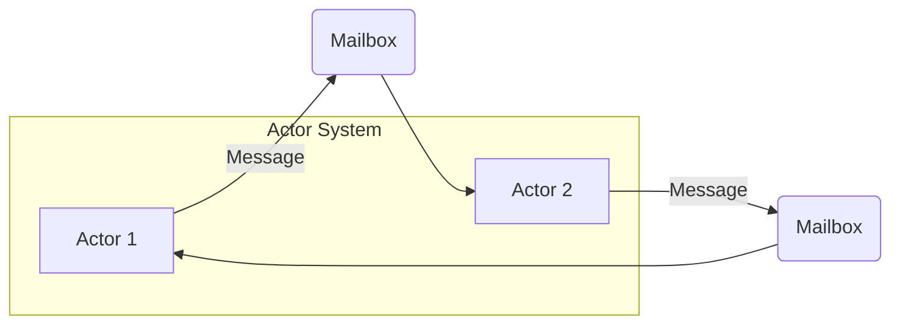
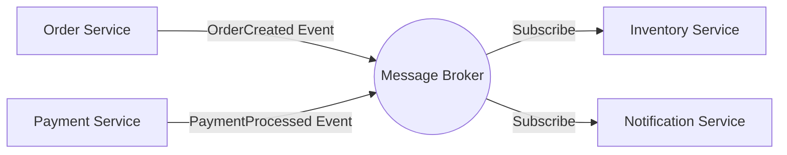
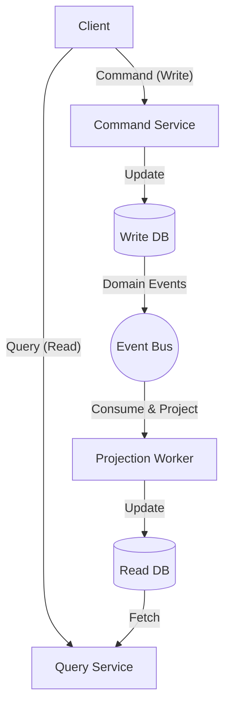

आधुनिक सॉफ्टवेयर विकास में, सिस्टम की स्केलेबिलिटी और उपलब्धता को बढ़ाने के लिए, **एसिंक्रोनस प्रोसेसिंग** (Asynchronous processing) और **इवेंट-ड्रिवन आर्किटेक्चर** (EDA: [Event-Driven](https://kenji.blog/hi/p/event-driven-architecture-message-queue-kafka-rabbitmq/) Architecture) को समझना अपरिहार्य है। इस लेख में, हम इनका समर्थन करने वाली प्रमुख अवधारणाओं - Event Loop, Actor मॉडल और CQRS (Command Query Responsibility Segregation) - के बारे में सिद्धांत से लेकर कार्यान्वयन और आर्किटेक्चर-स्तरीय डिज़ाइन तक गहराई से जानेंगे।

## 1. एसिंक्रोनस प्रोसेसिंग के मूल तत्व और चुनौतियाँ

पारंपरिक सिंक्रोनस प्रोसेसिंग मॉडल में, एक कार्य के पूरा होने तक अगला कार्य ब्लॉक हो जाता है। यद्यपि यह प्रोग्रामिंग मॉडल के रूप में सरल है, लेकिन इसमें एक खामी है कि I/O प्रतीक्षा (जैसे डेटाबेस एक्सेस या नेटवर्क रिक्वेस्ट) के दौरान CPU संसाधनों की बर्बादी होती है।

एसिंक्रोनस प्रोसेसिंग इस ब्लॉकिंग से बचने और सिस्टम के **थ्रूपुट** (throughput) को नाटकीय रूप से सुधारने की एक तकनीक है। हालाँकि, एसिंक्रोनस प्रोसेसिंग को अपनाने से स्टेट मैनेजमेंट, एरर हैंडलिंग और थ्रेड्स के बीच रेस कंडीशन (Race Condition) जैसी नई चुनौतियाँ पैदा होती हैं।

### 1.1 सिंक्रोनस और एसिंक्रोनस मॉडल की तुलना



एसिंक्रोनस मॉडल में, चूंकि प्रतीक्षा समय का प्रभावी ढंग से उपयोग किया जा सकता है, इसलिए एक साथ अधिक रिक्वेस्ट को प्रोसेस किया जा सकता है। इस कंकरेंसी (concurrency) को प्राप्त करने के तरीकों में से, सबसे प्रमुख **Event Loop** और **Actor मॉडल** हैं।

---

## 2. Event Loop द्वारा एसिंक्रोनस प्रोसेसिंग (Node.js / JavaScript)

Event Loop सिंगल-थ्रेडेड होते हुए भी उच्च कंकरेंसी प्राप्त करने का एक तंत्र है। यह Node.js और ब्राउज़र वातावरण (JavaScript) में व्यापक रूप से अपनाया जाता है।

### 2.1 Event Loop का आर्किटेक्चर

Event Loop मुख्य थ्रेड पर एक अनंत लूप के रूप में काम करता है और टास्क कतार (Task Queue) में मौजूद कॉलबैक कार्यों को क्रमिक रूप से निष्पादित करता है। समय लेने वाले I/O कार्यों को OS के एसिंक्रोनस API या वर्कर थ्रेड्स (थ्रेड पूल) को सौंप दिया जाता है, और पूरा होने पर कॉलबैक को कतार में जोड़ दिया जाता है।



### 2.2 JavaScript में कार्यान्वयन का उदाहरण

निम्नलिखित कोड JavaScript में एसिंक्रोनस प्रोसेसिंग (Promise और async/await) का एक विशिष्ट उदाहरण है।

```javascript
// उपयोगकर्ता डेटा को एसिंक्रोनस रूप से प्राप्त करने के लिए मॉक फंक्शन
const fetchUserData = async (userId) => {
  return new Promise((resolve, reject) => {
    setTimeout(() => {
      if (userId > 0) {
        resolve({ id: userId, name: "Alice", role: "Admin" });
      } else {
        reject(new Error("Invalid User ID"));
      }
    }, 1000); // 1 सेकंड के I/O प्रतीक्षा का अनुकरण
  });
};

// मुख्य प्रोसेसिंग
const main = async () => {
  console.log("प्रोसेसिंग शुरू...");
  
  try {
    // एसिंक्रोनस प्रोसेसिंग के पूरा होने की प्रतीक्षा करें (Event Loop द्वारा ब्लॉक नहीं किया गया)
    const user = await fetchUserData(1);
    console.log("प्राप्ति पूर्ण:", user);
  } catch (error) {
    console.error("त्रुटि उत्पन्न हुई:", error.message);
  }
  
  console.log("प्रोसेसिंग समाप्त");
};

main();
```

Event Loop का लाभ यह है कि साझा स्टेट्स के लिए लॉक प्रबंधन की कोई आवश्यकता नहीं है। हालाँकि, यदि आप Call [Stack](https://kenji.blog/hi/p/c-language-pointers-memory-management-stack-heap/) पर CPU-बाउंड भारी कार्यों को निष्पादित करते हैं, तो संपूर्ण Event Loop ब्लॉक हो जाएगा, जिससे सिस्टम के रुकने का जोखिम होता है (Event Loop ब्लॉकिंग)। कम्प्यूटेशनल जटिलता को $ O(1) $ से $ O(N) $ वाले हल्के कार्यों तक सीमित रखा जाना चाहिए।

---

## 3. Actor मॉडल और मैसेज पासिंग ([Rust](https://kenji.blog/hi/p/webassembly-wasm-current-future/) / Erlang / Akka)

यदि Event Loop सिंगल-थ्रेड की सीमाओं को पार करने का एक दृष्टिकोण है, तो **Actor मॉडल** मल्टी-थ्रेडेड और डिस्ट्रिब्यूटेड वातावरण में कंकरेंट प्रोसेसिंग को सुरक्षित और स्केलेबल बनाने का एक प्रतिमान (paradigm) है।

### 3.1 Actor मॉडल की मूल अवधारणा

Actor मॉडल में, प्रोसेसिंग की मूल इकाई को "Actor (एक्टर)" कहा जाता है। प्रत्येक Actor का अपना स्वतंत्र स्टेट ([State](https://kenji.blog/hi/p/iac-infrastructure-as-code-terraform/)) और व्यवहार (Behavior) होता है, और यह अन्य Actors के साथ सीधे तौर पर स्टेट साझा नहीं करता है। Actors के बीच का संचार पूरी तरह से **एसिंक्रोनस मैसेज पासिंग** के माध्यम से होता है।

- **स्टेट का एनकैप्सुलेशन**: Actor के आंतरिक स्टेट को बाहर से सीधे एक्सेस नहीं किया जा सकता है।
- **मैसेज कतार (Mailbox)**: प्राप्त संदेशों को Mailbox में कतारबद्ध किया जाता है और क्रमिक रूप से प्रोसेस किया जाता है।
- **लॉक-फ्री**: चूंकि स्टेट साझा नहीं किया जाता है, इसलिए म्यूटेक्स जैसे लॉकिंग तंत्र की कोई आवश्यकता नहीं होती है।



### 3.2 [Rust](https://kenji.blog/hi/p/webassembly-wasm-current-future/) का उपयोग करके Actor का कार्यान्वयन उदाहरण

सिस्टम प्रोग्रामिंग भाषा [Rust](https://kenji.blog/hi/p/programming-languages-history-paradigm-evolution/) में, आप `tokio` या `actix` जैसे शक्तिशाली एसिंक्रोनस क्रेट्स का उपयोग करके Actor मॉडल बना सकते हैं। यहां, हम `mpsc` (Multi-Producer, Single-Consumer) चैनल का उपयोग करके एक साधारण Actor पैटर्न का कार्यान्वयन दिखाएंगे।

```rust
use std::sync::Arc;
use tokio::sync::{mpsc, oneshot};

// एक्टर को भेजे जाने वाले संदेशों की परिभाषा
enum ActorMessage {
    Increment {
        respond_to: oneshot::Sender<i32>,
    },
    GetCount {
        respond_to: oneshot::Sender<i32>,
    },
}

// एक्टर स्ट्रक्चर
struct CounterActor {
    receiver: mpsc::Receiver<ActorMessage>,
    count: i32,
}

impl CounterActor {
    fn new(receiver: mpsc::Receiver<ActorMessage>) -> Self {
        CounterActor { receiver, count: 0 }
    }

    // एक्टर का मुख्य लूप
    async fn run(&mut self) {
        // Mailbox से संदेशों को क्रमिक रूप से प्राप्त करें
        while let Some(msg) = self.receiver.recv().await {
            match msg {
                ActorMessage::Increment { respond_to } => {
                    self.count += 1;
                    let _ = respond_to.send(self.count);
                }
                ActorMessage::GetCount { respond_to } => {
                    let _ = respond_to.send(self.count);
                }
            }
        }
    }
}

#[tokio::main]
async fn main() {
    // चैनल बनाना (क्षमता 100)
    let (tx, rx) = mpsc::channel(100);

    // एक्टर शुरू करना
    let mut actor = CounterActor::new(rx);
    tokio::spawn(async move {
        actor.run().await;
    });

    // संदेश भेजना और परिणाम प्राप्त करना
    let (resp_tx1, resp_rx1) = oneshot::channel();
    tx.send(ActorMessage::Increment { respond_to: resp_tx1 }).await.unwrap();
    println!("Count after increment: {}", resp_rx1.await.unwrap());

    let (resp_tx2, resp_rx2) = oneshot::channel();
    tx.send(ActorMessage::GetCount { respond_to: resp_tx2 }).await.unwrap();
    println!("Current count: {}", resp_rx2.await.unwrap());
}
```

[Rust](https://kenji.blog/hi/p/webassembly-wasm-current-future/) में ओनरशिप (Ownership) और टाइप सिस्टम संकलन (compile) के समय Actors के बीच मैसेज पासिंग की सुरक्षा की गारंटी देते हैं। यदि हम गणितीय रूप से सिस्टम के थ्रूपुट को $ S $ के रूप में व्यक्त करते हैं, तो Actors की संख्या $ N $ और संदेश प्रोसेसिंग दर $ R $ के लिए, आदर्श रूप से $ S = N \times R $ होता है, जो उच्च स्केलेबिलिटी प्रदर्शित करता है।

---

## 4. इवेंट-ड्रिवन आर्किटेक्चर (EDA) की दुनिया में

एसिंक्रोनस प्रोसेसिंग और Actor मॉडल एक ही एप्लिकेशन के भीतर कंकरेंट प्रोसेसिंग को अनुकूलित करने के तरीके हैं। इस अवधारणा का पूरे सिस्टम (जैसे माइक्रोसर्विसेज के बीच) में विस्तार **इवेंट-ड्रिवन आर्किटेक्चर (EDA)** कहलाता है।

EDA में, सिस्टम के भीतर स्टेट में होने वाले बदलावों को "इवेंट" के रूप में दर्शाया जाता है, और उन्हें इवेंट बस या मैसेज ब्रोकर (जैसे Apache [Kafka](https://kenji.blog/hi/p/event-driven-architecture-message-queue-kafka-rabbitmq/), [RabbitMQ](https://kenji.blog/hi/p/event-driven-architecture-message-queue-kafka-rabbitmq/), AWS EventBridge) के माध्यम से एसिंक्रोनस रूप से वितरित किया जाता है।

### 4.1 EDA के प्रमुख घटक

1. **Event Producer (इवेंट प्रोड्यूसर)**: वह घटक जो इवेंट उत्पन्न करता है और उन्हें ब्रोकर को भेजता है।
2. **Message Broker (मैसेज ब्रोकर)**: वह आधार जो इवेंट्स को रूट करता है, संग्रहीत करता है और वितरित करता है।
3. **Event Consumer (इवेंट कंज्यूमर)**: वह घटक जो इवेंट प्राप्त करता है और एसिंक्रोनस रूप से प्रोसेसिंग निष्पादित करता है।



इस आर्किटेक्चर का सबसे बड़ा लाभ **लूज कपलिंग (Loose Coupling)** है। प्रोड्यूसर को कंज्यूमर के अस्तित्व के बारे में जागरूक होने की आवश्यकता नहीं है, और भले ही सिस्टम का कोई हिस्सा डाउन हो जाए, ब्रोकर इवेंट्स को बनाए रखता है, जिससे फॉल्ट टॉलरेंस (Resilience) में सुधार होता है।

---

## 5. CQRS और इवेंट सोर्सिंग

जब आप इवेंट-ड्रिवन आर्किटेक्चर को इसकी चरम सीमा तक ले जाते हैं, तो आप पाते हैं कि डेटा लिखने (Command) और पढ़ने (Query) की आवश्यकताएं काफी भिन्न होती हैं। वह पैटर्न जो इसे हल करता है वह है **CQRS (Command Query Responsibility Segregation: कमांड क्वेरी रिस्पॉन्सिबिलिटी सेग्रीगेशन)**।

### 5.1 CQRS का आर्किटेक्चर

CQRS में, सिस्टम को भौतिक रूप से और तार्किक रूप से एक "कमांड मॉडल (जो स्टेट को बदलता है)" और एक "क्वेरी मॉडल (जो डेटा प्राप्त करता है)" में विभाजित किया जाता है।

- **Command Model**: जटिल व्यावसायिक तर्क और वैलिडेशन (validation) को संभालता है, और डेटा स्थिरता (consistency) सुनिश्चित करता है।
- **Query Model**: पढ़ने के लिए अनुकूलित डी-नॉर्मलाइज्ड डेटा (Read Model) प्रदान करता है, और तेज़ क्वेरी रिस्पांस प्राप्त करता है।



### 5.2 इवेंट सोर्सिंग (Event Sourcing) के साथ संयोजन

**इवेंट सोर्सिंग** के साथ जोड़े जाने पर CQRS अपना असली मूल्य दिखाता है।
पारंपरिक डेटाबेस डिज़ाइन में, केवल एक एंटिटी (entity) का "वर्तमान स्टेट" सहेजा जाता है। हालाँकि, इवेंट सोर्सिंग में, स्टेट को बदलने वाले इवेंट्स के सभी "इतिहास" को सहेजा जाता है (Append-only), और वर्तमान स्टेट को उन्हें क्रमिक रूप से रिप्ले (replay) करके पुनर्स्थापित किया जाता है।

उदाहरण के लिए, बैंक खाते की शेष राशि (वर्तमान स्टेट) को निम्नलिखित इवेंट्स के संचय के रूप में व्यक्त किया जा सकता है।

$ \text{शेष राशि} = \sum_{i=1}^{n} (\text{जमा}_i) - \sum_{j=1}^{m} (\text{निकासी}_j) $

इवेंट सोर्सिंग के लाभ इस प्रकार हैं:
- **संपूर्ण ऑडिट लॉग**: अतीत में किसी भी बिंदु पर स्टेट को पुनर्स्थापित और सत्यापित किया जा सकता है।
- **समय यात्रा**: अतीत के इवेंट्स के आधार पर स्क्रैच से एक नया Query Model (Read DB) बनाया जा सकता है।
- **लेखन प्रदर्शन में सुधार**: यह तेज़ है क्योंकि यह DB को अपडेट (Update) करने के बजाय केवल इवेंट्स को जोड़ता (Append) है।

---

## 6. उपयोग के मामले और आर्किटेक्चर का चयन

जिन तकनीकों को हमने अब तक देखा है, उनके अपने उपयुक्त उपयोग के मामले (use cases) हैं।

1. **Event Loop (Node.js)**: 
   - API गेटवे और रियल-टाइम चैट सिस्टम जिनमें बहुत सारे I/O-बाउंड कार्य होते हैं।
   - WebSocket सर्वर जो बड़ी संख्या में समवर्ती (concurrent) कनेक्शन को संभालते हैं।
2. **Actor मॉडल ([Rust](https://kenji.blog/hi/p/webassembly-wasm-current-future/) / Akka)**: 
   - जटिल स्टेट के साथ कंकरेंट प्रोसेसिंग (गेम सर्वर, रियल-टाइम ट्रैकिंग)।
   - उच्च उपलब्धता वाले सिस्टम जिनके लिए त्रुटियों से स्व-उपचार क्षमताओं (पर्यवेक्षक ट्री - supervisor trees) की आवश्यकता होती है।
3. **CQRS / Event Sourcing**: 
   - वित्तीय प्रणाली, ई-कॉमर्स ऑर्डर प्रबंधन आदि जैसे डोमेन, जहां ऑडिट लॉग और उच्च स्केलेबिलिटी आवश्यक हैं।
   - ऐसे सिस्टम जहां पढ़ने और लिखने का भार असममित (asymmetrical) है।

### 6.1 चुनौतियाँ और सर्वोत्तम अभ्यास (Best Practices)

हालाँकि इवेंट-ड्रिवन और एसिंक्रोनस आर्किटेक्चर शक्तिशाली हैं, फिर भी **इवेंचुअल कंसिस्टेंसी (Eventual [Consistency](https://kenji.blog/hi/p/cap-theorem-distributed-systems-tradeoff/))** को स्वीकार करना आवश्यक है। चूंकि डेटा तुरंत पूरे सिस्टम में परिलक्षित (स्ट्रॉन्ग कंसिस्टेंसी) नहीं होता है, इसलिए UI/UX की ओर से रचनात्मकता (उदाहरण: आशावादी UI अपडेट) की आवश्यकता होती है।

इसके अलावा, डिस्ट्रिब्यूटेड सिस्टम्स में **आइडम्पोटेंसी (Idempotency)** सुनिश्चित करना महत्वपूर्ण है। इसे इस तरह डिज़ाइन किया जाना चाहिए कि भले ही नेटवर्क रिट्रांसमिशन (retransmission) के कारण एक ही इवेंट को कई बार प्रोसेस किया जाए, परिणाम न बदले।

---

## 7. निष्कर्ष

इस लेख में, हमने निम्नलिखित दृष्टिकोणों से इवेंट-ड्रिवन आर्किटेक्चर और एसिंक्रोनस प्रोसेसिंग की गहराई के बारे में बताया:

- **Event Loop** के माध्यम से सिंगल-थ्रेडेड, नॉन-ब्लॉकिंग I/O का तंत्र।
- **Actor मॉडल** का उपयोग करके सुरक्षित और स्केलेबल मैसेज पासिंग।
- **EDA** के माध्यम से सिस्टम के बीच लूज कपलिंग और स्केलेबिलिटी।
- **CQRS और इवेंट सोर्सिंग** के माध्यम से जटिल डोमेन मॉडलिंग और पढ़ने/लिखने का अनुकूलन।

ये प्रौद्योगिकियां आधुनिक क्लाउड-नेटिव डिस्ट्रिब्यूटेड सिस्टम्स के निर्माण के लिए शक्तिशाली हथियार हैं। सिस्टम की विशेषताओं और व्यावसायिक आवश्यकताओं के अनुसार उपयुक्त प्रतिमानों (paradigms) का चयन और संयोजन करना उत्कृष्ट आर्किटेक्चर डिज़ाइन की दिशा में पहला कदम है।
