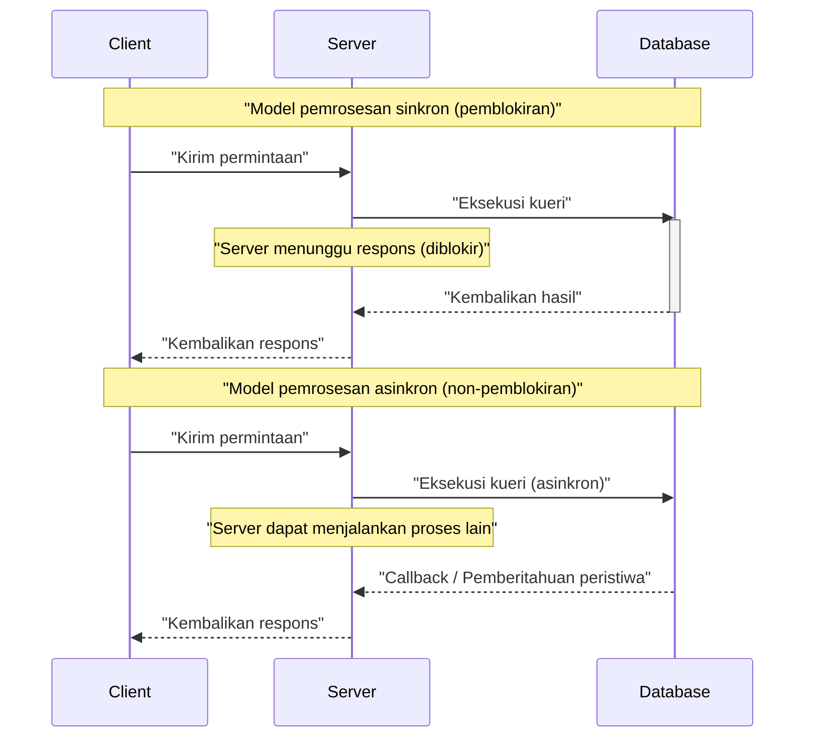
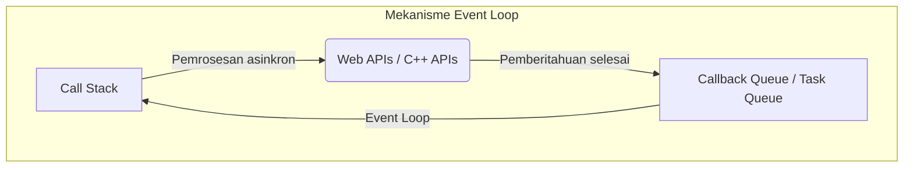
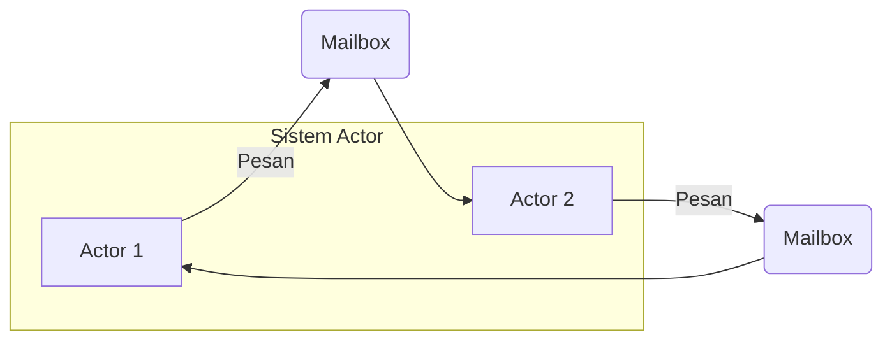
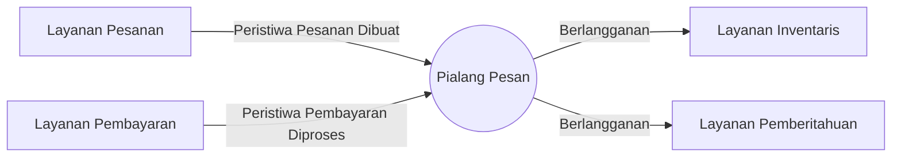
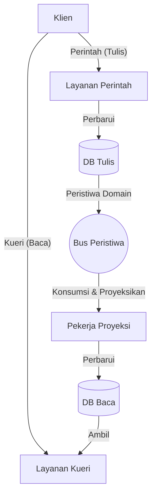

Dalam pengembangan perangkat lunak modern, pemahaman tentang **pemrosesan asinkron** dan **arsitektur berbasis peristiwa** (EDA: Event-Driven Architecture) sangat penting untuk meningkatkan skalabilitas dan ketersediaan sistem. Artikel ini akan membahas secara mendalam konsep-konsep inti yang mendukung hal tersebut, yaitu Event Loop, model Actor, dan CQRS (Command Query Responsibility Segregation), mulai dari teori, implementasi, hingga desain tingkat arsitektur.

## 1. Dasar dan Tantangan Pemrosesan Asinkron

Dalam model pemrosesan sinkron tradisional, tugas berikutnya akan diblokir hingga tugas saat ini selesai. Model pemrograman ini sederhana, namun memiliki kelemahan yaitu sumber daya CPU menjadi terbuang percuma selama menunggu I/O (seperti akses database atau permintaan jaringan).

Pemrosesan asinkron adalah teknik untuk menghindari pemblokiran ini dan meningkatkan **throughput** sistem secara drastis. Namun, dengan memperkenalkan pemrosesan asinkron, muncul tantangan baru seperti manajemen keadaan (state), penanganan kesalahan, dan kondisi balapan (Race Condition) antar thread.

### 1.1 Perbandingan Model Sinkron dan Asinkron



Dalam model asinkron, waktu tunggu dapat dimanfaatkan secara efektif, sehingga lebih banyak permintaan dapat diproses secara bersamaan. Pendekatan utama untuk mencapai konkurensi ini adalah **Event Loop** dan **model Actor**.

---

## 2. Pemrosesan Asinkron dengan Event Loop (Node.js / JavaScript)

Event Loop adalah mekanisme untuk mencapai konkurensi tinggi meskipun menggunakan thread tunggal (single-thread). Ini banyak diadopsi di Node.js dan lingkungan browser (JavaScript).

### 2.1 Arsitektur Event Loop

Event Loop beroperasi sebagai loop tak terbatas pada thread utama, mengeksekusi fungsi callback yang ditumpuk dalam antrean tugas secara berurutan. Pemrosesan I/O yang memakan waktu didelegasikan ke API asinkron dari OS atau thread pekerja (thread pool), dan setelah selesai, callback ditambahkan ke antrean.



### 2.2 Contoh Implementasi dalam JavaScript

Kode berikut adalah contoh umum dari pemrosesan asinkron (Promise dan async/await) dalam JavaScript.

```javascript
// Fungsi tiruan untuk mengambil informasi pengguna secara asinkron
const fetchUserData = async (userId) => {
  return new Promise((resolve, reject) => {
    setTimeout(() => {
      if (userId > 0) {
        resolve({ id: userId, name: "Alice", role: "Admin" });
      } else {
        reject(new Error("Invalid User ID"));
      }
    }, 1000); // Mensimulasikan I/O yang menunggu selama 1 detik
  });
};

// Proses utama
const main = async () => {
  console.log("Memulai proses...");
  
  try {
    // Menunggu selesainya pemrosesan asinkron (tidak diblokir oleh Event Loop)
    const user = await fetchUserData(1);
    console.log("Pengambilan selesai:", user);
  } catch (error) {
    console.error("Terjadi kesalahan:", error.message);
  }
  
  console.log("Proses selesai");
};

main();
```

Keuntungan Event Loop adalah tidak memerlukan manajemen kunci (lock) untuk keadaan yang dibagikan. Namun, jika pemrosesan yang berat pada CPU dijalankan di Call Stack, seluruh Event Loop akan diblokir, dan ada risiko sistem menjadi terhenti (Pemblokiran Event Loop). Beban komputasi sebaiknya dibatasi pada pemrosesan ringan dari $ O(1) $ hingga $ O(N) $.

---

## 3. Model Actor dan Pengiriman Pesan (Rust / Erlang / Akka)

Jika Event Loop adalah pendekatan yang menantang batas thread tunggal, **model Actor** adalah paradigma untuk membuat pemrosesan konkuren di lingkungan multi-thread atau terdistribusi menjadi aman dan dapat diskalakan.

### 3.1 Konsep Dasar Model Actor

Dalam model Actor, unit dasar pemrosesan disebut "Actor" (aktor). Setiap Actor memiliki keadaan (State) dan perilaku (Behavior) yang independen, dan tidak membagikan keadaan secara langsung dengan Actor lain. Komunikasi antar Actor sepenuhnya dilakukan melalui **pengiriman pesan asinkron**.

- **Enkapsulasi Keadaan**: Keadaan internal Actor tidak dapat diakses secara langsung dari luar.
- **Antrean Pesan (Mailbox)**: Pesan yang diterima akan diantrekan di Mailbox dan diproses secara berurutan.
- **Bebas Kunci (Lock-free)**: Karena keadaan tidak dibagikan, mekanisme penguncian seperti mutex tidak diperlukan.



### 3.2 Contoh Implementasi Actor Menggunakan Rust

Dalam Rust, yang merupakan bahasa pemrograman sistem, Anda dapat membangun model Actor menggunakan crate asinkron yang kuat seperti `tokio` dan `actix`. Di sini, ditunjukkan implementasi pola Actor sederhana menggunakan saluran `mpsc` (Multi-Producer, Single-Consumer).

```rust
use std::sync::Arc;
use tokio::sync::{mpsc, oneshot};

// Definisi pesan yang akan dikirim ke actor
enum ActorMessage {
    Increment {
        respond_to: oneshot::Sender<i32>,
    },
    GetCount {
        respond_to: oneshot::Sender<i32>,
    },
}

// Struktur actor
struct CounterActor {
    receiver: mpsc::Receiver<ActorMessage>,
    count: i32,
}

impl CounterActor {
    fn new(receiver: mpsc::Receiver<ActorMessage>) -> Self {
        CounterActor { receiver, count: 0 }
    }

    // Loop utama dari actor
    async fn run(&mut self) {
        // Menerima pesan dari Mailbox secara berurutan
        while let Some(msg) = self.receiver.recv().await {
            match msg {
                ActorMessage::Increment { respond_to } => {
                    self.count += 1;
                    let _ = respond_to.send(self.count);
                }
                ActorMessage::GetCount { respond_to } => {
                    let _ = respond_to.send(self.count);
                }
            }
        }
    }
}

#[tokio::main]
async fn main() {
    // Pembuatan saluran (kapasitas 100)
    let (tx, rx) = mpsc::channel(100);

    // Memulai actor
    let mut actor = CounterActor::new(rx);
    tokio::spawn(async move {
        actor.run().await;
    });

    // Mengirim pesan dan menerima hasil
    let (resp_tx1, resp_rx1) = oneshot::channel();
    tx.send(ActorMessage::Increment { respond_to: resp_tx1 }).await.unwrap();
    println!("Count after increment: {}", resp_rx1.await.unwrap());

    let (resp_tx2, resp_rx2) = oneshot::channel();
    tx.send(ActorMessage::GetCount { respond_to: resp_tx2 }).await.unwrap();
    println!("Current count: {}", resp_rx2.await.unwrap());
}
```

Kepemilikan (Ownership) dan sistem tipe dalam Rust menjamin keamanan pengiriman pesan antar Actor saat kompilasi. Jika kita menyatakan throughput sistem dengan rumus $ S $, untuk jumlah actor $ N $ dan tingkat pemrosesan pesan $ R $, secara ideal $ S = N \times R $, yang menunjukkan skalabilitas tinggi.

---

## 4. Memasuki Dunia Arsitektur Berbasis Peristiwa (EDA)

Pemrosesan asinkron dan model Actor adalah teknik untuk mengoptimalkan pemrosesan konkuren di dalam aplikasi tunggal. Konsep yang memperluas hal ini ke seluruh sistem (seperti antar layanan mikro) adalah **Arsitektur Berbasis Peristiwa (EDA)**.

Dalam EDA, perubahan keadaan di dalam sistem direpresentasikan sebagai "peristiwa" dan didistribusikan secara asinkron melalui bus peristiwa atau pialang pesan (Apache Kafka, RabbitMQ, AWS EventBridge, dll.).

### 4.1 Komponen Utama EDA

1. **Event Producer (Produsen Peristiwa)**: Komponen yang menghasilkan peristiwa dan mengirimkannya ke pialang.
2. **Message Broker (Pialang Pesan)**: Infrastruktur yang merutekan, menyimpan, dan mendistribusikan peristiwa.
3. **Event Consumer (Konsumen Peristiwa)**: Komponen yang menerima peristiwa dan mengeksekusi pemrosesan secara asinkron.



Keuntungan terbesar dari arsitektur ini adalah **Pemisahan yang Longgar (Loose Coupling)**. Produsen tidak perlu menyadari keberadaan konsumen, dan jika ada bagian dari sistem yang mati, pialang akan menyimpan peristiwa, sehingga meningkatkan toleransi kesalahan (Resilience).

---

## 5. CQRS dan Event Sourcing

Jika arsitektur berbasis peristiwa didorong ke batasnya, Anda akan menyadari bahwa persyaratan untuk penulisan data (Command) dan pembacaan (Query) sangat berbeda. Pola yang menyelesaikan hal ini adalah **CQRS (Command Query Responsibility Segregation: Pemisahan Tanggung Jawab Perintah Kueri)**.

### 5.1 Arsitektur CQRS

Dalam CQRS, sistem dipisahkan secara fisik dan logis menjadi "model perintah untuk mengubah keadaan" dan "model kueri untuk mengambil data".

- **Command Model**: Menangani logika bisnis dan validasi yang kompleks, serta memastikan konsistensi data.
- **Query Model**: Menyediakan data denormalisasi yang dioptimalkan untuk pembacaan (Read Model), dan menyajikan respons kueri yang cepat.



### 5.2 Kombinasi dengan Event Sourcing

CQRS akan menunjukkan nilai sebenarnya bila dikombinasikan dengan **Event Sourcing**.
Pada desain database tradisional, hanya "keadaan saat ini" dari suatu entitas yang disimpan. Namun dalam Event Sourcing, seluruh "riwayat peristiwa yang mengubah keadaan" disimpan (Append-only), dan dengan memutarnya ulang (replay) secara berurutan, keadaan saat ini dapat dipulihkan.

Sebagai contoh, saldo rekening bank (keadaan saat ini) dapat direpresentasikan sebagai akumulasi dari peristiwa-peristiwa berikut:

$ \text{Saldo} = \sum_{i=1}^{n} (\text{Setoran}_i) - \sum_{j=1}^{m} (\text{Penarikan}_j) $

Keuntungan dari Event Sourcing adalah sebagai berikut:
- **Log Audit Lengkap**: Keadaan di titik waktu mana pun di masa lalu dapat dipulihkan dan diverifikasi.
- **Perjalanan Waktu (Time Travel)**: Query Model (Read DB) baru dapat dibangun dari awal berdasarkan peristiwa masa lalu.
- **Peningkatan Performa Penulisan**: Sangat cepat karena hanya melakukan penambahan peristiwa (Append), bukan pembaruan DB (Update).

---

## 6. Kasus Penggunaan dan Pemilihan Arsitektur

Teknologi yang telah dibahas sejauh ini memiliki kasus penggunaan masing-masing yang sesuai.

1. **Event Loop (Node.js)**: 
   - API Gateway dan sistem obrolan waktu nyata yang banyak melakukan pemrosesan yang dibatasi oleh I/O (I/O bound).
   - Server WebSocket yang menangani koneksi bersamaan dalam jumlah besar.
2. **Model Actor (Rust / Akka)**: 
   - Pemrosesan konkuren yang memiliki keadaan kompleks (server permainan, pelacakan waktu nyata).
   - Sistem ketersediaan tinggi yang memerlukan kemampuan perbaikan diri (self-healing) dari kesalahan (pohon supervisor).
3. **CQRS / Event Sourcing**: 
   - Domain yang mutlak memerlukan log audit dan skalabilitas tinggi seperti sistem keuangan dan manajemen pesanan e-commerce.
   - Sistem di mana beban pembacaan dan penulisan tidak simetris (asimetris).

### 6.1 Tantangan dan Praktik Terbaik

Meskipun arsitektur asinkron dan berbasis peristiwa sangat kuat, penerimaan terhadap **Konsistensi Akhir (Eventual Consistency)** sangat diperlukan. Karena data tidak langsung direfleksikan di seluruh sistem (konsistensi kuat), inovasi dari sisi UI/UX (misalnya: pembaruan UI yang optimis) sangat dibutuhkan.

Selain itu, sangat penting untuk memastikan **Idempotensi (Idempotency)** dalam sistem terdistribusi. Bahkan jika peristiwa yang sama diproses beberapa kali karena transmisi ulang dari jaringan, sistem harus dirancang sedemikian rupa agar hasilnya tidak berubah.

---

## 7. Kesimpulan

Artikel ini telah menjelaskan secara mendalam tentang arsitektur berbasis peristiwa dan pemrosesan asinkron dari sudut pandang berikut:

- Mekanisme thread tunggal dan I/O non-pemblokiran dengan **Event Loop**.
- Pengiriman pesan yang aman dan dapat diskalakan menggunakan **model Actor**.
- Pemisahan yang longgar antar sistem dan skalabilitas melalui **EDA**.
- Pemodelan domain kompleks serta optimasi baca-tulis melalui **CQRS dan Event Sourcing**.

Teknologi-teknologi ini merupakan senjata yang kuat untuk membangun sistem terdistribusi modern berbasis cloud (cloud-native). Memilih dan menggabungkan paradigma yang tepat sesuai dengan karakteristik sistem dan persyaratan bisnis adalah langkah pertama menuju desain arsitektur yang unggul.
