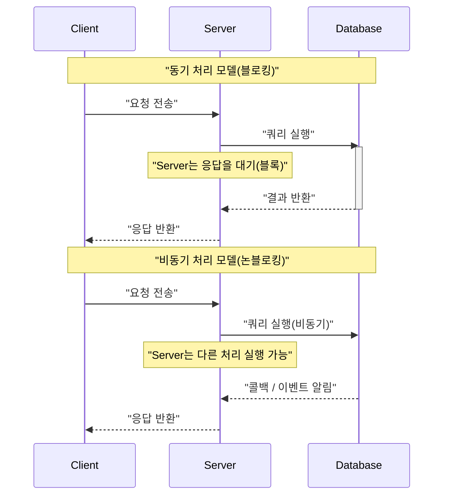
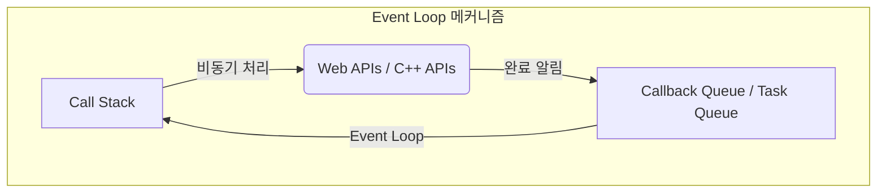
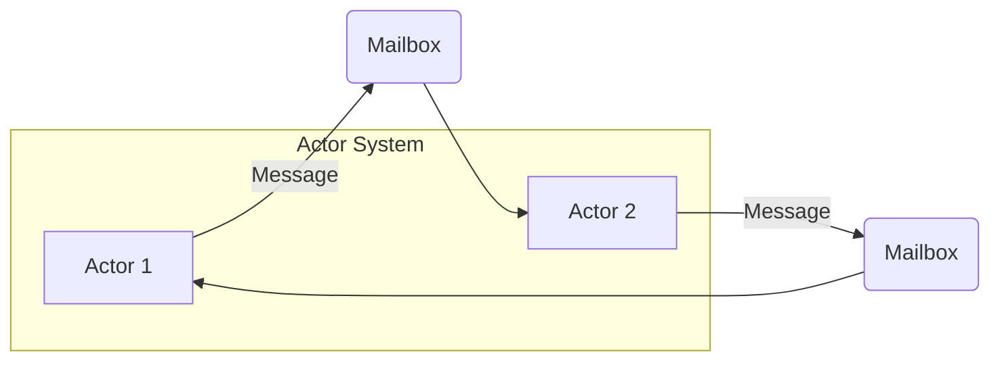
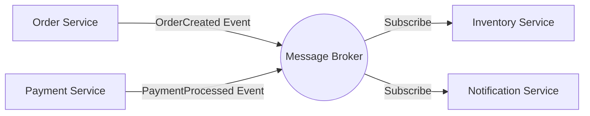
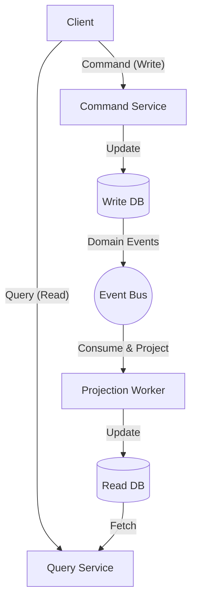

현대의 소프트웨어 개발에서 시스템의 확장성과 가용성을 높이기 위해서는 **비동기 처리** 와 **이벤트 기반 아키텍처** (EDA: [Event-Driven](https://kenji.blog/ko/p/event-driven-architecture-message-queue-kafka-rabbitmq/) Architecture)에 대한 이해가 필수적입니다. 본 문서에서는 이를 뒷받침하는 핵심 개념인 Event Loop, Actor 모델, 그리고 CQRS(Command Query Responsibility Segregation)에 대해 이론부터 구현, 그리고 아키텍처 수준의 설계에 이르기까지 깊이 파헤쳐 설명합니다.

## 1. 비동기 처리의 기초와 과제

기존의 동기 처리 모델에서는 한 작업이 완료될 때까지 다음 작업이 차단(블록)됩니다. 이는 프로그래밍 모델로서는 단순하지만, I/O 대기(데이터베이스 액세스나 네트워크 요청 등) 중에 CPU 리소스가 낭비된다는 단점이 있습니다.

비동기 처리는 이러한 블로킹을 피하고 시스템의 **처리량** 을 획기적으로 향상시키기 위한 기법입니다. 하지만 비동기 처리를 도입함으로써 상태 관리나 에러 핸들링, 스레드 간의 경쟁 상태(Race Condition)와 같은 새로운 과제가 발생합니다.

### 1.1 동기 모델과 비동기 모델의 비교



비동기 모델에서는 대기 시간을 유효하게 활용할 수 있으므로 더 많은 요청을 동시에 처리할 수 있습니다. 이러한 동시성을 실현하기 위한 접근 방식으로 대표적인 것이 **Event Loop** 와 **Actor 모델** 입니다.

---

## 2. Event Loop에 의한 비동기 처리 (Node.js / JavaScript)

Event Loop는 단일 스레드이면서도 높은 동시성을 실현하기 위한 메커니즘입니다. Node.js나 브라우저 환경(JavaScript)에서 널리 채택되고 있습니다.

### 2.1 Event Loop 아키텍처

Event Loop는 메인 스레드 상에서 무한 루프로 동작하며, 태스크 큐에 쌓인 콜백 함수를 순차적으로 실행합니다. 시간이 걸리는 I/O 처리는 OS 측의 비동기 API나 워커 스레드(스레드 풀)에 위임되며, 완료 시 콜백이 큐에 추가됩니다.



### 2.2 JavaScript 구현 예시

다음 코드는 JavaScript에서의 비동기 처리(Promise와 async/await)의 전형적인 예입니다.

```javascript
// 사용자 정보를 비동기로 가져오는 목 함수
const fetchUserData = async (userId) => {
  return new Promise((resolve, reject) => {
    setTimeout(() => {
      if (userId > 0) {
        resolve({ id: userId, name: "Alice", role: "Admin" });
      } else {
        reject(new Error("Invalid User ID"));
      }
    }, 1000); // 1초의 I/O 대기를 시뮬레이트
  });
};

// 메인 처리
const main = async () => {
  console.log("처리 시작...");
  
  try {
    // 비동기 처리 완료 대기(Event Loop에 의해 블록되지 않음)
    const user = await fetchUserData(1);
    console.log("조회 완료:", user);
  } catch (error) {
    console.error("에러 발생:", error.message);
  }
  
  console.log("처리 종료");
};

main();
```

Event Loop의 장점은 공유 상태에 대한 락([Lock](https://kenji.blog/ko/p/rdbms-transaction-acid-isolation-level-lock/)) 관리가 필요 없다는 것입니다. 그러나 CPU 바운드인 무거운 처리를 Call Stack에서 실행해 버리면 Event Loop 전체가 블록되어 시스템이 정지 상태에 빠질 위험이 있습니다(Event Loop의 블로킹). 계산량은 $ O(1) $ 에서 $ O(N) $ 의 가벼운 처리로 유지해야 합니다.

---

## 3. Actor 모델과 메시지 패싱 ([Rust](https://kenji.blog/ko/p/webassembly-wasm-current-future/) / Erlang / Akka)

Event Loop가 단일 스레드의 한계에 도전하는 접근 방식이라면, **Actor 모델** 은 멀티 스레드나 분산 환경에서의 병행 처리를 안전하고 확장 가능하게 하기 위한 패러다임입니다.

### 3.1 Actor 모델의 기본 개념

Actor 모델에서는 처리의 기본 단위를 'Actor(액터)'라고 부릅니다. 각 Actor는 독립적인 상태([State](https://kenji.blog/ko/p/iac-infrastructure-as-code-terraform/))와 행위(Behavior)를 가지며, 다른 Actor와 직접 상태를 공유하지 않습니다. Actor 간의 통신은 모두 **비동기적인 메시지 패싱** 에 의해 이루어집니다.

- **상태의 캡슐화** : Actor 내부의 상태는 외부에서 직접 접근할 수 없습니다.
- **메시지 큐(Mailbox)** : 수신한 메시지는 Mailbox에 큐잉되어 순차적으로 처리됩니다.
- **락 프리** : 상태를 공유하지 않으므로 뮤텍스 등의 락 메커니즘이 필요 없습니다.



### 3.2 [Rust](https://kenji.blog/ko/p/webassembly-wasm-current-future/)를 이용한 Actor 구현 예시

시스템 프로그래밍 언어인 Rust에서는 `tokio` 나 `actix` 와 같은 강력한 비동기 크레이트를 사용하여 Actor 모델을 구축할 수 있습니다. 여기서는 `mpsc` (Multi-Producer, Single-Consumer) 채널을 사용한 간단한 Actor 패턴의 구현을 보여줍니다.

```rust
use std::sync::Arc;
use tokio::sync::{mpsc, oneshot};

// 액터에게 전송할 메시지 정의
enum ActorMessage {
    Increment {
        respond_to: oneshot::Sender<i32>,
    },
    GetCount {
        respond_to: oneshot::Sender<i32>,
    },
}

// 액터 구조체
struct CounterActor {
    receiver: mpsc::Receiver<ActorMessage>,
    count: i32,
}

impl CounterActor {
    fn new(receiver: mpsc::Receiver<ActorMessage>) -> Self {
        CounterActor { receiver, count: 0 }
    }

    // 액터의 메인 루프
    async fn run(&mut self) {
        // Mailbox에서 메시지를 순차적으로 수신
        while let Some(msg) = self.receiver.recv().await {
            match msg {
                ActorMessage::Increment { respond_to } => {
                    self.count += 1;
                    let _ = respond_to.send(self.count);
                }
                ActorMessage::GetCount { respond_to } => {
                    let _ = respond_to.send(self.count);
                }
            }
        }
    }
}

#[tokio::main]
async fn main() {
    // 채널 생성(용량 100)
    let (tx, rx) = mpsc::channel(100);

    // 액터 시작
    let mut actor = CounterActor::new(rx);
    tokio::spawn(async move {
        actor.run().await;
    });

    // 메시지 전송 및 결과 수신
    let (resp_tx1, resp_rx1) = oneshot::channel();
    tx.send(ActorMessage::Increment { respond_to: resp_tx1 }).await.unwrap();
    println!("Count after increment: {}", resp_rx1.await.unwrap());

    let (resp_tx2, resp_rx2) = oneshot::channel();
    tx.send(ActorMessage::GetCount { respond_to: resp_tx2 }).await.unwrap();
    println!("Current count: {}", resp_rx2.await.unwrap());
}
```

[Rust](https://kenji.blog/ko/p/webassembly-wasm-current-future/)에서의 소유권(Ownership)과 타입 시스템은 Actor 간의 메시지 패싱의 안전성을 컴파일 타임에 보장합니다. 수식으로 시스템의 처리량 $ S $ 를 표현하면, 액터 수 $ N $ 과 메시지 처리 속도 $ R $ 에 대해 이상적으로는 $ S = N \times R $ 이 되어 높은 확장성을 발휘합니다.

---

## 4. 이벤트 기반 아키텍처(EDA)의 세계로

비동기 처리나 Actor 모델은 단일 애플리케이션 내부에서의 병행 처리를 최적화하는 기법입니다. 이를 시스템 전체(마이크로서비스 간 등)로 확장한 개념이 **이벤트 기반 아키텍처(EDA)** 입니다.

EDA에서는 시스템 내의 상태 변화를 '이벤트'로 표현하고, 이벤트 버스나 메시지 브로커(Apache [Kafka](https://kenji.blog/ko/p/event-driven-architecture-message-queue-kafka-rabbitmq/), [RabbitMQ](https://kenji.blog/ko/p/event-driven-architecture-message-queue-kafka-rabbitmq/), AWS EventBridge 등)를 통해 비동기적으로 전달합니다.

### 4.1 EDA의 주요 구성 요소

1. **Event Producer(이벤트 프로듀서)** : 이벤트를 생성하여 브로커에 전송하는 컴포넌트.
2. **Message Broker(메시지 브로커)** : 이벤트를 라우팅하고 축적 및 전달하는 기반.
3. **Event Consumer(이벤트 컨슈머)** : 이벤트를 수신하여 비동기적으로 처리를 실행하는 컴포넌트.



이 아키텍처의 가장 큰 장점은 **느슨한 결합(Loose Coupling)** 입니다. 프로듀서는 컨슈머의 존재를 의식할 필요가 없으며, 시스템의 일부가 다운되더라도 브로커가 이벤트를 유지하기 때문에 내결함성(Resilience)이 향상됩니다.

---

## 5. CQRS와 이벤트 소싱

이벤트 기반 아키텍처를 파고들면, 데이터의 쓰기(Command)와 읽기(Query)에서 요구되는 조건이 크게 다르다는 것을 알게 됩니다. 이를 해결하는 패턴이 **CQRS(Command Query Responsibility Segregation: 명령 쿼리 책임 분리)** 입니다.

### 5.1 CQRS 아키텍처

CQRS에서는 시스템을 '상태를 변경하는 명령 모델'과 '데이터를 조회하는 쿼리 모델'로 물리적, 논리적으로 분리합니다.

- **Command Model**: 복잡한 비즈니스 로직이나 유효성 검사를 담당하며, 데이터의 일관성을 보장합니다.
- **Query Model**: 읽기에 최적화된 비정규화 데이터(Read Model)를 제공하여 고속의 쿼리 응답을 실현합니다.



### 5.2 이벤트 소싱(Event Sourcing)과의 조합

CQRS는 **이벤트 소싱** 과 결합할 때 진가를 발휘합니다.
기존의 데이터베이스 설계에서는 엔티티의 '현재 상태'만을 저장합니다. 그러나 이벤트 소싱에서는 '상태를 변화시킨 이벤트의 기록'을 모두 저장(Append-only)하고, 이를 순차적으로 리플레이함으로써 현재 상태를 복원합니다.

예를 들어, 은행 계좌의 잔고(현재 상태)는 다음 이벤트의 축적으로 표현할 수 있습니다.

$ Balance = \sum_{i=1}^{n} (Deposit_i) - \sum_{j=1}^{m} (Withdrawal_j) $

이벤트 소싱의 장점은 다음과 같습니다.
- **완전한 감사 로그** : 과거의 모든 시점의 상태를 복원 및 검증 가능.
- **시간 역행** : 과거의 이벤트를 바탕으로 새로운 Query Model(Read DB)을 처음부터 구축 가능.
- **쓰기 성능 향상** : DB의 갱신(Update)이 아니라 이벤트의 추가(Append)만을 수행하므로 고속.

---

## 6. 사용 사례 및 아키텍처 선택

지금까지 살펴본 기술들은 각각 적합한 사용 사례가 있습니다.

1. **Event Loop (Node.js)** : 
   - I/O 바운드 처리가 많은 API 게이트웨이나 실시간 채팅 시스템.
   - 대량의 동시 접속을 처리하는 WebSocket 서버.
2. **Actor 모델 ([Rust](https://kenji.blog/ko/p/webassembly-wasm-current-future/) / Akka)** : 
   - 복잡한 상태를 가진 병행 처리(게임 서버, 실시간 트래킹).
   - 오류로부터의 자가 복구 능력(슈퍼바이저 트리)이 요구되는 고가용성 시스템.
3. **CQRS / Event Sourcing** : 
   - 금융 시스템, e커머스의 주문 관리 등 감사 로그와 높은 확장성이 필수적인 도메인.
   - 읽기와 쓰기의 부하가 비대칭적인 시스템.

### 6.1 과제 및 모범 사례

이벤트 기반 및 비동기 아키텍처는 강력하지만, **결과적 일관성(Eventual [Consistency](https://kenji.blog/ko/p/cap-theorem-distributed-systems-tradeoff/))** 을 수용해야 합니다. 데이터가 즉시 모든 시스템에 반영되는 것(강한 일관성)은 아니므로 UI/UX 측면에서의 고려(예: 낙관적 UI 업데이트)가 요구됩니다.

또한, 분산 시스템에서의 **멱등성(Idempotency)** 보장도 중요합니다. 네트워크 재전송으로 인해 동일한 이벤트가 여러 번 처리되더라도 결과가 달라지지 않도록 설계해야 합니다.

---

## 7. 요약

본 문서에서는 이벤트 기반 아키텍처와 비동기 처리의 심층에 대해 다음 관점에서 설명했습니다.

- **Event Loop** 에 의한 단일 스레드 및 논블로킹 I/O의 메커니즘.
- **Actor 모델** 을 사용한 안전하고 확장 가능한 메시지 패싱.
- **EDA** 에 의한 시스템 간의 느슨한 결합과 확장성.
- **CQRS 및 이벤트 소싱** 에 의한 복잡한 도메인 모델링 및 읽기/쓰기 최적화.

이러한 기술들은 현대의 클라우드 네이티브 분산 시스템을 구축하기 위한 강력한 무기가 됩니다. 시스템의 특성이나 비즈니스 요구사항에 맞춰 적절한 패러다임을 선택하고 조합하는 것이 훌륭한 아키텍처 설계로 가는 첫걸음입니다.
