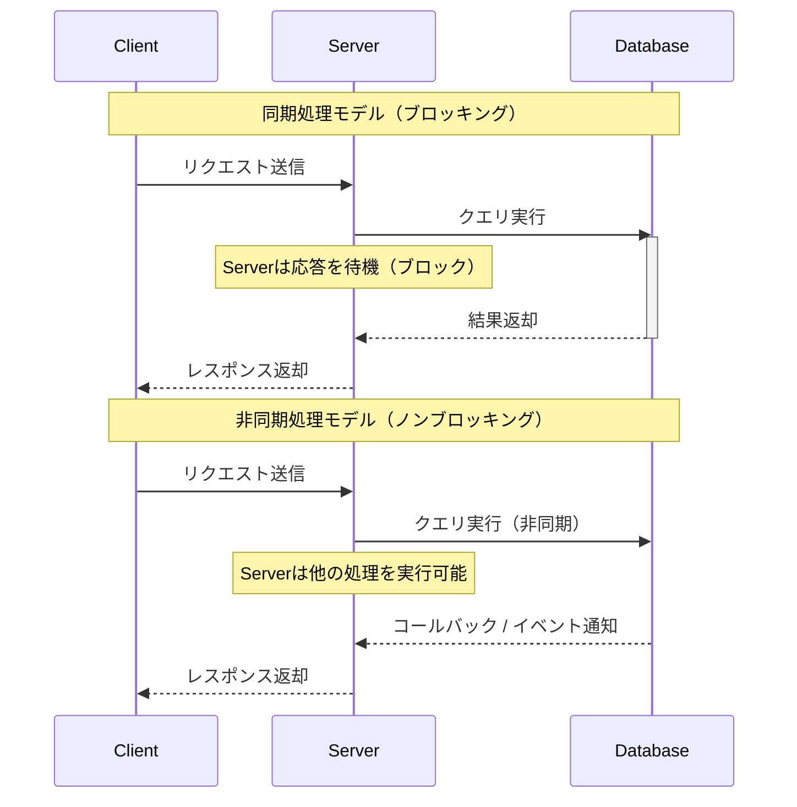
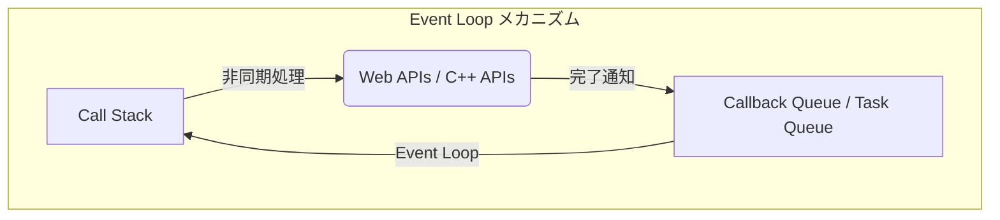
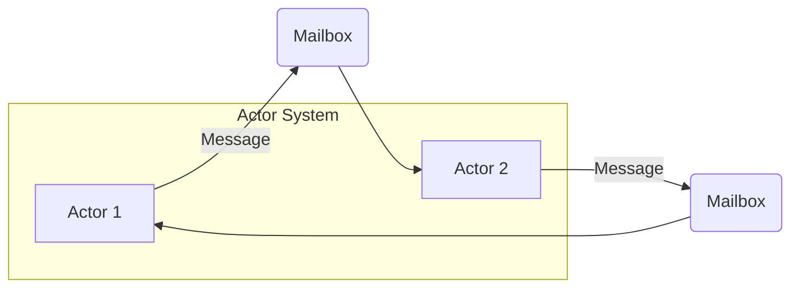
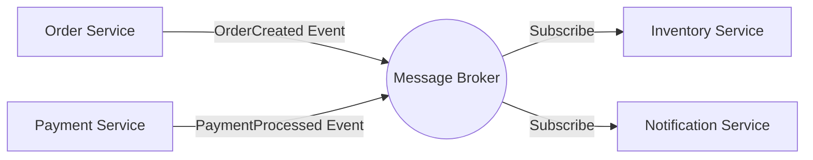

現代のソフトウェア開発において、システムのスケーラビリティと可用性を高めるためには、 **非同期処理** と **イベント駆動アーキテクチャ** （EDA: Event-Driven Architecture）の理解が不可欠です。本記事では、これらを支える中核的な概念である Event Loop、Actorモデル、そして CQRS（Command Query Responsibility Segregation）について、理論から実装、そしてアーキテクチャレベルの設計に至るまで深く掘り下げて解説します。

## 1. 非同期処理の基礎と課題

従来の同期処理モデルでは、あるタスクが完了するまで次のタスクはブロックされます。これはプログラミングモデルとしてはシンプルですが、I/O待ち（データベースアクセスやネットワークリクエストなど）の間にCPUリソースが無駄になるという欠点があります。

非同期処理は、このブロッキングを回避し、システムの **スループット** を劇的に向上させるための手法です。しかし、非同期処理を導入することで、状態の管理やエラーハンドリング、スレッド間の競合状態（Race Condition）といった新たな課題が生じます。

### 1.1 同期モデルと非同期モデルの比較



非同期モデルでは、待機時間を有効活用できるため、より多くのリクエストを同時に処理できます。この並行性を実現するためのアプローチとして、代表的なものが **Event Loop** と **Actorモデル** です。

---

## 2. Event Loop による非同期処理（Node.js / JavaScript）

Event Loopは、シングルスレッドでありながら高い並行性を実現するための仕組みです。Node.jsやブラウザ環境（JavaScript）で広く採用されています。

### 2.1 Event Loop のアーキテクチャ

Event Loopは、メインスレッド上で無限ループとして動作し、タスクキューに積まれたコールバック関数を順次実行します。時間のかかるI/O処理はOS側の非同期APIやワーカースレッド（スレッドプール）に委譲され、完了時にコールバックがキューに追加されます。



### 2.2 JavaScript での実装例

以下のコードは、JavaScriptにおける非同期処理（Promiseとasync/await）の典型的な例です。

```javascript
// ユーザー情報を非同期で取得するモック関数
const fetchUserData = async (userId) => {
  return new Promise((resolve, reject) => {
    setTimeout(() => {
      if (userId > 0) {
        resolve({ id: userId, name: "Alice", role: "Admin" });
      } else {
        reject(new Error("Invalid User ID"));
      }
    }, 1000); // 1秒のI/O待ちをシミュレート
  });
};

// メイン処理
const main = async () => {
  console.log("処理開始...");
  
  try {
    // 非同期処理の完了を待機（Event Loopによりブロックされない）
    const user = await fetchUserData(1);
    console.log("取得完了:", user);
  } catch (error) {
    console.error("エラー発生:", error.message);
  }
  
  console.log("処理終了");
};

main();
```

Event Loopの利点は、共有状態に対するロック管理が不要であることです。しかし、CPUバウンドな重い処理をCall Stackで実行してしまうと、Event Loop全体がブロックされ、システムが停止状態に陥るリスクがあります（Event Loopのブロッキング）。計算量は $ O(1) $ から $ O(N) $ の軽量な処理に留めるべきです。

---

## 3. Actorモデルとメッセージパッシング（[Rust](https://kenji.blog/p/webassembly-wasm-current-future/) / Erlang / Akka）

Event Loopがシングルスレッドの限界に挑むアプローチだとすれば、 **Actorモデル** はマルチスレッドや分散環境における並行処理を安全かつスケール可能にするためのパラダイムです。

### 3.1 Actorモデルの基本概念

Actorモデルでは、処理の基本単位を「Actor（アクター）」と呼びます。各Actorは独立した状態（[State](https://kenji.blog/p/iac-infrastructure-as-code-terraform/)）と振る舞い（Behavior）を持ち、他のActorとは直接状態を共有しません。Actor間のコミュニケーションは、すべて **非同期なメッセージパッシング** によって行われます。

- **状態のカプセル化**: Actor内部の状態は外部から直接アクセス不可。
- **メッセージキュー（Mailbox）**: 受信したメッセージはMailboxにキューイングされ、順次処理される。
- **ロックフリー**: 状態を共有しないため、ミューテックスなどのロック機構が不要。



### 3.2 [Rust](https://kenji.blog/p/webassembly-wasm-current-future/) を用いた Actor の実装例

システムプログラミング言語である Rust では、 `tokio` や `actix` といった強力な非同期クレートを用いてActorモデルを構築できます。ここでは、 `mpsc` （Multi-Producer, Single-Consumer）チャネルを用いたシンプルなActorパターンの実装を示します。

```rust
use std::sync::Arc;
use tokio::sync::{mpsc, oneshot};

// アクターに送信するメッセージの定義
enum ActorMessage {
    Increment {
        respond_to: oneshot::Sender<i32>,
    },
    GetCount {
        respond_to: oneshot::Sender<i32>,
    },
}

// アクターの構造体
struct CounterActor {
    receiver: mpsc::Receiver<ActorMessage>,
    count: i32,
}

impl CounterActor {
    fn new(receiver: mpsc::Receiver<ActorMessage>) -> Self {
        CounterActor { receiver, count: 0 }
    }

    // アクターのメインループ
    async fn run(&mut self) {
        // Mailboxからメッセージを順次受信
        while let Some(msg) = self.receiver.recv().await {
            match msg {
                ActorMessage::Increment { respond_to } => {
                    self.count += 1;
                    let _ = respond_to.send(self.count);
                }
                ActorMessage::GetCount { respond_to } => {
                    let _ = respond_to.send(self.count);
                }
            }
        }
    }
}

#[tokio::main]
async fn main() {
    // チャンネルの作成（容量100）
    let (tx, rx) = mpsc::channel(100);

    // アクターの起動
    let mut actor = CounterActor::new(rx);
    tokio::spawn(async move {
        actor.run().await;
    });

    // メッセージの送信と結果の受信
    let (resp_tx1, resp_rx1) = oneshot::channel();
    tx.send(ActorMessage::Increment { respond_to: resp_tx1 }).await.unwrap();
    println!("Count after increment: {}", resp_rx1.await.unwrap());

    let (resp_tx2, resp_rx2) = oneshot::channel();
    tx.send(ActorMessage::GetCount { respond_to: resp_tx2 }).await.unwrap();
    println!("Current count: {}", resp_rx2.await.unwrap());
}
```

[Rust](https://kenji.blog/p/webassembly-wasm-current-future/)における所有権（Ownership）と型システムは、Actor間のメッセージパッシングの安全性をコンパイル時に保証します。数式でシステムのスループット $ S $ を表すと、アクター数 $ N $ とメッセージ処理レート $ R $ に対して、理想的には $ S = N \times R $ となり、高いスケーラビリティを発揮します。

---

## 4. イベント駆動アーキテクチャ（EDA）の世界へ

非同期処理やActorモデルは、単一のアプリケーション内部での並行処理を最適化する手法です。これをシステム全体（マイクロサービス間など）に拡張した概念が **イベント駆動アーキテクチャ（EDA）** です。

EDAでは、システム内の状態変化を「イベント」として表現し、イベントバスやメッセージブローカー（Apache Kafka、RabbitMQ、AWS EventBridgeなど）を通じて非同期に配信します。

### 4.1 EDA の主要な構成要素

1. **Event Producer（イベントプロデューサー）**: イベントを生成し、ブローカーに送信するコンポーネント。
2. **Message Broker（メッセージブローカー）**: イベントをルーティングし、蓄積・配信する基盤。
3. **Event Consumer（イベントコンシューマー）**: イベントを受信し、非同期に処理を実行するコンポーネント。



このアーキテクチャの最大のメリットは **疎結合（Loose Coupling）** です。プロデューサーはコンシューマーの存在を意識する必要がなく、システムの一部がダウンしてもブローカーがイベントを保持するため、耐障害性（Resilience）が向上します。

---

## 5. CQRS とイベントソーシング

イベント駆動アーキテクチャを突き詰めると、データの書き込み（Command）と読み取り（Query）で求められる要件が大きく異なることに気づきます。これを解決するパターンが **CQRS（Command Query Responsibility Segregation: コマンドクエリ責務分離）** です。

### 5.1 CQRS のアーキテクチャ

CQRSでは、システムを「状態を変更するコマンドモデル」と「データを取得するクエリモデル」に物理的・論理的に分離します。

- **Command Model**: 複雑なビジネスロジックやバリデーションを担当し、データの整合性を担保する。
- **Query Model**: 読み取りに最適化された非正規化データ（Read Model）を提供し、高速なクエリレスポンスを実現する。

```mermaid
flowchart TD
    Client -->|Command (Write)| CommandAPI[Command Service]
    Client -->|Query (Read)| QueryAPI[Query Service]
    
    CommandAPI -->|Update| WriteDB[(Write DB)]
    WriteDB -->|Domain Events| EventBus((Event Bus))
    EventBus -->|Consume & Project| ProjectionWorker[Projection Worker]
    ProjectionWorker -->|Update| ReadDB[(Read DB)]
    ReadDB -->|Fetch| QueryAPI
```

### 5.2 イベントソーシング（Event Sourcing）との組み合わせ

CQRSは、 **イベントソーシング** と組み合わせることで真価を発揮します。
従来のデータベース設計では、エンティティの「現在の状態」のみを保存します。しかしイベントソーシングでは、「状態を変化させたイベントの履歴」をすべて保存（Append-only）し、それらを順次リプレイすることで現在の状態を復元します。

例えば、銀行口座の残高（現在の状態）は、以下のイベントの蓄積として表現できます。

$$ Balance = \sum_{i=1}^{n} (Deposit_i) - \sum_{j=1}^{m} (Withdrawal_j) $$

イベントソーシングの利点は以下の通りです。
- **完全な監査ログ**: 過去のあらゆる時点の状態を復元・検証可能。
- **時間遡行**: 過去のイベントをもとに、新たなQuery Model（Read DB）をゼロから構築可能。
- **書き込み性能の向上**: DBの更新（Update）ではなく、イベントの追記（Append）のみを行うため高速。

---

## 6. ユースケースとアーキテクチャの選択

これまで見てきた技術群は、それぞれ適したユースケースがあります。

1. **Event Loop (Node.js)**: 
   - I/Oバウンドな処理が多いAPIゲートウェイやリアルタイムチャットシステム。
   - 大量の同時接続をさばくWebSocketサーバー。
2. **Actor モデル ([Rust](https://kenji.blog/p/webassembly-wasm-current-future/) / Akka)**: 
   - 複雑な状態を持つ並行処理（ゲームサーバー、リアルタイムトラッキング）。
   - エラーからの自己修復能力（スーパーバイザーツリー）が求められる高可用性システム。
3. **CQRS / Event Sourcing**: 
   - 金融システム、eコマースの注文管理など、監査ログと高いスケーラビリティが必須のドメイン。
   - 読み取りと書き込みの負荷が非対称なシステム。

### 6.1 課題とベストプラクティス

イベント駆動・非同期アーキテクチャは強力ですが、 **結果整合性（Eventual Consistency）** の受け入れが必要です。データが即座に全システムに反映される（強い整合性）わけではないため、UI/UX側での工夫（例：楽観的UI更新）が求められます。

また、分散システムにおける **Idempotency（冪等性）** の担保も重要です。ネットワークの再送により同じイベントが複数回処理されても、結果が変わらないように設計しなければなりません。

---

## 7. まとめ

本記事では、イベント駆動アーキテクチャと非同期処理の深層について、以下の観点から解説しました。

- **Event Loop** によるシングルスレッド・ノンブロッキングI/Oのメカニズム。
- **Actorモデル** を用いた安全でスケーラブルなメッセージパッシング。
- **EDA** によるシステム間の疎結合化とスケーラビリティ。
- **CQRS と イベントソーシング** による複雑なドメインのモデリングと読み書きの最適化。

これらの技術は、現代のクラウドネイティブな分散システムを構築するための強力な武器となります。システムの特性やビジネス要件に合わせて、適切なパラダイムを選択・組み合わせることが、優れたアーキテクチャ設計への第一歩です。
