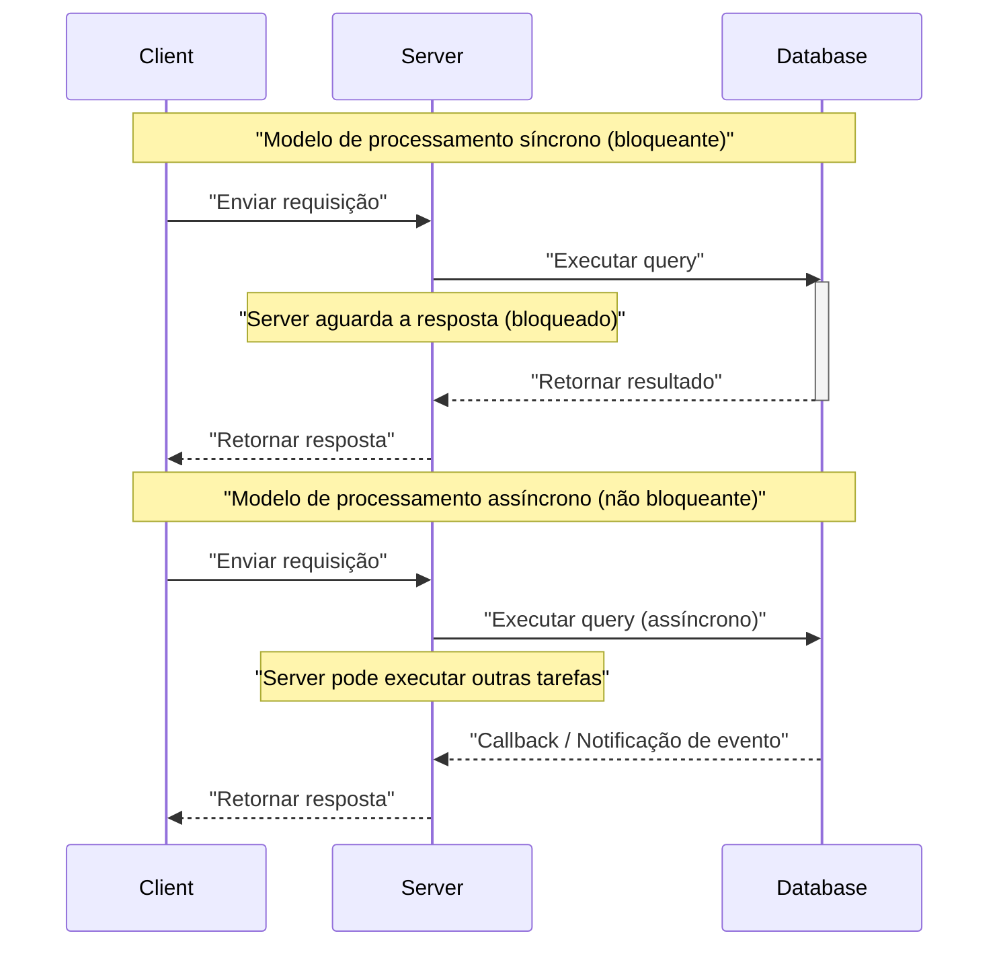
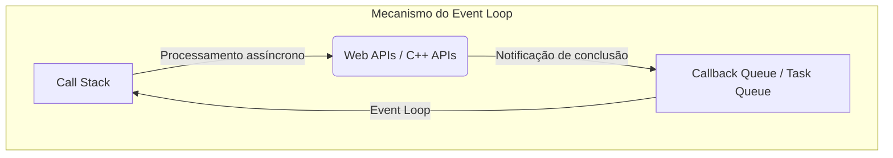
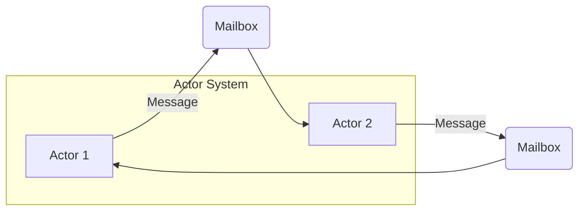
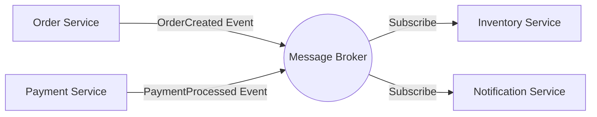
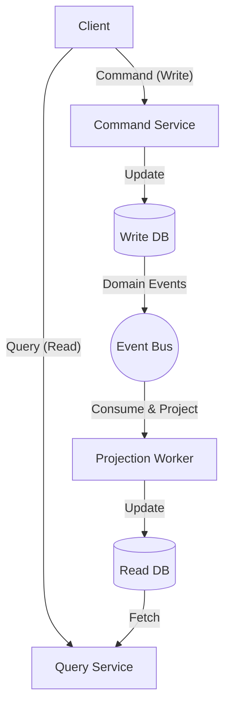

No desenvolvimento de software moderno, entender o **processamento assíncrono** e a **arquitetura orientada a eventos** (EDA: [Event-Driven](https://kenji.blog/pt/p/event-driven-architecture-message-queue-kafka-rabbitmq/) Architecture) é essencial para aumentar a escalabilidade e a disponibilidade do sistema. Neste artigo, vamos nos aprofundar nos conceitos centrais que sustentam essas abordagens: o Event Loop, o modelo de Atores e o CQRS (Command Query Responsibility Segregation), da teoria à implementação e ao design em nível de arquitetura.

## 1. Fundamentos e Desafios do Processamento Assíncrono

No modelo tradicional de processamento síncrono, a próxima tarefa é bloqueada até que a tarefa atual seja concluída. Embora seja simples como modelo de programação, tem a desvantagem de que os recursos da CPU são desperdiçados durante as esperas de I/O (como acessos a banco de dados e requisições de rede).

O processamento assíncrono é uma técnica para evitar esse bloqueio e melhorar drasticamente o **throughput** do sistema. No entanto, a introdução do processamento assíncrono cria novos desafios, como gerenciamento de estado, tratamento de erros e condições de corrida (Race Condition) entre as threads.

### 1.1 Comparação entre os Modelos Síncrono e Assíncrono



No modelo assíncrono, como o tempo de espera pode ser utilizado de forma eficaz, mais requisições podem ser processadas simultaneamente. As abordagens representativas para alcançar essa concorrência são o **Event Loop** e o **Modelo de Atores**.

---

## 2. Processamento Assíncrono com Event Loop (Node.js / JavaScript)

O Event Loop é um mecanismo para alcançar alta concorrência mesmo sendo single-thread. É amplamente adotado no Node.js e em ambientes de navegador (JavaScript).

### 2.1 Arquitetura do Event Loop

O Event Loop opera como um loop infinito na thread principal, executando sequencialmente as funções de callback colocadas na fila de tarefas (task queue). Operações de I/O demoradas são delegadas a APIs assíncronas do sistema operacional ou a worker threads (thread pool), e os callbacks são adicionados à fila na conclusão.



### 2.2 Exemplo de Implementação em JavaScript

O código a seguir é um exemplo típico de processamento assíncrono (Promise e async/await) em JavaScript.

```javascript
// Função mock para obter dados do usuário de forma assíncrona
const fetchUserData = async (userId) => {
  return new Promise((resolve, reject) => {
    setTimeout(() => {
      if (userId > 0) {
        resolve({ id: userId, name: "Alice", role: "Admin" });
      } else {
        reject(new Error("Invalid User ID"));
      }
    }, 1000); // Simula 1 segundo de espera de I/O
  });
};

// Processamento principal
const main = async () => {
  console.log("Iniciando processamento...");
  
  try {
    // Aguarda a conclusão do processamento assíncrono (não é bloqueado pelo Event Loop)
    const user = await fetchUserData(1);
    console.log("Obtenção concluída:", user);
  } catch (error) {
    console.error("Erro ocorrido:", error.message);
  }
  
  console.log("Processamento concluído");
};

main();
```

A vantagem do Event Loop é que o gerenciamento de locks para estados compartilhados é desnecessário. No entanto, se um processamento pesado com uso intensivo da CPU (CPU-bound) for executado no Call [Stack](https://kenji.blog/pt/p/c-language-pointers-memory-management-stack-heap/), todo o Event Loop será bloqueado e há o risco de o sistema parar (Bloqueio do Event Loop). O uso deve se restringir a processamentos leves cuja complexidade computacional seja de $ O(1) $ a $ O(N) $.

---

## 3. Modelo de Atores e Troca de Mensagens ([Rust](https://kenji.blog/pt/p/webassembly-wasm-current-future/) / Erlang / Akka)

Se o Event Loop é uma abordagem que desafia os limites de ser single-thread, o **modelo de Atores** (Actor Model) é um paradigma para tornar o processamento concorrente seguro e escalável em ambientes multithread e distribuídos.

### 3.1 Conceitos Básicos do Modelo de Atores

No modelo de Atores, a unidade básica de processamento é chamada de "Actor" (Ator). Cada Ator tem um estado independente ([State](https://kenji.blog/pt/p/iac-infrastructure-as-code-terraform/)) e comportamento (Behavior), e não compartilha estado diretamente com outros Atores. Toda a comunicação entre Atores é feita de forma assíncrona por **troca de mensagens** (Message Passing).

- **Encapsulamento de estado**: O estado interno do Ator não pode ser acessado diretamente do exterior.
- **Fila de mensagens (Mailbox)**: As mensagens recebidas são colocadas em fila no Mailbox e processadas sequencialmente.
- **Livre de locks ([Lock](https://kenji.blog/pt/p/rdbms-transaction-acid-isolation-level-lock/)-free)**: Como o estado não é compartilhado, mecanismos de lock, como mutexes, não são necessários.



### 3.2 Exemplo de Implementação de Atores usando [Rust](https://kenji.blog/pt/p/webassembly-wasm-current-future/)

Na linguagem de programação de sistemas [Rust](https://kenji.blog/pt/p/programming-languages-history-paradigm-evolution/), é possível construir o modelo de Atores usando crates assíncronos poderosos como `tokio` e `actix`. Aqui mostramos uma implementação de um padrão de Ator simples usando um canal `mpsc` (Multi-Producer, Single-Consumer).

```rust
use std::sync::Arc;
use tokio::sync::{mpsc, oneshot};

// Definição das mensagens enviadas ao Ator
enum ActorMessage {
    Increment {
        respond_to: oneshot::Sender<i32>,
    },
    GetCount {
        respond_to: oneshot::Sender<i32>,
    },
}

// Estrutura do Ator
struct CounterActor {
    receiver: mpsc::Receiver<ActorMessage>,
    count: i32,
}

impl CounterActor {
    fn new(receiver: mpsc::Receiver<ActorMessage>) -> Self {
        CounterActor { receiver, count: 0 }
    }

    // Loop principal do Ator
    async fn run(&mut self) {
        // Recebe mensagens do Mailbox sequencialmente
        while let Some(msg) = self.receiver.recv().await {
            match msg {
                ActorMessage::Increment { respond_to } => {
                    self.count += 1;
                    let _ = respond_to.send(self.count);
                }
                ActorMessage::GetCount { respond_to } => {
                    let _ = respond_to.send(self.count);
                }
            }
        }
    }
}

#[tokio::main]
async fn main() {
    // Criação do canal (capacidade de 100)
    let (tx, rx) = mpsc::channel(100);

    // Inicialização do Ator
    let mut actor = CounterActor::new(rx);
    tokio::spawn(async move {
        actor.run().await;
    });

    // Envio de mensagem e recebimento do resultado
    let (resp_tx1, resp_rx1) = oneshot::channel();
    tx.send(ActorMessage::Increment { respond_to: resp_tx1 }).await.unwrap();
    println!("Count after increment: {}", resp_rx1.await.unwrap());

    let (resp_tx2, resp_rx2) = oneshot::channel();
    tx.send(ActorMessage::GetCount { respond_to: resp_tx2 }).await.unwrap();
    println!("Current count: {}", resp_rx2.await.unwrap());
}
```

No [Rust](https://kenji.blog/pt/p/webassembly-wasm-current-future/), a posse (Ownership) e o sistema de tipos garantem a segurança da troca de mensagens entre Atores em tempo de compilação. Expressando o throughput do sistema $ S $ em fórmula, para o número de atores $ N $ e a taxa de processamento de mensagens $ R $, idealmente temos $ S = N \times R $, demonstrando alta escalabilidade.

---

## 4. Rumo ao Mundo da Arquitetura Orientada a Eventos (EDA)

Processamento assíncrono e modelo de Atores são técnicas para otimizar o processamento concorrente dentro de uma única aplicação. O conceito que expande isso para todo o sistema (como entre microsserviços) é a **Arquitetura Orientada a Eventos (EDA)**.

Na EDA, as mudanças de estado no sistema são expressas como "eventos" e distribuídas de forma assíncrona por meio de um barramento de eventos ou broker de mensagens (Apache [Kafka](https://kenji.blog/pt/p/event-driven-architecture-message-queue-kafka-rabbitmq/), [RabbitMQ](https://kenji.blog/pt/p/event-driven-architecture-message-queue-kafka-rabbitmq/), AWS EventBridge, etc.).

### 4.1 Principais Componentes da EDA

1. **Produtor de Eventos (Event Producer)**: O componente que gera e envia o evento ao broker.
2. **Broker de Mensagens (Message Broker)**: A infraestrutura que roteia, armazena e distribui os eventos.
3. **Consumidor de Eventos (Event Consumer)**: O componente que recebe o evento e executa o processamento de forma assíncrona.



A maior vantagem desta arquitetura é o **baixo acoplamento (Loose Coupling)**. O produtor não precisa estar ciente da existência do consumidor, e mesmo se parte do sistema cair, o broker retém os eventos, o que melhora a tolerância a falhas (Resilience).

---

## 5. CQRS e Event Sourcing

Aprofundando-se na arquitetura orientada a eventos, percebe-se que os requisitos exigidos para escrever dados (Command) e ler dados (Query) diferem significativamente. O padrão para resolver isso é o **CQRS (Command Query Responsibility Segregation: Segregação de Responsabilidade de Comando e Consulta)**.

### 5.1 Arquitetura do CQRS

No CQRS, o sistema é fisicamente e logicamente separado em um "modelo de comando que altera o estado" e um "modelo de consulta que obtém dados".

- **Command Model**: Responsável pela lógica de negócios complexa e validação, garantindo a integridade dos dados.
- **Query Model**: Fornece dados desnormalizados otimizados para leitura (Read Model), alcançando respostas rápidas nas consultas.



### 5.2 Combinação com Event Sourcing

O CQRS demonstra seu verdadeiro valor quando combinado com o **Event Sourcing** (Event Sourcing).
No design de banco de dados tradicional, apenas o "estado atual" da entidade é armazenado. No entanto, com Event Sourcing, todo o "histórico de eventos que alteraram o estado" é salvo (apenas adição, Append-only) e o estado atual é restaurado reproduzindo (replaying) esses eventos sequencialmente.

Por exemplo, o saldo de uma conta bancária (estado atual) pode ser expresso como o acúmulo dos seguintes eventos.

$ \text{Saldo} = \sum_{i=1}^{n} (\text{Depósito}_i) - \sum_{j=1}^{m} (\text{Saque}_j) $

As vantagens do Event Sourcing são as seguintes:
- **Log de auditoria completo**: O estado em qualquer ponto do passado pode ser restaurado e verificado.
- **Viagem no tempo**: Com base em eventos passados, é possível construir um novo Query Model (Read DB) do zero.
- **Melhoria no desempenho de escrita**: Rápido porque ele apenas anexa (Append) eventos, em vez de atualizar o DB (Update).

---

## 6. Casos de Uso e Escolha da Arquitetura

As tecnologias que vimos até agora têm casos de uso adequados para cada uma.

1. **Event Loop (Node.js)**: 
   - [API Gateway](https://kenji.blog/pt/p/microservices-architecture-bff-api-gateway/)s e sistemas de chat em tempo real com muito processamento I/O-bound.
   - Servidores WebSocket que lidam com um grande número de conexões simultâneas.
2. **Modelo de Atores ([Rust](https://kenji.blog/pt/p/webassembly-wasm-current-future/) / Akka)**: 
   - Processamento concorrente com estados complexos (servidores de jogos, rastreamento em tempo real).
   - Sistemas de alta disponibilidade que exigem capacidade de autocorreção de erros (supervisor trees).
3. **CQRS / Event Sourcing**: 
   - Domínios onde trilhas de auditoria e alta escalabilidade são essenciais, como sistemas financeiros e gerenciamento de pedidos de e-commerce.
   - Sistemas onde as cargas de leitura e escrita são assimétricas.

### 6.1 Desafios e Melhores Práticas

Embora as arquiteturas assíncronas e orientadas a eventos sejam poderosas, a aceitação da **consistência eventual (Eventual [Consistency](https://kenji.blog/pt/p/cap-theorem-distributed-systems-tradeoff/))** é necessária. Como os dados não se refletem instantaneamente em todo o sistema (consistência forte), são necessários ajustes no lado da UI/UX (ex: atualizações otimistas da UI).

Além disso, garantir a **Idempotência (Idempotency)** em sistemas distribuídos é importante. Mesmo que o mesmo evento seja processado várias vezes devido a retransmissões de rede, o design deve garantir que o resultado não mude.

---

## 7. Conclusão

Neste artigo, explicamos as profundezas da arquitetura orientada a eventos e do processamento assíncrono sob os seguintes pontos de vista:

- O mecanismo de I/O não bloqueante em single-thread usando o **Event Loop**.
- Troca de mensagens segura e escalável usando o **Modelo de Atores**.
- **EDA** para o baixo acoplamento e escalabilidade entre sistemas.
- Modelagem de domínios complexos e otimização de leitura e escrita usando **CQRS e Event Sourcing**.

Essas tecnologias são armas poderosas para construir os sistemas distribuídos nativos da nuvem (cloud-native) modernos. Escolher e combinar os paradigmas apropriados de acordo com as características do sistema e os requisitos de negócios é o primeiro passo em direção a um design de arquitetura excepcional.
