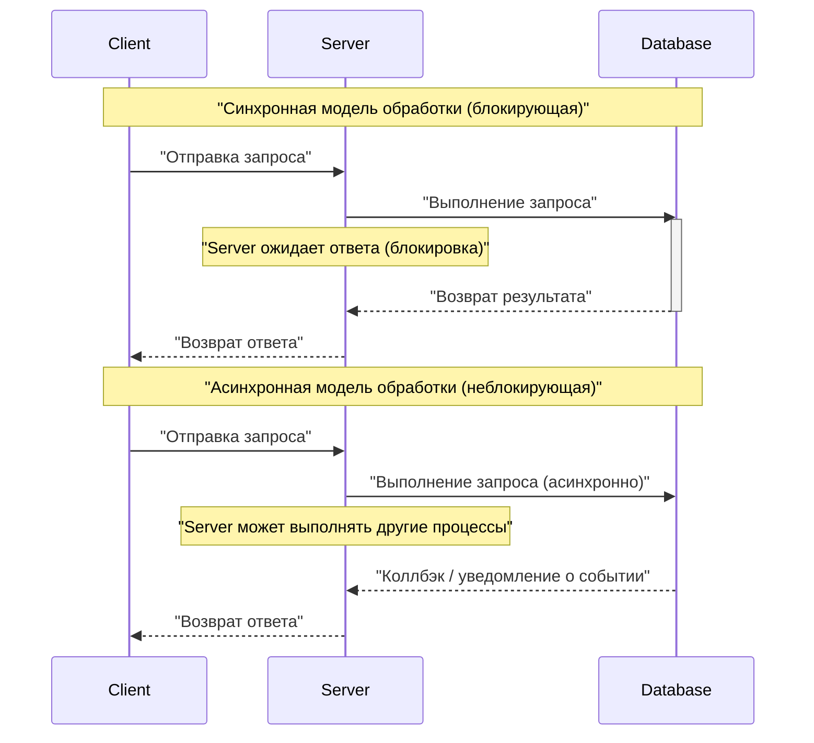
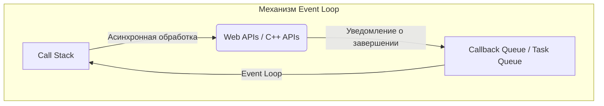
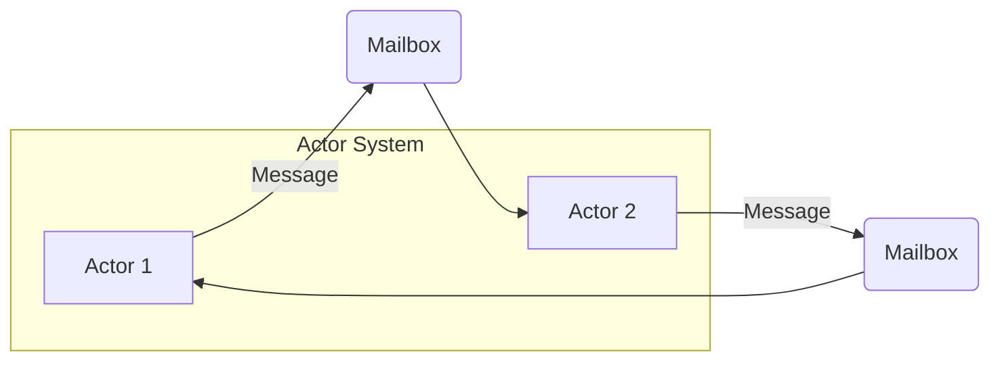
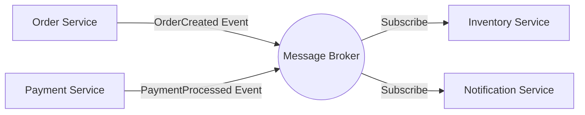
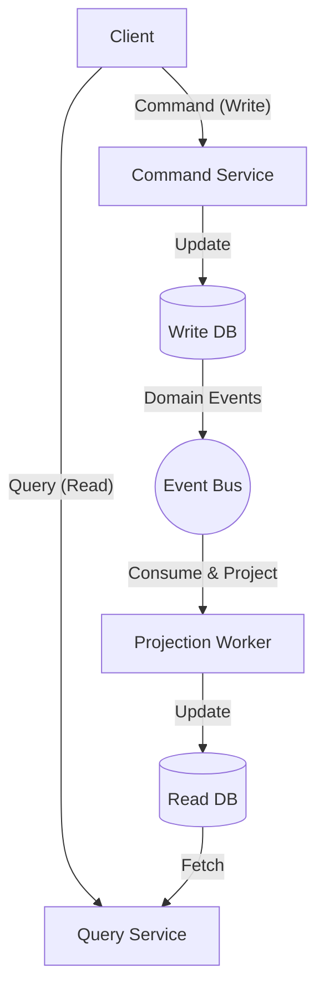

В современной разработке программного обеспечения для повышения масштабируемости и доступности систем необходимо понимание **асинхронной обработки** и **событийно-ориентированной архитектуры** (EDA: [Event-Driven](https://kenji.blog/ru/p/event-driven-architecture-message-queue-kafka-rabbitmq/) Architecture). В этой статье мы подробно рассмотрим ключевые концепции, лежащие в их основе: Event Loop, модель акторов и CQRS (Command Query Responsibility Segregation), от теории до реализации и проектирования на уровне архитектуры.

## 1. Основы и проблемы асинхронной обработки

В традиционной синхронной модели обработки следующая задача блокируется до завершения текущей. Это простая модель программирования, но её недостаток заключается в пустой трате ресурсов процессора во время ожидания ввода-вывода (например, доступа к базе данных или сетевых запросов).

Асинхронная обработка — это метод, позволяющий избежать этой блокировки и значительно повысить **пропускную способность** системы. Однако внедрение асинхронной обработки порождает новые проблемы, такие как управление состоянием, обработка ошибок и состояние гонки (Race Condition) между потоками.

### 1.1 Сравнение синхронной и асинхронной моделей



В асинхронной модели время ожидания можно использовать эффективно, что позволяет обрабатывать больше запросов одновременно. Популярными подходами для реализации такого параллелизма являются **Event Loop** и **модель акторов**.

---

## 2. Асинхронная обработка с помощью Event Loop (Node.js / JavaScript)

Event Loop — это механизм, обеспечивающий высокий уровень параллелизма при использовании одного потока. Он широко применяется в Node.js и браузерных средах (JavaScript).

### 2.1 Архитектура Event Loop

Event Loop работает как бесконечный цикл в главном потоке и последовательно выполняет функции обратного вызова, помещенные в очередь задач (task queue). Операции ввода-вывода, требующие времени, делегируются асинхронным API операционной системы или рабочим потокам (пулу потоков), а по завершении коллбэки добавляются в очередь.



### 2.2 Пример реализации на JavaScript

Следующий код представляет собой типичный пример асинхронной обработки (Promise и async/await) в JavaScript.

```javascript
// Мок-функция для асинхронного получения данных пользователя
const fetchUserData = async (userId) => {
  return new Promise((resolve, reject) => {
    setTimeout(() => {
      if (userId > 0) {
        resolve({ id: userId, name: "Alice", role: "Admin" });
      } else {
        reject(new Error("Invalid User ID"));
      }
    }, 1000); // Симуляция ожидания ввода-вывода (I/O) в 1 секунду
  });
};

// Главная функция
const main = async () => {
  console.log("Начало обработки...");
  
  try {
    // Ожидание завершения асинхронного процесса (не блокируется Event Loop)
    const user = await fetchUserData(1);
    console.log("Получение завершено:", user);
  } catch (error) {
    console.error("Произошла ошибка:", error.message);
  }
  
  console.log("Обработка завершена");
};

main();
```

Преимущество Event Loop заключается в отсутствии необходимости управления блокировками для разделяемого состояния. Однако, если выполнять ресурсоемкие (CPU-bound) задачи в Call [Stack](https://kenji.blog/ru/p/c-language-pointers-memory-management-stack-heap/), весь Event Loop будет заблокирован, и система может остановиться (блокировка Event Loop). Следует ограничиваться легкими задачами со сложностью от $ O(1) $ до $ O(N) $.

---

## 3. Модель акторов и передача сообщений ([Rust](https://kenji.blog/ru/p/webassembly-wasm-current-future/) / Erlang / Akka)

В то время как Event Loop — это подход, бросающий вызов ограничениям одного потока, **модель акторов** — это парадигма для обеспечения безопасной и масштабируемой параллельной обработки в многопоточных и распределенных средах.

### 3.1 Основные концепции модели акторов

В модели акторов базовой единицей обработки является "актор". Каждый актор имеет независимое состояние ([State](https://kenji.blog/ru/p/iac-infrastructure-as-code-terraform/)) и поведение (Behavior) и не разделяет свое состояние напрямую с другими акторами. Связь между акторами осуществляется исключительно посредством **асинхронной передачи сообщений**.

- **Инкапсуляция состояния**: Состояние внутри актора недоступно напрямую извне.
- **Очередь сообщений (Mailbox)**: Полученные сообщения помещаются в очередь в Mailbox и обрабатываются последовательно.
- **Отсутствие блокировок**: Поскольку состояние не разделяется, механизмы блокировки, такие как мьютексы, не требуются.



### 3.2 Пример реализации актора на [Rust](https://kenji.blog/ru/p/webassembly-wasm-current-future/)

В [Rust](https://kenji.blog/ru/p/programming-languages-history-paradigm-evolution/), языке системного программирования, можно создавать модели акторов с использованием мощных асинхронных крейтов, таких как `tokio` и `actix`. Здесь показана реализация простого паттерна актора с использованием канала `mpsc` (Multi-Producer, Single-Consumer).

```rust
use std::sync::Arc;
use tokio::sync::{mpsc, oneshot};

// Определение сообщений для отправки актору
enum ActorMessage {
    Increment {
        respond_to: oneshot::Sender<i32>,
    },
    GetCount {
        respond_to: oneshot::Sender<i32>,
    },
}

// Структура актора
struct CounterActor {
    receiver: mpsc::Receiver<ActorMessage>,
    count: i32,
}

impl CounterActor {
    fn new(receiver: mpsc::Receiver<ActorMessage>) -> Self {
        CounterActor { receiver, count: 0 }
    }

    // Главный цикл актора
    async fn run(&mut self) {
        // Последовательное получение сообщений из Mailbox
        while let Some(msg) = self.receiver.recv().await {
            match msg {
                ActorMessage::Increment { respond_to } => {
                    self.count += 1;
                    let _ = respond_to.send(self.count);
                }
                ActorMessage::GetCount { respond_to } => {
                    let _ = respond_to.send(self.count);
                }
            }
        }
    }
}

#[tokio::main]
async fn main() {
    // Создание канала (емкость 100)
    let (tx, rx) = mpsc::channel(100);

    // Запуск актора
    let mut actor = CounterActor::new(rx);
    tokio::spawn(async move {
        actor.run().await;
    });

    // Отправка сообщений и получение результатов
    let (resp_tx1, resp_rx1) = oneshot::channel();
    tx.send(ActorMessage::Increment { respond_to: resp_tx1 }).await.unwrap();
    println!("Count after increment: {}", resp_rx1.await.unwrap());

    let (resp_tx2, resp_rx2) = oneshot::channel();
    tx.send(ActorMessage::GetCount { respond_to: resp_tx2 }).await.unwrap();
    println!("Current count: {}", resp_rx2.await.unwrap());
}
```

Система владения (Ownership) и система типов в [Rust](https://kenji.blog/ru/p/webassembly-wasm-current-future/) гарантируют безопасность передачи сообщений между акторами на этапе компиляции. Если выразить пропускную способность системы $ S $ математически, то для $ N $ акторов и скорости обработки сообщений $ R $ в идеале $ S = N \times R $, что демонстрирует высокую масштабируемость.

---

## 4. В мир событийно-ориентированной архитектуры (EDA)

Асинхронная обработка и модель акторов — это методы оптимизации параллельной обработки внутри одного приложения. Концепция, расширяющая это на всю систему (например, между микросервисами), называется **событийно-ориентированной архитектурой (EDA)**.

В EDA изменения состояния внутри системы представляются как "события", которые асинхронно доставляются через шины событий или брокеры сообщений (Apache [Kafka](https://kenji.blog/ru/p/event-driven-architecture-message-queue-kafka-rabbitmq/), [RabbitMQ](https://kenji.blog/ru/p/event-driven-architecture-message-queue-kafka-rabbitmq/), AWS EventBridge и т.д.).

### 4.1 Основные компоненты EDA

1. **Event Producer (Производитель событий)**: Компонент, генерирующий события и отправляющий их брокеру.
2. **Message Broker (Брокер сообщений)**: Инфраструктура, маршрутизирующая, накапливающая и доставляющая события.
3. **Event Consumer (Потребитель событий)**: Компонент, получающий события и асинхронно выполняющий обработку.



Главным преимуществом этой архитектуры является **слабая связанность (Loose Coupling)**. Производителю не нужно знать о существовании потребителей, и даже если часть системы выйдет из строя, брокер сохранит события, что повышает отказоустойчивость (Resilience).

---

## 5. CQRS и Event Sourcing

При углублении в событийно-ориентированную архитектуру становится очевидным, что требования к записи данных (Command) и их чтению (Query) сильно различаются. Паттерн, решающий эту проблему, называется **CQRS (Command Query Responsibility Segregation: Разделение ответственности команд и запросов)**.

### 5.1 Архитектура CQRS

В CQRS система физически или логически разделяется на "модель команд для изменения состояния" и "модель запросов для получения данных".

- **Command Model**: Отвечает за сложную бизнес-логику и валидацию, обеспечивая целостность данных.
- **Query Model**: Предоставляет денормализованные данные (Read Model), оптимизированные для чтения, обеспечивая быстрый ответ на запросы.



### 5.2 Комбинация с Event Sourcing

CQRS раскрывает свой истинный потенциал в сочетании с **Event Sourcing (Событийным источником)**.
В традиционном проектировании баз данных сохраняется только "текущее состояние" сущности. Однако в Event Sourcing сохраняется вся история событий, изменивших состояние (Append-only), и текущее состояние восстанавливается путем их последовательного воспроизведения.

Например, баланс банковского счета (текущее состояние) может быть представлен как накопление следующих событий:

$ Balance = \sum_{i=1}^{n} (Deposit_i) - \sum_{j=1}^{m} (Withdrawal_j) $

Преимущества Event Sourcing включают в себя:
- **Полный журнал аудита**: Возможность восстановления и проверки состояния в любой момент времени в прошлом.
- **Путешествие во времени**: Возможность создания новых Query Model (Read DB) с нуля на основе прошлых событий.
- **Повышение производительности записи**: Так как выполняется только добавление событий (Append), а не обновление БД (Update), операции происходят очень быстро.

---

## 6. Примеры использования и выбор архитектуры

Рассмотренные технологии подходят для различных сценариев использования.

1. **Event Loop (Node.js)**: 
   - API-шлюзы и системы чатов в реальном времени с большим количеством операций ввода-вывода.
   - WebSocket-серверы, обрабатывающие огромное количество одновременных подключений.
2. **Модель акторов ([Rust](https://kenji.blog/ru/p/webassembly-wasm-current-future/) / Akka)**: 
   - Параллельная обработка со сложным состоянием (игровые серверы, отслеживание в реальном времени).
   - Системы высокой доступности, требующие способности к самовосстановлению после ошибок (деревья супервизоров).
3. **CQRS / Event Sourcing**: 
   - Финансовые системы, управление заказами в электронной коммерции и другие домены, где обязательны журналы аудита и высокая масштабируемость.
   - Системы с асимметричной нагрузкой на чтение и запись.

### 6.1 Проблемы и лучшие практики

Событийно-ориентированные и асинхронные архитектуры мощны, но требуют принятия концепции **согласованности в конечном счете (Eventual [Consistency](https://kenji.blog/ru/p/cap-theorem-distributed-systems-tradeoff/))**. Поскольку данные не отражаются во всех системах мгновенно (сильная согласованность), необходимы решения на стороне UI/UX (например, оптимистичное обновление пользовательского интерфейса).

Также важно обеспечить **идемпотентность (Idempotency)** в распределенных системах. Архитектура должна быть спроектирована таким образом, чтобы результат не менялся, даже если одно и то же событие обрабатывается несколько раз из-за повторных передач по сети.

---

## 7. Заключение

В этой статье мы подробно рассмотрели событийно-ориентированную архитектуру и асинхронную обработку с следующих позиций:

- Механизм однопоточного неблокирующего ввода-вывода с использованием **Event Loop**.
- Безопасная и масштабируемая передача сообщений с помощью **модели акторов**.
- Слабая связанность и масштабируемость между системами благодаря **EDA**.
- Моделирование сложных доменов и оптимизация чтения/записи с помощью **CQRS и Event Sourcing**.

Эти технологии являются мощным оружием для создания современных облачных распределенных систем (Cloud-Native). Выбор и комбинирование подходящих парадигм в соответствии с характеристиками системы и бизнес-требованиями — это первый шаг к разработке выдающейся архитектуры.
