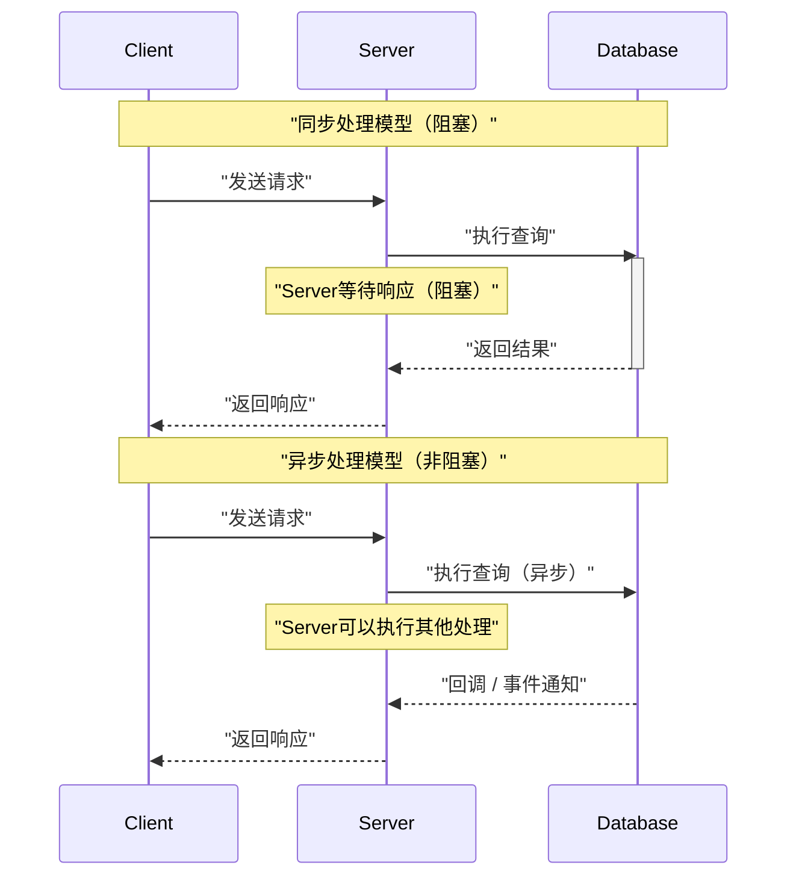
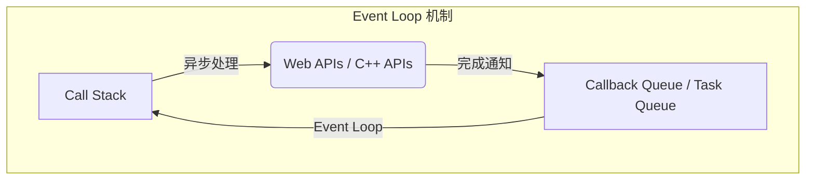
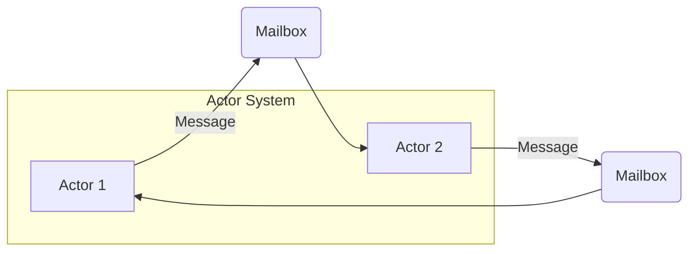
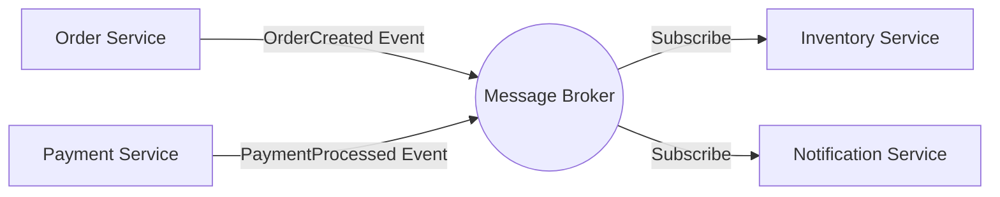
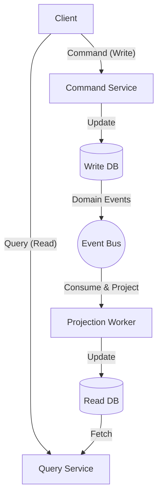

在现代软件开发中，为了提高系统的可扩展性和可用性，理解 **异步处理** 和 **事件驱动架构** （EDA: Event-Driven Architecture）是不可或缺的。本文将从支撑这些核心概念的 Event Loop、Actor模型以及 CQRS（Command Query Responsibility Segregation）出发，深入探讨从理论到实现，再到架构级别的设计。

## 1. 异步处理的基础与挑战

在传统的同步处理模型中，一个任务完成之前，下一个任务会被阻塞。虽然作为编程模型来说这很简单，但在等待 I/O（如数据库访问或网络请求）期间，CPU 资源会被浪费，这是它的缺点。

异步处理是为了避免这种阻塞，从而极大地提高系统 **吞吐量** 的一种方法。然而，引入异步处理也会带来状态管理、错误处理以及线程间的竞争条件（Race Condition）等新挑战。

### 1.1 同步模型与异步模型的比较



异步模型可以有效利用等待时间，因此能够同时处理更多请求。作为实现这种并发性的方法，最具代表性的是 **Event Loop** 和 **Actor模型** 。

---

## 2. 基于 Event Loop 的异步处理（Node.js / JavaScript）

Event Loop 是在单线程下实现高并发性的机制。在 Node.js 和浏览器环境（JavaScript）中被广泛采用。

### 2.1 Event Loop 的架构

Event Loop 在主线程上作为无限循环运行，依次执行积压在任务队列中的回调函数。耗时的 I/O 处理会被委托给操作系统的异步 API 或工作线程（线程池），完成时将回调添加到队列中。



### 2.2 JavaScript 中的实现示例

以下代码是 JavaScript 中异步处理（Promise 与 async/await）的典型示例。

```javascript
// 异步获取用户信息的模拟函数
const fetchUserData = async (userId) => {
  return new Promise((resolve, reject) => {
    setTimeout(() => {
      if (userId > 0) {
        resolve({ id: userId, name: "Alice", role: "Admin" });
      } else {
        reject(new Error("Invalid User ID"));
      }
    }, 1000); // 模拟1秒的 I/O 等待
  });
};

// 主处理
const main = async () => {
  console.log("处理开始...");
  
  try {
    // 等待异步处理完成（不会被 Event Loop 阻塞）
    const user = await fetchUserData(1);
    console.log("获取完成:", user);
  } catch (error) {
    console.error("发生错误:", error.message);
  }
  
  console.log("处理结束");
};

main();
```

Event Loop 的优势在于无需对共享状态进行锁管理。然而，如果在 Call Stack 中执行计算密集型（CPU Bound）的繁重任务，就会阻塞整个 Event Loop，导致系统陷入停滞状态（Event Loop 阻塞）。计算复杂度应保持在 $ O(1) $ 到 $ O(N) $ 的轻量级处理。

---

## 3. Actor模型与消息传递（Rust / Erlang / Akka）

如果说 Event Loop 是挑战单线程极限的方法，那么 **Actor模型** 则是在多线程和分布式环境中，让并发处理变得安全且可扩展的范式。

### 3.1 Actor模型的基本概念

在 Actor模型中，处理的基本单位被称为“Actor（参与者）”。每个 Actor 拥有独立的状态（State）和行为（Behavior），不与其他 Actor 直接共享状态。Actor 之间的通信全部通过 **异步的消息传递** 来进行。

- **状态封装**: 外部无法直接访问 Actor 内部的状态。
- **消息队列（Mailbox）**: 接收到的消息会在 Mailbox 中排队，并被依次处理。
- **无锁化（Lock-free）**: 因为不共享状态，所以不需要互斥锁（Mutex）等锁机制。



### 3.2 使用 Rust 的 Actor 实现示例

在系统编程语言 Rust 中，可以使用 `tokio` 和 `actix` 等强大的异步 Crate 来构建 Actor 模型。这里展示一个使用 `mpsc`（多生产者，单消费者）通道的简单 Actor 模式实现。

```rust
use std::sync::Arc;
use tokio::sync::{mpsc, oneshot};

// 定义发送给 Actor 的消息
enum ActorMessage {
    Increment {
        respond_to: oneshot::Sender<i32>,
    },
    GetCount {
        respond_to: oneshot::Sender<i32>,
    },
}

// Actor 的结构体
struct CounterActor {
    receiver: mpsc::Receiver<ActorMessage>,
    count: i32,
}

impl CounterActor {
    fn new(receiver: mpsc::Receiver<ActorMessage>) -> Self {
        CounterActor { receiver, count: 0 }
    }

    // Actor 的主循环
    async fn run(&mut self) {
        // 依次从 Mailbox 接收消息
        while let Some(msg) = self.receiver.recv().await {
            match msg {
                ActorMessage::Increment { respond_to } => {
                    self.count += 1;
                    let _ = respond_to.send(self.count);
                }
                ActorMessage::GetCount { respond_to } => {
                    let _ = respond_to.send(self.count);
                }
            }
        }
    }
}

#[tokio::main]
async fn main() {
    // 创建通道（容量100）
    let (tx, rx) = mpsc::channel(100);

    // 启动 Actor
    let mut actor = CounterActor::new(rx);
    tokio::spawn(async move {
        actor.run().await;
    });

    // 发送消息并接收结果
    let (resp_tx1, resp_rx1) = oneshot::channel();
    tx.send(ActorMessage::Increment { respond_to: resp_tx1 }).await.unwrap();
    println!("Count after increment: {}", resp_rx1.await.unwrap());

    let (resp_tx2, resp_rx2) = oneshot::channel();
    tx.send(ActorMessage::GetCount { respond_to: resp_tx2 }).await.unwrap();
    println!("Current count: {}", resp_rx2.await.unwrap());
}
```

Rust 中的所有权（Ownership）和类型系统在编译时就保证了 Actor 之间消息传递的安全性。用数学公式表示系统吞吐量 $ S $，对于 Actor 数量 $ N $ 和消息处理速率 $ R $，理想情况下 $ S = N \times R $，这展现了极高的可扩展性。

---

## 4. 进入事件驱动架构（EDA）的世界

异步处理和 Actor模型是优化单个应用程序内部并发处理的方法。将这些扩展到整个系统（如微服务之间）的概念就是 **事件驱动架构（EDA）** 。

在 EDA 中，系统内的状态变化被表示为“事件”，并通过事件总线或消息代理（如 Apache Kafka、RabbitMQ、AWS EventBridge 等）异步分发。

### 4.1 EDA 的主要组件

1. **Event Producer（事件生产者）**: 生成事件并发送给代理的组件。
2. **Message Broker（消息代理）**: 负责路由、存储和分发事件的基础设施。
3. **Event Consumer（事件消费者）**: 接收事件并异步执行处理的组件。



这种架构最大的优势是 **松耦合（Loose Coupling）** 。生产者不需要意识到消费者的存在，即使系统的一部分宕机，代理也会保留事件，从而提高了容错性（Resilience）。

---

## 5. CQRS 与事件溯源

当将事件驱动架构发挥到极致时，我们会发现数据写入（Command）和读取（Query）所需的要求有着巨大差异。解决这一模式的是 **CQRS（Command Query Responsibility Segregation: 命令查询职责分离）** 。

### 5.1 CQRS 的架构

在 CQRS 中，系统在物理或逻辑上被划分为“改变状态的命令模型”和“获取数据的查询模型”。

- **Command Model**: 负责复杂的业务逻辑和验证，保证数据的完整性。
- **Query Model**: 提供针对读取优化的非规范化数据（Read Model），实现高速的查询响应。



### 5.2 结合事件溯源（Event Sourcing）

CQRS 与 **事件溯源** 结合时能发挥其真正的价值。
传统的数据库设计仅保存实体的“当前状态”。而在事件溯源中，会保存（Append-only）所有“导致状态发生变化的事件的历史”，并通过依次重放它们来恢复当前状态。

例如，银行账户的余额（当前状态）可以表示为以下事件的累积：

$ Balance = \sum_{i=1}^{n} (Deposit_i) - \sum_{j=1}^{m} (Withdrawal_j) $

事件溯源的优点如下：
- **完整的审计日志**: 能够恢复并验证过去任何时间点的状态。
- **时间穿梭**: 可以基于过去的事件，从零开始构建新的 Query Model（Read DB）。
- **提升写入性能**: 不是去更新（Update）数据库，而是仅追加（Append）事件，因此速度很快。

---

## 6. 用例与架构选择

我们目前探讨的各种技术，都有其适用的场景。

1. **Event Loop (Node.js)**: 
   - 存在大量 I/O 密集型处理的 API 网关或实时聊天系统。
   - 处理海量并发连接的 WebSocket 服务器。
2. **Actor模型 (Rust / Akka)**: 
   - 具有复杂状态的并发处理（游戏服务器、实时追踪）。
   - 需要从错误中自我修复（监督者树）的高可用性系统。
3. **CQRS / Event Sourcing**: 
   - 金融系统、电子商务的订单管理等对审计日志和高可扩展性有强制要求的领域。
   - 读写负载不对称的系统。

### 6.1 挑战与最佳实践

事件驱动和异步架构虽然强大，但必须要接受 **最终一致性（Eventual Consistency）** 。由于数据不会立刻反映到所有系统中（非强一致性），因此需要在 UI/UX 层面上进行巧思（例如：乐观 UI 更新）。

此外，保证分布式系统中的 **幂等性（Idempotency）** 也很重要。必须设计成即使由于网络重传导致同一事件被处理多次，结果也不会发生改变。

---

## 7. 总结

本文从以下角度深入探讨了事件驱动架构与异步处理：

- 基于 **Event Loop** 的单线程、非阻塞 I/O 机制。
- 使用 **Actor模型** 的安全且可扩展的消息传递。
- 基于 **EDA** 的系统间松耦合与可扩展性。
- 通过 **CQRS 和事件溯源** 优化复杂领域的建模与读写操作。

这些技术是我们构建现代云原生分布式系统的强大武器。根据系统的特性和业务需求，选择并组合合适的范式，是迈向优秀架构设计的第一步。
