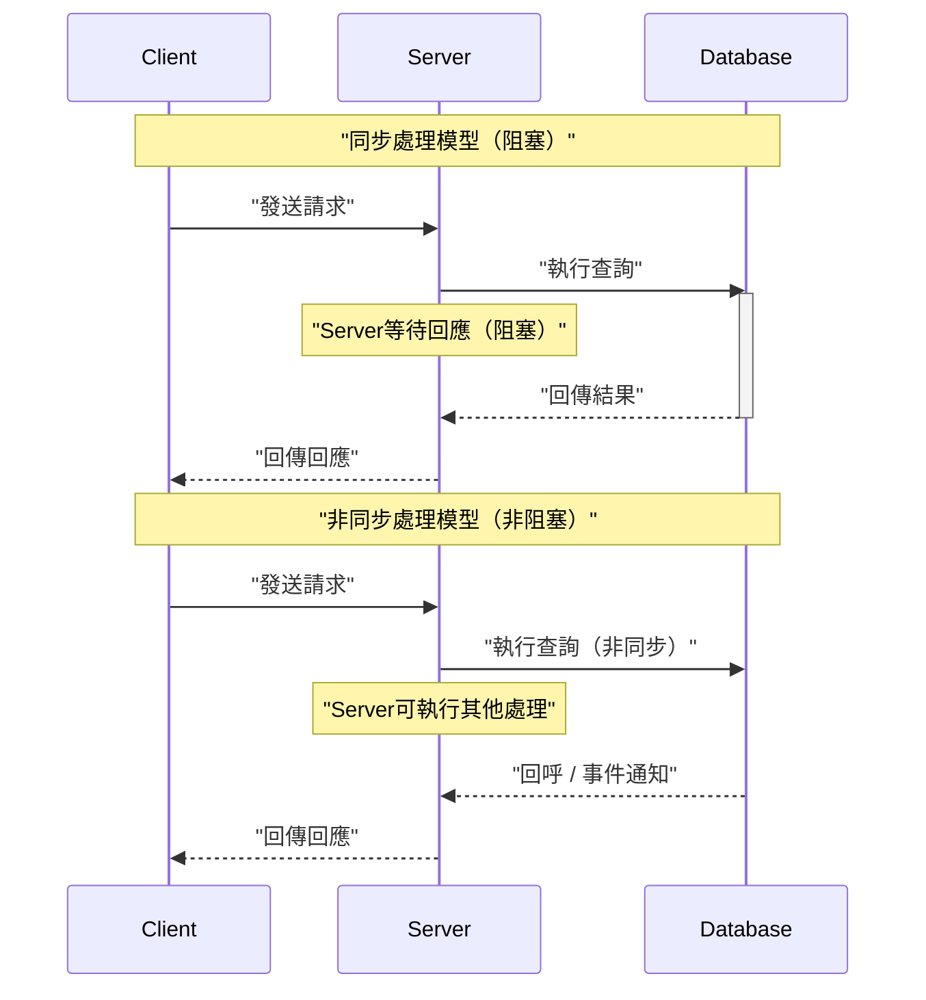
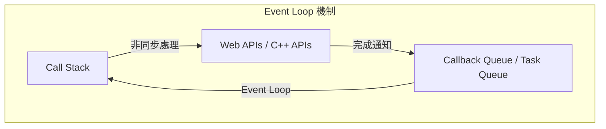
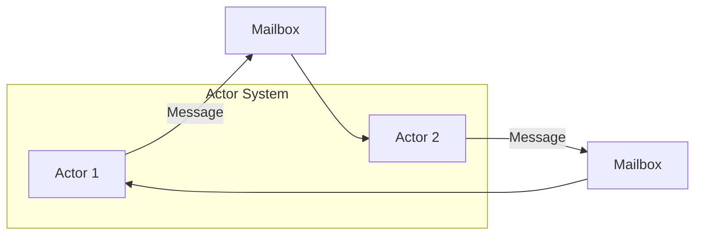
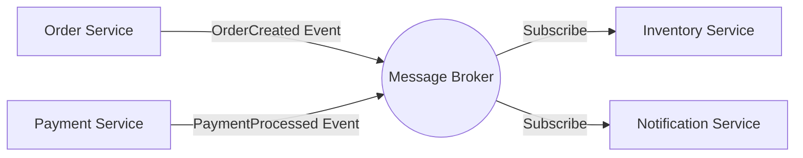
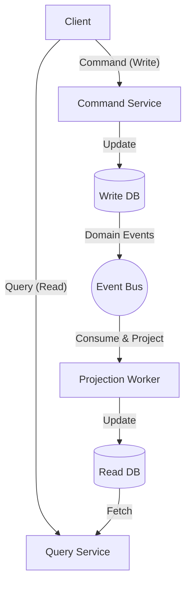

在現代的軟體開發中，為了提升系統的擴展性與可用性，理解 **非同步處理** 與 **事件驅動架構** （EDA: Event-Driven Architecture）是不可或缺的。本文將從支撐這些核心概念的 Event Loop、Actor模型，以及 CQRS（Command Query Responsibility Segregation）開始，從理論、實作到架構層級的設計進行深入探討。

## 1. 非同步處理的基礎與挑戰

在傳統的同步處理模型中，直到某個任務完成之前，下一個任務都會被阻塞。這作為一種程式設計模型雖然很簡單，但在等待 I/O（如資料庫存取或網路請求等）的期間，CPU 資源會被白白浪費，這是一大缺點。

非同步處理是為了避免這種阻塞，並大幅提升系統 **吞吐量** （throughput）的一種手法。然而，導入非同步處理也會帶來狀態管理、錯誤處理以及執行緒之間的競爭危害（Race Condition）等新挑戰。

### 1.1 同步模型與非同步模型的比較



在非同步模型中，因為能有效利用等待時間，所以可以同時處理更多的請求。為了實現這種並行性，最具代表性的方法就是 **Event Loop** 與 **Actor模型** 。

---

## 2. 透過 Event Loop 進行非同步處理（Node.js / JavaScript）

Event Loop 是一種在單一執行緒下實現高並行性的機制。它被廣泛應用於 Node.js 與瀏覽器環境（JavaScript）中。

### 2.1 Event Loop 的架構

Event Loop 在主執行緒上作為一個無限迴圈運作，會依序執行堆疊在任務佇列中的回呼函式。耗時的 I/O 處理會被委託給 OS 端的非同步 API 或工作執行緒（執行緒池），並在完成時將回呼加入佇列中。



### 2.2 JavaScript 的實作範例

以下程式碼是 JavaScript 中非同步處理（Promise 與 async/await）的典型範例。

```javascript
// 非同步取得使用者資訊的模擬函式
const fetchUserData = async (userId) => {
  return new Promise((resolve, reject) => {
    setTimeout(() => {
      if (userId > 0) {
        resolve({ id: userId, name: "Alice", role: "Admin" });
      } else {
        reject(new Error("Invalid User ID"));
      }
    }, 1000); // 模擬1秒的 I/O 等待
  });
};

// 主處理
const main = async () => {
  console.log("處理開始...");
  
  try {
    // 等待非同步處理完成（不會被 Event Loop 阻塞）
    const user = await fetchUserData(1);
    console.log("取得完成:", user);
  } catch (error) {
    console.error("發生錯誤:", error.message);
  }
  
  console.log("處理結束");
};

main();
```

Event Loop 的優點在於不需要對共用狀態進行鎖定管理。但是，如果在 Call Stack 中執行 CPU 密集型的繁重處理，會導致整個 Event Loop 被阻塞，系統有可能陷入停滯狀態（Event Loop 的阻塞）。因此計算複雜度應該保持在 $ O(1) $ 到 $ O(N) $ 的輕量級處理。

---

## 3. Actor 模型與訊息傳遞（Rust / Erlang / Akka）

如果說 Event Loop 是挑戰單一執行緒極限的方法，那麼 **Actor模型** 就是為了在多執行緒或分散式環境中，安全且具備擴展性地實現並行處理的一種典範。

### 3.1 Actor 模型的基本概念

在 Actor 模型中，處理的基本單位稱為「Actor」。每個 Actor 擁有獨立的狀態（State）與行為（Behavior），並且不會直接與其他 Actor 共用狀態。Actor 之間的溝通完全透過 **非同步的訊息傳遞** 來進行。

- **狀態的封裝**: Actor 內部的狀態無法從外部直接存取。
- **訊息佇列（Mailbox）**: 接收到的訊息會被放入 Mailbox 佇列中，並依序進行處理。
- **無鎖（Lock-free）**: 因為不共用狀態，所以不需要 Mutex 等鎖定機制。



### 3.2 使用 Rust 的 Actor 實作範例

在系統程式語言 Rust 中，可以使用 `tokio` 或 `actix` 等強大的非同步 Crate 來建構 Actor 模型。這裡展示一個使用 `mpsc` （Multi-Producer, Single-Consumer）通道的簡單 Actor 模式實作。

```rust
use std::sync::Arc;
use tokio::sync::{mpsc, oneshot};

// 定義發送給 Actor 的訊息
enum ActorMessage {
    Increment {
        respond_to: oneshot::Sender<i32>,
    },
    GetCount {
        respond_to: oneshot::Sender<i32>,
    },
}

// Actor 的結構體
struct CounterActor {
    receiver: mpsc::Receiver<ActorMessage>,
    count: i32,
}

impl CounterActor {
    fn new(receiver: mpsc::Receiver<ActorMessage>) -> Self {
        CounterActor { receiver, count: 0 }
    }

    // Actor 的主迴圈
    async fn run(&mut self) {
        // 依序從 Mailbox 接收訊息
        while let Some(msg) = self.receiver.recv().await {
            match msg {
                ActorMessage::Increment { respond_to } => {
                    self.count += 1;
                    let _ = respond_to.send(self.count);
                }
                ActorMessage::GetCount { respond_to } => {
                    let _ = respond_to.send(self.count);
                }
            }
        }
    }
}

#[tokio::main]
async fn main() {
    // 建立通道（容量100）
    let (tx, rx) = mpsc::channel(100);

    // 啟動 Actor
    let mut actor = CounterActor::new(rx);
    tokio::spawn(async move {
        actor.run().await;
    });

    // 發送訊息與接收結果
    let (resp_tx1, resp_rx1) = oneshot::channel();
    tx.send(ActorMessage::Increment { respond_to: resp_tx1 }).await.unwrap();
    println!("遞增後的計數: {}", resp_rx1.await.unwrap());

    let (resp_tx2, resp_rx2) = oneshot::channel();
    tx.send(ActorMessage::GetCount { respond_to: resp_tx2 }).await.unwrap();
    println!("目前的計數: {}", resp_rx2.await.unwrap());
}
```

Rust 中的所有權（Ownership）與型別系統，會在編譯時保證 Actor 之間訊息傳遞的安全性。如果用數學公式來表示系統的吞吐量 $ S $ ，對於 Actor 數量 $ N $ 與訊息處理速率 $ R $ ，理想情況下 $ S = N \times R $ ，展現出高度的擴展性。

---

## 4. 邁向事件驅動架構（EDA）的世界

非同步處理與 Actor 模型，是最佳化單一應用程式內部並行處理的方法。將這個概念擴展到整個系統（例如微服務之間）的就是 **事件驅動架構（EDA）** 。

在 EDA 中，系統內的狀態變化會被表示為「事件」，並透過事件匯流排或訊息代理程式（如 Apache Kafka、RabbitMQ、AWS EventBridge 等）進行非同步派發。

### 4.1 EDA 的主要構成要素

1. **Event Producer（事件生產者）**: 產生事件並發送給代理程式的元件。
2. **Message Broker（訊息代理程式）**: 負責路由、儲存與派發事件的基礎設施。
3. **Event Consumer（事件消費者）**: 接收事件並非同步執行處理的元件。



這種架構最大的優點在於 **鬆散耦合（Loose Coupling）** 。生產者不需要意識到消費者的存在，即使系統的某一部分停機，因為代理程式會保留事件，所以系統的容錯性（Resilience）也會隨之提升。

---

## 5. CQRS 與事件溯源（Event Sourcing）

當我們將事件驅動架構推向極致時，會發現寫入資料（Command）與讀取資料（Query）所面臨的需求有著巨大的差異。為了解決這個問題，就出現了 **CQRS（Command Query Responsibility Segregation: 命令查詢職責分離）** 模式。

### 5.1 CQRS 的架構

在 CQRS 中，系統會在實體與邏輯上分離為「改變狀態的命令模型」與「取得資料的查詢模型」。

- **Command Model**: 負責複雜的商業邏輯與驗證，以確保資料的一致性。
- **Query Model**: 提供為讀取而最佳化的非正規化資料（Read Model），實現高速的查詢回應。



### 5.2 與事件溯源（Event Sourcing）的結合

CQRS 在結合 **事件溯源（Event Sourcing）** 後，更能發揮其真正的價值。
在傳統的資料庫設計中，只會儲存實體的「當前狀態」。然而在事件溯源中，會將「改變狀態的所有事件歷史紀錄」保存下來（Append-only），並透過依序重播這些事件來還原當前的狀態。

例如，銀行帳戶的餘額（當前狀態），可以表示為以下事件的累積：

$ Balance = \sum_{i=1}^{n} (Deposit_i) - \sum_{j=1}^{m} (Withdrawal_j) $

事件溯源的優點如下：
- **完整的稽核日誌**: 可以還原並驗證過去任意時間點的狀態。
- **時間回溯**: 可以基於過去的事件，從零開始建構新的 Query Model（Read DB）。
- **寫入效能的提升**: 因為只進行事件的附加（Append），而不進行 DB 的更新（Update），所以速度很快。

---

## 6. 使用案例與架構的選擇

我們目前為止所看到的技術群，各自都有適合的使用案例。

1. **Event Loop (Node.js)**: 
   - 包含大量 I/O 密集型處理的 API 閘道器或即時聊天系統。
   - 需要處理大量同時連線的 WebSocket 伺服器。
2. **Actor 模型 (Rust / Akka)**: 
   - 帶有複雜狀態的並行處理（遊戲伺服器、即時追蹤）。
   - 需要具備錯誤自我修復能力（Supervisor Tree）的高可用性系統。
3. **CQRS / Event Sourcing**: 
   - 金融系統、電子商務的訂單管理等，必須具備稽核日誌與高擴展性的領域。
   - 讀寫負載不對稱的系統。

### 6.1 挑戰與最佳實務

事件驅動與非同步架構雖然強大，但也必須接受 **最終一致性（Eventual Consistency）** 。因為資料並不會立即反映在整個系統中（強一致性），所以需要在 UI/UX 方面下功夫（例如：樂觀的 UI 更新）。

此外，在分散式系統中確保 **冪等性（Idempotency）** 也是非常重要的。必須確保即使因為網路重傳而導致相同的事件被處理多次，結果也不會改變。

---

## 7. 總結

本文從以下幾個角度，深入探討了事件驅動架構與非同步處理：

- 透過 **Event Loop** 實現單一執行緒、非阻塞 I/O 的機制。
- 使用 **Actor模型** 進行安全且可擴展的訊息傳遞。
- 透過 **EDA** 實現系統間的鬆散耦合與擴展性。
- 利用 **CQRS 與 事件溯源** 進行複雜領域的塑模與讀寫最佳化。

這些技術是建構現代雲端原生分散式系統的強大武器。配合系統的特性與商業需求，選擇並組合適當的典範，是邁向優良架構設計的第一步。
