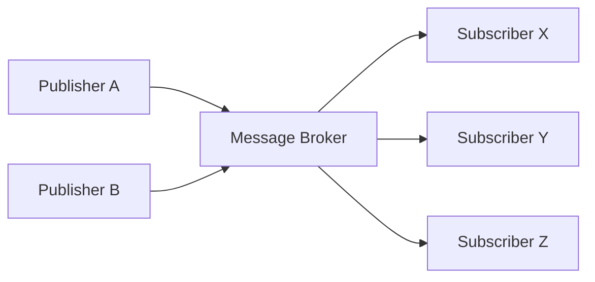
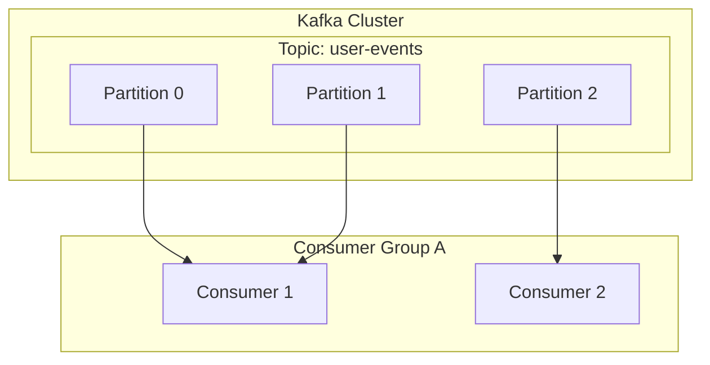

# 1. دعوة إلى الهيكلية المدفوعة بالأحداث

تتمتع أنظمة البرمجيات الحديثة بنطاق وتعقيد غير مسبوقين. مع تزايد انتشار هيكلية الخدمات المصغرة، أصبح تصميم كيفية تواصل الخدمات مع بعضها البعض عنصرًا حاسمًا للغاية يحدد أداء النظام ككل، ومدى توفره، وقابليته للصيانة. في هذا السياق، رسخت ** الهيكلية المدفوعة بالأحداث ** (Event-Driven Architecture: EDA) مكانتها بقوة كنموذج فعال لتقليل درجة الاقتران بين الأنظمة وتحقيق قابلية توسع عالية.

# 2. تحديات الاتصال المتزامن (REST / gRPC)

النهج الأكثر بديهية لاتصال الخدمات في الأنظمة الموزعة هو ** الاتصال المتزامن ** عبر واجهات برمجة تطبيقات REST باستخدام طلب/استجابة HTTP، أو gRPC الأسرع. ومع ذلك، هناك بعض التحديات الجوهرية في الاتصال المتزامن.

## 2.1 الاقتران الوثيق والأعطال المتعاقبة
في الاتصال المتزامن، يكون هناك اقتران زمني قوي بين المتصل (العميل) والمتصل به (الخادم). يحتاج العميل إلى الانتظار حتى يعيد الخادم استجابة، وفي حالة حدوث عطل في الخادم أو تأخر استجابته بسبب حمل مرتفع، فإن هذا التأثير يمتد أيضًا إلى العميل. إذا حدث هذا بشكل متسلسل، فهناك خطر التسبب في ** أعطال متعاقبة ** تؤدي إلى توقف النظام بأكمله.

## 2.2 تراكم وقت الاستجابة
في معالجة المعاملات التي تستدعي خدمات متعددة بشكل تسلسلي، يتم إضافة وقت الاستجابة لكل استدعاء. على سبيل المثال، إذا تم استدعاء 3 خدمات بشكل متزامن في معالجة الطلبات: "التحقق من المخزون"، و"معالجة الدفع"، و"ترتيب الشحن"، فإن مجموع أوقات الاستجابة لكل من هذه الخدمات سيصبح هو وقت انتظار المستخدم.

## 2.3 قيود قابلية التوسع
عند حدوث ارتفاع مؤقت في حركة المرور (حركة المرور المفاجئة)، يكون من الصعب تسوية حركة المرور في الاتصال المتزامن، ويصبح من الضروري التوسع السريع لموارد الخدمة التي تتلقى الطلبات مباشرة. إذا أصبحت عمليات مثل الكتابة في قاعدة البيانات عنق زجاجة، فسيتم تقييد قابلية توسع النظام بأكمله.

# 3. أساسيات الهيكلية المدفوعة بالأحداث (EDA)

للتغلب على هذه التحديات، ظهرت ** الهيكلية المدفوعة بالأحداث **. في نظام EDA، يتم التعبير عن التغييرات في حالة النظام كـ "أحداث"، ويتم تبادلها بشكل غير متزامن بين المكونات.

## 3.1 نموذج الناشر والمشترك (Pub/Sub)

جوهر نظام EDA هو ** نموذج الناشر والمشترك ** (Pub/Sub). في هذا النموذج، يوجد "وسيط رسائل" يعمل كوسيط بين الجانب الذي ينشئ الأحداث (الناشر) والجانب الذي يستهلك الأحداث (المشترك). يحتاج الناشر فقط إلى إرسال الحدث إلى الوسيط، ولا يحتاج إلى معرفة من سيتلقى هذا الحدث. وبالمثل، يحتاج المشترك فقط إلى تلقي الأحداث التي يهتم بها من الوسيط، ولا يحتاج إلى معرفة من أصدرها.



## 3.2 نمط تحديد مصادر الأحداث

كنمط تصميم مهم متعلق بنظام EDA، هناك ** تحديد مصادر الأحداث ** (Event Sourcing). في التطبيقات التقليدية القائمة على CRUD، يتم حفظ "الحالة الحالية" للبيانات فقط في قاعدة البيانات. من ناحية أخرى، في نظام تحديد مصادر الأحداث، يتم حفظ جميع العمليات التي تغير حالة النظام كـ "تسلسل من الأحداث" غير القابلة للتغيير (Immutable).

إذا كانت الحالة الحالية مطلوبة، يتم إعادة بنائها عن طريق إعادة تشغيل (Replay) الأحداث السابقة بالترتيب من البداية. هذا لا يوفر سجل تدقيق كامل فحسب، بل يجعل من الممكن أيضًا استعادة حالة النظام في أي وقت في الماضي. علاوة على ذلك، فإنه يتوافق بشكل ممتاز مع نمط CQRS الذي يفصل بين نموذج القراءة ونموذج الكتابة.

# 4. طابور الرسائل والتدفق: RabbitMQ و Kafka

كبرمجيات وسيطة لتحقيق التوزيع غير المتزامن للأحداث، تطور تاريخيًا كل من طابور الرسائل ومنصات تدفق الأحداث. هنا، سنقارن بين الممثلين الرئيسيين لكل منهما، وهما ** RabbitMQ ** و ** Apache Kafka **، ونتعمق في الاختلافات المعمارية بينهما.

## 4.1 RabbitMQ: طابور رسائل تقليدي وقوي

RabbitMQ هو وسيط رسائل أثبت كفاءته العالية، وقد تم تصميمه استنادًا إلى بروتوكول AMQP.

### 4.1.1 مرونة التوجيه (Exchange و Queue)
أهم ميزة في RabbitMQ هي أن إمكانيات توجيه الرسائل غنية جدًا. لا يرسل الناشر الرسائل مباشرة إلى الطابور، بل يرسلها إلى مكون يسمى ** Exchange **. يقوم الـ Exchange بتوزيع الرسائل إلى الطوابير المناسبة وفقًا لقواعد (ارتباطات) محددة مسبقًا.

- ** Direct Exchange ** : يتم تحويل الرسالة إذا كان مفتاح التوجيه الخاص بها يتطابق تمامًا مع مفتاح الارتباط الخاص بالطابور.
- ** Topic Exchange ** : النقل من خلال مطابقة الأنماط المرنة باستخدام أحرف البدل.
- ** Fanout Exchange ** : بث الرسالة إلى جميع الطوابير المرتبطة دون قيد أو شرط.

### 4.1.2 دورة حياة الرسالة وإدارة الحالة
يتبنى RabbitMQ فلسفة "الوسيط الذكي والمستهلك الغبي". يكون الوسيط مسؤولاً عن إدارة حالة الرسائل، مثل تأكيد تسليم الرسالة (ACK) وإعادة المحاولة عند حدوث خطأ (التوجيه إلى Dead Letter Queue). عندما تتم معالجة الرسالة بنجاح بواسطة المستهلك ويتم إرجاع ACK، يتم حذف تلك الرسالة من الطابور.

## 4.2 Apache Kafka: تدفق الأحداث الموزع

تم تطوير Kafka في الأصل في LinkedIn، وتم تصميمه لمعالجة بيانات السجل واسعة النطاق بسرعة فائقة وإنتاجية عالية. يمتلك نموذجًا معماريًا مختلفًا تمامًا عن RabbitMQ.

### 4.2.1 الهيكل الموزع عبر المواضيع والأقسام
في Kafka، يتم تصنيف الرسائل (الأحداث) في فئة منطقية تسمى ** الموضوع **. ولتحقيق قابلية التوسع، يتم تقسيم موضوع واحد ماديًا إلى ** أقسام ** (Partitions) متعددة. يتم الاحتفاظ بكل قسم على القرص كملف سجل إضافي (Commit Log) لا يتغير ومرتب.



### 4.2.2 الإزاحة و"الوسيط الغبي والمستهلك الذكي"
لا يقوم Kafka بإدارة حالة الرسائل. حتى إذا تمت قراءة الرسالة من قبل المستهلك، فلا يتم حذفها على الفور، بل تبقى على القرص حتى تنتهي فترة الاحتفاظ المحددة. يدير المستهلك ** الإزاحة ** (Offset) التي تشير إلى المدى الذي وصل إليه في قراءة القسم. بفضل نموذج "الوسيط الغبي والمستهلك الذكي" هذا، يقلل Kafka من الحمل الإضافي للوسيط إلى أقصى حد، مما يحقق إنتاجية مذهلة تصل إلى ملايين الرسائل في الثانية.

## 4.3 مقارنة بين RabbitMQ و Kafka وحالات الاستخدام

- ** حالات الاستخدام المناسبة لـ RabbitMQ ** :
  عند الحاجة إلى توجيه معقد، أو في طابور المهام الذي يتطلب معالجة مؤكدة وإدارة ACK لكل رسالة (مثل: مهام إرسال البريد الإلكتروني، معالجة الصور الثقيلة، إدارة المهام في تدفق الطلبات).
- ** حالات الاستخدام المناسبة لـ Kafka ** :
  تجميع السجلات، تتبع سلوك المستخدم، معالجة التدفق، ومتجر أحداث تحديد مصادر الأحداث، والأنظمة الأخرى التي تحتاج إلى معالجة كميات كبيرة من البيانات بإنتاجية عالية، مع الحاجة إلى إعادة تشغيل الأحداث لاحقًا.

# 5. مثال تطبيقي: أكواد RabbitMQ و Kafka

دعنا نلقي نظرة على تطبيق برمجي بسيط باستخدام كلا البرنامجين الوسيطين.

## 5.1 مثال تطبيقي لـ RabbitMQ باستخدام (Node.js / amqplib)

### الناشر (publisher.js)
```javascript
const amqp = require('amqplib');

async function send() {
    const connection = await amqp.connect('amqp://localhost');
    const channel = await connection.createChannel();
    const queue = 'task_queue';
    
    await channel.assertQueue(queue, { durable: true });
    const msg = 'Hello RabbitMQ!';
    
    channel.sendToQueue(queue, Buffer.from(msg), { persistent: true });
    console.log(" [x] Sent '%s'", msg);
    
    setTimeout(() => { connection.close(); process.exit(0) }, 500);
}
send();
```

### المستهلك (consumer.js)
```javascript
const amqp = require('amqplib');

async function receive() {
    const connection = await amqp.connect('amqp://localhost');
    const channel = await connection.createChannel();
    const queue = 'task_queue';
    
    await channel.assertQueue(queue, { durable: true });
    channel.prefetch(1); // المعالجة واحدة تلو الأخرى
    
    console.log(" [*] Waiting for messages in %s.", queue);
    channel.consume(queue, (msg) => {
        console.log(" [x] Received '%s'", msg.content.toString());
        setTimeout(() => {
            console.log(" [x] Done");
            channel.ack(msg);
        }, 1000);
    }, { noAck: false });
}
receive();
```

## 5.2 مثال تطبيقي لـ Kafka باستخدام (Node.js / kafkajs)

### المنتج (producer.js)
```javascript
const { Kafka } = require('kafkajs');

const kafka = new Kafka({
  clientId: 'my-app',
  brokers: ['localhost:9092']
});

const producer = kafka.producer();

async function run() {
  await producer.connect();
  await producer.send({
    topic: 'test-topic',
    messages: [
      { value: 'Hello Kafka!' },
    ],
  });
  console.log("Message sent to Kafka");
  await producer.disconnect();
}
run();
```

### المستهلك (consumer.js)
```javascript
const { Kafka } = require('kafkajs');

const kafka = new Kafka({
  clientId: 'my-app',
  brokers: ['localhost:9092']
});

const consumer = kafka.consumer({ groupId: 'test-group' });

async function run() {
  await consumer.connect();
  await consumer.subscribe({ topic: 'test-topic', fromBeginning: true });

  await consumer.run({
    eachMessage: async ({ topic, partition, message }) => {
      console.log({
        partition,
        offset: message.offset,
        value: message.value.toString(),
      });
    },
  });
}
run();
```

# 6. خاتمة

تعد الهيكلية المدفوعة بالأحداث طريقة قوية للحفاظ على مرونة النظام وقابليته للتوسع. كوسطاء رسائل يلعبون دورًا مركزيًا، يمتلك كل من RabbitMQ و Kafka فلسفات تصميم مختلفة. إن اختيار التقنية المناسبة وفقًا لمتطلبات المشروع هو المفتاح لبناء نظام موزع ناجح؛ فاختر RabbitMQ إذا كنت بحاجة إلى مرونة في التوجيه وإدارة حالة موثوقة، واختر Kafka إذا كنت تبحث عن إنتاجية هائلة، واستمرارية بيانات، وإمكانية إعادة التشغيل.

# 7. أنماط التصميم المتقدمة والتشغيل في الهيكلية المدفوعة بالأحداث

عند تبني الهيكلية المدفوعة بالأحداث في أنظمة المؤسسات الفعلية، تبرز تحديات جديدة، مثل اتساق البيانات، ومعالجة الأخطاء، وقابلية مراقبة النظام (Observability). هنا، سنشرح الأنماط المتقدمة لحل هذه التحديات.

## 7.1 المعاملات الموزعة باستخدام نمط ساغا (Saga)

في هيكلية الخدمات المصغرة، تؤدي إدارة المعاملات التي تمتد عبر خدمات متعددة باستخدام الالتزام ثنائي المراحل المتزامن (2PC) إلى تدهور في التوافر والأداء. كبديل لهذا النهج، يُستخدم ** نمط ساغا **.

في نمط ساغا، يتم تمثيل المعاملة الموزعة كسلسلة من المعاملات المحلية. تقوم كل خدمة بتنفيذ معاملة محلية، وعند الانتهاء، تصدر حدثًا لتحفيز الخطوة التالية. إذا فشلت خطوة ما، فإنها تصدر حدثًا لتنفيذ "معاملة تعويضية (Compensating [Transaction](https://kenji.blog/ar/p/rdbms-transaction-acid-isolation-level-lock/))" لإلغاء المعاملات التي اكتملت بالفعل.

يوجد نوعان من نمط ساغا: "التنسيق" (Orchestration) حيث توجد وحدة تحكم مركزية توجه الخطوات، و"تصميم الرقصات" (Choreography) حيث تشترك كل خدمة بشكل مستقل في الأحداث وتعمل بناءً عليها. في الهيكليات المدفوعة بالأحداث (EDA) التي تستخدم ناقل أحداث مثل Kafka، يمكن تنفيذ ساغا بأسلوب الكوريغرافيا بشكل طبيعي جدًا.

## 7.2 نمط Outbox والحيادية (Idempotency)

عندما تقوم خدمة بتحديث قاعدة بياناتها الخاصة وفي نفس الوقت إصدار أحداث إلى Kafka أو RabbitMQ، يجب تنفيذ "تحديث قاعدة البيانات وإصدار الحدث" كوحدة واحدة (بشكل ذري). إذا تعطلت العملية بعد تحديث قاعدة البيانات وفشل إصدار الحدث، فسيحدث عدم تناسق في النظام بأكمله.

يحل هذه المشكلة ** نمط Outbox للمعاملات **. تقوم الخدمة بكتابة سجل الحدث المراد إرساله في جدول "Outbox (صندوق الصادر)" ضمن نفس معاملة قاعدة البيانات التي يتم فيها التحديث الأصلي للبيانات. بعد ذلك، تقوم عملية خلفية أخرى (مثل أداة CDC مثل Debezium) بمراقبة جدول Outbox وتسليم الأحداث بشكل موثوق إلى وسيط الرسائل (تسليم مرة واحدة على الأقل - At-Least-Once Delivery).

نتيجة لذلك، من الضروري تصميم جانب المستهلك الذي يتلقى الحدث بحيث يمتلك خاصية عدم تغير النتيجة حتى إذا تم تلقي نفس الحدث عدة مرات، أي أن يتمتع بـ ** الحيادية (Idempotency) **.

## 7.3 الهيكلية التفصيلية لـ Kafka: سر الأداء

سنستكشف بمزيد من التعمق التقني لماذا يمكن لـ Kafka أن يحقق أداءً عاليًا للغاية مقارنة بالوسطاء التقليديين مثل RabbitMQ.

### 7.3.1 تقنية النسخ الصفري (Zero-Copy) وذاكرة التخزين المؤقت للصفحات (Page Cache)
يستخدم Kafka تحسين "النسخ الصفري" على مستوى نظام التشغيل (استدعاء النظام `sendfile` في Linux) لنقل البيانات من القرص إلى الشبكة. بفضل هذا، يتم إرسال البيانات مباشرة إلى مقبس الشبكة دون نسخها من مساحة النواة إلى مساحة المستخدم. بالإضافة إلى ذلك، يحقق Kafka وصولاً تسلسليًا سريعًا حتى للبيانات الضخمة من خلال الاستفادة القصوى من ذاكرة التخزين المؤقت للصفحات في نظام التشغيل بدلاً من ذاكرة JVM.

### 7.3.2 معالجة الرسائل كدفعات وضغطها
لا يرسل منتج Kafka الرسائل واحدة تلو الأخرى، بل يجمعها ويرسلها كدفعات إلى الوسيط. علاوة على ذلك، من خلال ضغط الدفعة بأكملها باستخدام خوارزميات مثل LZ4 أو Snappy، يتم تقليل استهلاك النطاق الترددي للشبكة ومساحة القرص بشكل كبير.

## 7.4 ضمان قابلية المراقبة (Observability)

في الأنظمة التي تتسلسل فيها المعالجة غير المتزامنة، يصبح استكشاف الأخطاء وإصلاحها عند حدوث عطل أمرًا بالغ الصعوبة. لتتبع في أي طابور تتراكم الرسائل أو في أي خدمة حدث الخطأ، من الضروري إدخال ** التتبع الموزع ** (مثل OpenTelemetry و Jaeger). يُعد تعيين `traceId` فريد لكل رسالة وربطها بالسجلات والمقاييس لإنشاء بنية تحتية تصور تدفق الأحداث من أفضل الممارسات في تشغيل الأنظمة المدفوعة بالأحداث.

# 7. أنماط التصميم المتقدمة والتشغيل في الهيكلية المدفوعة بالأحداث

عند تبني الهيكلية المدفوعة بالأحداث في أنظمة المؤسسات الفعلية، تبرز تحديات جديدة، مثل اتساق البيانات، ومعالجة الأخطاء، وقابلية مراقبة النظام (Observability). هنا، سنشرح الأنماط المتقدمة لحل هذه التحديات.

## 7.4 ضمان قابلية المراقبة (Observability)

في الأنظمة التي تتسلسل فيها المعالجة غير المتزامنة، يصبح استكشاف الأخطاء وإصلاحها عند حدوث عطل أمرًا بالغ الصعوبة. لتتبع في أي طابور تتراكم الرسائل أو في أي خدمة حدث الخطأ، من الضروري إدخال ** التتبع الموزع ** (مثل OpenTelemetry و Jaeger). يُعد تعيين `traceId` فريد لكل رسالة وربطها بالسجلات والمقاييس لإنشاء بنية تحتية تصور تدفق الأحداث من أفضل الممارسات في تشغيل الأنظمة المدفوعة بالأحداث.
