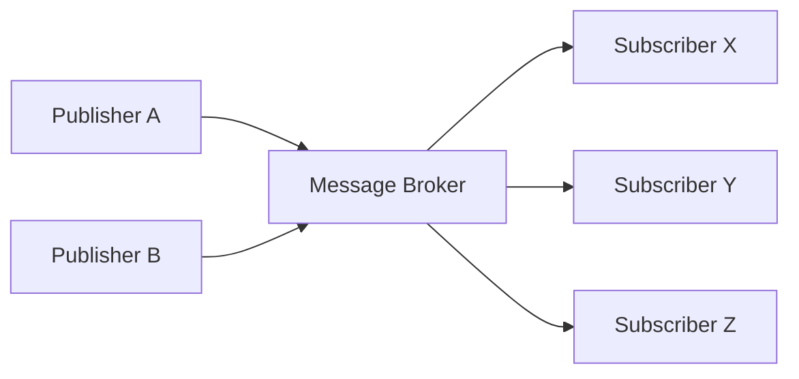
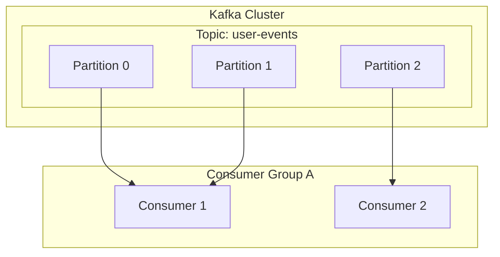

# 1. Einführung in die ereignisgesteuerte Architektur

Moderne Softwaresysteme weisen eine beispiellose Größenordnung und Komplexität auf. Da die [[Microservice](https://kenji.blog/de/p/microservices-architecture-bff-api-gateway/)s](https://kenji.blog/de/p/microservices-architecture-bff-api-gateway/)-Architektur zum Mainstream wird, ist die Frage, wie die Kommunikation zwischen Diensten gestaltet wird, ein äußerst wichtiger Faktor, der die Leistung, Verfügbarkeit und Wartbarkeit des gesamten Systems bestimmt. In diesem Zusammenhang hat sich die **ereignisgesteuerte Architektur** (Event-Driven Architecture: EDA) als starkes Paradigma zur Verringerung der Kopplung zwischen Systemen und zur Erzielung einer hohen Skalierbarkeit fest etabliert.

# 2. Herausforderungen der synchronen Kommunikation (REST / gRPC)

Der intuitivste Ansatz für die Kommunikation zwischen Diensten in verteilten Systemen ist die **synchrone Kommunikation** mittels REST-APIs (HTTP-Requests/Responses) oder dem schnelleren gRPC. Die synchrone Kommunikation birgt jedoch einige inhärente Herausforderungen.

## 2.1 Enge Kopplung und kaskadierende Ausfälle
Bei der synchronen Kommunikation sind der Aufrufer (Client) und der Aufgerufene (Server) zeitlich stark aneinander gekoppelt. Der Client muss warten, bis der Server antwortet. Wenn der Server ausfällt oder die Antwort aufgrund hoher Last verzögert wird, wirkt sich dies auch auf den Client aus. Geschieht dies in einer Kettenreaktion, besteht die Gefahr, dass es zu **kaskadierenden Ausfällen** kommt, die das gesamte System zum Absturz bringen.

## 2.2 Akkumulation von Latenzen
Bei Transaktionsverarbeitungen, die nacheinander mehrere Dienste aufrufen, addieren sich die Latenzen der einzelnen Aufrufe. Wenn beispielsweise bei der Bestellabwicklung drei Dienste – „Bestandsprüfung“, „Zahlungsabwicklung“ und „Versandvereinbarung“ – synchron aufgerufen werden, ergibt die Summe der Reaktionszeiten der einzelnen Dienste die Wartezeit des Benutzers.

## 2.3 Eingeschränkte Skalierbarkeit
Wenn temporäre Traffic-Spitzen (Burst Traffic) auftreten, ist es bei der synchronen Kommunikation schwierig, den Traffic auszugleichen. Stattdessen müssen die Ressourcen der Dienste, die die Anfragen direkt entgegennehmen, schnell skaliert werden. Wenn das Schreiben in die Datenbank zum Engpass wird, ist die Skalierbarkeit des gesamten Systems eingeschränkt.

# 3. Grundlagen der ereignisgesteuerten Architektur (EDA)

Um diese Herausforderungen zu überwinden, wurde die **ereignisgesteuerte Architektur** entwickelt. In der EDA werden Zustandsänderungen des Systems als „Ereignisse“ (Events) dargestellt und asynchron zwischen Komponenten ausgetauscht.

## 3.1 Publisher-Subscriber-Modell (Pub/Sub)

Den Kern der EDA bildet das **Publisher-Subscriber-Modell** (Pub/Sub). In diesem Modell gibt es zwischen dem Erzeuger eines Ereignisses (Publisher) und dem Konsumenten des Ereignisses (Subscriber) einen „Message Broker“, der als Vermittler von Nachrichten fungiert. Der Publisher muss das Ereignis lediglich an den Broker senden und nicht wissen, wer das Ereignis empfängt. Ebenso muss der Subscriber nur die ihn interessierenden Ereignisse vom Broker empfangen und nicht wissen, wer sie veröffentlicht hat.



## 3.2 Event-Sourcing-Muster

Ein wichtiges Entwurfsmuster im Zusammenhang mit EDA ist das **Event Sourcing**. In herkömmlichen CRUD-basierten Anwendungen wird in der Datenbank nur der „aktuelle Zustand“ der Daten gespeichert. Beim Event Sourcing hingegen werden alle Operationen, die den Systemzustand ändern, als unveränderliche (immutable) „Ereignissequenz“ gespeichert.

Wenn der aktuelle Zustand benötigt wird, wird er durch schrittweises Abspielen (Replay) der vergangenen Ereignisse von Anfang an rekonstruiert. Dies liefert nicht nur ein vollständiges Audit-Log, sondern ermöglicht es auch, den Systemzustand zu einem beliebigen Zeitpunkt in der Vergangenheit wiederherzustellen. Es passt zudem hervorragend zum CQRS-Muster (Command Query Responsibility Segregation), das Lese- und Schreibmodelle trennt.

# 4. Message Queues und Streaming: RabbitMQ und Kafka

Als Middleware zur Realisierung der asynchronen Ereignisübermittlung haben sich historisch zwei Kategorien entwickelt: Message Queues und Event-Streaming-Plattformen. Hier vergleichen wir deren prominenteste Vertreter, **RabbitMQ** und **Apache Kafka**, und vertiefen uns in ihre architektonischen Unterschiede.

## 4.1 RabbitMQ: Eine traditionelle und robuste Message Queue

RabbitMQ ist ein sehr bewährter Message Broker, der auf dem AMQP (Advanced Message Queuing Protocol) basiert.

### 4.1.1 Flexibilität beim Routing (Exchange und Queue)
Das Hauptmerkmal von RabbitMQ sind seine sehr umfangreichen Message-Routing-Funktionen. Publisher senden Nachrichten nicht direkt in eine Queue, sondern an eine Komponente namens **Exchange**. Der Exchange leitet die Nachrichten anhand vordefinierter Regeln (Bindings) in die entsprechenden Queues weiter.

- **Direct Exchange**: Weiterleitung, wenn der Routing Key der Nachricht exakt mit dem Binding Key der Queue übereinstimmt.
- **Topic Exchange**: Weiterleitung durch flexibles Pattern-Matching mittels Wildcards.
- **Fanout Exchange**: Bedingungsloser Broadcast an alle gebundenen Queues.

### 4.1.2 Lebenszyklus und Zustandsverwaltung von Nachrichten
RabbitMQ verfolgt die Philosophie des „Smart Broker, Dumb Consumer“. Der Broker ist für die Zustandsverwaltung der Nachrichten verantwortlich, z. B. für die Empfangsbestätigung (ACK) von Nachrichten und für Wiederholungsversuche im Fehlerfall (Routing zu einer Dead Letter Queue). Wenn eine Nachricht erfolgreich von einem Consumer verarbeitet und ein ACK zurückgegeben wurde, wird die Nachricht aus der Warteschlange gelöscht.

## 4.2 Apache Kafka: Verteiltes Event-Streaming

Kafka wurde ursprünglich bei LinkedIn entwickelt und darauf ausgelegt, große Mengen an Logdaten mit ultrahoher Geschwindigkeit und hohem Durchsatz zu verarbeiten. Es besitzt ein völlig anderes architektonisches Paradigma als RabbitMQ.

### 4.2.1 Verteilte Struktur durch Topics und Partitionen
In Kafka werden Nachrichten (Ereignisse) in logische Kategorien namens **Topics** eingeteilt. Um Skalierbarkeit zu erreichen, wird ein Topic physisch in mehrere **Partitionen** unterteilt. Jede Partition wird als geordnete, unveränderliche, nur anfügbare Protokolldatei (Commit Log) auf der Festplatte persistiert.



### 4.2.2 Offsets und „Dumb Broker, Smart Consumer“
Kafka führt keine Statusverwaltung für Nachrichten durch. Nachrichten werden nicht sofort gelöscht, nachdem sie von einem Consumer gelesen wurden, sondern verbleiben auf der Festplatte, bis die festgelegte Aufbewahrungsfrist (Retention Period) abläuft. Der Consumer verwaltet den **Offset**, der angibt, wie weit er eine Partition gelesen hat. Durch dieses Modell des „Dumb Broker, Smart Consumer“ reduziert Kafka den Overhead des Brokers auf ein Minimum und erreicht einen erstaunlichen Durchsatz von Millionen Nachrichten pro Sekunde.

## 4.3 Vergleich und Anwendungsfälle von RabbitMQ und Kafka

- **Ideale Anwendungsfälle für RabbitMQ**:
  Wenn komplexes Routing erforderlich ist; Job-Queues, die eine zuverlässige Verarbeitung jeder Nachricht und ACK-Verwaltung erfordern (z. B. Aufgaben für den E-Mail-Versand, ressourcenintensive Bildverarbeitung, Aufgabenverwaltung in Bestellabläufen).
- **Ideale Anwendungsfälle für Kafka**:
  Systeme, die große Datenmengen mit hohem Durchsatz verarbeiten und in der Lage sein müssen, Ereignisse nachträglich neu abzuspielen, wie z. B. Log-Aggregation, Tracking des Benutzerverhaltens, Stream-Processing und Event Stores beim Event Sourcing.

# 5. Implementierungsbeispiele: Code für RabbitMQ und Kafka

Werfen wir einen Blick auf einfache Code-Implementierungen mit der jeweiligen Middleware.

## 5.1 Implementierungsbeispiel für RabbitMQ (Node.js / amqplib)

### Publisher (publisher.js)
```javascript
const amqp = require('amqplib');

async function send() {
    const connection = await amqp.connect('amqp://localhost');
    const channel = await connection.createChannel();
    const queue = 'task_queue';
    
    await channel.assertQueue(queue, { durable: true });
    const msg = 'Hallo RabbitMQ!';
    
    channel.sendToQueue(queue, Buffer.from(msg), { persistent: true });
    console.log(" [x] '%s' gesendet", msg);
    
    setTimeout(() => { connection.close(); process.exit(0) }, 500);
}
send();
```

### Consumer (consumer.js)
```javascript
const amqp = require('amqplib');

async function receive() {
    const connection = await amqp.connect('amqp://localhost');
    const channel = await connection.createChannel();
    const queue = 'task_queue';
    
    await channel.assertQueue(queue, { durable: true });
    channel.prefetch(1); // Eine nach der anderen verarbeiten
    
    console.log(" [*] Warten auf Nachrichten in %s.", queue);
    channel.consume(queue, (msg) => {
        console.log(" [x] '%s' empfangen", msg.content.toString());
        setTimeout(() => {
            console.log(" [x] Fertig");
            channel.ack(msg);
        }, 1000);
    }, { noAck: false });
}
receive();
```

## 5.2 Implementierungsbeispiel für Kafka (Node.js / kafkajs)

### Producer (producer.js)
```javascript
const { Kafka } = require('kafkajs');

const kafka = new Kafka({
  clientId: 'my-app',
  brokers: ['localhost:9092']
});

const producer = kafka.producer();

async function run() {
  await producer.connect();
  await producer.send({
    topic: 'test-topic',
    messages: [
      { value: 'Hallo Kafka!' },
    ],
  });
  console.log("Nachricht an Kafka gesendet");
  await producer.disconnect();
}
run();
```

### Consumer (consumer.js)
```javascript
const { Kafka } = require('kafkajs');

const kafka = new Kafka({
  clientId: 'my-app',
  brokers: ['localhost:9092']
});

const consumer = kafka.consumer({ groupId: 'test-group' });

async function run() {
  await consumer.connect();
  await consumer.subscribe({ topic: 'test-topic', fromBeginning: true });

  await consumer.run({
    eachMessage: async ({ topic, partition, message }) => {
      console.log({
        partition,
        offset: message.offset,
        value: message.value.toString(),
      });
    },
  });
}
run();
```

# 6. Fazit

Die ereignisgesteuerte Architektur ist ein leistungsstarker Ansatz, um Systeme flexibel und skalierbar zu halten. Als Message Broker, die dabei eine zentrale Rolle spielen, verfolgen RabbitMQ und Kafka jeweils unterschiedliche Designphilosophien. Die Auswahl der richtigen Technologie passend zu den Projektanforderungen – RabbitMQ für flexible Routing-Möglichkeiten und zuverlässige Statusverwaltung, Kafka für überwältigenden Durchsatz sowie Datenpersistenz und Replay-Fähigkeit – ist der Schlüssel zum erfolgreichen Aufbau eines verteilten Systems.

# 7. Fortgeschrittene Entwurfsmuster und Betrieb in ereignisgesteuerten Architekturen

Wenn eine ereignisgesteuerte Architektur in tatsächlichen Enterprise-Systemen eingeführt wird, entstehen neue Herausforderungen. Dazu gehören Datenkonsistenz, Fehlerbehandlung und Systembeobachtbarkeit (Observability). Hier erläutern wir fortgeschrittene Muster zur Lösung dieser Probleme.

## 7.1 Verteilte Transaktionen mit dem Saga-Muster

In einer [[Microservice](https://kenji.blog/de/p/microservices-architecture-bff-api-gateway/)s](https://kenji.blog/de/p/microservices-architecture-bff-api-gateway/)-Architektur führt die Verwaltung von Transaktionen, die sich über mehrere Dienste erstrecken, mit einem synchronen Two-Phase-Commit (2PC) zu Einbußen bei der Verfügbarkeit und Leistung. Als Alternative dazu wird das **Saga-Muster** verwendet.

Beim Saga-Muster werden verteilte Transaktionen als eine Abfolge lokaler Transaktionen dargestellt. Jeder Dienst führt eine lokale Transaktion aus und veröffentlicht nach Abschluss ein Ereignis, um den nächsten Schritt auszulösen. Wenn ein Schritt fehlschlägt, wird ein Ereignis veröffentlicht, das eine „Kompensationstransaktion“ (Compensating [Transaction](https://kenji.blog/de/p/rdbms-transaction-acid-isolation-level-lock/)) ausführt, um die bereits abgeschlossenen Transaktionen rückgängig zu machen.

Bei Sagas gibt es die „Orchestrierung“, bei der ein zentraler Controller die Schritte vorgibt, und die „Choreografie“, bei der die Dienste autonom Ereignisse abonnieren und darauf reagieren. In einer EDA mit einem Event-Bus wie Kafka lässt sich die Choreografie-Saga sehr natürlich implementieren.

## 7.2 Outbox-Muster und Idempotenz

Wenn ein Dienst seine eigene Datenbank aktualisiert und gleichzeitig ein Ereignis an Kafka oder RabbitMQ sendet, müssen die „Datenbankaktualisierung und das Senden des Ereignisses“ atomar erfolgen. Wenn der Prozess nach der Datenbankaktualisierung abstürzt und das Senden des Ereignisses fehlschlägt, entsteht im gesamten System eine Inkonsistenz.

Dies wird durch das **Transactional-Outbox-Muster** gelöst. Der Dienst schreibt innerhalb derselben Datenbanktransaktion wie die eigentliche Datenaktualisierung einen Eintrag für das zu sendende Ereignis in eine „Outbox“-Tabelle (Postausgang). Anschließend überwacht ein separater Hintergrundprozess (z. B. ein CDC-Tool wie Debezium) die Outbox-Tabelle und liefert die Ereignisse zuverlässig an den Message Broker (At-Least-Once Delivery).

Damit einhergehend ist es unabdingbar, dass der Consumer, der die Ereignisse empfängt, so konzipiert ist, dass sich das Ergebnis auch dann nicht ändert, wenn er dasselbe Ereignis mehrmals empfängt, er also die Eigenschaft der **Idempotenz** (Idempotency) besitzt.

## 7.3 Detaillierte Kafka-Architektur: Das Geheimnis der Leistung

Lassen Sie uns tiefer in die technischen Aspekte eintauchen, um zu verstehen, warum Kafka im Vergleich zu herkömmlichen Brokern wie RabbitMQ eine so hohe Leistung erbringen kann.

### 7.3.1 Zero-Copy-Technologie und Page Cache
Kafka nutzt für die Datenübertragung von der Festplatte ins Netzwerk die Optimierung „Zero-Copy“ auf OS-Ebene (der `sendfile` System Call in Linux). Dadurch werden die Daten direkt in den Netzwerk-Socket gesendet, ohne dass sie vom Kernel-Space in den User-Space kopiert werden. Darüber hinaus nutzt Kafka den Page Cache des Betriebssystems anstelle des JVM-Speichers maximal aus, wodurch auch bei riesigen Datenmengen schnelle sequenzielle Zugriffe erzielt werden.

### 7.3.2 Batch-Verarbeitung und Komprimierung von Nachrichten
Der Kafka-Producer sendet Nachrichten nicht einzeln, sondern fasst sie in Batches zusammen und sendet sie an den Broker. Zudem wird der gesamte Batch mit Algorithmen wie LZ4 oder Snappy komprimiert, was die Netzwerkbandbreite und den Festplattenplatzbedarf drastisch reduziert.

## 7.4 Gewährleistung der Beobachtbarkeit (Observability)

In Systemen mit verketteten asynchronen Prozessen wird die Fehlersuche bei auftretenden Störungen extrem schwierig. Um nachverfolgen zu können, in welcher Queue sich Nachrichten stauen oder bei welchem Dienst ein Fehler aufgetreten ist, ist die Einführung von **Distributed Tracing** (OpenTelemetry, Jaeger usw.) unerlässlich. Die Zuweisung einer eindeutigen `traceId` zu jeder Nachricht und deren Verknüpfung mit Logs und Metriken zum Aufbau einer Infrastruktur zur Visualisierung des Ereignisflusses ist eine Best Practice für den EDA-Betrieb.

# 7. Fortgeschrittene Entwurfsmuster und Betrieb in ereignisgesteuerten Architekturen

Wenn eine ereignisgesteuerte Architektur in tatsächlichen Enterprise-Systemen eingeführt wird, entstehen neue Herausforderungen. Dazu gehören Datenkonsistenz, Fehlerbehandlung und Systembeobachtbarkeit (Observability). Hier erläutern wir fortgeschrittene Muster zur Lösung dieser Probleme.

## 7.1 Verteilte Transaktionen mit dem Saga-Muster

In einer [[Microservice](https://kenji.blog/de/p/microservices-architecture-bff-api-gateway/)s](https://kenji.blog/de/p/microservices-architecture-bff-api-gateway/)-Architektur führt die Verwaltung von Transaktionen, die sich über mehrere Dienste erstrecken, mit einem synchronen Two-Phase-Commit (2PC) zu Einbußen bei der Verfügbarkeit und Leistung. Als Alternative dazu wird das **Saga-Muster** verwendet.

Beim Saga-Muster werden verteilte Transaktionen als eine Abfolge lokaler Transaktionen dargestellt. Jeder Dienst führt eine lokale Transaktion aus und veröffentlicht nach Abschluss ein Ereignis, um den nächsten Schritt auszulösen. Wenn ein Schritt fehlschlägt, wird ein Ereignis veröffentlicht, das eine „Kompensationstransaktion“ (Compensating [Transaction](https://kenji.blog/de/p/rdbms-transaction-acid-isolation-level-lock/)) ausführt, um die bereits abgeschlossenen Transaktionen rückgängig zu machen.

Bei Sagas gibt es die „Orchestrierung“, bei der ein zentraler Controller die Schritte vorgibt, und die „Choreografie“, bei der die Dienste autonom Ereignisse abonnieren und darauf reagieren. In einer EDA mit einem Event-Bus wie Kafka lässt sich die Choreografie-Saga sehr natürlich implementieren.

## 7.2 Outbox-Muster und Idempotenz

Wenn ein Dienst seine eigene Datenbank aktualisiert und gleichzeitig ein Ereignis an Kafka oder RabbitMQ sendet, müssen die „Datenbankaktualisierung und das Senden des Ereignisses“ atomar erfolgen. Wenn der Prozess nach der Datenbankaktualisierung abstürzt und das Senden des Ereignisses fehlschlägt, entsteht im gesamten System eine Inkonsistenz.

Dies wird durch das **Transactional-Outbox-Muster** gelöst. Der Dienst schreibt innerhalb derselben Datenbanktransaktion wie die eigentliche Datenaktualisierung einen Eintrag für das zu sendende Ereignis in eine „Outbox“-Tabelle (Postausgang). Anschließend überwacht ein separater Hintergrundprozess (z. B. ein CDC-Tool wie Debezium) die Outbox-Tabelle und liefert die Ereignisse zuverlässig an den Message Broker (At-Least-Once Delivery).

Damit einhergehend ist es unabdingbar, dass der Consumer, der die Ereignisse empfängt, so konzipiert ist, dass sich das Ergebnis auch dann nicht ändert, wenn er dasselbe Ereignis mehrmals empfängt, er also die Eigenschaft der **Idempotenz** (Idempotency) besitzt.

## 7.3 Detaillierte Kafka-Architektur: Das Geheimnis der Leistung

Lassen Sie uns tiefer in die technischen Aspekte eintauchen, um zu verstehen, warum Kafka im Vergleich zu herkömmlichen Brokern wie RabbitMQ eine so hohe Leistung erbringen kann.

### 7.3.1 Zero-Copy-Technologie und Page Cache
Kafka nutzt für die Datenübertragung von der Festplatte ins Netzwerk die Optimierung „Zero-Copy“ auf OS-Ebene (der `sendfile` System Call in Linux). Dadurch werden die Daten direkt in den Netzwerk-Socket gesendet, ohne dass sie vom Kernel-Space in den User-Space kopiert werden. Darüber hinaus nutzt Kafka den Page Cache des Betriebssystems anstelle des JVM-Speichers maximal aus, wodurch auch bei riesigen Datenmengen schnelle sequenzielle Zugriffe erzielt werden.

### 7.3.2 Batch-Verarbeitung und Komprimierung von Nachrichten
Der Kafka-Producer sendet Nachrichten nicht einzeln, sondern fasst sie in Batches zusammen und sendet sie an den Broker. Zudem wird der gesamte Batch mit Algorithmen wie LZ4 oder Snappy komprimiert, was die Netzwerkbandbreite und den Festplattenplatzbedarf drastisch reduziert.

## 7.4 Gewährleistung der Beobachtbarkeit (Observability)

In Systemen mit verketteten asynchronen Prozessen wird die Fehlersuche bei auftretenden Störungen extrem schwierig. Um nachverfolgen zu können, in welcher Queue sich Nachrichten stauen oder bei welchem Dienst ein Fehler aufgetreten ist, ist die Einführung von **Distributed Tracing** (OpenTelemetry, Jaeger usw.) unerlässlich. Die Zuweisung einer eindeutigen `traceId` zu jeder Nachricht und deren Verknüpfung mit Logs und Metriken zum Aufbau einer Infrastruktur zur Visualisierung des Ereignisflusses ist eine Best Practice für den EDA-Betrieb.

# 7. Fortgeschrittene Entwurfsmuster und Betrieb in ereignisgesteuerten Architekturen

Wenn eine ereignisgesteuerte Architektur in tatsächlichen Enterprise-Systemen eingeführt wird, entstehen neue Herausforderungen. Dazu gehören Datenkonsistenz, Fehlerbehandlung und Systembeobachtbarkeit (Observability). Hier erläutern wir fortgeschrittene Muster zur Lösung dieser Probleme.

## 7.1 Verteilte Transaktionen mit dem Saga-Muster

In einer [[Microservice](https://kenji.blog/de/p/microservices-architecture-bff-api-gateway/)s](https://kenji.blog/de/p/microservices-architecture-bff-api-gateway/)-Architektur führt die Verwaltung von Transaktionen, die sich über mehrere Dienste erstrecken, mit einem synchronen Two-Phase-Commit (2PC) zu Einbußen bei der Verfügbarkeit und Leistung. Als Alternative dazu wird das **Saga-Muster** verwendet.

Beim Saga-Muster werden verteilte Transaktionen als eine Abfolge lokaler Transaktionen dargestellt. Jeder Dienst führt eine lokale Transaktion aus und veröffentlicht nach Abschluss ein Ereignis, um den nächsten Schritt auszulösen. Wenn ein Schritt fehlschlägt, wird ein Ereignis veröffentlicht, das eine „Kompensationstransaktion“ (Compensating [Transaction](https://kenji.blog/de/p/rdbms-transaction-acid-isolation-level-lock/)) ausführt, um die bereits abgeschlossenen Transaktionen rückgängig zu machen.

Bei Sagas gibt es die „Orchestrierung“, bei der ein zentraler Controller die Schritte vorgibt, und die „Choreografie“, bei der die Dienste autonom Ereignisse abonnieren und darauf reagieren. In einer EDA mit einem Event-Bus wie Kafka lässt sich die Choreografie-Saga sehr natürlich implementieren.

## 7.2 Outbox-Muster und Idempotenz

Wenn ein Dienst seine eigene Datenbank aktualisiert und gleichzeitig ein Ereignis an Kafka oder RabbitMQ sendet, müssen die „Datenbankaktualisierung und das Senden des Ereignisses“ atomar erfolgen. Wenn der Prozess nach der Datenbankaktualisierung abstürzt und das Senden des Ereignisses fehlschlägt, entsteht im gesamten System eine Inkonsistenz.

Dies wird durch das **Transactional-Outbox-Muster** gelöst. Der Dienst schreibt innerhalb derselben Datenbanktransaktion wie die eigentliche Datenaktualisierung einen Eintrag für das zu sendende Ereignis in eine „Outbox“-Tabelle (Postausgang). Anschließend überwacht ein separater Hintergrundprozess (z. B. ein CDC-Tool wie Debezium) die Outbox-Tabelle und liefert die Ereignisse zuverlässig an den Message Broker (At-Least-Once Delivery).

Damit einhergehend ist es unabdingbar, dass der Consumer, der die Ereignisse empfängt, so konzipiert ist, dass sich das Ergebnis auch dann nicht ändert, wenn er dasselbe Ereignis mehrmals empfängt, er also die Eigenschaft der **Idempotenz** (Idempotency) besitzt.

## 7.3 Detaillierte Kafka-Architektur: Das Geheimnis der Leistung

Lassen Sie uns tiefer in die technischen Aspekte eintauchen, um zu verstehen, warum Kafka im Vergleich zu herkömmlichen Brokern wie RabbitMQ eine so hohe Leistung erbringen kann.

### 7.3.1 Zero-Copy-Technologie und Page Cache
Kafka nutzt für die Datenübertragung von der Festplatte ins Netzwerk die Optimierung „Zero-Copy“ auf OS-Ebene (der `sendfile` System Call in Linux). Dadurch werden die Daten direkt in den Netzwerk-Socket gesendet, ohne dass sie vom Kernel-Space in den User-Space kopiert werden. Darüber hinaus nutzt Kafka den Page Cache des Betriebssystems anstelle des JVM-Speichers maximal aus, wodurch auch bei riesigen Datenmengen schnelle sequenzielle Zugriffe erzielt werden.

### 7.3.2 Batch-Verarbeitung und Komprimierung von Nachrichten
Der Kafka-Producer sendet Nachrichten nicht einzeln, sondern fasst sie in Batches zusammen und sendet sie an den Broker. Zudem wird der gesamte Batch mit Algorithmen wie LZ4 oder Snappy komprimiert, was die Netzwerkbandbreite und den Festplattenplatzbedarf drastisch reduziert.

## 7.4 Gewährleistung der Beobachtbarkeit (Observability)

In Systemen mit verketteten asynchronen Prozessen wird die Fehlersuche bei auftretenden Störungen extrem schwierig. Um nachverfolgen zu können, in welcher Queue sich Nachrichten stauen oder bei welchem Dienst ein Fehler aufgetreten ist, ist die Einführung von **Distributed Tracing** (OpenTelemetry, Jaeger usw.) unerlässlich. Die Zuweisung einer eindeutigen `traceId` zu jeder Nachricht und deren Verknüpfung mit Logs und Metriken zum Aufbau einer Infrastruktur zur Visualisierung des Ereignisflusses ist eine Best Practice für den EDA-Betrieb.

# 7. Fortgeschrittene Entwurfsmuster und Betrieb in ereignisgesteuerten Architekturen

Wenn eine ereignisgesteuerte Architektur in tatsächlichen Enterprise-Systemen eingeführt wird, entstehen neue Herausforderungen. Dazu gehören Datenkonsistenz, Fehlerbehandlung und Systembeobachtbarkeit (Observability). Hier erläutern wir fortgeschrittene Muster zur Lösung dieser Probleme.

## 7.1 Verteilte Transaktionen mit dem Saga-Muster

In einer [[Microservice](https://kenji.blog/de/p/microservices-architecture-bff-api-gateway/)s](https://kenji.blog/de/p/microservices-architecture-bff-api-gateway/)-Architektur führt die Verwaltung von Transaktionen, die sich über mehrere Dienste erstrecken, mit einem synchronen Two-Phase-Commit (2PC) zu Einbußen bei der Verfügbarkeit und Leistung. Als Alternative dazu wird das **Saga-Muster** verwendet.

Beim Saga-Muster werden verteilte Transaktionen als eine Abfolge lokaler Transaktionen dargestellt. Jeder Dienst führt eine lokale Transaktion aus und veröffentlicht nach Abschluss ein Ereignis, um den nächsten Schritt auszulösen. Wenn ein Schritt fehlschlägt, wird ein Ereignis veröffentlicht, das eine „Kompensationstransaktion“ (Compensating [Transaction](https://kenji.blog/de/p/rdbms-transaction-acid-isolation-level-lock/)) ausführt, um die bereits abgeschlossenen Transaktionen rückgängig zu machen.

Bei Sagas gibt es die „Orchestrierung“, bei der ein zentraler Controller die Schritte vorgibt, und die „Choreografie“, bei der die Dienste autonom Ereignisse abonnieren und darauf reagieren. In einer EDA mit einem Event-Bus wie Kafka lässt sich die Choreografie-Saga sehr natürlich implementieren.

## 7.2 Outbox-Muster und Idempotenz

Wenn ein Dienst seine eigene Datenbank aktualisiert und gleichzeitig ein Ereignis an Kafka oder RabbitMQ sendet, müssen die „Datenbankaktualisierung und das Senden des Ereignisses“ atomar erfolgen. Wenn der Prozess nach der Datenbankaktualisierung abstürzt und das Senden des Ereignisses fehlschlägt, entsteht im gesamten System eine Inkonsistenz.

Dies wird durch das **Transactional-Outbox-Muster** gelöst. Der Dienst schreibt innerhalb derselben Datenbanktransaktion wie die eigentliche Datenaktualisierung einen Eintrag für das zu sendende Ereignis in eine „Outbox“-Tabelle (Postausgang). Anschließend überwacht ein separater Hintergrundprozess (z. B. ein CDC-Tool wie Debezium) die Outbox-Tabelle und liefert die Ereignisse zuverlässig an den Message Broker (At-Least-Once Delivery).

Damit einhergehend ist es unabdingbar, dass der Consumer, der die Ereignisse empfängt, so konzipiert ist, dass sich das Ergebnis auch dann nicht ändert, wenn er dasselbe Ereignis mehrmals empfängt, er also die Eigenschaft der **Idempotenz** (Idempotency) besitzt.

## 7.3 Detaillierte Kafka-Architektur: Das Geheimnis der Leistung

Lassen Sie uns tiefer in die technischen Aspekte eintauchen, um zu verstehen, warum Kafka im Vergleich zu herkömmlichen Brokern wie RabbitMQ eine so hohe Leistung erbringen kann.

### 7.3.1 Zero-Copy-Technologie und Page Cache
Kafka nutzt für die Datenübertragung von der Festplatte ins Netzwerk die Optimierung „Zero-Copy“ auf OS-Ebene (der `sendfile` System Call in Linux). Dadurch werden die Daten direkt in den Netzwerk-Socket gesendet, ohne dass sie vom Kernel-Space in den User-Space kopiert werden. Darüber hinaus nutzt Kafka den Page Cache des Betriebssystems anstelle des JVM-Speichers maximal aus, wodurch auch bei riesigen Datenmengen schnelle sequenzielle Zugriffe erzielt werden.

### 7.3.2 Batch-Verarbeitung und Komprimierung von Nachrichten
Der Kafka-Producer sendet Nachrichten nicht einzeln, sondern fasst sie in Batches zusammen und sendet sie an den Broker. Zudem wird der gesamte Batch mit Algorithmen wie LZ4 oder Snappy komprimiert, was die Netzwerkbandbreite und den Festplattenplatzbedarf drastisch reduziert.

## 7.4 Gewährleistung der Beobachtbarkeit (Observability)

In Systemen mit verketteten asynchronen Prozessen wird die Fehlersuche bei auftretenden Störungen extrem schwierig. Um nachverfolgen zu können, in welcher Queue sich Nachrichten stauen oder bei welchem Dienst ein Fehler aufgetreten ist, ist die Einführung von **Distributed Tracing** (OpenTelemetry, Jaeger usw.) unerlässlich. Die Zuweisung einer eindeutigen `traceId` zu jeder Nachricht und deren Verknüpfung mit Logs und Metriken zum Aufbau einer Infrastruktur zur Visualisierung des Ereignisflusses ist eine Best Practice für den EDA-Betrieb.

# 7. Fortgeschrittene Entwurfsmuster und Betrieb in ereignisgesteuerten Architekturen

Wenn eine ereignisgesteuerte Architektur in tatsächlichen Enterprise-Systemen eingeführt wird, entstehen neue Herausforderungen. Dazu gehören Datenkonsistenz, Fehlerbehandlung und Systembeobachtbarkeit (Observability). Hier erläutern wir fortgeschrittene Muster zur Lösung dieser Probleme.

## 7.1 Verteilte Transaktionen mit dem Saga-Muster

In einer [[Microservice](https://kenji.blog/de/p/microservices-architecture-bff-api-gateway/)s](https://kenji.blog/de/p/microservices-architecture-bff-api-gateway/)-Architektur führt die Verwaltung von Transaktionen, die sich über mehrere Dienste erstrecken, mit einem synchronen Two-Phase-Commit (2PC) zu Einbußen bei der Verfügbarkeit und Leistung. Als Alternative dazu wird das **Saga-Muster** verwendet.

Beim Saga-Muster werden verteilte Transaktionen als eine Abfolge lokaler Transaktionen dargestellt. Jeder Dienst führt eine lokale Transaktion aus und veröffentlicht nach Abschluss ein Ereignis, um den nächsten Schritt auszulösen. Wenn ein Schritt fehlschlägt, wird ein Ereignis veröffentlicht, das eine „Kompensationstransaktion“ (Compensating [Transaction](https://kenji.blog/de/p/rdbms-transaction-acid-isolation-level-lock/)) ausführt, um die bereits abgeschlossenen Transaktionen rückgängig zu machen.

Bei Sagas gibt es die „Orchestrierung“, bei der ein zentraler Controller die Schritte vorgibt, und die „Choreografie“, bei der die Dienste autonom Ereignisse abonnieren und darauf reagieren. In einer EDA mit einem Event-Bus wie Kafka lässt sich die Choreografie-Saga sehr natürlich implementieren.

## 7.2 Outbox-Muster und Idempotenz

Wenn ein Dienst seine eigene Datenbank aktualisiert und gleichzeitig ein Ereignis an Kafka oder RabbitMQ sendet, müssen die „Datenbankaktualisierung und das Senden des Ereignisses“ atomar erfolgen. Wenn der Prozess nach der Datenbankaktualisierung abstürzt und das Senden des Ereignisses fehlschlägt, entsteht im gesamten System eine Inkonsistenz.

Dies wird durch das **Transactional-Outbox-Muster** gelöst. Der Dienst schreibt innerhalb derselben Datenbanktransaktion wie die eigentliche Datenaktualisierung einen Eintrag für das zu sendende Ereignis in eine „Outbox“-Tabelle (Postausgang). Anschließend überwacht ein separater Hintergrundprozess (z. B. ein CDC-Tool wie Debezium) die Outbox-Tabelle und liefert die Ereignisse zuverlässig an den Message Broker (At-Least-Once Delivery).

Damit einhergehend ist es unabdingbar, dass der Consumer, der die Ereignisse empfängt, so konzipiert ist, dass sich das Ergebnis auch dann nicht ändert, wenn er dasselbe Ereignis mehrmals empfängt, er also die Eigenschaft der **Idempotenz** (Idempotency) besitzt.

## 7.3 Detaillierte Kafka-Architektur: Das Geheimnis der Leistung

Lassen Sie uns tiefer in die technischen Aspekte eintauchen, um zu verstehen, warum Kafka im Vergleich zu herkömmlichen Brokern wie RabbitMQ eine so hohe Leistung erbringen kann.

### 7.3.1 Zero-Copy-Technologie und Page Cache
Kafka nutzt für die Datenübertragung von der Festplatte ins Netzwerk die Optimierung „Zero-Copy“ auf OS-Ebene (der `sendfile` System Call in Linux). Dadurch werden die Daten direkt in den Netzwerk-Socket gesendet, ohne dass sie vom Kernel-Space in den User-Space kopiert werden. Darüber hinaus nutzt Kafka den Page Cache des Betriebssystems anstelle des JVM-Speichers maximal aus, wodurch auch bei riesigen Datenmengen schnelle sequenzielle Zugriffe erzielt werden.

### 7.3.2 Batch-Verarbeitung und Komprimierung von Nachrichten
Der Kafka-Producer sendet Nachrichten nicht einzeln, sondern fasst sie in Batches zusammen und sendet sie an den Broker. Zudem wird der gesamte Batch mit Algorithmen wie LZ4 oder Snappy komprimiert, was die Netzwerkbandbreite und den Festplattenplatzbedarf drastisch reduziert.

## 7.4 Gewährleistung der Beobachtbarkeit (Observability)

In Systemen mit verketteten asynchronen Prozessen wird die Fehlersuche bei auftretenden Störungen extrem schwierig. Um nachverfolgen zu können, in welcher Queue sich Nachrichten stauen oder bei welchem Dienst ein Fehler aufgetreten ist, ist die Einführung von **Distributed Tracing** (OpenTelemetry, Jaeger usw.) unerlässlich. Die Zuweisung einer eindeutigen `traceId` zu jeder Nachricht und deren Verknüpfung mit Logs und Metriken zum Aufbau einer Infrastruktur zur Visualisierung des Ereignisflusses ist eine Best Practice für den EDA-Betrieb.
