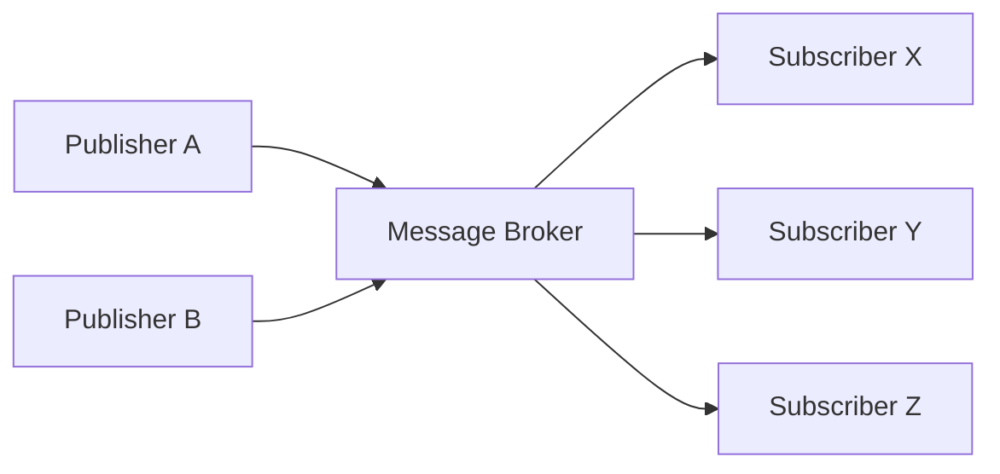
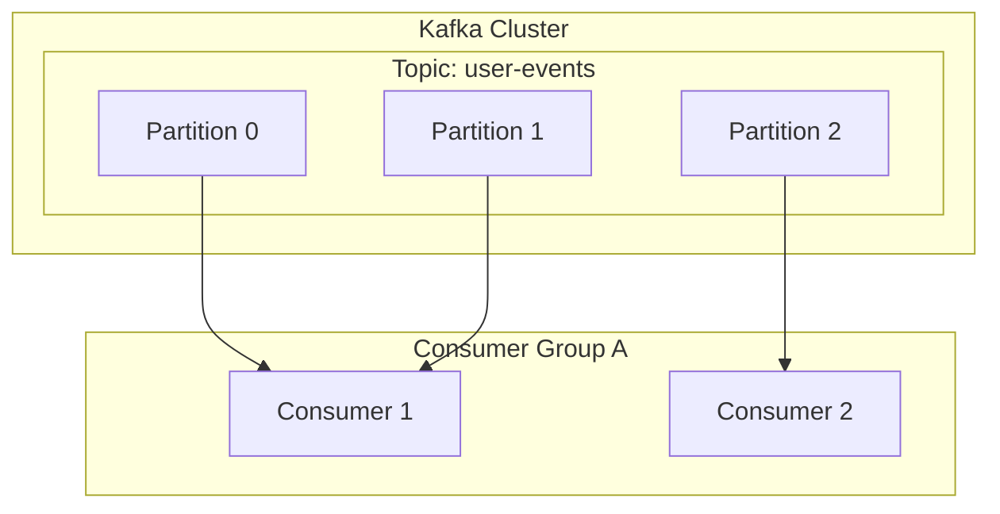

# 1. Introduction to Event-Driven Architecture

Modern software systems are unprecedented in scale and complexity. As microservice architecture becomes mainstream, how inter-service communication is designed is a critical factor that dictates overall system performance, availability, and maintainability. In this context, **Event-Driven Architecture** (EDA) has firmly established itself as a powerful paradigm for reducing the degree of coupling between systems and achieving high scalability.

# 2. Challenges of Synchronous Communication (REST / gRPC)

The most intuitive approach to inter-service communication in [distributed systems](/en/p/cap-theorem-distributed-systems-tradeoff/) is **synchronous communication**, such as REST APIs using HTTP requests/responses or the faster gRPC. However, synchronous communication has several inherent challenges.

## 2.1 Tight Coupling and Cascading Failures
In synchronous communication, the caller (client) and the callee (server) are strongly coupled in time. The client must wait until the server returns a response, and if the server experiences a failure or delays responding due to high load, the impact ripples through to the client. If this occurs in a chain reaction, there is a danger of causing **cascading failures** that take down the entire system.

## 2.2 Accumulation of Latency
In transaction processing where multiple services are called sequentially, the latency of each call adds up. For example, in order processing, if three services—"inventory check," "payment processing," and "shipping arrangement"—are called synchronously, the sum of their response times becomes the user's wait time.

## 2.3 Limitations on Scalability
When a temporary traffic spike (burst traffic) occurs, it is difficult to level the traffic with synchronous communication, requiring the resources of the service directly receiving the requests to be scaled out rapidly. If writing to a database becomes a bottleneck, the scalability of the entire system is limited.

# 3. Basics of Event-Driven Architecture (EDA)

**Event-Driven Architecture** emerged to overcome these challenges. In EDA, state changes in the system are represented as "events" and exchanged asynchronously between components.

## 3.1 Publisher-Subscriber Model (Pub/Sub)

At the core of EDA is the **Publisher-Subscriber model** (Pub/Sub). In this model, a "message broker" exists as an intermediary for messages between the side generating the events (publisher) and the side consuming the events (subscriber). The publisher only needs to send events to the broker and does not need to know who will receive them. Similarly, the subscriber only needs to receive events of interest from the broker and does not need to know who published them.



## 3.2 Event Sourcing Pattern

An important design pattern related to EDA is **Event Sourcing**. In traditional CRUD-based applications, only the "current state" of the data is saved in the database. In contrast, with event sourcing, all operations that change the state of the system are saved as an immutable "sequence of events."

When the current state is needed, it is reconstructed by replaying past events in order from the beginning. This not only provides a complete audit log but also makes it possible to restore the system's state at any given point in the past. It also works exceptionally well with the CQRS (Command Query Responsibility Segregation) pattern, which separates the read and write models.

# 4. Message Queues and Streaming: RabbitMQ and Kafka

Historically, two types of middleware have developed to realize asynchronous event delivery: message queues and event streaming platforms. Here, we compare the representative of each, **RabbitMQ** and **Apache Kafka**, and dive deep into their architectural differences.

## 4.1 RabbitMQ: A Traditional and Robust Message Queue

RabbitMQ is a highly proven message broker designed based on AMQP (Advanced Message Queuing Protocol).

### 4.1.1 Routing Flexibility (Exchange and Queue)
RabbitMQ's greatest feature is its extremely rich message routing capabilities. Publishers do not send messages directly to a queue; instead, they send them to a component called an **Exchange**. The Exchange distributes messages to the appropriate queues according to predefined rules (bindings).

- **Direct Exchange**: Forwards messages when the routing key of the message and the binding key of the queue match exactly.
- **Topic Exchange**: Forwards messages using flexible pattern matching with wildcards.
- **Fanout Exchange**: Unconditionally broadcasts to all bound queues.

### 4.1.2 Message Lifecycle and State Management
RabbitMQ embraces a "smart broker, dumb consumer" philosophy. The broker is responsible for managing the state of messages, such as delivery acknowledgments (ACK) and retries on errors (routing to a Dead Letter Queue). Once a message is successfully processed by a consumer and an ACK is returned, the message is deleted from the queue.

## 4.2 Apache Kafka: Distributed Event Streaming

Kafka was originally developed at LinkedIn and designed to process massive log data with ultra-high speed and high throughput. It has a completely different architectural paradigm from RabbitMQ.

### 4.2.1 Distributed Structure via Topics and Partitions
In Kafka, messages (events) are categorized into logical categories called **Topics**. To achieve scalability, a single topic is physically divided into multiple **Partitions**. Each partition is persisted to disk as an ordered, immutable, append-only Commit Log.



### 4.2.2 Offsets and the "Dumb Broker, Smart Consumer" Model
Kafka does not manage the state of messages. Even when a message is read by a consumer, it is not immediately deleted but remains on disk until the configured Retention Period expires. The consumer manages the **Offset**, which indicates how far it has read in the partition. With this "dumb broker, smart consumer" model, Kafka minimizes broker overhead and achieves an astonishing throughput of millions of messages per second.

## 4.3 Comparison and Use Cases for RabbitMQ and Kafka

- **RabbitMQ Suitable Use Cases**:
  When complex routing is required, or for job queues that need reliable processing and ACK management per message (e.g., email sending tasks, heavy image processing, task management in order flows).
- **Kafka Suitable Use Cases**:
  Systems that need to process large amounts of data at high throughput and replay events later, such as log aggregation, user behavior tracking, stream processing, and event stores for event sourcing.

# 5. Implementation Examples: RabbitMQ and Kafka Code

Let's look at simple code implementations using each middleware.

## 5.1 RabbitMQ Implementation Example (Node.js / amqplib)

### Publisher (publisher.js)
```javascript
const amqp = require('amqplib');

async function send() {
    const connection = await amqp.connect('amqp://localhost');
    const channel = await connection.createChannel();
    const queue = 'task_queue';
    
    await channel.assertQueue(queue, { durable: true });
    const msg = 'Hello RabbitMQ!';
    
    channel.sendToQueue(queue, Buffer.from(msg), { persistent: true });
    console.log(" [x] Sent '%s'", msg);
    
    setTimeout(() => { connection.close(); process.exit(0) }, 500);
}
send();
```

### Consumer (consumer.js)
```javascript
const amqp = require('amqplib');

async function receive() {
    const connection = await amqp.connect('amqp://localhost');
    const channel = await connection.createChannel();
    const queue = 'task_queue';
    
    await channel.assertQueue(queue, { durable: true });
    channel.prefetch(1); // Process one by one
    
    console.log(" [*] Waiting for messages in %s.", queue);
    channel.consume(queue, (msg) => {
        console.log(" [x] Received '%s'", msg.content.toString());
        setTimeout(() => {
            console.log(" [x] Done");
            channel.ack(msg);
        }, 1000);
    }, { noAck: false });
}
receive();
```

## 5.2 Kafka Implementation Example (Node.js / kafkajs)

### Producer (producer.js)
```javascript
const { Kafka } = require('kafkajs');

const kafka = new Kafka({
  clientId: 'my-app',
  brokers: ['localhost:9092']
});

const producer = kafka.producer();

async function run() {
  await producer.connect();
  await producer.send({
    topic: 'test-topic',
    messages: [
      { value: 'Hello Kafka!' },
    ],
  });
  console.log("Message sent to Kafka");
  await producer.disconnect();
}
run();
```

### Consumer (consumer.js)
```javascript
const { Kafka } = require('kafkajs');

const kafka = new Kafka({
  clientId: 'my-app',
  brokers: ['localhost:9092']
});

const consumer = kafka.consumer({ groupId: 'test-group' });

async function run() {
  await consumer.connect();
  await consumer.subscribe({ topic: 'test-topic', fromBeginning: true });

  await consumer.run({
    eachMessage: async ({ topic, partition, message }) => {
      console.log({
        partition,
        offset: message.offset,
        value: message.value.toString(),
      });
    },
  });
}
run();
```

# 6. Conclusion

Event-driven architecture is a powerful method for keeping systems flexible and scalable. As the message brokers that play a central role, RabbitMQ and Kafka each have different design philosophies. Selecting the appropriate technology to match your project requirements—RabbitMQ for routing flexibility and reliable [state management](/en/p/state-management-history-redux-context-recoil-zustand/), or Kafka for overwhelming throughput and data persistence/replayability—is the key to building a successful distributed system.

# 7. Advanced Design Patterns and Operations in Event-Driven Architecture

When introducing event-driven architecture to an actual enterprise system, new challenges arise. These include data consistency, error handling, and system observability. Here, we explain advanced patterns for solving these issues.

## 7.1 Distributed [Transaction](https://kenji.blog/en/p/rdbms-transaction-acid-isolation-level-lock/)s via the Saga Pattern

In a microservice architecture, managing a transaction across multiple services with a synchronous two-phase commit (2PC) leads to reduced availability and performance. The **Saga pattern** is used as an alternative approach.

In the Saga pattern, a distributed transaction is represented as a sequence of local transactions. Each service executes a local transaction and, upon completion, publishes an event to trigger the next step. If a step fails, it publishes an event to execute a "compensating transaction" to undo the already completed transactions.

Sagas come in two flavors: an "orchestration" type where a central controller dictates the steps, and a "choreography" type where each service autonomously subscribes to events and acts. In an EDA using an event bus like Kafka, a choreographed saga can be implemented very naturally.

## 7.2 Outbox Pattern and Idempotency

When a service updates its own database and simultaneously publishes an event to Kafka or RabbitMQ, the "database update and event publication" must be performed atomically. If the process crashes after the database update but the event publication fails, inconsistencies occur across the system.

The **Transactional Outbox Pattern** solves this. The service writes a record of the event to be sent into an "Outbox" table within the same database transaction as the primary data update. Subsequently, another background process (e.g., a CDC tool like Debezium) monitors the Outbox table and reliably delivers the event to the message broker (At-Least-Once Delivery).

Consequently, it is essential to design the consuming side that receives the events to have the property of producing the same result even if the same event is received multiple times, namely **idempotency**.

## 7.3 Kafka's Detailed Architecture: The Secret to Performance

Let's explore the technical depths of why Kafka can achieve such high performance compared to traditional brokers like RabbitMQ.

### 7.3.1 Zero-Copy Technology and Page Cache
Kafka uses an OS-level "zero-copy" optimization (the `sendfile` system call in Linux) for data transfer from disk to network. This allows data to be sent directly to the network socket without being copied from kernel space to user space. Furthermore, Kafka maximizes the use of the OS page cache rather than the JVM memory, achieving high-speed sequential access even for massive datasets.

### 7.3.2 Message Batching and Compression
Kafka producers do not send messages one by one but rather batch them together and send them to the broker. Additionally, compressing the entire batch using algorithms like LZ4 or Snappy drastically reduces network bandwidth and disk usage.

## 7.4 Ensuring Observability

In systems where [asynchronous processing](/en/p/event-driven-architecture-async/) is chained, troubleshooting during a failure becomes extremely difficult. To track which queue a message is stuck in or which service encountered an error, introducing **distributed tracing** (e.g., OpenTelemetry, Jaeger) is mandatory. The best practice for operating an EDA is to construct a foundation that visualizes the flow of events by assigning a unique `traceId` to each message and linking it with logs and metrics.
