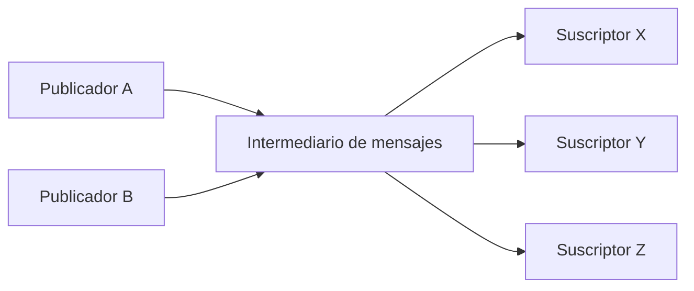
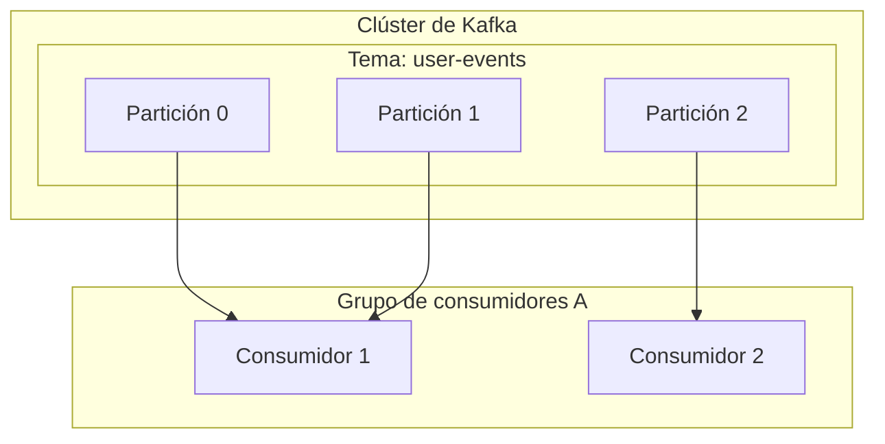

# 1. Introducción a la arquitectura basada en eventos

Los sistemas de software modernos tienen una escala y complejidad sin precedentes. A medida que la arquitectura de microservicios se convierte en la norma, la forma en que diseñamos la comunicación entre servicios es un factor crítico que determina el rendimiento, la disponibilidad y la mantenibilidad de todo el sistema. En este contexto, la **arquitectura basada en eventos** (Event-Driven Architecture: EDA) ha consolidado su posición como un poderoso paradigma para reducir el acoplamiento entre sistemas y lograr una alta escalabilidad.

# 2. Desafíos de la comunicación síncrona (REST / gRPC)

El enfoque más intuitivo para la comunicación entre servicios en sistemas distribuidos es la **comunicación síncrona** mediante API REST con solicitudes/respuestas HTTP, o gRPC, que es más rápido. Sin embargo, la comunicación síncrona presenta algunos desafíos inherentes.

## 2.1 Acoplamiento fuerte y fallas en cascada
En la comunicación síncrona, el llamador (cliente) y el llamado (servidor) están fuertemente acoplados en el tiempo. El cliente debe esperar hasta que el servidor responda, y si el servidor falla o su respuesta se retrasa debido a una alta carga, el impacto también se extiende al cliente. Si esto ocurre en cadena, existe el riesgo de provocar una **falla en cascada** que derribe todo el sistema.

## 2.2 Acumulación de latencia
En el procesamiento de transacciones en el que se llama a varios servicios secuencialmente, se suma la latencia de cada llamada. Por ejemplo, si en el procesamiento de un pedido se llama de forma síncrona a tres servicios: "verificación de inventario", "procesamiento de pago" y "gestión de envío", la suma de los tiempos de respuesta de cada servicio se convierte en el tiempo de espera del usuario.

## 2.3 Limitaciones de escalabilidad
Cuando se producen picos de tráfico temporales (tráfico en ráfagas), es difícil nivelar el tráfico en la comunicación síncrona, lo que obliga a escalar rápidamente los recursos de los servicios que reciben las solicitudes directamente. Si la escritura en la base de datos se convierte en un cuello de botella, la escalabilidad de todo el sistema se ve limitada.

# 3. Fundamentos de la arquitectura basada en eventos (EDA)

Para superar estos desafíos, surgió la **arquitectura basada en eventos**. En la EDA, los cambios de estado del sistema se representan como "eventos" y se intercambian de forma asíncrona entre componentes.

## 3.1 Modelo publicador-suscriptor (Pub/Sub)

El núcleo de la EDA es el **modelo publicador-suscriptor** (Pub/Sub). En este modelo, existe un "intermediario de mensajes" (message broker) que media los mensajes entre el creador del evento (publicador) y el consumidor del evento (suscriptor). El publicador solo necesita enviar el evento al intermediario y no necesita saber quién lo recibe. De manera similar, el suscriptor solo necesita recibir los eventos de su interés del intermediario y no necesita saber quién los publicó.



## 3.2 Patrón de Event Sourcing

Un patrón de diseño importante relacionado con la EDA es el **Event Sourcing**. En las aplicaciones tradicionales basadas en CRUD, solo se guarda el "estado actual" de los datos en la base de datos. Por otro lado, en el Event Sourcing, todas las operaciones que cambian el estado del sistema se guardan como una "secuencia de eventos" inmutable.

Si se necesita el estado actual, se reconstruye reproduciendo (replay) los eventos pasados en orden desde el principio. Esto no solo proporciona un registro de auditoría completo, sino que también permite restaurar el estado del sistema en cualquier momento del pasado. Además, es muy compatible con el patrón CQRS (Command Query Responsibility Segregation), que separa el modelo de lectura del modelo de escritura.

# 4. Colas de mensajes y streaming: RabbitMQ y Kafka

Históricamente, se han desarrollado dos tipos de middleware para permitir la entrega asíncrona de eventos: las colas de mensajes y las plataformas de streaming de eventos. Aquí compararemos a los representantes de cada uno, **RabbitMQ** y **Apache Kafka**, y profundizaremos en sus diferencias arquitectónicas.

## 4.1 RabbitMQ: Una cola de mensajes tradicional y robusta

RabbitMQ es un intermediario de mensajes muy consolidado diseñado sobre la base de AMQP (Advanced Message Queuing Protocol).

### 4.1.1 Flexibilidad de enrutamiento (Exchange y Queue)
La característica principal de RabbitMQ es su capacidad de enrutamiento de mensajes extremadamente rica. Los publicadores no envían mensajes directamente a las colas, sino a un componente llamado **Exchange**. El Exchange distribuye los mensajes a las colas adecuadas de acuerdo con reglas predefinidas (enlaces o bindings).

- **Direct Exchange**: Transfiere el mensaje si la clave de enrutamiento del mensaje coincide exactamente con la clave de enlace de la cola.
- **Topic Exchange**: Transfiere mediante una coincidencia de patrones flexible utilizando comodines.
- **Fanout Exchange**: Transmite incondicionalmente a todas las colas enlazadas.

### 4.1.2 Ciclo de vida del mensaje y gestión del estado
RabbitMQ tiene una filosofía de "intermediario inteligente, consumidor tonto". El intermediario asume la responsabilidad de la gestión del estado de los mensajes, como la confirmación de entrega (ACK) de los mensajes y el reintento en caso de error (enrutamiento a la Dead Letter Queue). Cuando un consumidor procesa un mensaje con éxito y devuelve un ACK, el mensaje se elimina de la cola.

## 4.2 Apache Kafka: Streaming de eventos distribuido

Kafka fue desarrollado originalmente por LinkedIn y diseñado para procesar datos de registro a gran escala con velocidades y rendimiento ultra altos. Tiene un paradigma arquitectónico completamente diferente al de RabbitMQ.

### 4.2.1 Estructura distribuida mediante temas y particiones
En Kafka, los mensajes (eventos) se clasifican en categorías lógicas llamadas **temas** (topics). Y para lograr escalabilidad, un tema se divide físicamente en múltiples **particiones** (partitions). Cada partición persiste en el disco como un archivo de registro inmutable y ordenado (Commit Log) de solo adición.



### 4.2.2 Compensaciones (Offsets) y "intermediario tonto, consumidor inteligente"
Kafka no gestiona el estado de los mensajes. Los mensajes no se eliminan inmediatamente después de que el consumidor los lea, sino que permanecen en el disco hasta que pasa el período de retención (Retention Period) configurado. El consumidor gestiona el **offset** que indica hasta qué punto ha leído en la partición. Con este modelo de "intermediario tonto, consumidor inteligente", Kafka reduce al mínimo la sobrecarga del intermediario, logrando un rendimiento asombroso de millones de mensajes por segundo.

## 4.3 Comparación y casos de uso de RabbitMQ y Kafka

- **Casos de uso adecuados para RabbitMQ**:
  Cuando se requiere un enrutamiento complejo, colas de trabajo que requieren un procesamiento confiable por mensaje y gestión de ACK (por ejemplo, tareas de envío de correo electrónico, procesamiento de imágenes pesado, gestión de tareas en el flujo de pedidos, etc.).
- **Casos de uso adecuados para Kafka**:
  Sistemas que necesitan procesar grandes cantidades de datos con alto rendimiento y reproducir eventos más tarde, como agregación de registros, seguimiento del comportamiento del usuario, procesamiento de flujos (stream processing) y almacenes de eventos para Event Sourcing.

# 5. Ejemplos de implementación: Código de RabbitMQ y Kafka

Veamos unas implementaciones de código simples usando cada middleware.

## 5.1 Ejemplo de implementación de RabbitMQ (Node.js / amqplib)

### Publicador (publisher.js)
```javascript
const amqp = require('amqplib');

async function send() {
    const connection = await amqp.connect('amqp://localhost');
    const channel = await connection.createChannel();
    const queue = 'task_queue';
    
    await channel.assertQueue(queue, { durable: true });
    const msg = '¡Hola RabbitMQ!';
    
    channel.sendToQueue(queue, Buffer.from(msg), { persistent: true });
    console.log(" [x] Enviado '%s'", msg);
    
    setTimeout(() => { connection.close(); process.exit(0) }, 500);
}
send();
```

### Consumidor (consumer.js)
```javascript
const amqp = require('amqplib');

async function receive() {
    const connection = await amqp.connect('amqp://localhost');
    const channel = await connection.createChannel();
    const queue = 'task_queue';
    
    await channel.assertQueue(queue, { durable: true });
    channel.prefetch(1); // Procesar uno a la vez
    
    console.log(" [*] Esperando mensajes en %s.", queue);
    channel.consume(queue, (msg) => {
        console.log(" [x] Recibido '%s'", msg.content.toString());
        setTimeout(() => {
            console.log(" [x] Hecho");
            channel.ack(msg);
        }, 1000);
    }, { noAck: false });
}
receive();
```

## 5.2 Ejemplo de implementación de Kafka (Node.js / kafkajs)

### Productor (producer.js)
```javascript
const { Kafka } = require('kafkajs');

const kafka = new Kafka({
  clientId: 'my-app',
  brokers: ['localhost:9092']
});

const producer = kafka.producer();

async function run() {
  await producer.connect();
  await producer.send({
    topic: 'test-topic',
    messages: [
      { value: '¡Hola Kafka!' },
    ],
  });
  console.log("Mensaje enviado a Kafka");
  await producer.disconnect();
}
run();
```

### Consumidor (consumer.js)
```javascript
const { Kafka } = require('kafkajs');

const kafka = new Kafka({
  clientId: 'my-app',
  brokers: ['localhost:9092']
});

const consumer = kafka.consumer({ groupId: 'test-group' });

async function run() {
  await consumer.connect();
  await consumer.subscribe({ topic: 'test-topic', fromBeginning: true });

  await consumer.run({
    eachMessage: async ({ topic, partition, message }) => {
      console.log({
        partition,
        offset: message.offset,
        value: message.value.toString(),
      });
    },
  });
}
run();
```

# 6. Conclusión

La arquitectura basada en eventos es una técnica poderosa para mantener los sistemas flexibles y escalables. Como intermediarios de mensajes principales, RabbitMQ y Kafka tienen filosofías de diseño diferentes. Elegir la tecnología adecuada en función de los requisitos del proyecto, como RabbitMQ si se requiere flexibilidad de enrutamiento y una gestión de estado confiable, o Kafka si se requiere un rendimiento abrumador, persistencia de datos y reproducibilidad, es la clave para construir un sistema distribuido exitoso.

# 7. Patrones de diseño avanzados y operaciones en la arquitectura basada en eventos

Al introducir una arquitectura basada en eventos en sistemas empresariales reales, surgen nuevos desafíos. Estos incluyen la consistencia de los datos, el manejo de errores y la observabilidad del sistema. Aquí explicaremos patrones avanzados para resolver estos problemas.

## 7.1 Transacciones distribuidas mediante el patrón Saga

En una arquitectura de microservicios, la gestión de transacciones que abarcan varios servicios con confirmación en dos fases (2PC) síncrona conduce a una disminución de la disponibilidad y el rendimiento. Como alternativa a esto, se utiliza el **patrón Saga**.

En el patrón Saga, una transacción distribuida se representa como una serie de transacciones locales. Cada servicio ejecuta una transacción local y, cuando finaliza, publica un evento para desencadenar el siguiente paso. Si un paso falla, se publica un evento para ejecutar una "transacción compensatoria" que deshace la transacción que ya se completó.

Saga tiene un "tipo de orquestación", en el que un controlador central dirige los pasos, y un "tipo de coreografía", en el que cada servicio se suscribe a los eventos de forma autónoma para operar. En EDA con un bus de eventos como Kafka, las sagas de tipo coreografía se pueden implementar de manera muy natural.

## 7.2 Patrón de bandeja de salida (Outbox) e idempotencia

Cuando un servicio actualiza su propia base de datos y simultáneamente publica un evento en Kafka o RabbitMQ, es necesario realizar "la actualización de la base de datos y la publicación del evento" de forma atómica. Si el proceso falla después de actualizar la base de datos y la publicación del evento falla, se producirá una inconsistencia en todo el sistema.

Esto se resuelve mediante el **patrón de bandeja de salida transaccional** ([Transaction](https://kenji.blog/es/p/rdbms-transaction-acid-isolation-level-lock/)al Outbox Pattern). El servicio escribe un registro del evento que se enviará en una tabla "Outbox" (Bandeja de salida) dentro de la misma transacción de base de datos que la actualización de datos original. Posteriormente, otro proceso en segundo plano (por ejemplo, una herramienta de CDC como Debezium) monitorea la tabla Outbox y entrega de manera confiable los eventos al intermediario de mensajes (entrega al menos una vez, At-Least-Once Delivery).

Junto con esto, es fundamental diseñar el lado del consumidor que recibe el evento para que tenga la propiedad de que el resultado no cambie incluso si recibe el mismo evento varias veces, es decir, **idempotencia** (Idempotency).

## 7.3 Arquitectura detallada de Kafka: El secreto de su rendimiento

Exploraremos con mayor profundidad técnica por qué Kafka puede ofrecer un rendimiento tan alto en comparación con los intermediarios tradicionales como RabbitMQ.

### 7.3.1 Tecnología Zero-Copy y caché de páginas
Kafka utiliza la optimización "zero-copy" a nivel del sistema operativo (la llamada al sistema `sendfile` en Linux) para la transferencia de datos del disco a la red. Esto permite que los datos se envíen directamente al socket de red sin copiarse del espacio del kernel al espacio de usuario. Además, Kafka aprovecha al máximo la caché de páginas (page cache) del sistema operativo en lugar de la memoria de la JVM, logrando un acceso secuencial de alta velocidad incluso para datos masivos.

### 7.3.2 Procesamiento por lotes y compresión de mensajes
Los productores de Kafka no envían mensajes al intermediario uno por uno, sino que los envían agrupados en lotes (batches). Además, al comprimir todo el lote con LZ4 o Snappy, se reduce drásticamente el ancho de banda de la red y el uso del disco.

## 7.4 Garantizar la observabilidad (Observability)

En los sistemas donde el procesamiento asíncrono está encadenado, la resolución de problemas cuando ocurre una falla se vuelve extremadamente difícil. Para rastrear en qué cola están atascados los mensajes o en qué servicio ocurrió el error, es obligatorio introducir el **rastreo distribuido** (Distributed Tracing, como OpenTelemetry, Jaeger, etc.). Asignar un `traceId` único a cada mensaje y vincularlo a registros (logs) y métricas para construir una base que visualice el flujo de eventos es una de las mejores prácticas para las operaciones de EDA.

# 7. Patrones de diseño avanzados y operaciones en la arquitectura basada en eventos

Al introducir una arquitectura basada en eventos en sistemas empresariales reales, surgen nuevos desafíos. Estos incluyen la consistencia de los datos, el manejo de errores y la observabilidad del sistema. Aquí explicaremos patrones avanzados para resolver estos problemas.

## 7.4 Garantizar la observabilidad (Observability)

En los sistemas donde el procesamiento asíncrono está encadenado, la resolución de problemas cuando ocurre una falla se vuelve extremadamente difícil. Para rastrear en qué cola están atascados los mensajes o en qué servicio ocurrió el error, es obligatorio introducir el **rastreo distribuido** (Distributed Tracing, como OpenTelemetry, Jaeger, etc.). Asignar un `traceId` único a cada mensaje y vincularlo a registros (logs) y métricas para construir una base que visualice el flujo de eventos es una de las mejores prácticas para las operaciones de EDA.
