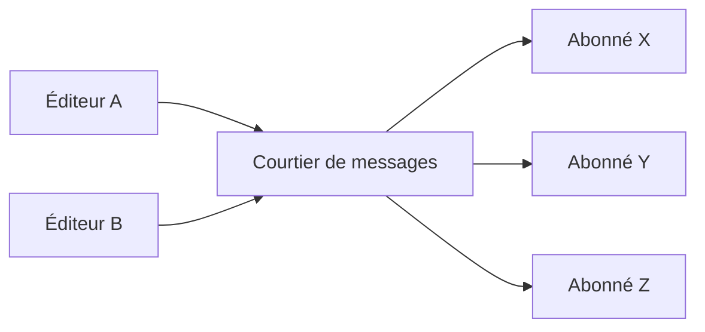
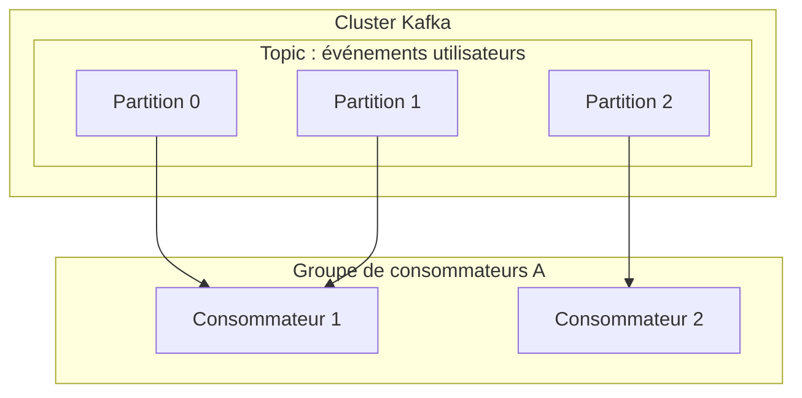

# 1. Invitation à l'architecture orientée événements

Les systèmes logiciels modernes ont une ampleur et une complexité sans précédent. L'architecture microservices devenant la norme, la manière de concevoir la communication entre les services est un élément crucial qui détermine les performances, la disponibilité et la maintenabilité de l'ensemble du système. Dans ce contexte, l' ** architecture orientée événements ** (Event-Driven Architecture : EDA) s'est solidement établie comme un paradigme puissant pour réduire le couplage entre les systèmes et atteindre une grande évolutivité.

# 2. Les défis de la communication synchrone (REST / gRPC)

L'approche la plus intuitive pour la communication inter-services dans un système distribué est la ** communication synchrone ** via des API REST avec requêtes/réponses HTTP ou via gRPC, plus rapide. Cependant, la communication synchrone présente plusieurs défis inhérents.

## 2.1 Couplage fort et pannes en cascade
Dans la communication synchrone, l'appelant (client) et l'appelé (serveur) sont fortement couplés temporellement. Le client doit attendre que le serveur réponde. Si le serveur tombe en panne ou si la réponse est retardée sous une forte charge, l'impact se propage au client. Si cela se produit en chaîne, cela risque de provoquer des ** pannes en cascade ** qui font tomber l'ensemble du système.

## 2.2 Accumulation de latence
Dans les traitements transactionnels où plusieurs services sont appelés séquentiellement, la latence de chaque appel s'additionne. Par exemple, si le traitement d'une commande appelle de manière synchrone trois services : "vérification des stocks", "traitement du paiement" et "organisation de la livraison", la somme des temps de réponse de chaque service devient le temps d'attente de l'utilisateur.

## 2.3 Limites de l'évolutivité
Lorsqu'un pic de trafic temporaire (trafic en rafale) se produit, il est difficile de lisser le trafic avec une communication synchrone, et il est nécessaire d'augmenter rapidement les ressources du service qui reçoit directement les requêtes. Si l'écriture dans la base de données devient un goulot d'étranglement, l'évolutivité de l'ensemble du système est limitée.

# 3. Bases de l'architecture orientée événements (EDA)

Pour surmonter ces défis, l' ** architecture orientée événements ** a fait son apparition. Dans l'EDA, les changements d'état du système sont représentés comme des "événements" et échangés de manière asynchrone entre les composants.

## 3.1 Modèle Éditeur-Abonné (Pub/Sub)

Au cœur de l'EDA se trouve le ** modèle Éditeur-Abonné ** (Pub/Sub). Dans ce modèle, il y a un "courtier de messages" (message broker) qui agit comme intermédiaire entre celui qui génère les événements (l'éditeur/publisher) et celui qui les consomme (l'abonné/subscriber). L'éditeur n'a qu'à envoyer les événements au courtier, sans avoir besoin de savoir qui les recevra. De même, l'abonné n'a qu'à recevoir les événements qui l'intéressent du courtier, sans avoir besoin de savoir qui les a publiés.



## 3.2 Modèle de l'Event Sourcing

Un modèle de conception important lié à l'EDA est l' ** Event Sourcing **. Dans les applications traditionnelles basées sur le CRUD, seul "l'état actuel" des données est stocké dans la base de données. En revanche, avec l'Event Sourcing, toutes les opérations qui modifient l'état du système sont stockées sous forme d'une "séquence d'événements" immuable.

Si l'état actuel est nécessaire, il est reconstruit en rejouant les événements passés dans l'ordre depuis le début. Cela fournit non seulement une piste d'audit complète, mais permet également de restaurer l'état du système à n'importe quel moment dans le passé. De plus, il est très compatible avec le modèle CQRS (Command Query Responsibility Segregation) qui sépare le modèle de lecture et le modèle d'écriture.

# 4. Files d'attente de messages et Streaming : RabbitMQ et Kafka

En tant que middleware pour réaliser la distribution asynchrone d'événements, deux types se sont historiquement développés : les files d'attente de messages et les plateformes de streaming d'événements. Ici, nous comparerons leurs représentants, ** RabbitMQ ** et ** Apache Kafka **, et approfondirons leurs différences architecturales.

## 4.1 RabbitMQ : File d'attente de messages traditionnelle et robuste

RabbitMQ est un courtier de messages très éprouvé conçu sur la base d'AMQP (Advanced Message Queuing Protocol).

### 4.1.1 Flexibilité du routage (Exchange et Queue)
La plus grande caractéristique de RabbitMQ est que ses fonctionnalités de routage de messages sont très riches. L'éditeur n'envoie pas le message directement à la file d'attente, mais l'envoie à un composant appelé ** Exchange **. L'Exchange distribue le message à la file d'attente appropriée selon des règles prédéfinies (bindings).

- ** Direct Exchange ** : Transfère lorsque la clé de routage du message correspond exactement à la clé de liaison de la file d'attente.
- ** Topic Exchange ** : Transfère basé sur une correspondance de motif flexible utilisant des caractères génériques.
- ** Fanout Exchange ** : Diffuse inconditionnellement à toutes les files d'attente liées.

### 4.1.2 Cycle de vie des messages et gestion d'état
RabbitMQ a pour philosophie "Smart Broker, Dumb Consumer". Le courtier est responsable de la gestion de l'état du message, comme l'accusé de réception (ACK) de la livraison du message et les nouvelles tentatives en cas d'erreur (routage vers la Dead Letter Queue). Lorsqu'un message est traité avec succès par un consommateur et qu'un ACK est renvoyé, ce message est supprimé de la file d'attente.

## 4.2 Apache Kafka : Streaming d'événements distribué

Kafka a été initialement développé par LinkedIn et conçu pour traiter des données de journaux à grande échelle à très grande vitesse et avec un débit élevé. Il a un paradigme architectural complètement différent de RabbitMQ.

### 4.2.1 Structure distribuée via Topics et Partitions
Dans Kafka, les messages (événements) sont classés en catégories logiques appelées ** Topics **. Et pour réaliser l'évolutivité, un topic est physiquement divisé en plusieurs ** Partitions **. Chaque partition est conservée sur le disque sous la forme d'un fichier journal ordonné et immuable, en mode ajout uniquement (Commit Log).



### 4.2.2 Offset et "Dumb Broker, Smart Consumer"
Kafka ne gère pas l'état des messages. Même si un message est lu par un consommateur, il n'est pas immédiatement supprimé et reste sur le disque jusqu'à l'expiration de la période de rétention (Retention Period) configurée. C'est le consommateur qui gère l' ** offset ** qui indique jusqu'où il a lu dans la partition. Grâce à ce modèle "Dumb Broker, Smart Consumer", Kafka réduit la surcharge du courtier au minimum et atteint un débit étonnant de millions de messages par seconde.

## 4.3 Comparaison et cas d'utilisation de RabbitMQ et Kafka

- ** Cas d'utilisation appropriés pour RabbitMQ ** :
  Lorsqu'un routage complexe est nécessaire, des files d'attente de travaux nécessitant un traitement fiable et une gestion des ACK par message (ex : tâches d'envoi d'e-mails, traitements d'images lourds, gestion des tâches dans les flux de commandes).
- ** Cas d'utilisation appropriés pour Kafka ** :
  Systèmes nécessitant le traitement de grandes quantités de données avec un débit élevé et la possibilité de rejouer les événements ultérieurement, tels que l'agrégation de logs, le suivi du comportement des utilisateurs, le traitement de flux, et les magasins d'événements pour l'Event Sourcing.

# 5. Exemples d'implémentation : Code pour RabbitMQ et Kafka

Examinons des implémentations de code simples utilisant chaque middleware.

## 5.1 Exemple d'implémentation de RabbitMQ (Node.js / amqplib)

### Éditeur (publisher.js)
```javascript
const amqp = require('amqplib');

async function send() {
    const connection = await amqp.connect('amqp://localhost');
    const channel = await connection.createChannel();
    const queue = 'task_queue';
    
    await channel.assertQueue(queue, { durable: true });
    const msg = 'Bonjour RabbitMQ !';
    
    channel.sendToQueue(queue, Buffer.from(msg), { persistent: true });
    console.log(" [x] Envoyé '%s'", msg);
    
    setTimeout(() => { connection.close(); process.exit(0) }, 500);
}
send();
```

### Consommateur (consumer.js)
```javascript
const amqp = require('amqplib');

async function receive() {
    const connection = await amqp.connect('amqp://localhost');
    const channel = await connection.createChannel();
    const queue = 'task_queue';
    
    await channel.assertQueue(queue, { durable: true });
    channel.prefetch(1); // Traiter un par un
    
    console.log(" [*] En attente de messages dans %s.", queue);
    channel.consume(queue, (msg) => {
        console.log(" [x] Reçu '%s'", msg.content.toString());
        setTimeout(() => {
            console.log(" [x] Terminé");
            channel.ack(msg);
        }, 1000);
    }, { noAck: false });
}
receive();
```

## 5.2 Exemple d'implémentation de Kafka (Node.js / kafkajs)

### Producteur (producer.js)
```javascript
const { Kafka } = require('kafkajs');

const kafka = new Kafka({
  clientId: 'my-app',
  brokers: ['localhost:9092']
});

const producer = kafka.producer();

async function run() {
  await producer.connect();
  await producer.send({
    topic: 'test-topic',
    messages: [
      { value: 'Bonjour Kafka !' },
    ],
  });
  console.log("Message envoyé à Kafka");
  await producer.disconnect();
}
run();
```

### Consommateur (consumer.js)
```javascript
const { Kafka } = require('kafkajs');

const kafka = new Kafka({
  clientId: 'my-app',
  brokers: ['localhost:9092']
});

const consumer = kafka.consumer({ groupId: 'test-group' });

async function run() {
  await consumer.connect();
  await consumer.subscribe({ topic: 'test-topic', fromBeginning: true });

  await consumer.run({
    eachMessage: async ({ topic, partition, message }) => {
      console.log({
        partition,
        offset: message.offset,
        value: message.value.toString(),
      });
    },
  });
}
run();
```

# 6. Conclusion

L'architecture orientée événements est une méthode puissante pour garder les systèmes flexibles et évolutifs. En tant que courtiers de messages au cœur de celle-ci, RabbitMQ et Kafka ont des philosophies de conception différentes. Choisir la technologie appropriée en fonction des exigences du projet (comme RabbitMQ pour la flexibilité du routage et la gestion fiable de l'état, ou Kafka pour un débit écrasant, la persistance des données et la rejouabilité) est la clé pour construire un système distribué réussi.

# 7. Modèles de conception avancés et opérations dans l'architecture orientée événements

Lorsque l'architecture orientée événements est introduite dans les systèmes d'entreprise réels, de nouveaux défis émergent. Ceux-ci incluent la cohérence des données, la gestion des erreurs et l'observabilité du système. Ici, nous expliquerons des modèles avancés pour résoudre ces problèmes.

## 7.1 [Transaction](https://kenji.blog/fr/p/rdbms-transaction-acid-isolation-level-lock/)s distribuées avec le modèle Saga

Dans une architecture microservices, gérer les transactions couvrant plusieurs services avec des validations à deux phases synchrones (2PC) entraîne une diminution de la disponibilité et des performances. Le ** modèle Saga ** est utilisé comme une alternative à cela.

Dans le modèle Saga, une transaction distribuée est représentée comme une séquence de transactions locales. Chaque service exécute une transaction locale et, une fois terminée, publie un événement pour déclencher l'étape suivante. Si une étape échoue, il publie un événement pour exécuter une "transaction de compensation" (Compensating Transaction) afin d'annuler les transactions déjà terminées.

Les Sagas peuvent être de type "Orchestration", où un contrôleur central dicte les étapes, ou "Chorégraphie", où chaque service s'abonne de manière autonome aux événements et agit. Dans une EDA utilisant un bus d'événements comme Kafka, une saga chorégraphiée peut être implémentée très naturellement.

## 7.2 Modèle Outbox et Idempotence

Lorsqu'un service met à jour sa propre base de données et publie simultanément un événement sur Kafka ou RabbitMQ, il est nécessaire d'effectuer "la mise à jour de la base de données et la publication de l'événement" de manière atomique. Si le processus plante après la mise à jour de la base de données et que la publication de l'événement échoue, il y aura une incohérence dans tout le système.

Le ** modèle Transactional Outbox ** résout ce problème. Le service écrit un enregistrement de l'événement à envoyer dans une table "Outbox" (boîte d'envoi) au sein de la même transaction de base de données que la mise à jour de données d'origine. Ensuite, un processus d'arrière-plan distinct (ex : un outil CDC comme Debezium) surveille la table Outbox et livre l'événement de manière fiable au courtier de messages (livraison "At-Least-Once").

Par conséquent, il est essentiel de concevoir le côté consommateur qui reçoit l'événement de manière à ce qu'il ait la propriété d' ** idempotence ** (Idempotency), c'est-à-dire que le résultat reste le même même si le même événement est reçu plusieurs fois.

## 7.3 Architecture détaillée de Kafka : Le secret de ses performances

Nous explorerons plus en profondeur d'un point de vue technique pourquoi Kafka peut atteindre des performances aussi élevées par rapport aux courtiers traditionnels comme RabbitMQ.

### 7.3.1 Technologie Zero-Copy et Cache de pages
Kafka utilise l'optimisation "zero-copy" au niveau de l'OS (l'appel système `sendfile` sous Linux) pour le transfert de données du disque vers le réseau. Cela permet aux données d'être envoyées directement au socket réseau sans être copiées de l'espace noyau vers l'espace utilisateur. De plus, Kafka exploite au maximum le cache de pages de l'OS plutôt que la mémoire de la JVM, ce qui permet un accès séquentiel rapide même pour des données massives.

### 7.3.2 Traitement par lots et compression des messages
Le producteur Kafka n'envoie pas les messages un par un, mais les envoie au courtier sous forme de lots. De plus, en compressant l'ensemble du lot avec LZ4 ou Snappy, il réduit considérablement la bande passante du réseau et l'utilisation du disque.

## 7.4 Assurer l'Observabilité (Observability)

Dans les systèmes où les processus asynchrones sont enchaînés, le dépannage en cas de panne devient extrêmement difficile. Afin de suivre dans quelle file d'attente un message est bloqué ou quel service a rencontré une erreur, l'introduction du ** traçage distribué ** (Distributed Tracing, comme OpenTelemetry, Jaeger) est essentielle. Attribuer un `traceId` unique à chaque message et le lier aux logs et aux métriques pour construire une infrastructure qui visualise le flux d'événements est une bonne pratique pour les opérations EDA.
