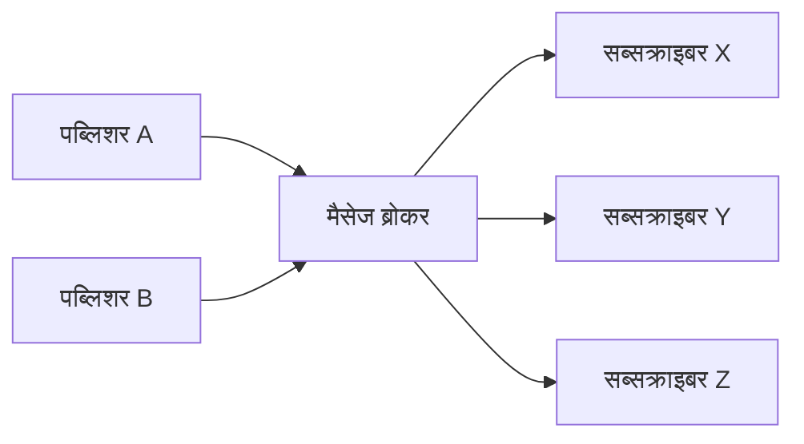
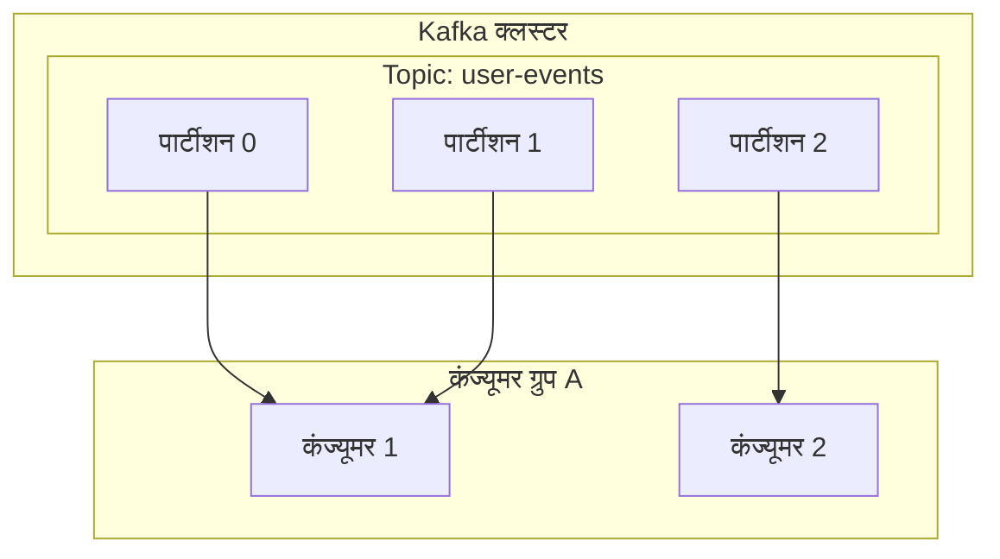

# 1. इवेंट-ड्रिवन आर्किटेक्चर का परिचय

आधुनिक सॉफ्टवेयर सिस्टम पहले से कहीं अधिक बड़े और जटिल हो गए हैं। [माइक्रोसर्विसेज आर्किटेक्चर](/hi/p/microservices-architecture-bff-api-gateway/) के मुख्यधारा बनने के साथ, सेवाओं के बीच संचार को कैसे डिज़ाइन किया जाए, यह पूरे सिस्टम के प्रदर्शन, उपलब्धता और मेंटेनेबिलिटी को निर्धारित करने वाला एक अत्यंत महत्वपूर्ण कारक है। इस संदर्भ में, ** इवेंट-ड्रिवन आर्किटेक्चर ** (Event-Driven Architecture: EDA) ने सिस्टम के बीच कपलिंग को कम करने और उच्च स्केलेबिलिटी प्राप्त करने के लिए एक शक्तिशाली पैराडाइम के रूप में अपनी जगह पक्की कर ली है।

# 2. सिंक्रोनस संचार (REST / gRPC) की चुनौतियाँ

डिस्ट्रिब्यूटेड सिस्टम में सर्विस-टू-सर्विस संचार का सबसे स्वाभाविक दृष्टिकोण HTTP रिक्वेस्ट/रिस्पॉन्स का उपयोग करने वाला REST API या तेज gRPC के माध्यम से ** सिंक्रोनस संचार ** है। हालाँकि, सिंक्रोनस संचार में कुछ मूलभूत चुनौतियाँ हैं।

## 2.1 टाइट कपलिंग और कैस्केडिंग फेलियर
सिंक्रोनस संचार में, कॉलर (क्लाइंट) और कैली (सर्वर) समय के साथ दृढ़ता से जुड़े होते हैं। क्लाइंट को सर्वर के जवाब देने तक प्रतीक्षा करनी होती है, और यदि सर्वर विफल हो जाता है या उच्च लोड के कारण रिस्पॉन्स में देरी होती है, तो इसका प्रभाव क्लाइंट पर भी पड़ता है। यदि यह एक श्रृंखला प्रतिक्रिया के रूप में होता है, तो यह ** कैस्केडिंग फेलियर ** का कारण बन सकता है, जिससे पूरा सिस्टम डाउन हो सकता है।

## 2.2 लेटेंसी का संचय
लेन-देन प्रसंस्करण में, जहाँ कई सेवाओं को क्रमिक रूप से कॉल किया जाता है, प्रत्येक कॉल की लेटेंसी जुड़ जाती है। उदाहरण के लिए, यदि ऑर्डर प्रोसेसिंग में "इन्वेंट्री चेक", "पेमेंट प्रोसेसिंग", और "शिपिंग व्यवस्था" की 3 सेवाओं को सिंक्रोनस रूप से कॉल किया जाता है, तो प्रत्येक सेवा के रिस्पॉन्स समय का योग उपयोगकर्ता का प्रतीक्षा समय बन जाता है।

## 2.3 स्केलेबिलिटी की सीमाएँ
यदि ट्रैफ़िक में अस्थायी स्पाइक (बर्स्ट ट्रैफ़िक) होता है, तो सिंक्रोनस संचार के साथ ट्रैफ़िक को सुचारू करना मुश्किल होता है, और सीधे रिक्वेस्ट प्राप्त करने वाली सेवा के संसाधनों को तेजी से स्केल-आउट करना आवश्यक हो जाता है। यदि डेटाबेस में लिखना कोई बॉटलनेक बन जाता है, तो पूरे सिस्टम की स्केलेबिलिटी सीमित हो जाती है।

# 3. इवेंट-ड्रिवन आर्किटेक्चर (EDA) की मूल बातें

इन चुनौतियों को दूर करने के लिए ** इवेंट-ड्रिवन आर्किटेक्चर ** का उदय हुआ। EDA में, सिस्टम स्थिति में परिवर्तन को "इवेंट" के रूप में दर्शाया जाता है, और घटकों के बीच असिंक्रोनस रूप से आदान-प्रदान किया जाता है।

## 3.1 पब्लिशर-सब्सक्राइबर मॉडल (Pub/Sub)

EDA के मूल में ** पब्लिशर-सब्सक्राइबर मॉडल ** (Pub/Sub) है। इस मॉडल में, इवेंट उत्पन्न करने वाले (पब्लिशर) और इवेंट का उपभोग करने वाले (सब्सक्राइबर) के बीच "मैसेज ब्रोकर" होता है जो मध्यस्थ के रूप में कार्य करता है। पब्लिशर को केवल ब्रोकर को इवेंट भेजने की आवश्यकता होती है, और उसे यह जानने की आवश्यकता नहीं होती कि उस इवेंट को कौन प्राप्त करेगा। इसी तरह, सब्सक्राइबर को केवल ब्रोकर से अपनी रुचि के इवेंट प्राप्त करने की आवश्यकता होती है, और उसे यह जानने की आवश्यकता नहीं होती कि इसे किसने प्रकाशित किया है।



## 3.2 इवेंट सोर्सिंग पैटर्न

EDA से संबंधित एक महत्वपूर्ण डिज़ाइन पैटर्न ** इवेंट सोर्सिंग ** (Event Sourcing) है। पारंपरिक CRUD-आधारित अनुप्रयोगों में, डेटाबेस में डेटा की केवल "वर्तमान स्थिति" सहेजी जाती है। दूसरी ओर, इवेंट सोर्सिंग में, सिस्टम की स्थिति को बदलने वाले सभी ऑपरेशनों को अपरिवर्तनीय (इम्यूटेबल) "इवेंट के अनुक्रम" के रूप में सहेजा जाता है।

जब वर्तमान स्थिति की आवश्यकता होती है, तो पिछले इवेंट्स को शुरू से क्रम में रीप्ले (रिप्ले) करके इसे फिर से बनाया जाता है। यह न केवल एक पूर्ण ऑडिट लॉग प्रदान करता है, बल्कि आपको सिस्टम को अतीत में किसी भी बिंदु पर उसकी स्थिति में वापस लाने की अनुमति भी देता है। यह CQRS (Command Query Responsibility Segregation) पैटर्न के साथ भी बहुत अच्छा काम करता है, जो रीड और राइट मॉडल को अलग करता है।

# 4. मैसेज क्यू और स्ट्रीमिंग: RabbitMQ और Kafka

इवेंट की असिंक्रोनस डिलीवरी को सक्षम करने के लिए मिडलवेयर के रूप में, ऐतिहासिक रूप से दो प्रकार विकसित हुए हैं: मैसेज क्यू और इवेंट स्ट्रीमिंग प्लेटफॉर्म। यहां, हम प्रत्येक के प्रतिनिधि, ** RabbitMQ ** और ** Apache Kafka ** की तुलना करेंगे, और उनके आर्किटेक्चर में अंतर को गहराई से जानेंगे।

## 4.1 RabbitMQ: पारंपरिक और मजबूत मैसेज क्यू

RabbitMQ एक बहुत ही सिद्ध मैसेज ब्रोकर है जिसे AMQP (Advanced Message Queuing Protocol) के आधार पर डिज़ाइन किया गया है।

### 4.1.1 रूटिंग लचीलापन (Exchange और Queue)
RabbitMQ की सबसे बड़ी विशेषता यह है कि इसकी मैसेज रूटिंग कार्यक्षमता बहुत समृद्ध है। पब्लिशर मैसेज को सीधे क्यू में नहीं भेजते हैं, बल्कि ** Exchange ** नामक घटक को भेजते हैं। Exchange पूर्व-परिभाषित नियमों (बाइंडिंग) के अनुसार मैसेज को उचित क्यू में वितरित करता है।

- ** Direct Exchange ** : यदि मैसेज की रूटिंग कुंजी और क्यू की बाइंडिंग कुंजी पूरी तरह से मेल खाती है, तो फॉरवर्ड करता है।
- ** Topic Exchange ** : वाइल्डकार्ड का उपयोग करके लचीले पैटर्न मिलान के माध्यम से फॉरवर्ड करता है।
- ** Fanout Exchange ** : बाउंड किए गए सभी क्यू में बिना शर्त ब्रॉडकास्ट करता है।

### 4.1.2 मैसेज जीवनचक्र और स्थिति प्रबंधन
RabbitMQ का दर्शन "स्मार्ट ब्रोकर, डंब कंज्यूमर" है। मैसेज स्थिति का प्रबंधन, जैसे कि मैसेज डिलीवरी कन्फर्मेशन (ACK) और त्रुटियों के मामले में फिर से प्रयास (Dead Letter Queue में रूटिंग), ब्रोकर की जिम्मेदारी है। जब किसी मैसेज को कंज्यूमर द्वारा सफलतापूर्वक प्रोसेस कर लिया जाता है और ACK वापस कर दिया जाता है, तो उस मैसेज को क्यू से हटा दिया जाता है।

## 4.2 Apache Kafka: डिस्ट्रिब्यूटेड इवेंट स्ट्रीमिंग

Kafka मूल रूप से LinkedIn पर विकसित किया गया था, और इसे बहुत अधिक गति और उच्च थ्रूपुट के साथ बड़े पैमाने पर लॉग डेटा को प्रोसेस करने के लिए डिज़ाइन किया गया था। इसका आर्किटेक्चर पैराडाइम RabbitMQ से बिल्कुल अलग है।

### 4.2.1 टॉपिक और पार्टीशन द्वारा डिस्ट्रिब्यूटेड संरचना
Kafka में, मैसेज (इवेंट) को ** टॉपिक ** नामक तार्किक श्रेणियों में वर्गीकृत किया जाता है। और स्केलेबिलिटी प्राप्त करने के लिए, एक टॉपिक को भौतिक रूप से कई ** पार्टीशन ** में विभाजित किया जाता है। प्रत्येक पार्टीशन को डिस्क पर क्रमित, अपरिवर्तनीय एपेंड-ओनली लॉग फ़ाइल (Commit Log) के रूप में लगातार सहेजा जाता है।



### 4.2.2 ऑफसेट और "डंब ब्रोकर, स्मार्ट कंज्यूमर"
Kafka मैसेज की स्थिति का प्रबंधन नहीं करता है। जब किसी मैसेज को कंज्यूमर द्वारा पढ़ लिया जाता है, तब भी इसे तुरंत नहीं हटाया जाता है, बल्कि निर्धारित अवधारण अवधि (Retention Period) बीत जाने तक डिस्क पर रहता है। कंज्यूमर पक्ष एक ** ऑफसेट ** (Offset) का प्रबंधन करता है जो इंगित करता है कि उसने पार्टीशन में कितनी दूर तक पढ़ा है। यह "डंब ब्रोकर, स्मार्ट कंज्यूमर" मॉडल Kafka को ब्रोकर ओवरहेड को काफी कम करने और प्रति सेकंड लाखों संदेशों का अविश्वसनीय थ्रूपुट प्राप्त करने की अनुमति देता है।

## 4.3 RabbitMQ और Kafka की तुलना और उपयोग के मामले

- ** RabbitMQ के उचित उपयोग के मामले ** :
  जब जटिल रूटिंग की आवश्यकता होती है, या जॉब क्यू जिन्हें प्रत्येक मैसेज के विश्वसनीय प्रसंस्करण और ACK प्रबंधन की आवश्यकता होती है (उदा: ईमेल भेजने के कार्य, भारी छवि प्रसंस्करण, ऑर्डर प्रवाह में कार्य प्रबंधन, आदि)।
- ** Kafka के उचित उपयोग के मामले ** :
  लॉग एग्रीगेशन, उपयोगकर्ता व्यवहार ट्रैकिंग, स्ट्रीम प्रोसेसिंग, और इवेंट सोर्सिंग के लिए इवेंट स्टोर जैसे सिस्टम, जहाँ बड़ी मात्रा में डेटा को उच्च थ्रूपुट के साथ प्रोसेस करने और बाद में इवेंट्स को रीप्ले करने की आवश्यकता होती है।

# 5. कार्यान्वयन उदाहरण: RabbitMQ और Kafka कोड

आइए प्रत्येक मिडलवेयर का उपयोग करके एक सरल कोड कार्यान्वयन देखें।

## 5.1 RabbitMQ कार्यान्वयन उदाहरण (Node.js / amqplib)

### पब्लिशर (publisher.js)
```javascript
const amqp = require('amqplib');

async function send() {
    const connection = await amqp.connect('amqp://localhost');
    const channel = await connection.createChannel();
    const queue = 'task_queue';
    
    await channel.assertQueue(queue, { durable: true });
    const msg = 'Hello RabbitMQ!';
    
    channel.sendToQueue(queue, Buffer.from(msg), { persistent: true });
    console.log(" [x] Sent '%s'", msg);
    
    setTimeout(() => { connection.close(); process.exit(0) }, 500);
}
send();
```

### कंज्यूमर (consumer.js)
```javascript
const amqp = require('amqplib');

async function receive() {
    const connection = await amqp.connect('amqp://localhost');
    const channel = await connection.createChannel();
    const queue = 'task_queue';
    
    await channel.assertQueue(queue, { durable: true });
    channel.prefetch(1); // एक-एक करके प्रोसेस करें
    
    console.log(" [*] Waiting for messages in %s.", queue);
    channel.consume(queue, (msg) => {
        console.log(" [x] Received '%s'", msg.content.toString());
        setTimeout(() => {
            console.log(" [x] Done");
            channel.ack(msg);
        }, 1000);
    }, { noAck: false });
}
receive();
```

## 5.2 Kafka कार्यान्वयन उदाहरण (Node.js / kafkajs)

### प्रोड्यूसर (producer.js)
```javascript
const { Kafka } = require('kafkajs');

const kafka = new Kafka({
  clientId: 'my-app',
  brokers: ['localhost:9092']
});

const producer = kafka.producer();

async function run() {
  await producer.connect();
  await producer.send({
    topic: 'test-topic',
    messages: [
      { value: 'Hello Kafka!' },
    ],
  });
  console.log("Kafka को मैसेज भेजा गया");
  await producer.disconnect();
}
run();
```

### कंज्यूमर (consumer.js)
```javascript
const { Kafka } = require('kafkajs');

const kafka = new Kafka({
  clientId: 'my-app',
  brokers: ['localhost:9092']
});

const consumer = kafka.consumer({ groupId: 'test-group' });

async function run() {
  await consumer.connect();
  await consumer.subscribe({ topic: 'test-topic', fromBeginning: true });

  await consumer.run({
    eachMessage: async ({ topic, partition, message }) => {
      console.log({
        partition,
        offset: message.offset,
        value: message.value.toString(),
      });
    },
  });
}
run();
```

# 6. निष्कर्ष

इवेंट-ड्रिवन आर्किटेक्चर सिस्टम को लचीला और स्केलेबल बनाए रखने के लिए एक शक्तिशाली तरीका है। इसके मूल में, RabbitMQ और Kafka के रूप में मैसेज ब्रोकर्स के अलग-अलग डिज़ाइन दर्शन हैं। प्रोजेक्ट की आवश्यकताओं के अनुसार सही तकनीक का चयन करना, जैसे रूटिंग लचीलापन और विश्वसनीय स्थिति प्रबंधन के लिए RabbitMQ, या अत्यधिक थ्रूपुट और डेटा पर्सिस्टेंस/रीप्ले क्षमता के लिए Kafka, एक सफल डिस्ट्रिब्यूटेड सिस्टम बनाने की कुंजी है।

# 7. इवेंट-ड्रिवन आर्किटेक्चर में उन्नत डिज़ाइन पैटर्न और संचालन

जब आप वास्तविक उद्यम प्रणालियों में इवेंट-ड्रिवन आर्किटेक्चर पेश करते हैं, तो नई चुनौतियाँ सामने आती हैं। ये डेटा स्थिरता, एरर हैंडलिंग, और सिस्टम ऑबजर्वेबिलिटी (अवलोकन क्षमता) हैं। यहां, हम इन्हें हल करने के लिए उन्नत पैटर्न की व्याख्या करेंगे।

## 7.1 सागा (Saga) पैटर्न का उपयोग करके डिस्ट्रिब्यूटेड ट्रांजेक्शन

[माइक्रोसर्विसेज आर्किटेक्चर](/hi/p/microservices-architecture-bff-api-gateway/) में, सिंक्रोनस 2-फेज कमिट (2PC) के साथ कई सेवाओं में फैले ट्रांजेक्शन को प्रबंधित करने से उपलब्धता और प्रदर्शन कम हो जाता है। एक विकल्प के रूप में, ** सागा पैटर्न ** का उपयोग किया जाता है।

सागा पैटर्न में, डिस्ट्रिब्यूटेड ट्रांजेक्शन को स्थानीय ट्रांजेक्शन के अनुक्रम के रूप में दर्शाया जाता है। प्रत्येक सेवा एक स्थानीय ट्रांजेक्शन को निष्पादित करती है और, जब यह पूरा हो जाता है, तो अगले चरण को ट्रिगर करने के लिए एक इवेंट जारी करती है। यदि कोई चरण विफल हो जाता है, तो यह पहले से पूर्ण किए गए ट्रांजेक्शन को पूर्ववत करने के लिए "कंपनसेटिंग ट्रांजेक्शन (Compensating [Transaction](https://kenji.blog/hi/p/rdbms-transaction-acid-isolation-level-lock/))" निष्पादित करने के लिए एक इवेंट जारी करता है।

सागा में दो प्रकार होते हैं: "ऑर्केस्ट्रेशन प्रकार" जहां एक केंद्रीय नियंत्रक चरणों को निर्देशित करता है, और "कोरियोग्राफी प्रकार" जहां प्रत्येक सेवा स्वायत्त रूप से इवेंट्स की सदस्यता लेती है और संचालित होती है। Kafka जैसे इवेंट बस का उपयोग करने वाले EDA में, कोरियोग्राफी प्रकार सागा को बहुत स्वाभाविक रूप से लागू किया जा सकता है।

## 7.2 आउटबॉक्स (Outbox) पैटर्न और आइडमपोटेंसी (Idempotency)

जब कोई सेवा अपने स्वयं के डेटाबेस को अपडेट करती है और उसी समय Kafka या RabbitMQ पर इवेंट जारी करती है, तो "डेटाबेस अपडेट और इवेंट इश्युएंस" को एटॉमिक रूप से करना आवश्यक है। यदि डेटाबेस अपडेट के बाद प्रक्रिया क्रैश हो जाती है, तो पूरे सिस्टम में विसंगतियां उत्पन्न हो जाएंगी।

इसे ** ट्रांजेक्शनल आउटबॉक्स पैटर्न ** द्वारा हल किया जाता है। सेवा उसी डेटाबेस ट्रांजेक्शन के भीतर "आउटबॉक्स (Outbox)" टेबल में भेजे जाने वाले इवेंट के रिकॉर्ड को लिखती है, जिस ट्रांजेक्शन में वास्तविक डेटा अपडेट होता है। उसके बाद, एक और बैकग्राउंड प्रक्रिया (जैसे Debezium जैसे CDC टूल) आउटबॉक्स टेबल की निगरानी करती है और सुनिश्चित करती है कि इवेंट मैसेज ब्रोकर को वितरित किया गया है (At-Least-Once Delivery)।

इसके साथ ही, यह आवश्यक है कि इवेंट प्राप्त करने वाले कंज्यूमर पक्ष को ** आइडमपोटेंसी (Idempotency) ** के लिए डिज़ाइन किया जाए, जिसका अर्थ है कि एक ही इवेंट को कई बार प्राप्त करने पर भी परिणाम नहीं बदलता है।

## 7.3 Kafka का विस्तृत आर्किटेक्चर: प्रदर्शन का रहस्य

हम तकनीकी गहराई में जानेंगे कि क्यों Kafka RabbitMQ जैसे पारंपरिक ब्रोकर्स की तुलना में इतना उच्च प्रदर्शन प्रदान कर सकता है।

### 7.3.1 ज़ीरो-कॉपी (Zero-Copy) तकनीक और पेज कैश
Kafka डिस्क से नेटवर्क में डेटा ट्रांसफर करने के लिए OS-स्तर के "ज़ीरो-कॉपी" अनुकूलन (Linux का `sendfile` सिस्टम कॉल) का उपयोग करता है। यह डेटा को कर्नेल स्पेस से यूज़र स्पेस में कॉपी किए बिना सीधे नेटवर्क सॉकेट में भेजे जाने की अनुमति देता है। इसके अलावा, Kafka JVM मेमोरी के बजाय OS के पेज कैश का पूरा लाभ उठाता है, इसलिए यह विशाल डेटा के लिए भी तेज़ अनुक्रमिक एक्सेस (sequential access) प्राप्त करता है।

### 7.3.2 मैसेज बैच प्रोसेसिंग और संपीड़न
Kafka प्रोड्यूसर मैसेज को एक-एक करके भेजने के बजाय, उन्हें बैच के रूप में ब्रोकर को भेजता है। इसके अलावा, LZ4 या Snappy आदि के साथ पूरे बैच को संपीड़ित करने से नेटवर्क बैंडविड्थ और डिस्क उपयोग में काफी कमी आती है।

## 7.4 ऑबजर्वेबिलिटी (Observability) सुनिश्चित करना

ऐसी प्रणाली में जहाँ असिंक्रोनस प्रसंस्करण श्रृंखला में होता है, विफलता के मामले में समस्या निवारण अत्यंत कठिन हो जाता है। यह ट्रैक करने के लिए कि किस क्यू में मैसेज अटके हैं और किस सेवा में त्रुटि हुई है, ** डिस्ट्रिब्यूटेड ट्रेसिंग ** (OpenTelemetry, Jaeger, आदि) की शुरुआत आवश्यक है। EDA संचालन के लिए सबसे अच्छी प्रथा प्रत्येक संदेश को एक अद्वितीय `traceId` निर्दिष्ट करके और इसे लॉग और मेट्रिक्स से जोड़कर इवेंट प्रवाह की कल्पना करने के लिए एक आधार बनाना है।
