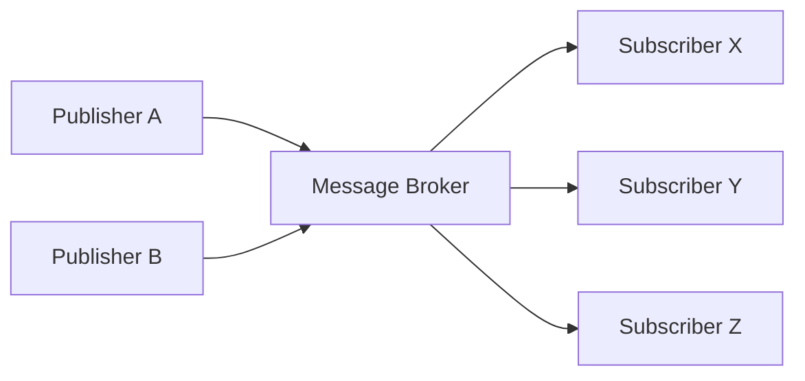
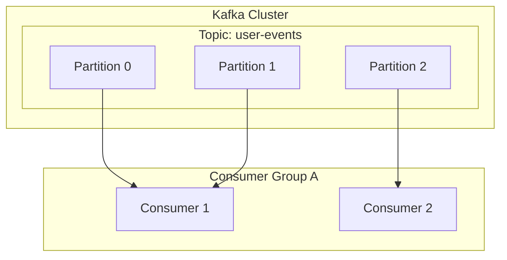

# 1. Pengantar ke Arsitektur Event-Driven

Sistem perangkat lunak modern memiliki skala dan kompleksitas yang belum pernah ada sebelumnya. Di tengah tren arsitektur microservices, cara merancang komunikasi antar layanan menjadi elemen yang sangat krusial yang menentukan performa, ketersediaan, dan skalabilitas seluruh sistem. Dalam konteks ini, ** Arsitektur Event-Driven ** (Event-Driven Architecture: EDA) telah mengukuhkan posisinya sebagai paradigma yang kuat untuk menurunkan tingkat ketergantungan antar sistem dan mewujudkan skalabilitas yang tinggi.

# 2. Tantangan Komunikasi Sinkron (REST / gRPC)

Pendekatan paling intuitif untuk komunikasi antar layanan dalam sistem terdistribusi adalah komunikasi sinkron menggunakan REST API dengan HTTP request/response, atau gRPC yang lebih cepat. Namun, komunikasi sinkron memiliki beberapa tantangan yang mendasar.

## 2.1 Ketergantungan Erat dan Kegagalan Beruntun (Cascade Failure)
Dalam komunikasi sinkron, pemanggil (klien) dan yang dipanggil (server) terikat kuat secara waktu. Klien harus menunggu sampai server memberikan respons, dan jika server mengalami kegagalan atau respons melambat karena beban tinggi, dampaknya akan meluas ke klien. Jika hal ini terjadi secara berantai, ada risiko menyebabkan ** kegagalan beruntun ** yang membuat seluruh sistem down.

## 2.2 Akumulasi Latensi
Dalam pemrosesan transaksi yang memanggil beberapa layanan secara berurutan, latensi dari setiap pemanggilan akan ditambahkan. Misalnya, dalam pemrosesan pesanan, jika kita memanggil tiga layanan: "Cek Stok", "Proses Pembayaran", dan "Atur Pengiriman" secara sinkron, total waktu respons dari setiap layanan akan menjadi waktu tunggu pengguna.

## 2.3 Keterbatasan Skalabilitas
Jika terjadi lonjakan lalu lintas sementara (burst traffic), komunikasi sinkron sulit untuk meratakan lalu lintas, dan kita perlu segera meningkatkan skala (scale out) sumber daya layanan yang menerima request secara langsung. Jika penulisan ke database menjadi bottleneck, skalabilitas seluruh sistem akan dibatasi.

# 3. Dasar-dasar Arsitektur Event-Driven (EDA)

Untuk mengatasi tantangan-tantangan ini, muncullah ** Arsitektur Event-Driven **. Dalam EDA, perubahan status sistem direpresentasikan sebagai "event" (kejadian) dan dipertukarkan secara asinkron antar komponen.

## 3.1 Model Publisher-Subscriber (Pub/Sub)

Inti dari EDA adalah ** model publisher-subscriber ** (Pub/Sub). Dalam model ini, terdapat "message broker" yang bertindak sebagai perantara pesan antara pihak yang menghasilkan event (publisher) dan pihak yang mengonsumsi event (subscriber). Publisher hanya perlu mengirim event ke broker, tanpa perlu tahu siapa yang akan menerimanya. Demikian pula, subscriber hanya perlu menerima event yang diinginkan dari broker, tanpa perlu tahu siapa yang menerbitkannya.



## 3.2 Pola Event Sourcing

Sebagai pola desain penting yang berkaitan dengan EDA, terdapat ** Event Sourcing **. Pada aplikasi berbasis CRUD tradisional, database hanya menyimpan "status saat ini" dari data. Sebaliknya, pada event sourcing, semua operasi yang mengubah status sistem disimpan sebagai "urutan event" yang tidak dapat diubah (immutable).

Jika status saat ini diperlukan, sistem akan merekonstruksinya dengan memutar ulang (replay) event masa lalu dari awal secara berurutan. Hal ini tidak hanya memberikan log audit yang lengkap, tetapi juga memungkinkan kita memulihkan status sistem pada titik waktu tertentu di masa lalu. Pola ini juga sangat cocok dengan pola CQRS (Command Query Responsibility Segregation) yang memisahkan model baca dan model tulis.

# 4. Message Queue dan Streaming: RabbitMQ dan Kafka

Sebagai middleware untuk mewujudkan pengiriman event asinkron, secara historis telah berkembang dua hal: message queue dan platform event streaming. Di sini, kita akan membandingkan ** RabbitMQ ** dan ** Apache Kafka **, yang merupakan perwakilan dari masing-masing kategori, dan mendalami perbedaan arsitekturnya.

## 4.1 RabbitMQ: Message Queue yang Tradisional dan Kuat

RabbitMQ adalah message broker yang sangat teruji, dirancang berdasarkan AMQP (Advanced Message Queuing Protocol).

### 4.1.1 Fleksibilitas Routing (Exchange dan Queue)
Fitur terbesar RabbitMQ adalah fungsi routing pesannya yang sangat kaya. Publisher tidak mengirim pesan langsung ke antrean (queue), melainkan ke komponen yang disebut ** Exchange **. Exchange akan mendistribusikan pesan ke antrean yang tepat sesuai dengan aturan (binding) yang telah ditentukan sebelumnya.

- ** Direct Exchange ** : Meneruskan pesan jika routing key pesan benar-benar cocok dengan binding key antrean.
- ** Topic Exchange ** : Meneruskan pesan menggunakan pencocokan pola fleksibel dengan wildcard.
- ** Fanout Exchange ** : Menyiarkan (broadcast) tanpa syarat ke semua antrean yang terikat.

### 4.1.2 Siklus Hidup Pesan dan Manajemen Status
RabbitMQ memiliki filosofi "Smart Broker, Dumb Consumer". Manajemen status pesan, seperti konfirmasi pengiriman pesan (ACK) dan percobaan ulang saat terjadi error (routing ke Dead Letter Queue), menjadi tanggung jawab broker. Ketika pesan berhasil diproses oleh consumer dan ACK dikembalikan, pesan tersebut akan dihapus dari antrean.

## 4.2 Apache Kafka: Event Streaming Terdistribusi

Kafka awalnya dikembangkan di LinkedIn dan dirancang untuk memproses data log skala besar dengan kecepatan dan throughput sangat tinggi. Kafka memiliki paradigma arsitektur yang sama sekali berbeda dengan RabbitMQ.

### 4.2.1 Struktur Terdistribusi melalui Topic dan Partition
Dalam Kafka, pesan (event) diklasifikasikan ke dalam kategori logis yang disebut ** Topic **. Kemudian, untuk mencapai skalabilitas, satu topik dibagi secara fisik menjadi beberapa ** Partition **. Setiap partisi disimpan ke dalam disk secara permanen sebagai file log append-only yang berurutan dan immutable (Commit Log).



### 4.2.2 Offset dan "Dumb Broker, Smart Consumer"
Kafka tidak melakukan manajemen status pesan. Pesan yang telah dibaca oleh consumer tidak akan langsung dihapus, melainkan tetap berada di disk sampai periode penyimpanan (Retention Period) yang ditentukan berlalu. Pihak consumer-lah yang mengelola ** Offset **, yang menunjukkan seberapa jauh ia telah membaca suatu partisi. Melalui model "Dumb Broker, Smart Consumer" ini, Kafka meminimalkan overhead pada broker dan mencapai throughput luar biasa hingga jutaan pesan per detik.

## 4.3 Perbandingan RabbitMQ dan Kafka serta Use Case

- ** Use case yang cocok untuk RabbitMQ ** :
  Ketika diperlukan routing yang kompleks, job queue yang membutuhkan pemrosesan pasti dan manajemen ACK untuk setiap pesan (contoh: tugas pengiriman email, pemrosesan gambar berat, manajemen tugas dalam alur pemesanan, dll).
- ** Use case yang cocok untuk Kafka ** :
  Sistem yang perlu memproses data dalam jumlah besar dengan throughput tinggi dan memutar ulang (replay) event di kemudian hari, seperti agregasi log, pelacakan perilaku pengguna, pemrosesan aliran (stream processing), dan event store untuk event sourcing.

# 5. Contoh Implementasi: Kode RabbitMQ dan Kafka

Mari kita lihat contoh implementasi kode sederhana menggunakan masing-masing middleware.

## 5.1 Contoh Implementasi RabbitMQ (Node.js / amqplib)

### Publisher (publisher.js)
```javascript
const amqp = require('amqplib');

async function send() {
    const connection = await amqp.connect('amqp://localhost');
    const channel = await connection.createChannel();
    const queue = 'task_queue';
    
    await channel.assertQueue(queue, { durable: true });
    const msg = 'Halo RabbitMQ!';
    
    channel.sendToQueue(queue, Buffer.from(msg), { persistent: true });
    console.log(" [x] Sent '%s'", msg);
    
    setTimeout(() => { connection.close(); process.exit(0) }, 500);
}
send();
```

### Consumer (consumer.js)
```javascript
const amqp = require('amqplib');

async function receive() {
    const connection = await amqp.connect('amqp://localhost');
    const channel = await connection.createChannel();
    const queue = 'task_queue';
    
    await channel.assertQueue(queue, { durable: true });
    channel.prefetch(1); // Proses satu per satu
    
    console.log(" [*] Waiting for messages in %s.", queue);
    channel.consume(queue, (msg) => {
        console.log(" [x] Received '%s'", msg.content.toString());
        setTimeout(() => {
            console.log(" [x] Done");
            channel.ack(msg);
        }, 1000);
    }, { noAck: false });
}
receive();
```

## 5.2 Contoh Implementasi Kafka (Node.js / kafkajs)

### Producer (producer.js)
```javascript
const { Kafka } = require('kafkajs');

const kafka = new Kafka({
  clientId: 'my-app',
  brokers: ['localhost:9092']
});

const producer = kafka.producer();

async function run() {
  await producer.connect();
  await producer.send({
    topic: 'test-topic',
    messages: [
      { value: 'Halo Kafka!' },
    ],
  });
  console.log("Message sent to Kafka");
  await producer.disconnect();
}
run();
```

### Consumer (consumer.js)
```javascript
const { Kafka } = require('kafkajs');

const kafka = new Kafka({
  clientId: 'my-app',
  brokers: ['localhost:9092']
});

const consumer = kafka.consumer({ groupId: 'test-group' });

async function run() {
  await consumer.connect();
  await consumer.subscribe({ topic: 'test-topic', fromBeginning: true });

  await consumer.run({
    eachMessage: async ({ topic, partition, message }) => {
      console.log({
        partition,
        offset: message.offset,
        value: message.value.toString(),
      });
    },
  });
}
run();
```

# 6. Penutup

Arsitektur Event-Driven adalah metode yang kuat untuk menjaga sistem tetap fleksibel dan skalabel. Sebagai message broker yang menjadi intinya, RabbitMQ dan Kafka masing-masing memiliki filosofi desain yang berbeda. Kunci untuk membangun sistem terdistribusi yang sukses adalah memilih teknologi yang tepat sesuai dengan kebutuhan proyek: RabbitMQ jika Anda membutuhkan fleksibilitas routing dan manajemen status yang pasti, atau Kafka jika Anda membutuhkan throughput yang luar biasa serta persistensi dan kemampuan memutar ulang data.

# 7. Pola Desain Lanjutan dan Operasional dalam Arsitektur Event-Driven

Ketika menerapkan arsitektur event-driven dalam sistem perusahaan nyata, tantangan baru akan muncul. Ini mencakup konsistensi data, penanganan error, dan kemampuan observasi sistem (observability). Di sini, kita akan membahas pola-pola lanjutan untuk menyelesaikan tantangan-tantangan ini.

## 7.1 Transaksi Terdistribusi dengan Pola Saga

Dalam arsitektur microservices, mengelola transaksi yang melibatkan beberapa layanan dengan sinkronisasi Two-Phase Commit (2PC) akan menyebabkan penurunan ketersediaan dan performa. Sebagai alternatif, ** Pola Saga ** digunakan.

Dalam pola Saga, transaksi terdistribusi direpresentasikan sebagai serangkaian transaksi lokal. Setiap layanan mengeksekusi transaksi lokal dan, setelah selesai, menerbitkan event untuk memicu langkah berikutnya. Jika suatu langkah gagal, sistem menerbitkan event untuk mengeksekusi "Transaksi Kompensasi (Compensating [Transaction](https://kenji.blog/id/p/rdbms-transaction-acid-isolation-level-lock/))" guna membatalkan transaksi yang telah selesai.

Ada dua jenis Saga: "Orchestration" di mana kontroler pusat menginstruksikan langkah-langkah, dan "Choreography" di mana setiap layanan beroperasi secara otonom dengan berlangganan event. Dalam EDA yang menggunakan event bus seperti Kafka, Saga berbasis Choreography dapat diimplementasikan dengan sangat alami.

## 7.2 Pola Outbox dan Idempotensi

Ketika sebuah layanan memperbarui databasenya sendiri dan sekaligus menerbitkan event ke Kafka atau RabbitMQ, "pembaruan database dan penerbitan event" harus dilakukan secara atomik. Jika proses crash setelah database diperbarui tetapi event gagal diterbitkan, akan terjadi ketidakkonsistenan pada seluruh sistem.

Solusi untuk ini adalah ** Pola Transactional Outbox **. Layanan menulis rekaman event yang harus dikirim ke tabel "Outbox" (kotak keluar) di dalam transaksi database yang sama dengan pembaruan data aslinya. Kemudian, proses latar belakang terpisah (misal: alat CDC seperti Debezium) akan memantau tabel Outbox dan memastikan event dikirim ke message broker secara pasti (At-Least-Once Delivery).

Sejalan dengan ini, sangat penting bagi consumer yang menerima event untuk dirancang sedemikian rupa sehingga hasilnya tetap sama meskipun menerima event yang sama berkali-kali, yang disebut memiliki sifat ** Idempotensi (Idempotency) **.

## 7.3 Arsitektur Detail Kafka: Rahasia Performa

Mengapa Kafka dapat memberikan performa yang jauh lebih tinggi dibandingkan dengan broker tradisional seperti RabbitMQ? Mari kita telusuri sisi teknisnya lebih dalam.

### 7.3.1 Teknologi Zero-Copy dan Page Cache
Kafka menggunakan optimisasi "zero-copy" di tingkat OS (system call `sendfile` di Linux) untuk transfer data dari disk ke jaringan. Dengan ini, data dikirim langsung ke network socket tanpa harus disalin dari kernel space ke user space. Selain itu, Kafka tidak memanfaatkan memori JVM, melainkan memaksimalkan penggunaan page cache OS, sehingga dapat mencapai akses berurutan (sequential access) yang sangat cepat meskipun menangani data berukuran raksasa.

### 7.3.2 Pemrosesan Batch Pesan dan Kompresi
Producer Kafka tidak mengirim pesan satu per satu, melainkan mengelompokkannya sebagai batch dan mengirimkannya ke broker. Lebih jauh lagi, dengan mengompres seluruh batch menggunakan algoritma seperti LZ4 atau Snappy, penggunaan bandwidth jaringan dan ruang disk dapat dikurangi secara drastis.

## 7.4 Memastikan Kemampuan Observasi (Observability)

Pada sistem dengan pemrosesan asinkron yang berantai, pemecahan masalah (troubleshooting) saat terjadi kegagalan menjadi sangat sulit. Untuk melacak antrean mana yang mengalami penumpukan pesan atau layanan mana yang mengalami error, sangat penting untuk menerapkan ** Distributed Tracing ** (seperti OpenTelemetry, Jaeger, dll). Menyematkan `traceId` unik ke setiap pesan dan mengaitkannya dengan log serta metrik guna membangun landasan untuk memvisualisasikan aliran event adalah praktik terbaik dalam operasional EDA.

# 7. Pola Desain Lanjutan dan Operasional dalam Arsitektur Event-Driven

Ketika menerapkan arsitektur event-driven dalam sistem perusahaan nyata, tantangan baru akan muncul. Ini mencakup konsistensi data, penanganan error, dan kemampuan observasi sistem (observability). Di sini, kita akan membahas pola-pola lanjutan untuk menyelesaikan tantangan-tantangan ini.

## 7.4 Memastikan Kemampuan Observasi (Observability)

Pada sistem dengan pemrosesan asinkron yang berantai, pemecahan masalah (troubleshooting) saat terjadi kegagalan menjadi sangat sulit. Untuk melacak antrean mana yang mengalami penumpukan pesan atau layanan mana yang mengalami error, sangat penting untuk menerapkan ** Distributed Tracing ** (seperti OpenTelemetry, Jaeger, dll). Menyematkan `traceId` unik ke setiap pesan dan mengaitkannya dengan log serta metrik guna membangun landasan untuk memvisualisasikan aliran event adalah praktik terbaik dalam operasional EDA.
