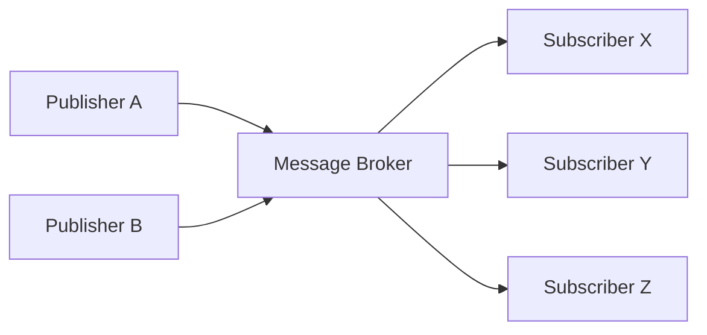
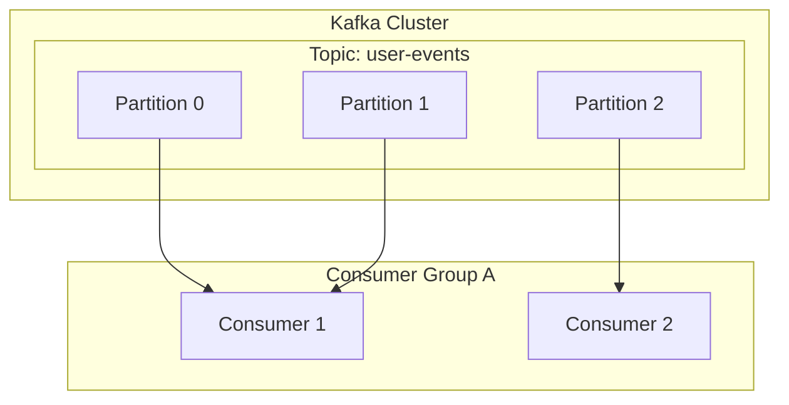

# 1. 이벤트 기반 아키텍처로의 초대

현대 소프트웨어 시스템은 그 어느 때보다 거대한 규모와 복잡성을 가지고 있습니다. 마이크로서비스 아키텍처가 주류가 됨에 따라 서비스 간의 통신을 어떻게 설계할 것인가는 시스템 전체의 성능, 가용성, 그리고 유지보수성을 좌우하는 매우 중요한 요소입니다. 이러한 맥락에서 ** 이벤트 기반 아키텍처 ** (Event-Driven Architecture: EDA)는 시스템 간의 결합도를 낮추고 높은 확장성을 실현하기 위한 강력한 패러다임으로서 확고한 입지를 다지고 있습니다.

# 2. 동기 통신 (REST / gRPC)의 과제

분산 시스템에서 서비스 간 통신의 가장 직관적인 접근 방식은 HTTP 요청/응답을 사용하는 REST API나, 더 빠른 gRPC를 통한 ** 동기 통신 ** 입니다. 하지만 동기 통신에는 몇 가지 본질적인 과제가 존재합니다.

## 2.1 강한 결합과 연쇄 장애
동기 통신에서는 호출자(클라이언트)와 피호출자(서버)가 시간적으로 강하게 결합됩니다. 클라이언트는 서버가 응답을 반환할 때까지 대기해야 하며, 서버에 장애가 발생하거나 높은 부하로 인해 응답이 지연될 경우 그 영향은 클라이언트에게도 파급됩니다. 이러한 현상이 연쇄적으로 발생하면 시스템 전체가 다운되는 ** 연쇄 장애 ** 를 일으킬 위험이 있습니다.

## 2.2 지연 시간의 축적
여러 서비스를 순서대로 호출하는 트랜잭션 처리에서는 각 호출의 지연 시간이 합산됩니다. 예를 들어, 주문 처리에서 '재고 확인', '결제 처리', '배송 수배'라는 3개의 서비스를 동기적으로 호출할 경우, 각 서비스의 응답 시간의 합이 사용자의 대기 시간이 되어 버립니다.

## 2.3 확장성의 제한
일시적인 트래픽 급증(버스트 트래픽)이 발생할 경우 동기 통신으로는 트래픽을 평준화하기 어려워 요청을 직접 처리하는 서비스의 리소스를 급격히 스케일 아웃해야 합니다. 데이터베이스 쓰기 등이 병목 현상의 원인이 되는 경우 시스템 전체의 확장성이 제한됩니다.

# 3. 이벤트 기반 아키텍처(EDA)의 기초

이러한 과제를 극복하기 위해 등장한 것이 ** 이벤트 기반 아키텍처 ** 입니다. EDA에서는 시스템 상태 변화를 '이벤트'로 표현하고 컴포넌트 간에 비동기적으로 주고받습니다.

## 3.1 퍼블리셔-서브스크라이버 모델 (Pub/Sub)

EDA의 핵심을 이루는 것은 ** 퍼블리셔-서브스크라이버 모델 ** (Pub/Sub)입니다. 이 모델에서는 이벤트를 생성하는 측(퍼블리셔)과 이벤트를 소비하는 측(서브스크라이버) 사이에 메시지 중개 역할을 하는 '메시지 브로커'가 존재합니다. 퍼블리셔는 이벤트를 브로커에게 전송하기만 하면 되며, 누가 그 이벤트를 수신하는지 알 필요가 없습니다. 마찬가지로 서브스크라이버는 관심 있는 이벤트를 브로커로부터 수신하기만 하면 되며, 누가 발행했는지 알 필요가 없습니다.



## 3.2 이벤트 소싱 패턴

EDA와 관련된 중요한 설계 패턴으로 ** 이벤트 소싱 ** (Event Sourcing)이 있습니다. 기존의 CRUD 기반 애플리케이션에서는 데이터베이스에 데이터의 '현재 상태'만이 저장됩니다. 반면 이벤트 소싱에서는 시스템 상태를 변경하는 모든 작업을 불변(Immutable)의 '이벤트 시퀀스'로 저장합니다.

현재 상태가 필요한 경우에는 과거의 이벤트를 처음부터 순서대로 재생(Replay)하여 재구성합니다. 이를 통해 완벽한 감사 로그를 얻을 수 있을 뿐만 아니라, 과거 임의의 시점의 시스템 상태를 복원하는 것이 가능해집니다. 또한 읽기 모델과 쓰기 모델을 분리하는 CQRS(Command Query Responsibility Segregation) 패턴과도 매우 잘 어울립니다.

# 4. 메시지 큐와 스트리밍: RabbitMQ와 Kafka

이벤트의 비동기 전송을 실현하기 위한 미들웨어로서 역사적으로 메시지 큐와 이벤트 스트리밍 플랫폼 두 가지가 발전해 왔습니다. 여기서는 각각의 대표 격인 ** RabbitMQ ** 와 ** Apache Kafka ** 를 비교하고 아키텍처의 차이를 깊이 파헤쳐 봅니다.

## 4.1 RabbitMQ: 전통적이고 견고한 메시지 큐

RabbitMQ는 AMQP(Advanced Message Queuing Protocol)를 기반으로 설계된 매우 검증된 메시지 브로커입니다.

### 4.1.1 라우팅의 유연성 (Exchange와 Queue)
RabbitMQ의 가장 큰 특징은 메시지 라우팅 기능이 매우 풍부하다는 점입니다. 퍼블리셔는 메시지를 큐로 직접 보내는 것이 아니라 ** Exchange ** 라고 불리는 컴포넌트로 전송합니다. Exchange는 미리 정의된 규칙(바인딩)에 따라 적절한 큐로 메시지를 분배합니다.

- ** Direct Exchange ** : 메시지의 라우팅 키와 큐의 바인딩 키가 완전히 일치할 경우 전송.
- ** Topic Exchange ** : 와일드카드를 사용한 유연한 패턴 매칭을 통한 전송.
- ** Fanout Exchange ** : 바인딩된 모든 큐에 무조건 브로드캐스트.

### 4.1.2 메시지의 수명 주기와 상태 관리
RabbitMQ는 '스마트 브로커, 덤 컨슈머(Smart Broker, Dumb Consumer)'라는 철학을 가지고 있습니다. 메시지 전송 확인(ACK)이나 오류 시 재시도(Dead Letter Queue로의 라우팅) 등 메시지의 상태 관리는 브로커 측이 책임을 집니다. 메시지가 컨슈머에 의해 정상적으로 처리되고 ACK가 반환되면 그 메시지는 큐에서 삭제됩니다.

## 4.2 Apache Kafka: 분산 이벤트 스트리밍

Kafka는 원래 LinkedIn에서 개발되었으며, 대규모 로그 데이터를 초고속, 높은 처리량으로 처리하기 위해 설계되었습니다. RabbitMQ와는 전혀 다른 아키텍처 패러다임을 가지고 있습니다.

### 4.2.1 토픽과 파티션에 의한 분산 구조
Kafka에서 메시지(이벤트)는 ** 토픽 ** 이라는 논리적 범주로 분류됩니다. 그리고 확장성을 실현하기 위해 하나의 토픽은 여러 개의 ** 파티션 ** 으로 물리적으로 분할됩니다. 각 파티션은 순서가 지정된 불변의 추가 전용 로그 파일(Commit Log)로서 디스크에 영구 저장됩니다.



### 4.2.2 오프셋과 '덤 브로커, 스마트 컨슈머'
Kafka는 메시지의 상태 관리를 수행하지 않습니다. 메시지는 컨슈머가 읽더라도 즉시 삭제되지 않으며, 설정된 보관 기간(Retention Period)이 지날 때까지 디스크에 남습니다. 컨슈머 측이 자신이 파티션의 어디까지 읽었는지를 나타내는 ** 오프셋 ** (Offset)을 관리합니다. 이 '덤 브로커, 스마트 컨슈머(Dumb Broker, Smart Consumer)' 모델을 통해 Kafka는 브로커의 오버헤드를 극한까지 줄이고 초당 수백만 개의 메시지라는 놀라운 처리량을 달성하고 있습니다.

## 4.3 RabbitMQ와 Kafka의 비교 및 사용 사례

- ** RabbitMQ에 적합한 사용 사례 ** :
  복잡한 라우팅이 필요한 경우, 메시지별로 확실한 처리와 ACK 관리가 필요한 작업 큐 (예: 이메일 전송 작업, 무거운 이미지 처리, 주문 흐름에서의 작업 관리 등).
- ** Kafka에 적합한 사용 사례 ** :
  로그 집계, 사용자 행동 추적, 스트림 처리, 이벤트 소싱의 이벤트 스토어 등 대량의 데이터를 높은 처리량으로 처리하고 나중에 이벤트를 재생해야 하는 시스템.

# 5. 구현 예: RabbitMQ와 Kafka 코드

각각의 미들웨어를 사용한 간단한 코드 구현을 살펴보겠습니다.

## 5.1 RabbitMQ 구현 예 (Node.js / amqplib)

### 퍼블리셔 (publisher.js)
```javascript
const amqp = require('amqplib');

async function send() {
    const connection = await amqp.connect('amqp://localhost');
    const channel = await connection.createChannel();
    const queue = 'task_queue';
    
    await channel.assertQueue(queue, { durable: true });
    const msg = 'Hello RabbitMQ!';
    
    channel.sendToQueue(queue, Buffer.from(msg), { persistent: true });
    console.log(" [x] Sent '%s'", msg);
    
    setTimeout(() => { connection.close(); process.exit(0) }, 500);
}
send();
```

### 컨슈머 (consumer.js)
```javascript
const amqp = require('amqplib');

async function receive() {
    const connection = await amqp.connect('amqp://localhost');
    const channel = await connection.createChannel();
    const queue = 'task_queue';
    
    await channel.assertQueue(queue, { durable: true });
    channel.prefetch(1); // 1개씩 처리
    
    console.log(" [*] Waiting for messages in %s.", queue);
    channel.consume(queue, (msg) => {
        console.log(" [x] Received '%s'", msg.content.toString());
        setTimeout(() => {
            console.log(" [x] Done");
            channel.ack(msg);
        }, 1000);
    }, { noAck: false });
}
receive();
```

## 5.2 Kafka 구현 예 (Node.js / kafkajs)

### 프로듀서 (producer.js)
```javascript
const { Kafka } = require('kafkajs');

const kafka = new Kafka({
  clientId: 'my-app',
  brokers: ['localhost:9092']
});

const producer = kafka.producer();

async function run() {
  await producer.connect();
  await producer.send({
    topic: 'test-topic',
    messages: [
      { value: 'Hello Kafka!' },
    ],
  });
  console.log("Message sent to Kafka");
  await producer.disconnect();
}
run();
```

### 컨슈머 (consumer.js)
```javascript
const { Kafka } = require('kafkajs');

const kafka = new Kafka({
  clientId: 'my-app',
  brokers: ['localhost:9092']
});

const consumer = kafka.consumer({ groupId: 'test-group' });

async function run() {
  await consumer.connect();
  await consumer.subscribe({ topic: 'test-topic', fromBeginning: true });

  await consumer.run({
    eachMessage: async ({ topic, partition, message }) => {
      console.log({
        partition,
        offset: message.offset,
        value: message.value.toString(),
      });
    },
  });
}
run();
```

# 6. 맺음말

이벤트 기반 아키텍처는 시스템을 유연하고 확장 가능하게 유지하기 위한 강력한 방법입니다. 그 핵심을 담당하는 메시지 브로커로서 RabbitMQ와 Kafka는 각각 다른 설계 철학을 가지고 있습니다. 라우팅의 유연성과 확실한 상태 관리를 원한다면 RabbitMQ, 압도적인 처리량과 데이터의 영속성 및 재생성을 원한다면 Kafka와 같이 프로젝트의 요구 사항에 맞춰 적절한 기술을 선택하는 것이 성공적인 분산 시스템 구축의 핵심입니다.

# 7. 이벤트 기반 아키텍처에서의 고급 설계 패턴과 운영

실제 엔터프라이즈 시스템에 이벤트 기반 아키텍처를 도입하면 새로운 과제가 떠오릅니다. 그것은 데이터의 일관성, 오류 처리, 시스템의 관찰 가능성(옵저버빌리티) 등입니다. 여기서는 이를 해결하기 위한 고급 패턴에 대해 설명합니다.

## 7.1 사가 (Saga) 패턴을 통한 분산 트랜잭션

마이크로서비스 아키텍처에서 여러 서비스에 걸친 트랜잭션을 동기적인 2단계 커밋(2PC)으로 관리하는 것은 가용성과 성능 저하를 초래합니다. 이를 대체하는 기법으로 ** 사가 패턴 ** 이 사용됩니다.

사가 패턴에서는 로컬 트랜잭션의 연속으로서 분산 트랜잭션을 표현합니다. 각 서비스는 로컬 트랜잭션을 실행하고, 완료되면 다음 단계를 트리거하기 위한 이벤트를 발행합니다. 만약 특정 단계에서 실패할 경우, 이미 완료된 트랜잭션을 취소하기 위한 '보상 트랜잭션(Compensating [Transaction](https://kenji.blog/ko/p/rdbms-transaction-acid-isolation-level-lock/))'을 실행하는 이벤트를 발행합니다.

사가에는 중앙 컨트롤러가 단계를 지시하는 '오케스트레이션(Orchestration) 방식'과 각 서비스가 자율적으로 이벤트를 구독하여 동작하는 '코레오그래피(Choreography) 방식'이 있습니다. Kafka와 같은 이벤트 버스를 사용하는 EDA에서는 코레오그래피 방식의 사가가 매우 자연스럽게 구현될 수 있습니다.

## 7.2 아웃박스 (Outbox) 패턴과 멱등성

서비스가 자체 데이터베이스를 업데이트하고 동시에 Kafka나 RabbitMQ에 이벤트를 발행할 경우, '데이터베이스 업데이트와 이벤트 발행'을 원자적으로(Atomic) 수행해야 합니다. 만약 데이터베이스 업데이트 후 프로세스가 크래시되어 이벤트 발행이 실패하면 시스템 전체의 불일치가 발생합니다.

이를 해결하는 것이 ** 트랜잭셔널 아웃박스 패턴 ** 입니다. 서비스는 본래의 데이터 업데이트와 동일한 데이터베이스 트랜잭션 내에서, 'Outbox(보낼 편지함)' 테이블에 전송할 이벤트 레코드를 기록합니다. 이후 별도의 백그라운드 프로세스(예: Debezium 등의 CDC 도구)가 Outbox 테이블을 모니터링하여 메시지 브로커에 이벤트를 확실하게 전송(At-Least-Once Delivery)합니다.

이에 따라 이벤트를 수신하는 컨슈머 측은 같은 이벤트를 여러 번 받아도 결과가 변하지 않는 성질, 즉 ** 멱등성 (Idempotency) ** 을 가지도록 설계하는 것이 필수적입니다.

## 7.3 Kafka의 세부 아키텍처: 성능의 비밀

Kafka가 RabbitMQ 등 기존의 브로커와 비교하여 왜 이토록 높은 성능을 발휘할 수 있는지 기술적인 깊은 곳을 살펴봅니다.

### 7.3.1 제로 카피 (Zero-Copy) 기술과 페이지 캐시
Kafka는 디스크에서 네트워크로의 데이터 전송에 OS 수준의 '제로 카피' 최적화(Linux의 `sendfile` 시스템 콜)를 사용합니다. 이를 통해 데이터는 커널 공간에서 사용자 공간으로 복사되지 않고 네트워크 소켓으로 직접 전송됩니다. 또한 Kafka는 JVM의 메모리가 아니라 OS의 페이지 캐시를 최대한 활용하기 때문에 거대한 데이터라도 고속의 순차적 접근(Sequential Access)을 실현하고 있습니다.

### 7.3.2 메시지 일괄 처리 및 압축
Kafka 프로듀서는 메시지를 하나씩 전송하는 것이 아니라 배치(Batch)로 묶어 브로커로 전송합니다. 나아가 배치 전체를 LZ4나 Snappy 등으로 압축함으로써 네트워크 대역폭과 디스크 사용량을 획기적으로 줄입니다.

## 7.4 관찰 가능성 (Observability) 확보

비동기 처리가 연쇄적으로 일어나는 시스템에서는 장애 발생 시 문제 해결이 매우 어려워집니다. 어느 큐에 메시지가 체류하고 있는지, 어느 서비스에서 오류가 발생했는지를 추적하기 위해 ** 분산 추적 ** (OpenTelemetry, Jaeger 등)의 도입이 필수입니다. 각 메시지에 고유한 `traceId` 를 부여하고 로그나 메트릭과 연결함으로써 이벤트의 흐름을 시각화하는 기반을 구축하는 것이 EDA 운영의 모범 사례입니다.
