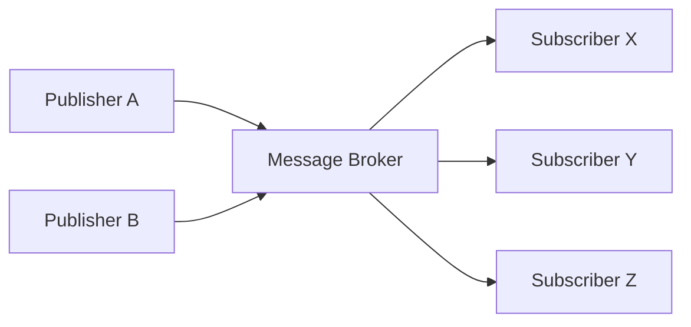
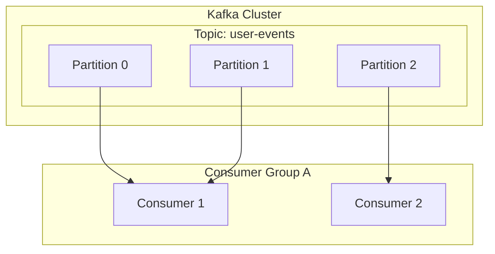

# 1. イベント駆動アーキテクチャへの誘い

現代のソフトウェアシステムは、かつてないほどの規模と複雑さを持っています。[マイクロサービス](https://kenji.blog/p/microservices-architecture-bff-api-gateway/)アーキテクチャが主流となる中、サービス間の通信をどのように設計するかは、システム全体のパフォーマンス、可用性、そして保守性を左右する極めて重要な要素です。この文脈において、 ** イベント駆動アーキテクチャ ** （Event-Driven Architecture: EDA）は、システム間の結合度を下げ、高いスケーラビリティを実現するための強力なパラダイムとして確固たる地位を築いています。

# 2. 同期通信（REST / gRPC）の課題

[分散システム](https://kenji.blog/p/cap-theorem-distributed-systems-tradeoff/)におけるサービス間通信の最も直感的なアプローチは、HTTPリクエスト/レスポンスを用いたREST APIや、より高速なgRPCによる ** 同期通信 ** です。しかし、同期通信にはいくつかの本質的な課題が存在します。

## 2.1 密結合とカスケード障害
同期通信では、呼び出し元（クライアント）と呼び出し先（サーバー）が時間的に強く結合します。クライアントはサーバーが応答を返すまで待機する必要があり、サーバーに障害が発生した場合や高負荷で応答が遅延した場合、その影響はクライアントにも波及します。これが連鎖的に発生すると、システム全体がダウンする ** カスケード障害 ** を引き起こす危険性があります。

## 2.2 レイテンシの蓄積
複数のサービスを順番に呼び出すような[トランザクション](https://kenji.blog/p/rdbms-transaction-acid-isolation-level-lock/)処理では、各呼び出しのレイテンシが加算されます。例えば、注文処理において「在庫確認」「決済処理」「配送手配」という3つのサービスを同期的に呼び出す場合、それぞれのサービスのレスポンスタイムの合計がユーザーの待ち時間となってしまいます。

## 2.3 スケーラビリティの制限
一時的なトラフィックのスパイク（バーストトラフィック）が発生した場合、同期通信ではトラフィックを平準化することが難しく、リクエストを直接受け止めるサービスのリソースを急激にスケールアウトさせる必要があります。データベースへの書き込みなどがボトルネックとなる場合、システム全体のスケーラビリティが制限されます。

# 3. イベント駆動アーキテクチャ（EDA）の基礎

これらの課題を克服するために登場したのが ** イベント駆動アーキテクチャ ** です。EDAでは、システムの状態変化を「イベント」として表現し、コンポーネント間で非同期にやり取りします。

## 3.1 パブリッシャー・サブスクライバーモデル（Pub/Sub）

EDAの核心を成すのが ** パブリッシャー・サブスクライバーモデル ** （Pub/Sub）です。このモデルでは、イベントを生成する側（パブリッシャー）と、イベントを消費する側（サブスクライバー）の間に、メッセージの仲介役である「メッセージブローカー」が存在します。パブリッシャーはイベントをブローカーに送信するだけでよく、誰がそのイベントを受け取るかを知る必要はありません。同様に、サブスクライバーは関心のあるイベントをブローカーから受信するだけでよく、誰が発行したかを知る必要はありません。



## 3.2 イベントソーシングパターン

EDAに関連する重要な設計パターンとして ** イベントソーシング ** （Event Sourcing）があります。従来のCRUDベースのアプリケーションでは、データベースにはデータの「現在の状態」のみが保存されます。一方、イベントソーシングでは、システムの状態を変更するすべての操作を不変（イミュータブル）な「イベントのシーケンス」として保存します。

現在の状態が必要な場合は、過去のイベントを最初から順番に再生（リプレイ）することで再構築します。これにより、完全な監査ログが得られるだけでなく、過去の任意の時点におけるシステムの状態を復元することが可能になります。また、読み取りモデルと書き込みモデルを分離するCQRS（Command Query Responsibility Segregation）パターンとの相性も抜群です。

# 4. メッセージキューとストリーミング：RabbitMQとKafka

イベントの非同期配信を実現するためのミドルウェアとして、歴史的にメッセージキューとイベントストリーミングプラットフォームの2つが発展してきました。ここでは、それぞれの代表格である ** RabbitMQ ** と ** Apache Kafka ** を比較し、アーキテクチャの違いを深掘りします。

## 4.1 RabbitMQ：伝統的で堅牢なメッセージキュー

RabbitMQは、AMQP（Advanced Message Queuing Protocol）をベースに設計された、非常に実績のあるメッセージブローカーです。

### 4.1.1 ルーティングの柔軟性（ExchangeとQueue）
RabbitMQの最大の特徴は、メッセージのルーティング機能が非常に豊富であることです。パブリッシャーはメッセージを直接キューに送るのではなく、 ** Exchange ** と呼ばれるコンポーネントに送信します。Exchangeはあらかじめ定義されたルール（バインディング）に従って、適切なキューにメッセージを振り分けます。

- ** Direct Exchange ** : メッセージのルーティングキーとキューのバインディングキーが完全一致する場合に転送。
- ** Topic Exchange ** : ワイルドカードを用いた柔軟なパターンマッチングによる転送。
- ** Fanout Exchange ** : バインドされているすべてのキューに無条件でブロードキャスト。

### 4.1.2 メッセージのライフサイクルと状態管理
RabbitMQは「スマートブローカー・ダムコンシューマー」という哲学を持っています。メッセージの配信確認（ACK）や、エラー時の再試行（Dead Letter Queueへのルーティング）など、メッセージの状態管理はブローカー側が責任を持ちます。メッセージがコンシューマーによって正常に処理され、ACKが返されると、そのメッセージはキューから削除されます。

## 4.2 Apache Kafka：分散イベントストリーミング

Kafkaは元々LinkedInで開発され、大規模なログデータを超高速・高スループットで処理するために設計されました。RabbitMQとは全く異なるアーキテクチャパラダイムを持っています。

### 4.2.1 トピックとパーティションによる分散構造
Kafkaにおいてメッセージ（イベント）は ** トピック ** という論理的なカテゴリに分類されます。そして、スケーラビリティを実現するために、1つのトピックは複数の ** パーティション ** に物理的に分割されます。各パーティションは順序付けられたイミュータブルな追記型ログファイル（Commit Log）としてディスクに永続化されます。



### 4.2.2 オフセットと「ダムブローカー・スマートコンシューマー」
Kafkaはメッセージの状態管理を行いません。メッセージはコンシューマーに読まれても即座には削除されず、設定された保持期間（Retention Period）が過ぎるまでディスクに残ります。コンシューマー側が、自分がパーティションのどこまで読み進めたかを示す ** オフセット ** （Offset）を管理します。この「ダムブローカー・スマートコンシューマー」モデルにより、Kafkaはブローカーのオーバーヘッドを極限まで減らし、毎秒数百万メッセージという驚異的なスループットを達成しています。

## 4.3 RabbitMQとKafkaの比較とユースケース

- ** RabbitMQの適正ユースケース ** :
  複雑なルーティングが必要な場合、メッセージごとの確実な処理とACK管理が必要なジョブキュー（例：メール送信タスク、重い画像処理処理、注文フローにおけるタスク管理など）。
- ** Kafkaの適正ユースケース ** :
  ログアグリゲーション、ユーザーの行動トラッキング、ストリーム処理、イベントソーシングのイベントストアなど、大量のデータを高スループットで処理し、後からイベントをリプレイする必要があるシステム。

# 5. 実装例：RabbitMQとKafkaのコード

それぞれのミドルウェアを使ったシンプルなコード実装を見てみましょう。

## 5.1 RabbitMQの実装例（Node.js / amqplib）

### パブリッシャー (publisher.js)
```javascript
const amqp = require('amqplib');

async function send() {
    const connection = await amqp.connect('amqp://localhost');
    const channel = await connection.createChannel();
    const queue = 'task_queue';
    
    await channel.assertQueue(queue, { durable: true });
    const msg = 'Hello RabbitMQ!';
    
    channel.sendToQueue(queue, Buffer.from(msg), { persistent: true });
    console.log(" [x] Sent '%s'", msg);
    
    setTimeout(() => { connection.close(); process.exit(0) }, 500);
}
send();
```

### コンシューマー (consumer.js)
```javascript
const amqp = require('amqplib');

async function receive() {
    const connection = await amqp.connect('amqp://localhost');
    const channel = await connection.createChannel();
    const queue = 'task_queue';
    
    await channel.assertQueue(queue, { durable: true });
    channel.prefetch(1); // 1つずつ処理
    
    console.log(" [*] Waiting for messages in %s.", queue);
    channel.consume(queue, (msg) => {
        console.log(" [x] Received '%s'", msg.content.toString());
        setTimeout(() => {
            console.log(" [x] Done");
            channel.ack(msg);
        }, 1000);
    }, { noAck: false });
}
receive();
```

## 5.2 Kafkaの実装例（Node.js / kafkajs）

### プロデューサー (producer.js)
```javascript
const { Kafka } = require('kafkajs');

const kafka = new Kafka({
  clientId: 'my-app',
  brokers: ['localhost:9092']
});

const producer = kafka.producer();

async function run() {
  await producer.connect();
  await producer.send({
    topic: 'test-topic',
    messages: [
      { value: 'Hello Kafka!' },
    ],
  });
  console.log("Message sent to Kafka");
  await producer.disconnect();
}
run();
```

### コンシューマー (consumer.js)
```javascript
const { Kafka } = require('kafkajs');

const kafka = new Kafka({
  clientId: 'my-app',
  brokers: ['localhost:9092']
});

const consumer = kafka.consumer({ groupId: 'test-group' });

async function run() {
  await consumer.connect();
  await consumer.subscribe({ topic: 'test-topic', fromBeginning: true });

  await consumer.run({
    eachMessage: async ({ topic, partition, message }) => {
      console.log({
        partition,
        offset: message.offset,
        value: message.value.toString(),
      });
    },
  });
}
run();
```

# 6. おわりに

イベント駆動アーキテクチャは、システムを柔軟かつスケーラブルに保つための強力な手法です。その中核を担うメッセージブローカーとして、RabbitMQとKafkaはそれぞれ異なる設計思想を持っています。ルーティングの柔軟性と確実な状態管理を求めるならRabbitMQ、圧倒的なスループットとデータの永続性・リプレイ性を求めるならKafkaというように、プロジェクトの要件に合わせて適切な技術を選択することが、成功する[分散システム](https://kenji.blog/p/cap-theorem-distributed-systems-tradeoff/)構築への鍵となります。

# 7. イベント駆動アーキテクチャにおける高度な設計パターンと運用

実際のエンタープライズシステムにおいてイベント駆動アーキテクチャを導入すると、新たな課題が浮上します。それは、データの整合性、エラーハンドリング、システムの可観測性（オブザーバビリティ）などです。ここでは、それらを解決するための高度なパターンについて解説します。

## 7.1 サーガ（Saga）パターンによる分散[トランザクション](https://kenji.blog/p/rdbms-transaction-acid-isolation-level-lock/)

[マイクロサービス](https://kenji.blog/p/microservices-architecture-bff-api-gateway/)アーキテクチャにおいて、複数のサービスにまたがるトランザクションを同期的な2相コミット（2PC）で管理することは、可用性とパフォーマンスの低下を招きます。これに代わる手法として ** サーガパターン ** が用いられます。

サーガパターンでは、ローカルトランザクションの連続として分散トランザクションを表現します。各サービスはローカルトランザクションを実行し、完了すると次のステップをトリガーするためのイベントを発行します。もしあるステップで失敗した場合、すでに完了したトランザクションを取り消すための「補償トランザクション（Compensating [Transaction](https://kenji.blog/p/rdbms-transaction-acid-isolation-level-lock/)）」を実行するイベントを発行します。

サーガには、中央のコントローラーがステップを指示する「オーケストレーション型」と、各サービスが自律的にイベントを購読して動作する「コレオグラフィ型」があります。Kafkaのようなイベントバスを用いたEDAでは、コレオグラフィ型サーガが非常に自然に実装できます。

## 7.2 アウトボックス（Outbox）パターンと冪等性

サービスが自身のデータベースを更新し、同時にKafkaやRabbitMQにイベントを発行する場合、「データベース更新とイベント発行」をアトミックに行う必要があります。もしデータベース更新後にプロセスがクラッシュし、イベント発行が失敗すると、システム全体の不整合が発生します。

これを解決するのが ** トランザクショナル・アウトボックス・パターン ** です。サービスは本来のデータ更新と同じデータベーストランザクション内で、「Outbox（送信箱）」テーブルに送信すべきイベントのレコードを書き込みます。その後、別のバックグラウンドプロセス（例：DebeziumなどのCDCツール）がOutboxテーブルを監視し、メッセージブローカーにイベントを確実に配信（At-Least-Once Delivery）します。

これに伴い、イベントを受信するコンシューマー側は、同じイベントを複数回受け取っても結果が変わらない性質、すなわち ** 冪等性（Idempotency） ** を持つように設計することが不可欠です。

## 7.3 Kafkaの詳細アーキテクチャ：パフォーマンスの秘密

KafkaがRabbitMQなどの従来のブローカーと比較して、なぜこれほど高いパフォーマンスを発揮できるのか、より技術的な深部を探ります。

### 7.3.1 ゼロコピー（Zero-Copy）技術とページキャッシュ
Kafkaは、ディスクからネットワークへのデータ転送にOSレベルの「ゼロコピー」最適化（Linuxの `sendfile` システムコール）を使用します。これにより、データはカーネル空間からユーザー空間にコピーされることなく、直接ネットワークソケットに送られます。また、KafkaはJVMのメモリではなく、OSのページキャッシュを最大限に活用するため、巨大なデータであっても高速なシーケンシャルアクセスを実現しています。

### 7.3.2 メッセージのバッチ処理と圧縮
Kafkaプロデューサーは、メッセージを1つずつ送信するのではなく、バッチとしてまとめてブローカーに送信します。さらに、バッチ全体をLZ4やSnappyなどで圧縮することで、ネットワーク帯域幅とディスク使用量を劇的に削減します。

## 7.4 可観測性（Observability）の確保

非同期処理が連鎖するシステムでは、障害発生時のトラブルシューティングが極めて困難になります。どこのキューでメッセージが滞留しているのか、どのサービスでエラーが起きたのかを追跡するために、 ** 分散トレーシング ** （OpenTelemetry、Jaegerなど）の導入が必須です。各メッセージに一意の `traceId` を付与し、ログやメトリクスと紐付けることで、イベントの流れを可視化する基盤を構築することが、EDA運用のベストプラクティスです。

# 7. イベント駆動アーキテクチャにおける高度な設計パターンと運用

実際のエンタープライズシステムにおいてイベント駆動アーキテクチャを導入すると、新たな課題が浮上します。それは、データの整合性、エラーハンドリング、システムの可観測性（オブザーバビリティ）などです。ここでは、それらを解決するための高度なパターンについて解説します。

## 7.1 サーガ（Saga）パターンによる分散[トランザクション](https://kenji.blog/p/rdbms-transaction-acid-isolation-level-lock/)

[マイクロサービス](https://kenji.blog/p/microservices-architecture-bff-api-gateway/)アーキテクチャにおいて、複数のサービスにまたがるトランザクションを同期的な2相コミット（2PC）で管理することは、可用性とパフォーマンスの低下を招きます。これに代わる手法として ** サーガパターン ** が用いられます。

サーガパターンでは、ローカルトランザクションの連続として分散トランザクションを表現します。各サービスはローカルトランザクションを実行し、完了すると次のステップをトリガーするためのイベントを発行します。もしあるステップで失敗した場合、すでに完了したトランザクションを取り消すための「補償トランザクション（Compensating [Transaction](https://kenji.blog/p/rdbms-transaction-acid-isolation-level-lock/)）」を実行するイベントを発行します。

サーガには、中央のコントローラーがステップを指示する「オーケストレーション型」と、各サービスが自律的にイベントを購読して動作する「コレオグラフィ型」があります。Kafkaのようなイベントバスを用いたEDAでは、コレオグラフィ型サーガが非常に自然に実装できます。

## 7.2 アウトボックス（Outbox）パターンと冪等性

サービスが自身のデータベースを更新し、同時にKafkaやRabbitMQにイベントを発行する場合、「データベース更新とイベント発行」をアトミックに行う必要があります。もしデータベース更新後にプロセスがクラッシュし、イベント発行が失敗すると、システム全体の不整合が発生します。

これを解決するのが ** トランザクショナル・アウトボックス・パターン ** です。サービスは本来のデータ更新と同じデータベーストランザクション内で、「Outbox（送信箱）」テーブルに送信すべきイベントのレコードを書き込みます。その後、別のバックグラウンドプロセス（例：DebeziumなどのCDCツール）がOutboxテーブルを監視し、メッセージブローカーにイベントを確実に配信（At-Least-Once Delivery）します。

これに伴い、イベントを受信するコンシューマー側は、同じイベントを複数回受け取っても結果が変わらない性質、すなわち ** 冪等性（Idempotency） ** を持つように設計することが不可欠です。

## 7.3 Kafkaの詳細アーキテクチャ：パフォーマンスの秘密

KafkaがRabbitMQなどの従来のブローカーと比較して、なぜこれほど高いパフォーマンスを発揮できるのか、より技術的な深部を探ります。

### 7.3.1 ゼロコピー（Zero-Copy）技術とページキャッシュ
Kafkaは、ディスクからネットワークへのデータ転送にOSレベルの「ゼロコピー」最適化（Linuxの `sendfile` システムコール）を使用します。これにより、データはカーネル空間からユーザー空間にコピーされることなく、直接ネットワークソケットに送られます。また、KafkaはJVMのメモリではなく、OSのページキャッシュを最大限に活用するため、巨大なデータであっても高速なシーケンシャルアクセスを実現しています。

### 7.3.2 メッセージのバッチ処理と圧縮
Kafkaプロデューサーは、メッセージを1つずつ送信するのではなく、バッチとしてまとめてブローカーに送信します。さらに、バッチ全体をLZ4やSnappyなどで圧縮することで、ネットワーク帯域幅とディスク使用量を劇的に削減します。

## 7.4 可観測性（Observability）の確保

非同期処理が連鎖するシステムでは、障害発生時のトラブルシューティングが極めて困難になります。どこのキューでメッセージが滞留しているのか、どのサービスでエラーが起きたのかを追跡するために、 ** 分散トレーシング ** （OpenTelemetry、Jaegerなど）の導入が必須です。各メッセージに一意の `traceId` を付与し、ログやメトリクスと紐付けることで、イベントの流れを可視化する基盤を構築することが、EDA運用のベストプラクティスです。

# 7. イベント駆動アーキテクチャにおける高度な設計パターンと運用

実際のエンタープライズシステムにおいてイベント駆動アーキテクチャを導入すると、新たな課題が浮上します。それは、データの整合性、エラーハンドリング、システムの可観測性（オブザーバビリティ）などです。ここでは、それらを解決するための高度なパターンについて解説します。

## 7.1 サーガ（Saga）パターンによる分散[トランザクション](https://kenji.blog/p/rdbms-transaction-acid-isolation-level-lock/)

[マイクロサービス](https://kenji.blog/p/microservices-architecture-bff-api-gateway/)アーキテクチャにおいて、複数のサービスにまたがるトランザクションを同期的な2相コミット（2PC）で管理することは、可用性とパフォーマンスの低下を招きます。これに代わる手法として ** サーガパターン ** が用いられます。

サーガパターンでは、ローカルトランザクションの連続として分散トランザクションを表現します。各サービスはローカルトランザクションを実行し、完了すると次のステップをトリガーするためのイベントを発行します。もしあるステップで失敗した場合、すでに完了したトランザクションを取り消すための「補償トランザクション（Compensating [Transaction](https://kenji.blog/p/rdbms-transaction-acid-isolation-level-lock/)）」を実行するイベントを発行します。

サーガには、中央のコントローラーがステップを指示する「オーケストレーション型」と、各サービスが自律的にイベントを購読して動作する「コレオグラフィ型」があります。Kafkaのようなイベントバスを用いたEDAでは、コレオグラフィ型サーガが非常に自然に実装できます。

## 7.2 アウトボックス（Outbox）パターンと冪等性

サービスが自身のデータベースを更新し、同時にKafkaやRabbitMQにイベントを発行する場合、「データベース更新とイベント発行」をアトミックに行う必要があります。もしデータベース更新後にプロセスがクラッシュし、イベント発行が失敗すると、システム全体の不整合が発生します。

これを解決するのが ** トランザクショナル・アウトボックス・パターン ** です。サービスは本来のデータ更新と同じデータベーストランザクション内で、「Outbox（送信箱）」テーブルに送信すべきイベントのレコードを書き込みます。その後、別のバックグラウンドプロセス（例：DebeziumなどのCDCツール）がOutboxテーブルを監視し、メッセージブローカーにイベントを確実に配信（At-Least-Once Delivery）します。

これに伴い、イベントを受信するコンシューマー側は、同じイベントを複数回受け取っても結果が変わらない性質、すなわち ** 冪等性（Idempotency） ** を持つように設計することが不可欠です。

## 7.3 Kafkaの詳細アーキテクチャ：パフォーマンスの秘密

KafkaがRabbitMQなどの従来のブローカーと比較して、なぜこれほど高いパフォーマンスを発揮できるのか、より技術的な深部を探ります。

### 7.3.1 ゼロコピー（Zero-Copy）技術とページキャッシュ
Kafkaは、ディスクからネットワークへのデータ転送にOSレベルの「ゼロコピー」最適化（Linuxの `sendfile` システムコール）を使用します。これにより、データはカーネル空間からユーザー空間にコピーされることなく、直接ネットワークソケットに送られます。また、KafkaはJVMのメモリではなく、OSのページキャッシュを最大限に活用するため、巨大なデータであっても高速なシーケンシャルアクセスを実現しています。

### 7.3.2 メッセージのバッチ処理と圧縮
Kafkaプロデューサーは、メッセージを1つずつ送信するのではなく、バッチとしてまとめてブローカーに送信します。さらに、バッチ全体をLZ4やSnappyなどで圧縮することで、ネットワーク帯域幅とディスク使用量を劇的に削減します。

## 7.4 可観測性（Observability）の確保

非同期処理が連鎖するシステムでは、障害発生時のトラブルシューティングが極めて困難になります。どこのキューでメッセージが滞留しているのか、どのサービスでエラーが起きたのかを追跡するために、 ** 分散トレーシング ** （OpenTelemetry、Jaegerなど）の導入が必須です。各メッセージに一意の `traceId` を付与し、ログやメトリクスと紐付けることで、イベントの流れを可視化する基盤を構築することが、EDA運用のベストプラクティスです。

# 7. イベント駆動アーキテクチャにおける高度な設計パターンと運用

実際のエンタープライズシステムにおいてイベント駆動アーキテクチャを導入すると、新たな課題が浮上します。それは、データの整合性、エラーハンドリング、システムの可観測性（オブザーバビリティ）などです。ここでは、それらを解決するための高度なパターンについて解説します。

## 7.1 サーガ（Saga）パターンによる分散[トランザクション](https://kenji.blog/p/rdbms-transaction-acid-isolation-level-lock/)

[マイクロサービス](https://kenji.blog/p/microservices-architecture-bff-api-gateway/)アーキテクチャにおいて、複数のサービスにまたがるトランザクションを同期的な2相コミット（2PC）で管理することは、可用性とパフォーマンスの低下を招きます。これに代わる手法として ** サーガパターン ** が用いられます。

サーガパターンでは、ローカルトランザクションの連続として分散トランザクションを表現します。各サービスはローカルトランザクションを実行し、完了すると次のステップをトリガーするためのイベントを発行します。もしあるステップで失敗した場合、すでに完了したトランザクションを取り消すための「補償トランザクション（Compensating [Transaction](https://kenji.blog/p/rdbms-transaction-acid-isolation-level-lock/)）」を実行するイベントを発行します。

サーガには、中央のコントローラーがステップを指示する「オーケストレーション型」と、各サービスが自律的にイベントを購読して動作する「コレオグラフィ型」があります。Kafkaのようなイベントバスを用いたEDAでは、コレオグラフィ型サーガが非常に自然に実装できます。

## 7.2 アウトボックス（Outbox）パターンと冪等性

サービスが自身のデータベースを更新し、同時にKafkaやRabbitMQにイベントを発行する場合、「データベース更新とイベント発行」をアトミックに行う必要があります。もしデータベース更新後にプロセスがクラッシュし、イベント発行が失敗すると、システム全体の不整合が発生します。

これを解決するのが ** トランザクショナル・アウトボックス・パターン ** です。サービスは本来のデータ更新と同じデータベーストランザクション内で、「Outbox（送信箱）」テーブルに送信すべきイベントのレコードを書き込みます。その後、別のバックグラウンドプロセス（例：DebeziumなどのCDCツール）がOutboxテーブルを監視し、メッセージブローカーにイベントを確実に配信（At-Least-Once Delivery）します。

これに伴い、イベントを受信するコンシューマー側は、同じイベントを複数回受け取っても結果が変わらない性質、すなわち ** 冪等性（Idempotency） ** を持つように設計することが不可欠です。

## 7.3 Kafkaの詳細アーキテクチャ：パフォーマンスの秘密

KafkaがRabbitMQなどの従来のブローカーと比較して、なぜこれほど高いパフォーマンスを発揮できるのか、より技術的な深部を探ります。

### 7.3.1 ゼロコピー（Zero-Copy）技術とページキャッシュ
Kafkaは、ディスクからネットワークへのデータ転送にOSレベルの「ゼロコピー」最適化（Linuxの `sendfile` システムコール）を使用します。これにより、データはカーネル空間からユーザー空間にコピーされることなく、直接ネットワークソケットに送られます。また、KafkaはJVMのメモリではなく、OSのページキャッシュを最大限に活用するため、巨大なデータであっても高速なシーケンシャルアクセスを実現しています。

### 7.3.2 メッセージのバッチ処理と圧縮
Kafkaプロデューサーは、メッセージを1つずつ送信するのではなく、バッチとしてまとめてブローカーに送信します。さらに、バッチ全体をLZ4やSnappyなどで圧縮することで、ネットワーク帯域幅とディスク使用量を劇的に削減します。

## 7.4 可観測性（Observability）の確保

非同期処理が連鎖するシステムでは、障害発生時のトラブルシューティングが極めて困難になります。どこのキューでメッセージが滞留しているのか、どのサービスでエラーが起きたのかを追跡するために、 ** 分散トレーシング ** （OpenTelemetry、Jaegerなど）の導入が必須です。各メッセージに一意の `traceId` を付与し、ログやメトリクスと紐付けることで、イベントの流れを可視化する基盤を構築することが、EDA運用のベストプラクティスです。

# 7. イベント駆動アーキテクチャにおける高度な設計パターンと運用

実際のエンタープライズシステムにおいてイベント駆動アーキテクチャを導入すると、新たな課題が浮上します。それは、データの整合性、エラーハンドリング、システムの可観測性（オブザーバビリティ）などです。ここでは、それらを解決するための高度なパターンについて解説します。

## 7.1 サーガ（Saga）パターンによる分散[トランザクション](https://kenji.blog/p/rdbms-transaction-acid-isolation-level-lock/)

[マイクロサービス](https://kenji.blog/p/microservices-architecture-bff-api-gateway/)アーキテクチャにおいて、複数のサービスにまたがるトランザクションを同期的な2相コミット（2PC）で管理することは、可用性とパフォーマンスの低下を招きます。これに代わる手法として ** サーガパターン ** が用いられます。

サーガパターンでは、ローカルトランザクションの連続として分散トランザクションを表現します。各サービスはローカルトランザクションを実行し、完了すると次のステップをトリガーするためのイベントを発行します。もしあるステップで失敗した場合、すでに完了したトランザクションを取り消すための「補償トランザクション（Compensating [Transaction](https://kenji.blog/p/rdbms-transaction-acid-isolation-level-lock/)）」を実行するイベントを発行します。

サーガには、中央のコントローラーがステップを指示する「オーケストレーション型」と、各サービスが自律的にイベントを購読して動作する「コレオグラフィ型」があります。Kafkaのようなイベントバスを用いたEDAでは、コレオグラフィ型サーガが非常に自然に実装できます。

## 7.2 アウトボックス（Outbox）パターンと冪等性

サービスが自身のデータベースを更新し、同時にKafkaやRabbitMQにイベントを発行する場合、「データベース更新とイベント発行」をアトミックに行う必要があります。もしデータベース更新後にプロセスがクラッシュし、イベント発行が失敗すると、システム全体の不整合が発生します。

これを解決するのが ** トランザクショナル・アウトボックス・パターン ** です。サービスは本来のデータ更新と同じデータベーストランザクション内で、「Outbox（送信箱）」テーブルに送信すべきイベントのレコードを書き込みます。その後、別のバックグラウンドプロセス（例：DebeziumなどのCDCツール）がOutboxテーブルを監視し、メッセージブローカーにイベントを確実に配信（At-Least-Once Delivery）します。

これに伴い、イベントを受信するコンシューマー側は、同じイベントを複数回受け取っても結果が変わらない性質、すなわち ** 冪等性（Idempotency） ** を持つように設計することが不可欠です。

## 7.3 Kafkaの詳細アーキテクチャ：パフォーマンスの秘密

KafkaがRabbitMQなどの従来のブローカーと比較して、なぜこれほど高いパフォーマンスを発揮できるのか、より技術的な深部を探ります。

### 7.3.1 ゼロコピー（Zero-Copy）技術とページキャッシュ
Kafkaは、ディスクからネットワークへのデータ転送にOSレベルの「ゼロコピー」最適化（Linuxの `sendfile` システムコール）を使用します。これにより、データはカーネル空間からユーザー空間にコピーされることなく、直接ネットワークソケットに送られます。また、KafkaはJVMのメモリではなく、OSのページキャッシュを最大限に活用するため、巨大なデータであっても高速なシーケンシャルアクセスを実現しています。

### 7.3.2 メッセージのバッチ処理と圧縮
Kafkaプロデューサーは、メッセージを1つずつ送信するのではなく、バッチとしてまとめてブローカーに送信します。さらに、バッチ全体をLZ4やSnappyなどで圧縮することで、ネットワーク帯域幅とディスク使用量を劇的に削減します。

## 7.4 可観測性（Observability）の確保

非同期処理が連鎖するシステムでは、障害発生時のトラブルシューティングが極めて困難になります。どこのキューでメッセージが滞留しているのか、どのサービスでエラーが起きたのかを追跡するために、 ** 分散トレーシング ** （OpenTelemetry、Jaegerなど）の導入が必須です。各メッセージに一意の `traceId` を付与し、ログやメトリクスと紐付けることで、イベントの流れを可視化する基盤を構築することが、EDA運用のベストプラクティスです。
