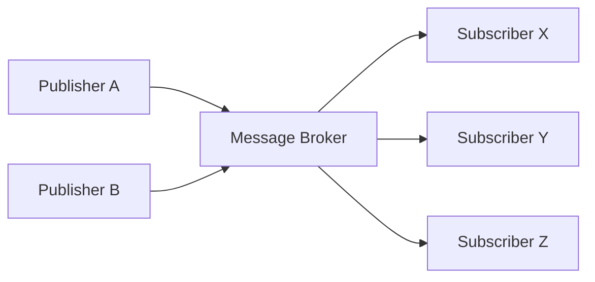
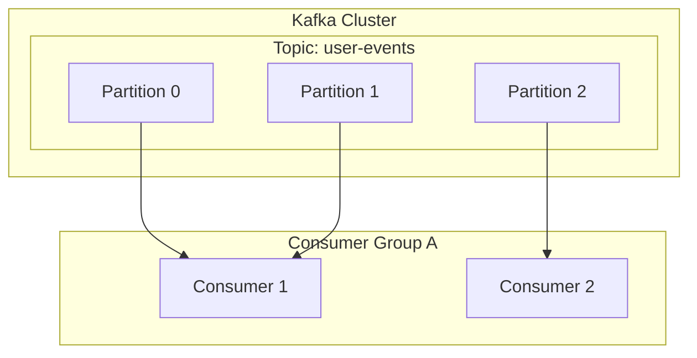

# 1. Um convite à Arquitetura Orientada a Eventos

Os sistemas de software modernos possuem uma escala e complexidade sem precedentes. Com a arquitetura de microsserviços se tornando a norma, como projetamos a comunicação entre os serviços é um fator crucial que determina o desempenho, a disponibilidade e a manutenibilidade de todo o sistema. Neste contexto, a ** Arquitetura Orientada a Eventos ** (Event-Driven Architecture: EDA) estabeleceu uma posição firme como um paradigma poderoso para reduzir o acoplamento entre sistemas e alcançar alta escalabilidade.

# 2. Desafios da Comunicação Síncrona (REST / gRPC)

A abordagem mais intuitiva para a comunicação entre serviços em sistemas distribuídos é a ** comunicação síncrona ** via APIs REST usando requisições/respostas HTTP ou o gRPC, que é mais rápido. No entanto, a comunicação síncrona tem vários desafios inerentes.

## 2.1 Alto Acoplamento e Falhas em Cascata
Na comunicação síncrona, o chamador (cliente) e o chamado (servidor) estão fortemente acoplados no tempo. O cliente deve esperar até que o servidor retorne uma resposta, e se o servidor falhar ou a resposta for atrasada devido à alta carga, o impacto se espalhará para o cliente. Se isso ocorrer em cadeia, corre-se o risco de causar uma ** falha em cascata ** que derrubará todo o sistema.

## 2.2 Acúmulo de Latência
No processamento de transações onde vários serviços são chamados sequencialmente, a latência de cada chamada é somada. Por exemplo, no processamento de pedidos, se chamarmos três serviços ("verificação de estoque", "processamento de pagamento" e "arranjos de envio") de forma síncrona, o tempo total de resposta de cada serviço se tornará o tempo de espera do usuário.

## 2.3 Limitações de Escalabilidade
Quando ocorrem picos de tráfego temporários (burst traffic), é difícil nivelar o tráfego com a comunicação síncrona, exigindo um rápido scale-out (aumento horizontal de escala) dos recursos do serviço que recebe as requisições diretamente. Se as gravações no banco de dados se tornarem um gargalo, a escalabilidade de todo o sistema será limitada.

# 3. Fundamentos da Arquitetura Orientada a Eventos (EDA)

A ** Arquitetura Orientada a Eventos ** surgiu para superar esses desafios. Na EDA, as mudanças de estado do sistema são representadas como "eventos" e trocadas de forma assíncrona entre os componentes.

## 3.1 Modelo Publisher-Subscriber (Pub/Sub)

O núcleo da EDA é o ** modelo Publisher-Subscriber ** (Pub/Sub). Neste modelo, um "message broker" (mediador de mensagens) existe entre o lado que gera os eventos (publisher) e o lado que consome os eventos (subscriber). O publisher só precisa enviar o evento para o broker e não precisa saber quem receberá esse evento. Da mesma forma, o subscriber só precisa receber os eventos de interesse do broker e não precisa saber quem os publicou.



## 3.2 Padrão de Event Sourcing

Um padrão de design importante relacionado à EDA é o ** Event Sourcing **. Nas aplicações tradicionais baseadas em CRUD, apenas o "estado atual" dos dados é salvo no banco de dados. Por outro lado, no Event Sourcing, todas as operações que alteram o estado do sistema são salvas como uma "sequência de eventos" imutável.

Se o estado atual for necessário, ele é reconstruído reproduzindo (replay) os eventos passados em ordem desde o início. Isso não apenas fornece um log de auditoria completo, mas também permite que o estado do sistema seja restaurado em qualquer ponto do passado. Além disso, tem excelente sinergia com o padrão CQRS (Command Query Responsibility Segregation), que separa os modelos de leitura e escrita.

# 4. Filas de Mensagens e Streaming: RabbitMQ e Kafka

Historicamente, as filas de mensagens (message queues) e as plataformas de streaming de eventos se desenvolveram como os dois principais middlewares para realizar a entrega assíncrona de eventos. Aqui, compararemos ** RabbitMQ ** e ** Apache Kafka **, que são os principais representantes de cada um, e nos aprofundaremos nas diferenças em suas arquiteturas.

## 4.1 RabbitMQ: Fila de Mensagens Tradicional e Robusta

RabbitMQ é um message broker altamente comprovado projetado com base no AMQP (Advanced Message Queuing Protocol).

### 4.1.1 Flexibilidade de Roteamento (Exchange e Queue)
A maior característica do RabbitMQ é a sua função de roteamento de mensagens muito rica. Os publishers não enviam mensagens diretamente para a fila, mas para um componente chamado ** Exchange **. O Exchange distribui as mensagens para a fila apropriada de acordo com regras predefinidas (bindings).

- ** Direct Exchange **: Encaminha quando a chave de roteamento (routing key) da mensagem e a chave de ligação (binding key) da fila coincidem exatamente.
- ** Topic Exchange **: Encaminha baseado em correspondência de padrões (pattern matching) flexível usando curingas.
- ** Fanout Exchange **: Transmite (broadcast) incondicionalmente para todas as filas vinculadas.

### 4.1.2 Ciclo de Vida da Mensagem e Gerenciamento de Estado
O RabbitMQ possui a filosofia de "Smart Broker, Dumb Consumer". O broker é responsável pelo gerenciamento do estado das mensagens, como a confirmação de entrega de mensagens (ACK) e novas tentativas em caso de erro (roteamento para a Dead Letter Queue). Quando uma mensagem é processada com sucesso pelo consumer e um ACK é retornado, a mensagem é excluída da fila.

## 4.2 Apache Kafka: Streaming de Eventos Distribuído

O Kafka foi originalmente desenvolvido no LinkedIn e projetado para processar dados de log em larga escala com altíssima velocidade e throughput. Ele possui um paradigma de arquitetura completamente diferente do RabbitMQ.

### 4.2.1 Estrutura Distribuída por Tópicos e Partições
No Kafka, as mensagens (eventos) são classificadas em categorias lógicas chamadas ** tópicos ** (topics). E para alcançar escalabilidade, um único tópico é fisicamente dividido em várias ** partições ** (partitions). Cada partição é persistida em disco como um arquivo de log de acréscimo ordenado e imutável (Commit Log).



### 4.2.2 Offset e "Dumb Broker, Smart Consumer"
O Kafka não gerencia o estado da mensagem. Mesmo depois que a mensagem é lida por um consumer, ela não é excluída imediatamente e permanece no disco até que o período de retenção configurado (Retention Period) tenha passado. O consumer gerencia o ** offset ** (deslocamento) que indica até onde ele leu a partição. Com este modelo "Dumb Broker, Smart Consumer", o Kafka reduz a sobrecarga do broker ao limite absoluto, alcançando um throughput surpreendente de milhões de mensagens por segundo.

## 4.3 Comparação e Casos de Uso de RabbitMQ e Kafka

- ** Casos de Uso Apropriados para RabbitMQ **:
  Fila de trabalhos (job queue) que requer roteamento complexo, processamento confiável de cada mensagem e gerenciamento de ACK (ex: tarefas de envio de e-mail, processamento pesado de imagens, gerenciamento de tarefas no fluxo de pedidos, etc.).
- ** Casos de Uso Apropriados para Kafka **:
  Agregação de logs, rastreamento de comportamento do usuário, processamento de streams, armazenamento de eventos para Event Sourcing; sistemas que precisam processar grandes quantidades de dados com alto throughput e onde é necessário reproduzir (replay) eventos mais tarde.

# 5. Exemplo de Implementação: Código para RabbitMQ e Kafka

Vamos ver exemplos simples de código usando cada middleware.

## 5.1 Exemplo de Implementação com RabbitMQ (Node.js / amqplib)

### Publisher (publisher.js)
```javascript
const amqp = require('amqplib');

async function send() {
    const connection = await amqp.connect('amqp://localhost');
    const channel = await connection.createChannel();
    const queue = 'task_queue';
    
    await channel.assertQueue(queue, { durable: true });
    const msg = 'Hello RabbitMQ!';
    
    channel.sendToQueue(queue, Buffer.from(msg), { persistent: true });
    console.log(" [x] Sent '%s'", msg);
    
    setTimeout(() => { connection.close(); process.exit(0) }, 500);
}
send();
```

### Consumer (consumer.js)
```javascript
const amqp = require('amqplib');

async function receive() {
    const connection = await amqp.connect('amqp://localhost');
    const channel = await connection.createChannel();
    const queue = 'task_queue';
    
    await channel.assertQueue(queue, { durable: true });
    channel.prefetch(1); // Processa um por vez
    
    console.log(" [*] Waiting for messages in %s.", queue);
    channel.consume(queue, (msg) => {
        console.log(" [x] Received '%s'", msg.content.toString());
        setTimeout(() => {
            console.log(" [x] Done");
            channel.ack(msg);
        }, 1000);
    }, { noAck: false });
}
receive();
```

## 5.2 Exemplo de Implementação com Kafka (Node.js / kafkajs)

### Producer (producer.js)
```javascript
const { Kafka } = require('kafkajs');

const kafka = new Kafka({
  clientId: 'my-app',
  brokers: ['localhost:9092']
});

const producer = kafka.producer();

async function run() {
  await producer.connect();
  await producer.send({
    topic: 'test-topic',
    messages: [
      { value: 'Hello Kafka!' },
    ],
  });
  console.log("Message sent to Kafka");
  await producer.disconnect();
}
run();
```

### Consumer (consumer.js)
```javascript
const { Kafka } = require('kafkajs');

const kafka = new Kafka({
  clientId: 'my-app',
  brokers: ['localhost:9092']
});

const consumer = kafka.consumer({ groupId: 'test-group' });

async function run() {
  await consumer.connect();
  await consumer.subscribe({ topic: 'test-topic', fromBeginning: true });

  await consumer.run({
    eachMessage: async ({ topic, partition, message }) => {
      console.log({
        partition,
        offset: message.offset,
        value: message.value.toString(),
      });
    },
  });
}
run();
```

# 6. Conclusão

A arquitetura orientada a eventos é uma técnica poderosa para manter sistemas flexíveis e escaláveis. Como message brokers atuando em seu núcleo, o RabbitMQ e o Kafka têm filosofias de design diferentes. Se você precisa de flexibilidade no roteamento e gerenciamento confiável de estado, escolha RabbitMQ; se precisa de um throughput esmagador, persistência de dados e capacidade de reprodução (replay), escolha Kafka. Escolher a tecnologia certa que atenda aos requisitos do projeto é a chave para a construção de um sistema distribuído de sucesso.

# 7. Padrões de Design Avançados e Operações na Arquitetura Orientada a Eventos

Ao introduzir a arquitetura orientada a eventos em sistemas empresariais do mundo real, surgem novos desafios. Estes incluem consistência de dados, tratamento de erros e a observabilidade do sistema. Aqui explicamos padrões avançados para resolver isso.

## 7.1 Padrão Saga para Transações Distribuídas

Na arquitetura de microsserviços, gerenciar transações que abrangem vários serviços através do commit de duas fases (2PC) síncrono causa degradação da disponibilidade e do desempenho. O ** Padrão Saga ** é usado como uma abordagem alternativa.

No Padrão Saga, uma transação distribuída é representada como uma série de transações locais. Cada serviço executa sua transação local e, após a conclusão, publica um evento para acionar a próxima etapa. Se alguma etapa falhar, ele publica um evento para executar uma "transação de compensação" (Compensating [Transaction](https://kenji.blog/pt/p/rdbms-transaction-acid-isolation-level-lock/)) que desfaz as transações que já foram concluídas.

Existem dois tipos de Sagas: o tipo "orquestração" (Orchestration), onde um controlador central direciona as etapas, e o tipo "coreografia" (Choreography), onde cada serviço assina os eventos e opera autonomamente. Em uma EDA usando um event bus como o Kafka, Sagas do tipo coreografia podem ser implementadas de maneira muito natural.

## 7.2 Padrão Outbox e Idempotência

Quando um serviço atualiza seu próprio banco de dados e simultaneamente publica um evento no Kafka ou RabbitMQ, a "atualização do banco de dados e a publicação do evento" precisam ser feitas de forma atômica. Se o processo travar após a atualização do banco de dados e a publicação do evento falhar, ocorrerá uma inconsistência em todo o sistema.

Isso é resolvido usando o ** Padrão Transactional Outbox **. O serviço escreve o registro do evento a ser enviado na tabela "Outbox" (caixa de saída) dentro da mesma transação de banco de dados que a atualização dos dados originais. Subsequentemente, outro processo em segundo plano (ex: uma ferramenta CDC como o Debezium) monitora a tabela Outbox e entrega de forma confiável (At-Least-Once Delivery) o evento para o message broker.

Como resultado disso, é essencial projetar o lado do consumer que recebe os eventos com a propriedade de que o resultado não mude mesmo que o mesmo evento seja recebido várias vezes, ou seja, ** Idempotência ** (Idempotency).

## 7.3 Arquitetura Detalhada do Kafka: O Segredo da Performance

Vamos explorar mais profundamente do lado técnico por que o Kafka consegue alcançar um desempenho tão alto em comparação com brokers tradicionais como o RabbitMQ.

### 7.3.1 Tecnologia Zero-Copy e Page Cache
Para transferir dados do disco para a rede, o Kafka utiliza uma otimização no nível do sistema operacional chamada "zero-copy" (a chamada de sistema `sendfile` no Linux). Isso permite que os dados sejam enviados diretamente para os soquetes de rede sem serem copiados do espaço do kernel para o espaço do usuário. Além disso, o Kafka maximiza o uso do page cache do sistema operacional em vez da memória da JVM, realizando assim um acesso sequencial rápido até mesmo para dados massivos.

### 7.3.2 Processamento em Lote (Batch) e Compressão de Mensagens
O producer do Kafka não envia as mensagens uma a uma, mas as agrupa como um batch (lote) para enviá-las ao broker. Além disso, ao comprimir todo o lote usando LZ4, Snappy, etc., a largura de banda de rede e o uso de disco são reduzidos drasticamente.

## 7.4 Garantindo a Observabilidade (Observability)

Em sistemas onde o processamento assíncrono é encadeado, o troubleshooting quando ocorre uma falha se torna extremamente difícil. Para rastrear em qual fila as mensagens estão presas e em qual serviço o erro ocorreu, a introdução do ** Distributed Tracing ** (Rastreamento Distribuído) (como OpenTelemetry, Jaeger, etc.) é essencial. A melhor prática para a operação de uma EDA é anexar um `traceId` exclusivo a cada mensagem e vinculá-lo a logs e métricas para construir uma fundação que visualize o fluxo de eventos.

# 7. Padrões de Design Avançados e Operações na Arquitetura Orientada a Eventos

Ao introduzir a arquitetura orientada a eventos em sistemas empresariais do mundo real, surgem novos desafios. Estes incluem consistência de dados, tratamento de erros e a observabilidade do sistema. Aqui explicamos padrões avançados para resolver isso.

## 7.1 Padrão Saga para Transações Distribuídas

Na arquitetura de microsserviços, gerenciar transações que abrangem vários serviços através do commit de duas fases (2PC) síncrono causa degradação da disponibilidade e do desempenho. O ** Padrão Saga ** é usado como uma abordagem alternativa.

No Padrão Saga, uma transação distribuída é representada como uma série de transações locais. Cada serviço executa sua transação local e, após a conclusão, publica um evento para acionar a próxima etapa. Se alguma etapa falhar, ele publica um evento para executar uma "transação de compensação" (Compensating [Transaction](https://kenji.blog/pt/p/rdbms-transaction-acid-isolation-level-lock/)) que desfaz as transações que já foram concluídas.

Existem dois tipos de Sagas: o tipo "orquestração" (Orchestration), onde um controlador central direciona as etapas, e o tipo "coreografia" (Choreography), onde cada serviço assina os eventos e opera autonomamente. Em uma EDA usando um event bus como o Kafka, Sagas do tipo coreografia podem ser implementadas de maneira muito natural.

## 7.2 Padrão Outbox e Idempotência

Quando um serviço atualiza seu próprio banco de dados e simultaneamente publica um evento no Kafka ou RabbitMQ, a "atualização do banco de dados e a publicação do evento" precisam ser feitas de forma atômica. Se o processo travar após a atualização do banco de dados e a publicação do evento falhar, ocorrerá uma inconsistência em todo o sistema.

Isso é resolvido usando o ** Padrão Transactional Outbox **. O serviço escreve o registro do evento a ser enviado na tabela "Outbox" (caixa de saída) dentro da mesma transação de banco de dados que a atualização dos dados originais. Subsequentemente, outro processo em segundo plano (ex: uma ferramenta CDC como o Debezium) monitora a tabela Outbox e entrega de forma confiável (At-Least-Once Delivery) o evento para o message broker.

Como resultado disso, é essencial projetar o lado do consumer que recebe os eventos com a propriedade de que o resultado não mude mesmo que o mesmo evento seja recebido várias vezes, ou seja, ** Idempotência ** (Idempotency).

## 7.3 Arquitetura Detalhada do Kafka: O Segredo da Performance

Vamos explorar mais profundamente do lado técnico por que o Kafka consegue alcançar um desempenho tão alto em comparação com brokers tradicionais como o RabbitMQ.

### 7.3.1 Tecnologia Zero-Copy e Page Cache
Para transferir dados do disco para a rede, o Kafka utiliza uma otimização no nível do sistema operacional chamada "zero-copy" (a chamada de sistema `sendfile` no Linux). Isso permite que os dados sejam enviados diretamente para os soquetes de rede sem serem copiados do espaço do kernel para o espaço do usuário. Além disso, o Kafka maximiza o uso do page cache do sistema operacional em vez da memória da JVM, realizando assim um acesso sequencial rápido até mesmo para dados massivos.

### 7.3.2 Processamento em Lote (Batch) e Compressão de Mensagens
O producer do Kafka não envia as mensagens uma a uma, mas as agrupa como um batch (lote) para enviá-las ao broker. Além disso, ao comprimir todo o lote usando LZ4, Snappy, etc., a largura de banda de rede e o uso de disco são reduzidos drasticamente.

## 7.4 Garantindo a Observabilidade (Observability)

Em sistemas onde o processamento assíncrono é encadeado, o troubleshooting quando ocorre uma falha se torna extremamente difícil. Para rastrear em qual fila as mensagens estão presas e em qual serviço o erro ocorreu, a introdução do ** Distributed Tracing ** (Rastreamento Distribuído) (como OpenTelemetry, Jaeger, etc.) é essencial. A melhor prática para a operação de uma EDA é anexar um `traceId` exclusivo a cada mensagem e vinculá-lo a logs e métricas para construir uma fundação que visualize o fluxo de eventos.

# 7. Padrões de Design Avançados e Operações na Arquitetura Orientada a Eventos

Ao introduzir a arquitetura orientada a eventos em sistemas empresariais do mundo real, surgem novos desafios. Estes incluem consistência de dados, tratamento de erros e a observabilidade do sistema. Aqui explicamos padrões avançados para resolver isso.

## 7.1 Padrão Saga para Transações Distribuídas

Na arquitetura de microsserviços, gerenciar transações que abrangem vários serviços através do commit de duas fases (2PC) síncrono causa degradação da disponibilidade e do desempenho. O ** Padrão Saga ** é usado como uma abordagem alternativa.

No Padrão Saga, uma transação distribuída é representada como uma série de transações locais. Cada serviço executa sua transação local e, após a conclusão, publica um evento para acionar a próxima etapa. Se alguma etapa falhar, ele publica um evento para executar uma "transação de compensação" (Compensating [Transaction](https://kenji.blog/pt/p/rdbms-transaction-acid-isolation-level-lock/)) que desfaz as transações que já foram concluídas.

Existem dois tipos de Sagas: o tipo "orquestração" (Orchestration), onde um controlador central direciona as etapas, e o tipo "coreografia" (Choreography), onde cada serviço assina os eventos e opera autonomamente. Em uma EDA usando um event bus como o Kafka, Sagas do tipo coreografia podem ser implementadas de maneira muito natural.

## 7.2 Padrão Outbox e Idempotência

Quando um serviço atualiza seu próprio banco de dados e simultaneamente publica um evento no Kafka ou RabbitMQ, a "atualização do banco de dados e a publicação do evento" precisam ser feitas de forma atômica. Se o processo travar após a atualização do banco de dados e a publicação do evento falhar, ocorrerá uma inconsistência em todo o sistema.

Isso é resolvido usando o ** Padrão Transactional Outbox **. O serviço escreve o registro do evento a ser enviado na tabela "Outbox" (caixa de saída) dentro da mesma transação de banco de dados que a atualização dos dados originais. Subsequentemente, outro processo em segundo plano (ex: uma ferramenta CDC como o Debezium) monitora a tabela Outbox e entrega de forma confiável (At-Least-Once Delivery) o evento para o message broker.

Como resultado disso, é essencial projetar o lado do consumer que recebe os eventos com a propriedade de que o resultado não mude mesmo que o mesmo evento seja recebido várias vezes, ou seja, ** Idempotência ** (Idempotency).

## 7.3 Arquitetura Detalhada do Kafka: O Segredo da Performance

Vamos explorar mais profundamente do lado técnico por que o Kafka consegue alcançar um desempenho tão alto em comparação com brokers tradicionais como o RabbitMQ.

### 7.3.1 Tecnologia Zero-Copy e Page Cache
Para transferir dados do disco para a rede, o Kafka utiliza uma otimização no nível do sistema operacional chamada "zero-copy" (a chamada de sistema `sendfile` no Linux). Isso permite que os dados sejam enviados diretamente para os soquetes de rede sem serem copiados do espaço do kernel para o espaço do usuário. Além disso, o Kafka maximiza o uso do page cache do sistema operacional em vez da memória da JVM, realizando assim um acesso sequencial rápido até mesmo para dados massivos.

### 7.3.2 Processamento em Lote (Batch) e Compressão de Mensagens
O producer do Kafka não envia as mensagens uma a uma, mas as agrupa como um batch (lote) para enviá-las ao broker. Além disso, ao comprimir todo o lote usando LZ4, Snappy, etc., a largura de banda de rede e o uso de disco são reduzidos drasticamente.

## 7.4 Garantindo a Observabilidade (Observability)

Em sistemas onde o processamento assíncrono é encadeado, o troubleshooting quando ocorre uma falha se torna extremamente difícil. Para rastrear em qual fila as mensagens estão presas e em qual serviço o erro ocorreu, a introdução do ** Distributed Tracing ** (Rastreamento Distribuído) (como OpenTelemetry, Jaeger, etc.) é essencial. A melhor prática para a operação de uma EDA é anexar um `traceId` exclusivo a cada mensagem e vinculá-lo a logs e métricas para construir uma fundação que visualize o fluxo de eventos.

# 7. Padrões de Design Avançados e Operações na Arquitetura Orientada a Eventos

Ao introduzir a arquitetura orientada a eventos em sistemas empresariais do mundo real, surgem novos desafios. Estes incluem consistência de dados, tratamento de erros e a observabilidade do sistema. Aqui explicamos padrões avançados para resolver isso.

## 7.1 Padrão Saga para Transações Distribuídas

Na arquitetura de microsserviços, gerenciar transações que abrangem vários serviços através do commit de duas fases (2PC) síncrono causa degradação da disponibilidade e do desempenho. O ** Padrão Saga ** é usado como uma abordagem alternativa.

No Padrão Saga, uma transação distribuída é representada como uma série de transações locais. Cada serviço executa sua transação local e, após a conclusão, publica um evento para acionar a próxima etapa. Se alguma etapa falhar, ele publica um evento para executar uma "transação de compensação" (Compensating [Transaction](https://kenji.blog/pt/p/rdbms-transaction-acid-isolation-level-lock/)) que desfaz as transações que já foram concluídas.

Existem dois tipos de Sagas: o tipo "orquestração" (Orchestration), onde um controlador central direciona as etapas, e o tipo "coreografia" (Choreography), onde cada serviço assina os eventos e opera autonomamente. Em uma EDA usando um event bus como o Kafka, Sagas do tipo coreografia podem ser implementadas de maneira muito natural.

## 7.2 Padrão Outbox e Idempotência

Quando um serviço atualiza seu próprio banco de dados e simultaneamente publica um evento no Kafka ou RabbitMQ, a "atualização do banco de dados e a publicação do evento" precisam ser feitas de forma atômica. Se o processo travar após a atualização do banco de dados e a publicação do evento falhar, ocorrerá uma inconsistência em todo o sistema.

Isso é resolvido usando o ** Padrão Transactional Outbox **. O serviço escreve o registro do evento a ser enviado na tabela "Outbox" (caixa de saída) dentro da mesma transação de banco de dados que a atualização dos dados originais. Subsequentemente, outro processo em segundo plano (ex: uma ferramenta CDC como o Debezium) monitora a tabela Outbox e entrega de forma confiável (At-Least-Once Delivery) o evento para o message broker.

Como resultado disso, é essencial projetar o lado do consumer que recebe os eventos com a propriedade de que o resultado não mude mesmo que o mesmo evento seja recebido várias vezes, ou seja, ** Idempotência ** (Idempotency).

## 7.3 Arquitetura Detalhada do Kafka: O Segredo da Performance

Vamos explorar mais profundamente do lado técnico por que o Kafka consegue alcançar um desempenho tão alto em comparação com brokers tradicionais como o RabbitMQ.

### 7.3.1 Tecnologia Zero-Copy e Page Cache
Para transferir dados do disco para a rede, o Kafka utiliza uma otimização no nível do sistema operacional chamada "zero-copy" (a chamada de sistema `sendfile` no Linux). Isso permite que os dados sejam enviados diretamente para os soquetes de rede sem serem copiados do espaço do kernel para o espaço do usuário. Além disso, o Kafka maximiza o uso do page cache do sistema operacional em vez da memória da JVM, realizando assim um acesso sequencial rápido até mesmo para dados massivos.

### 7.3.2 Processamento em Lote (Batch) e Compressão de Mensagens
O producer do Kafka não envia as mensagens uma a uma, mas as agrupa como um batch (lote) para enviá-las ao broker. Além disso, ao comprimir todo o lote usando LZ4, Snappy, etc., a largura de banda de rede e o uso de disco são reduzidos drasticamente.

## 7.4 Garantindo a Observabilidade (Observability)

Em sistemas onde o processamento assíncrono é encadeado, o troubleshooting quando ocorre uma falha se torna extremamente difícil. Para rastrear em qual fila as mensagens estão presas e em qual serviço o erro ocorreu, a introdução do ** Distributed Tracing ** (Rastreamento Distribuído) (como OpenTelemetry, Jaeger, etc.) é essencial. A melhor prática para a operação de uma EDA é anexar um `traceId` exclusivo a cada mensagem e vinculá-lo a logs e métricas para construir uma fundação que visualize o fluxo de eventos.

# 7. Padrões de Design Avançados e Operações na Arquitetura Orientada a Eventos

Ao introduzir a arquitetura orientada a eventos em sistemas empresariais do mundo real, surgem novos desafios. Estes incluem consistência de dados, tratamento de erros e a observabilidade do sistema. Aqui explicamos padrões avançados para resolver isso.

## 7.1 Padrão Saga para Transações Distribuídas

Na arquitetura de microsserviços, gerenciar transações que abrangem vários serviços através do commit de duas fases (2PC) síncrono causa degradação da disponibilidade e do desempenho. O ** Padrão Saga ** é usado como uma abordagem alternativa.

No Padrão Saga, uma transação distribuída é representada como uma série de transações locais. Cada serviço executa sua transação local e, após a conclusão, publica um evento para acionar a próxima etapa. Se alguma etapa falhar, ele publica um evento para executar uma "transação de compensação" (Compensating [Transaction](https://kenji.blog/pt/p/rdbms-transaction-acid-isolation-level-lock/)) que desfaz as transações que já foram concluídas.

Existem dois tipos de Sagas: o tipo "orquestração" (Orchestration), onde um controlador central direciona as etapas, e o tipo "coreografia" (Choreography), onde cada serviço assina os eventos e opera autonomamente. Em uma EDA usando um event bus como o Kafka, Sagas do tipo coreografia podem ser implementadas de maneira muito natural.

## 7.2 Padrão Outbox e Idempotência

Quando um serviço atualiza seu próprio banco de dados e simultaneamente publica um evento no Kafka ou RabbitMQ, a "atualização do banco de dados e a publicação do evento" precisam ser feitas de forma atômica. Se o processo travar após a atualização do banco de dados e a publicação do evento falhar, ocorrerá uma inconsistência em todo o sistema.

Isso é resolvido usando o ** Padrão Transactional Outbox **. O serviço escreve o registro do evento a ser enviado na tabela "Outbox" (caixa de saída) dentro da mesma transação de banco de dados que a atualização dos dados originais. Subsequentemente, outro processo em segundo plano (ex: uma ferramenta CDC como o Debezium) monitora a tabela Outbox e entrega de forma confiável (At-Least-Once Delivery) o evento para o message broker.

Como resultado disso, é essencial projetar o lado do consumer que recebe os eventos com a propriedade de que o resultado não mude mesmo que o mesmo evento seja recebido várias vezes, ou seja, ** Idempotência ** (Idempotency).

## 7.3 Arquitetura Detalhada do Kafka: O Segredo da Performance

Vamos explorar mais profundamente do lado técnico por que o Kafka consegue alcançar um desempenho tão alto em comparação com brokers tradicionais como o RabbitMQ.

### 7.3.1 Tecnologia Zero-Copy e Page Cache
Para transferir dados do disco para a rede, o Kafka utiliza uma otimização no nível do sistema operacional chamada "zero-copy" (a chamada de sistema `sendfile` no Linux). Isso permite que os dados sejam enviados diretamente para os soquetes de rede sem serem copiados do espaço do kernel para o espaço do usuário. Além disso, o Kafka maximiza o uso do page cache do sistema operacional em vez da memória da JVM, realizando assim um acesso sequencial rápido até mesmo para dados massivos.

### 7.3.2 Processamento em Lote (Batch) e Compressão de Mensagens
O producer do Kafka não envia as mensagens uma a uma, mas as agrupa como um batch (lote) para enviá-las ao broker. Além disso, ao comprimir todo o lote usando LZ4, Snappy, etc., a largura de banda de rede e o uso de disco são reduzidos drasticamente.

## 7.4 Garantindo a Observabilidade (Observability)

Em sistemas onde o processamento assíncrono é encadeado, o troubleshooting quando ocorre uma falha se torna extremamente difícil. Para rastrear em qual fila as mensagens estão presas e em qual serviço o erro ocorreu, a introdução do ** Distributed Tracing ** (Rastreamento Distribuído) (como OpenTelemetry, Jaeger, etc.) é essencial. A melhor prática para a operação de uma EDA é anexar um `traceId` exclusivo a cada mensagem e vinculá-lo a logs e métricas para construir uma fundação que visualize o fluxo de eventos.
