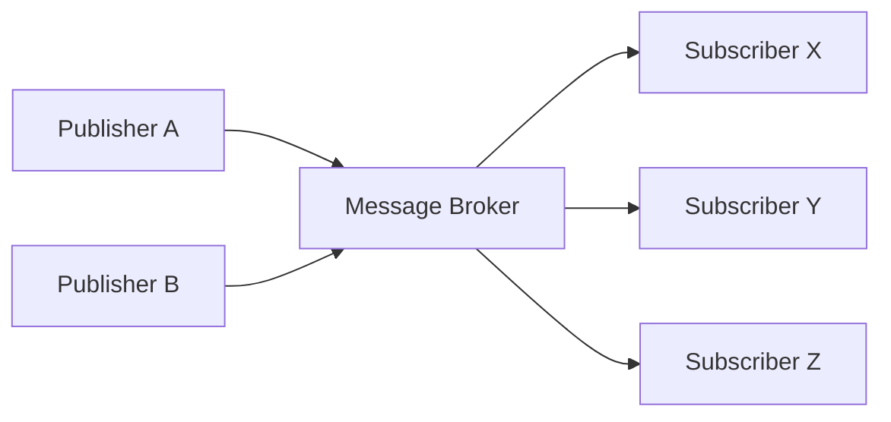
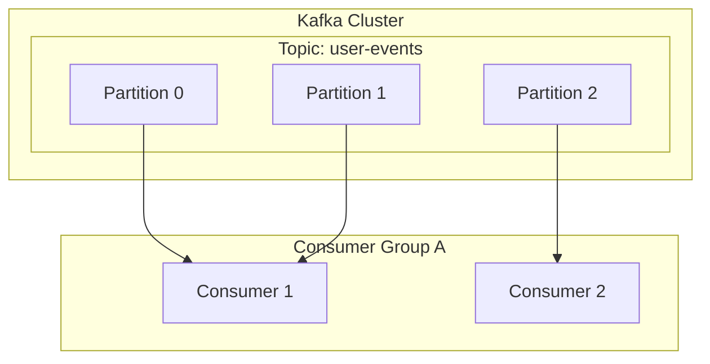

# 1. Введение в событийно-ориентированную архитектуру

Современные программные системы обладают беспрецедентным масштабом и сложностью. В условиях, когда микросервисная архитектура становится основным направлением, то, как спроектировано взаимодействие между сервисами, является чрезвычайно важным фактором, определяющим общую производительность, доступность и удобство сопровождения системы. В этом контексте ** Событийно-ориентированная архитектура ** (Event-Driven Architecture: EDA) прочно утвердилась как мощная парадигма для снижения связанности между системами и достижения высокой масштабируемости.

# 2. Проблемы синхронного взаимодействия (REST / gRPC)

Наиболее интуитивно понятным подходом к взаимодействию между сервисами в распределенных системах является ** синхронное взаимодействие **, такое как REST API, использующий HTTP запросы/ответы, или более быстрый gRPC. Однако синхронное взаимодействие имеет ряд существенных проблем.

## 2.1 Тесная связанность и каскадные сбои
При синхронном взаимодействии вызывающая сторона (клиент) и вызываемая сторона (сервер) сильно связаны во времени. Клиенту необходимо ждать, пока сервер не вернет ответ, и если на сервере происходит сбой или ответ задерживается из-за высокой нагрузки, это влияние распространяется и на клиента. Если это происходит по цепочке, существует риск вызвать ** каскадный сбой **, при котором выходит из строя вся система.

## 2.2 Накопление задержки
В транзакционных процессах, где последовательно вызываются несколько сервисов, задержки каждого вызова суммируются. Например, в процессе обработки заказа, если три сервиса — "проверка запасов", "обработка платежа" и "организация доставки" — вызываются синхронно, общее время ответа каждого сервиса становится временем ожидания пользователя.

## 2.3 Ограничения масштабируемости
В случае временных всплесков трафика (burst traffic) при синхронном взаимодействии трудно сгладить трафик, и необходимо быстро масштабировать ресурсы сервиса, который непосредственно принимает запросы. Если запись в базу данных становится узким местом, масштабируемость всей системы ограничивается.

# 3. Основы событийно-ориентированной архитектуры (EDA)

Для преодоления этих проблем и появилась ** событийно-ориентированная архитектура **. В EDA изменения состояния системы представляются как "события", которые асинхронно передаются между компонентами.

## 3.1 Модель издатель-подписчик (Pub/Sub)

Ядром EDA является ** модель издатель-подписчик ** (Pub/Sub). В этой модели между стороной, генерирующей события (издателем), и стороной, потребляющей события (подписчиком), существует "брокер сообщений", который выступает посредником для сообщений. Издателю нужно только отправить событие брокеру, и ему не нужно знать, кто получит это событие. Аналогично, подписчику нужно только получить интересующее его событие от брокера, и ему не нужно знать, кто его опубликовал.



## 3.2 Паттерн Event Sourcing

Важным паттерном проектирования, связанным с EDA, является ** Event Sourcing ** (Порождение событий). В традиционных приложениях на основе CRUD в базе данных сохраняется только "текущее состояние" данных. В отличие от этого, в Event Sourcing все операции, изменяющие состояние системы, сохраняются как неизменяемая (immutable) "последовательность событий".

Когда требуется текущее состояние, оно восстанавливается путем воспроизведения (replay) прошлых событий по порядку с самого начала. Это не только обеспечивает полный журнал аудита, но и позволяет восстановить состояние системы на любой момент времени в прошлом. Кроме того, это отлично сочетается с паттерном CQRS (Command Query Responsibility Segregation), который разделяет модели чтения и записи.

# 4. Очереди сообщений и потоковая передача: RabbitMQ и Kafka

Исторически развивались два типа промежуточного программного обеспечения (middleware) для реализации асинхронной доставки событий: очереди сообщений и платформы потоковой передачи событий. Здесь мы сравним типичных представителей каждого из них, ** RabbitMQ ** и ** Apache Kafka **, и углубимся в различия их архитектур.

## 4.1 RabbitMQ: традиционная и надежная очередь сообщений

RabbitMQ — это брокер сообщений с огромным послужным списком, разработанный на основе AMQP (Advanced Message Queuing Protocol).

### 4.1.1 Гибкость маршрутизации (Exchange и Queue)
Важнейшей особенностью RabbitMQ является очень богатая функциональность маршрутизации сообщений. Издатель не отправляет сообщения напрямую в очередь, а отправляет их в компонент, называемый ** Exchange ** (обменник). Exchange распределяет сообщения по соответствующим очередям в соответствии с заранее определенными правилами (привязками, bindings).

- ** Direct Exchange **: Перенаправляет, когда ключ маршрутизации сообщения полностью совпадает с ключом привязки очереди.
- ** Topic Exchange **: Перенаправляет на основе гибкого сопоставления шаблонов с использованием подстановочных знаков.
- ** Fanout Exchange **: Безусловно транслирует (broadcast) на все привязанные очереди.

### 4.1.2 Жизненный цикл сообщений и управление состоянием
RabbitMQ придерживается философии "умный брокер, глупый потребитель". Брокер несет ответственность за управление состоянием сообщений, такое как подтверждение доставки сообщений (ACK) или повторные попытки при ошибках (маршрутизация в Dead Letter Queue). Когда сообщение успешно обрабатывается потребителем и возвращается ACK, это сообщение удаляется из очереди.

## 4.2 Apache Kafka: распределенная потоковая передача событий

Kafka изначально была разработана в LinkedIn и спроектирована для обработки крупномасштабных данных журналов на сверхвысокой скорости и с высокой пропускной способностью. Она имеет совершенно другую архитектурную парадигму по сравнению с RabbitMQ.

### 4.2.1 Распределенная структура с топиками и партициями
В Kafka сообщения (события) классифицируются по логическим категориям, называемым ** топиками ** (Topics). И для достижения масштабируемости один топик физически разделяется на несколько ** партиций ** (Partitions). Каждая партиция сохраняется на диске как упорядоченный, неизменяемый файл журнала, в который можно только добавлять данные (Commit Log).



### 4.2.2 Смещение (Offset) и "глупый брокер, умный потребитель"
Kafka не управляет состоянием сообщений. Сообщения не удаляются сразу после их прочтения потребителем, а остаются на диске до истечения заданного периода хранения (Retention Period). Сторона потребителя управляет ** смещением ** (Offset), которое указывает, до какого места в партиции она прочитала. Благодаря этой модели "глупый брокер, умный потребитель", Kafka сводит накладные расходы брокера к абсолютному минимуму и достигает невероятной пропускной способности в миллионы сообщений в секунду.

## 4.3 Сравнение RabbitMQ и Kafka и варианты использования

- ** Подходящие варианты использования RabbitMQ **:
  Когда требуется сложная маршрутизация, или для очередей заданий, требующих надежной обработки каждого сообщения и управления ACK (например, задачи отправки электронной почты, тяжелая обработка изображений, управление задачами в процессе оформления заказа и т. д.).
- ** Подходящие варианты использования Kafka **:
  Агрегация журналов, отслеживание поведения пользователей, потоковая обработка, хранилище событий для Event Sourcing и другие системы, которым необходимо обрабатывать большие объемы данных с высокой пропускной способностью и иметь возможность воспроизводить события позже.

# 5. Пример реализации: код RabbitMQ и Kafka

Давайте посмотрим на простую реализацию кода с использованием каждого промежуточного программного обеспечения.

## 5.1 Пример реализации RabbitMQ (Node.js / amqplib)

### Издатель (publisher.js)
```javascript
const amqp = require('amqplib');

async function send() {
    const connection = await amqp.connect('amqp://localhost');
    const channel = await connection.createChannel();
    const queue = 'task_queue';
    
    await channel.assertQueue(queue, { durable: true });
    const msg = 'Hello RabbitMQ!';
    
    channel.sendToQueue(queue, Buffer.from(msg), { persistent: true });
    console.log(" [x] Sent '%s'", msg);
    
    setTimeout(() => { connection.close(); process.exit(0) }, 500);
}
send();
```

### Потребитель (consumer.js)
```javascript
const amqp = require('amqplib');

async function receive() {
    const connection = await amqp.connect('amqp://localhost');
    const channel = await connection.createChannel();
    const queue = 'task_queue';
    
    await channel.assertQueue(queue, { durable: true });
    channel.prefetch(1); // Обрабатывать по одному
    
    console.log(" [*] Waiting for messages in %s.", queue);
    channel.consume(queue, (msg) => {
        console.log(" [x] Received '%s'", msg.content.toString());
        setTimeout(() => {
            console.log(" [x] Done");
            channel.ack(msg);
        }, 1000);
    }, { noAck: false });
}
receive();
```

## 5.2 Пример реализации Kafka (Node.js / kafkajs)

### Продюсер (producer.js)
```javascript
const { Kafka } = require('kafkajs');

const kafka = new Kafka({
  clientId: 'my-app',
  brokers: ['localhost:9092']
});

const producer = kafka.producer();

async function run() {
  await producer.connect();
  await producer.send({
    topic: 'test-topic',
    messages: [
      { value: 'Hello Kafka!' },
    ],
  });
  console.log("Message sent to Kafka"); // Сообщение отправлено в Kafka
  await producer.disconnect();
}
run();
```

### Потребитель (consumer.js)
```javascript
const { Kafka } = require('kafkajs');

const kafka = new Kafka({
  clientId: 'my-app',
  brokers: ['localhost:9092']
});

const consumer = kafka.consumer({ groupId: 'test-group' });

async function run() {
  await consumer.connect();
  await consumer.subscribe({ topic: 'test-topic', fromBeginning: true });

  await consumer.run({
    eachMessage: async ({ topic, partition, message }) => {
      console.log({
        partition,
        offset: message.offset,
        value: message.value.toString(),
      });
    },
  });
}
run();
```

# 6. Заключение

Событийно-ориентированная архитектура является мощным методом для поддержания гибкости и масштабируемости системы. В качестве брокеров сообщений, которые играют центральную роль, RabbitMQ и Kafka имеют разные философии проектирования. Ключом к построению успешной распределенной системы является выбор подходящей технологии в соответствии с требованиями проекта, например, RabbitMQ, если требуется гибкость маршрутизации и надежное управление состоянием, или Kafka, если требуется подавляющая пропускная способность, надежность данных и возможность воспроизведения.

# 7. Расширенные паттерны проектирования и эксплуатации в событийно-ориентированной архитектуре

При внедрении событийно-ориентированной архитектуры в реальные корпоративные системы возникают новые проблемы. К ним относятся согласованность данных, обработка ошибок и наблюдаемость (observability) системы. Здесь мы обсудим расширенные паттерны для их решения.

## 7.1 Распределенные транзакции с использованием паттерна Сага (Saga)

В микросервисной архитектуре управление транзакциями, охватывающими несколько сервисов, с помощью синхронной двухфазной фиксации (2PC) приводит к снижению доступности и производительности. В качестве альтернативы используется ** паттерн Сага **.

В паттерне Сага распределенная транзакция представляется как последовательность локальных транзакций. Каждый сервис выполняет локальную транзакцию, и по ее завершении публикует событие для запуска следующего шага. Если какой-либо шаг завершается неудачно, он публикует событие для выполнения "компенсирующей транзакции" (Compensating [Transaction](https://kenji.blog/ru/p/rdbms-transaction-acid-isolation-level-lock/)) для отмены уже завершенных транзакций.

Существуют два типа саг: "Оркестрация", где центральный контроллер направляет шаги, и "Хореография", где каждый сервис автономно подписывается на события и действует. В EDA, использующей шину событий вроде Kafka, хореографическая сага может быть реализована очень естественным образом.

## 7.2 Паттерн Outbox (Исходящие сообщения) и идемпотентность

Когда сервис обновляет свою собственную базу данных и одновременно публикует событие в Kafka или RabbitMQ, необходимо атомарно выполнять "обновление базы данных и публикацию события". Если процесс дает сбой после обновления базы данных и публикация события не удается, возникнет несогласованность во всей системе.

Для решения этой проблемы используется ** Транзакционный паттерн Outbox **. В рамках той же транзакции базы данных, что и исходное обновление данных, сервис записывает запись события для отправки в таблицу "Outbox" (исходящие сообщения). Затем другой фоновый процесс (например, инструмент CDC, такой как Debezium) отслеживает таблицу Outbox и надежно доставляет событие брокеру сообщений (доставка как минимум один раз, At-Least-Once Delivery).

В связи с этим крайне важно, чтобы потребительская сторона, получающая события, была спроектирована так, чтобы обладать ** идемпотентностью ** (Idempotency), то есть свойством, при котором результат не меняется даже при многократном получении одного и того же события.

## 7.3 Детальная архитектура Kafka: секрет производительности

Давайте подробнее рассмотрим технические особенности того, почему Kafka может достигать такой высокой производительности по сравнению с традиционными брокерами, такими как RabbitMQ.

### 7.3.1 Технология Zero-Copy (Нулевое копирование) и страничный кэш (Page Cache)
Kafka использует оптимизацию "нулевого копирования" на уровне ОС (системный вызов `sendfile` в Linux) для передачи данных с диска в сеть. Благодаря этому данные отправляются напрямую в сетевой сокет без копирования из пространства ядра в пространство пользователя. Кроме того, Kafka максимально использует страничный кэш ОС, а не память JVM, обеспечивая высокоскоростной последовательный доступ даже к огромным объемам данных.

### 7.3.2 Пакетная обработка и сжатие сообщений
Продюсер Kafka не отправляет сообщения по одному, а отправляет их брокеру пакетами. Кроме того, сжатие всего пакета с помощью таких алгоритмов, как LZ4 или Snappy, радикально снижает использование пропускной способности сети и дискового пространства.

## 7.4 Обеспечение наблюдаемости (Observability)

В системах с цепочкой асинхронных процессов устранение неполадок при возникновении сбоев становится чрезвычайно сложным. Чтобы отследить, в какой очереди застряло сообщение или в каком сервисе произошла ошибка, необходимо внедрить ** распределенную трассировку ** (OpenTelemetry, Jaeger и т. д.). Назначение уникального `traceId` каждому сообщению и связывание его с журналами и метриками для создания основы визуализации потока событий является передовой практикой (best practice) при эксплуатации EDA.

# 7. Расширенные паттерны проектирования и эксплуатации в событийно-ориентированной архитектуре

При внедрении событийно-ориентированной архитектуры в реальные корпоративные системы возникают новые проблемы. К ним относятся согласованность данных, обработка ошибок и наблюдаемость (observability) системы. Здесь мы обсудим расширенные паттерны для их решения.

## 7.1 Распределенные транзакции с использованием паттерна Сага (Saga)

В микросервисной архитектуре управление транзакциями, охватывающими несколько сервисов, с помощью синхронной двухфазной фиксации (2PC) приводит к снижению доступности и производительности. В качестве альтернативы используется ** паттерн Сага **.

В паттерне Сага распределенная транзакция представляется как последовательность локальных транзакций. Каждый сервис выполняет локальную транзакцию, и по ее завершении публикует событие для запуска следующего шага. Если какой-либо шаг завершается неудачно, он публикует событие для выполнения "компенсирующей транзакции" (Compensating [Transaction](https://kenji.blog/ru/p/rdbms-transaction-acid-isolation-level-lock/)) для отмены уже завершенных транзакций.

Существуют два типа саг: "Оркестрация", где центральный контроллер направляет шаги, и "Хореография", где каждый сервис автономно подписывается на события и действует. В EDA, использующей шину событий вроде Kafka, хореографическая сага может быть реализована очень естественным образом.

## 7.2 Паттерн Outbox (Исходящие сообщения) и идемпотентность

Когда сервис обновляет свою собственную базу данных и одновременно публикует событие в Kafka или RabbitMQ, необходимо атомарно выполнять "обновление базы данных и публикацию события". Если процесс дает сбой после обновления базы данных и публикация события не удается, возникнет несогласованность во всей системе.

Для решения этой проблемы используется ** Транзакционный паттерн Outbox **. В рамках той же транзакции базы данных, что и исходное обновление данных, сервис записывает запись события для отправки в таблицу "Outbox" (исходящие сообщения). Затем другой фоновый процесс (например, инструмент CDC, такой как Debezium) отслеживает таблицу Outbox и надежно доставляет событие брокеру сообщений (доставка как минимум один раз, At-Least-Once Delivery).

В связи с этим крайне важно, чтобы потребительская сторона, получающая события, была спроектирована так, чтобы обладать ** идемпотентностью ** (Idempotency), то есть свойством, при котором результат не меняется даже при многократном получении одного и того же события.

## 7.3 Детальная архитектура Kafka: секрет производительности

Давайте подробнее рассмотрим технические особенности того, почему Kafka может достигать такой высокой производительности по сравнению с традиционными брокерами, такими как RabbitMQ.

### 7.3.1 Технология Zero-Copy (Нулевое копирование) и страничный кэш (Page Cache)
Kafka использует оптимизацию "нулевого копирования" на уровне ОС (системный вызов `sendfile` в Linux) для передачи данных с диска в сеть. Благодаря этому данные отправляются напрямую в сетевой сокет без копирования из пространства ядра в пространство пользователя. Кроме того, Kafka максимально использует страничный кэш ОС, а не память JVM, обеспечивая высокоскоростной последовательный доступ даже к огромным объемам данных.

### 7.3.2 Пакетная обработка и сжатие сообщений
Продюсер Kafka не отправляет сообщения по одному, а отправляет их брокеру пакетами. Кроме того, сжатие всего пакета с помощью таких алгоритмов, как LZ4 или Snappy, радикально снижает использование пропускной способности сети и дискового пространства.

## 7.4 Обеспечение наблюдаемости (Observability)

В системах с цепочкой асинхронных процессов устранение неполадок при возникновении сбоев становится чрезвычайно сложным. Чтобы отследить, в какой очереди застряло сообщение или в каком сервисе произошла ошибка, необходимо внедрить ** распределенную трассировку ** (OpenTelemetry, Jaeger и т. д.). Назначение уникального `traceId` каждому сообщению и связывание его с журналами и метриками для создания основы визуализации потока событий является передовой практикой (best practice) при эксплуатации EDA.

# 7. Расширенные паттерны проектирования и эксплуатации в событийно-ориентированной архитектуре

При внедрении событийно-ориентированной архитектуры в реальные корпоративные системы возникают новые проблемы. К ним относятся согласованность данных, обработка ошибок и наблюдаемость (observability) системы. Здесь мы обсудим расширенные паттерны для их решения.

## 7.1 Распределенные транзакции с использованием паттерна Сага (Saga)

В микросервисной архитектуре управление транзакциями, охватывающими несколько сервисов, с помощью синхронной двухфазной фиксации (2PC) приводит к снижению доступности и производительности. В качестве альтернативы используется ** паттерн Сага **.

В паттерне Сага распределенная транзакция представляется как последовательность локальных транзакций. Каждый сервис выполняет локальную транзакцию, и по ее завершении публикует событие для запуска следующего шага. Если какой-либо шаг завершается неудачно, он публикует событие для выполнения "компенсирующей транзакции" (Compensating [Transaction](https://kenji.blog/ru/p/rdbms-transaction-acid-isolation-level-lock/)) для отмены уже завершенных транзакций.

Существуют два типа саг: "Оркестрация", где центральный контроллер направляет шаги, и "Хореография", где каждый сервис автономно подписывается на события и действует. В EDA, использующей шину событий вроде Kafka, хореографическая сага может быть реализована очень естественным образом.

## 7.2 Паттерн Outbox (Исходящие сообщения) и идемпотентность

Когда сервис обновляет свою собственную базу данных и одновременно публикует событие в Kafka или RabbitMQ, необходимо атомарно выполнять "обновление базы данных и публикацию события". Если процесс дает сбой после обновления базы данных и публикация события не удается, возникнет несогласованность во всей системе.

Для решения этой проблемы используется ** Транзакционный паттерн Outbox **. В рамках той же транзакции базы данных, что и исходное обновление данных, сервис записывает запись события для отправки в таблицу "Outbox" (исходящие сообщения). Затем другой фоновый процесс (например, инструмент CDC, такой как Debezium) отслеживает таблицу Outbox и надежно доставляет событие брокеру сообщений (доставка как минимум один раз, At-Least-Once Delivery).

В связи с этим крайне важно, чтобы потребительская сторона, получающая события, была спроектирована так, чтобы обладать ** идемпотентностью ** (Idempotency), то есть свойством, при котором результат не меняется даже при многократном получении одного и того же события.

## 7.3 Детальная архитектура Kafka: секрет производительности

Давайте подробнее рассмотрим технические особенности того, почему Kafka может достигать такой высокой производительности по сравнению с традиционными брокерами, такими как RabbitMQ.

### 7.3.1 Технология Zero-Copy (Нулевое копирование) и страничный кэш (Page Cache)
Kafka использует оптимизацию "нулевого копирования" на уровне ОС (системный вызов `sendfile` в Linux) для передачи данных с диска в сеть. Благодаря этому данные отправляются напрямую в сетевой сокет без копирования из пространства ядра в пространство пользователя. Кроме того, Kafka максимально использует страничный кэш ОС, а не память JVM, обеспечивая высокоскоростной последовательный доступ даже к огромным объемам данных.

### 7.3.2 Пакетная обработка и сжатие сообщений
Продюсер Kafka не отправляет сообщения по одному, а отправляет их брокеру пакетами. Кроме того, сжатие всего пакета с помощью таких алгоритмов, как LZ4 или Snappy, радикально снижает использование пропускной способности сети и дискового пространства.

## 7.4 Обеспечение наблюдаемости (Observability)

В системах с цепочкой асинхронных процессов устранение неполадок при возникновении сбоев становится чрезвычайно сложным. Чтобы отследить, в какой очереди застряло сообщение или в каком сервисе произошла ошибка, необходимо внедрить ** распределенную трассировку ** (OpenTelemetry, Jaeger и т. д.). Назначение уникального `traceId` каждому сообщению и связывание его с журналами и метриками для создания основы визуализации потока событий является передовой практикой (best practice) при эксплуатации EDA.

# 7. Расширенные паттерны проектирования и эксплуатации в событийно-ориентированной архитектуре

При внедрении событийно-ориентированной архитектуры в реальные корпоративные системы возникают новые проблемы. К ним относятся согласованность данных, обработка ошибок и наблюдаемость (observability) системы. Здесь мы обсудим расширенные паттерны для их решения.

## 7.1 Распределенные транзакции с использованием паттерна Сага (Saga)

В микросервисной архитектуре управление транзакциями, охватывающими несколько сервисов, с помощью синхронной двухфазной фиксации (2PC) приводит к снижению доступности и производительности. В качестве альтернативы используется ** паттерн Сага **.

В паттерне Сага распределенная транзакция представляется как последовательность локальных транзакций. Каждый сервис выполняет локальную транзакцию, и по ее завершении публикует событие для запуска следующего шага. Если какой-либо шаг завершается неудачно, он публикует событие для выполнения "компенсирующей транзакции" (Compensating [Transaction](https://kenji.blog/ru/p/rdbms-transaction-acid-isolation-level-lock/)) для отмены уже завершенных транзакций.

Существуют два типа саг: "Оркестрация", где центральный контроллер направляет шаги, и "Хореография", где каждый сервис автономно подписывается на события и действует. В EDA, использующей шину событий вроде Kafka, хореографическая сага может быть реализована очень естественным образом.

## 7.2 Паттерн Outbox (Исходящие сообщения) и идемпотентность

Когда сервис обновляет свою собственную базу данных и одновременно публикует событие в Kafka или RabbitMQ, необходимо атомарно выполнять "обновление базы данных и публикацию события". Если процесс дает сбой после обновления базы данных и публикация события не удается, возникнет несогласованность во всей системе.

Для решения этой проблемы используется ** Транзакционный паттерн Outbox **. В рамках той же транзакции базы данных, что и исходное обновление данных, сервис записывает запись события для отправки в таблицу "Outbox" (исходящие сообщения). Затем другой фоновый процесс (например, инструмент CDC, такой как Debezium) отслеживает таблицу Outbox и надежно доставляет событие брокеру сообщений (доставка как минимум один раз, At-Least-Once Delivery).

В связи с этим крайне важно, чтобы потребительская сторона, получающая события, была спроектирована так, чтобы обладать ** идемпотентностью ** (Idempotency), то есть свойством, при котором результат не меняется даже при многократном получении одного и того же события.

## 7.3 Детальная архитектура Kafka: секрет производительности

Давайте подробнее рассмотрим технические особенности того, почему Kafka может достигать такой высокой производительности по сравнению с традиционными брокерами, такими как RabbitMQ.

### 7.3.1 Технология Zero-Copy (Нулевое копирование) и страничный кэш (Page Cache)
Kafka использует оптимизацию "нулевого копирования" на уровне ОС (системный вызов `sendfile` в Linux) для передачи данных с диска в сеть. Благодаря этому данные отправляются напрямую в сетевой сокет без копирования из пространства ядра в пространство пользователя. Кроме того, Kafka максимально использует страничный кэш ОС, а не память JVM, обеспечивая высокоскоростной последовательный доступ даже к огромным объемам данных.

### 7.3.2 Пакетная обработка и сжатие сообщений
Продюсер Kafka не отправляет сообщения по одному, а отправляет их брокеру пакетами. Кроме того, сжатие всего пакета с помощью таких алгоритмов, как LZ4 или Snappy, радикально снижает использование пропускной способности сети и дискового пространства.

## 7.4 Обеспечение наблюдаемости (Observability)

В системах с цепочкой асинхронных процессов устранение неполадок при возникновении сбоев становится чрезвычайно сложным. Чтобы отследить, в какой очереди застряло сообщение или в каком сервисе произошла ошибка, необходимо внедрить ** распределенную трассировку ** (OpenTelemetry, Jaeger и т. д.). Назначение уникального `traceId` каждому сообщению и связывание его с журналами и метриками для создания основы визуализации потока событий является передовой практикой (best practice) при эксплуатации EDA.

# 7. Расширенные паттерны проектирования и эксплуатации в событийно-ориентированной архитектуре

При внедрении событийно-ориентированной архитектуры в реальные корпоративные системы возникают новые проблемы. К ним относятся согласованность данных, обработка ошибок и наблюдаемость (observability) системы. Здесь мы обсудим расширенные паттерны для их решения.

## 7.1 Распределенные транзакции с использованием паттерна Сага (Saga)

В микросервисной архитектуре управление транзакциями, охватывающими несколько сервисов, с помощью синхронной двухфазной фиксации (2PC) приводит к снижению доступности и производительности. В качестве альтернативы используется ** паттерн Сага **.

В паттерне Сага распределенная транзакция представляется как последовательность локальных транзакций. Каждый сервис выполняет локальную транзакцию, и по ее завершении публикует событие для запуска следующего шага. Если какой-либо шаг завершается неудачно, он публикует событие для выполнения "компенсирующей транзакции" (Compensating [Transaction](https://kenji.blog/ru/p/rdbms-transaction-acid-isolation-level-lock/)) для отмены уже завершенных транзакций.

Существуют два типа саг: "Оркестрация", где центральный контроллер направляет шаги, и "Хореография", где каждый сервис автономно подписывается на события и действует. В EDA, использующей шину событий вроде Kafka, хореографическая сага может быть реализована очень естественным образом.

## 7.2 Паттерн Outbox (Исходящие сообщения) и идемпотентность

Когда сервис обновляет свою собственную базу данных и одновременно публикует событие в Kafka или RabbitMQ, необходимо атомарно выполнять "обновление базы данных и публикацию события". Если процесс дает сбой после обновления базы данных и публикация события не удается, возникнет несогласованность во всей системе.

Для решения этой проблемы используется ** Транзакционный паттерн Outbox **. В рамках той же транзакции базы данных, что и исходное обновление данных, сервис записывает запись события для отправки в таблицу "Outbox" (исходящие сообщения). Затем другой фоновый процесс (например, инструмент CDC, такой как Debezium) отслеживает таблицу Outbox и надежно доставляет событие брокеру сообщений (доставка как минимум один раз, At-Least-Once Delivery).

В связи с этим крайне важно, чтобы потребительская сторона, получающая события, была спроектирована так, чтобы обладать ** идемпотентностью ** (Idempotency), то есть свойством, при котором результат не меняется даже при многократном получении одного и того же события.

## 7.3 Детальная архитектура Kafka: секрет производительности

Давайте подробнее рассмотрим технические особенности того, почему Kafka может достигать такой высокой производительности по сравнению с традиционными брокерами, такими как RabbitMQ.

### 7.3.1 Технология Zero-Copy (Нулевое копирование) и страничный кэш (Page Cache)
Kafka использует оптимизацию "нулевого копирования" на уровне ОС (системный вызов `sendfile` в Linux) для передачи данных с диска в сеть. Благодаря этому данные отправляются напрямую в сетевой сокет без копирования из пространства ядра в пространство пользователя. Кроме того, Kafka максимально использует страничный кэш ОС, а не память JVM, обеспечивая высокоскоростной последовательный доступ даже к огромным объемам данных.

### 7.3.2 Пакетная обработка и сжатие сообщений
Продюсер Kafka не отправляет сообщения по одному, а отправляет их брокеру пакетами. Кроме того, сжатие всего пакета с помощью таких алгоритмов, как LZ4 или Snappy, радикально снижает использование пропускной способности сети и дискового пространства.

## 7.4 Обеспечение наблюдаемости (Observability)

В системах с цепочкой асинхронных процессов устранение неполадок при возникновении сбоев становится чрезвычайно сложным. Чтобы отследить, в какой очереди застряло сообщение или в каком сервисе произошла ошибка, необходимо внедрить ** распределенную трассировку ** (OpenTelemetry, Jaeger и т. д.). Назначение уникального `traceId` каждому сообщению и связывание его с журналами и метриками для создания основы визуализации потока событий является передовой практикой (best practice) при эксплуатации EDA.
