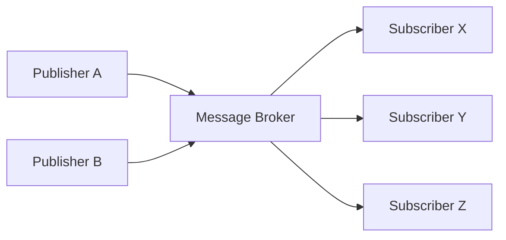
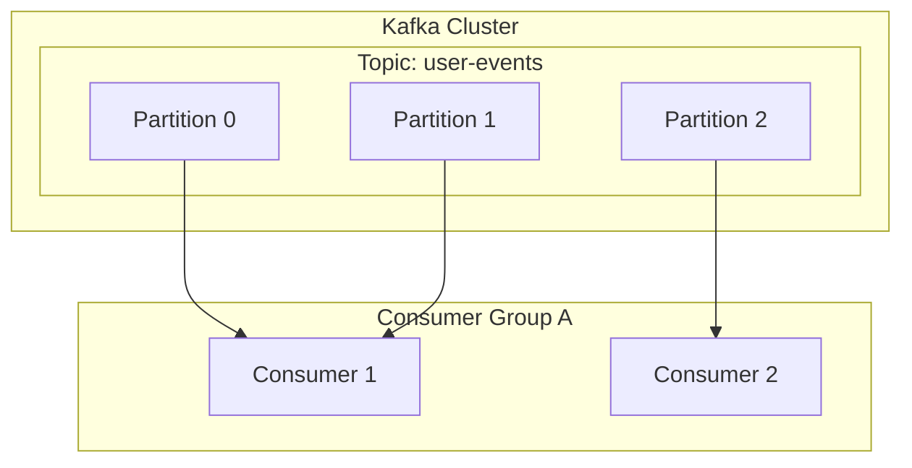

# 1. 事件驱动架构的引言

现代软件系统具有前所未有的规模和复杂性。在微服务架构成为主流的背景下，如何设计服务间的通信是决定系统整体性能、可用性以及可维护性的极其重要的因素。在这一背景下， ** 事件驱动架构 ** （Event-Driven Architecture: EDA）作为一种降低系统间耦合度、实现高可扩展性的强大范式，已经确立了坚实的地位。

# 2. 同步通信（REST / gRPC）的挑战

在分布式系统中，服务间通信最直观的方法是使用基于HTTP请求/响应的REST API，或是更高速的gRPC进行的 ** 同步通信 ** 。然而，同步通信存在一些本质上的挑战。

## 2.1 紧耦合与级联故障
在同步通信中，调用方（客户端）和被调用方（服务端）在时间上是强耦合的。客户端必须等待服务端返回响应，如果服务端发生故障或因高负载导致响应延迟，其影响将波及客户端。如果这种现象连锁发生，有引发导致整个系统宕机的 ** 级联故障 ** 的危险。

## 2.2 延迟的积累
在依次调用多个服务的事务处理中，各次调用的延迟会累加。例如，在订单处理中，如果同步调用“库存确认”、“支付处理”、“配送安排”这3个服务，各个服务响应时间的总和就变成了用户的等待时间。

## 2.3 可扩展性的限制
当发生突发流量（Burst Traffic）时，同步通信很难平滑流量，必须急剧横向扩展直接接收请求的服务资源。如果数据库写入等成为瓶颈，整个系统的可扩展性就会受到限制。

# 3. 事件驱动架构（EDA）的基础

为了克服这些挑战而出现的就是 ** 事件驱动架构 ** 。在EDA中，系统状态的变化被表示为“事件”，并在组件之间异步传递。

## 3.1 发布者-订阅者模型（Pub/Sub）

构成EDA核心的是 ** 发布者-订阅者模型 ** （Pub/Sub）。在这个模型中，生成事件的一方（发布者）和消费事件的一方（订阅者）之间，存在着作为消息中介的“消息代理（Message Broker）”。发布者只需将事件发送给代理即可，无需知道谁会接收该事件。同样，订阅者只需从代理接收感兴趣的事件即可，无需知道是谁发布的。



## 3.2 事件溯源模式

与EDA相关的一个重要设计模式是 ** 事件溯源 ** （Event Sourcing）。在传统的基于CRUD的应用程序中，数据库仅保存数据的“当前状态”。而在事件溯源中，更改系统状态的所有操作都作为不可变（Immutable）的“事件序列”来保存。

如果需要当前状态，则通过从头开始按顺序重放（Replay）过去的事件来进行重建。这不仅能获得完整的审计日志，还能恢复到过去任意时间点的系统状态。此外，它与分离读模型和写模型的CQRS（Command Query Responsibility Segregation）模式也非常契合。

# 4. 消息队列与流处理：RabbitMQ与Kafka

作为实现事件异步传递的中间件，历史上发展出了消息队列和事件流平台两种。这里，我们将比较各自的代表 ** RabbitMQ ** 和 ** Apache Kafka ** ，并深入探讨架构的差异。

## 4.1 RabbitMQ：传统且坚固的消息队列

RabbitMQ是基于AMQP（Advanced Message Queuing Protocol）设计的、拥有非常丰富业绩的消息代理。

### 4.1.1 路由的灵活性（Exchange与Queue）
RabbitMQ最大的特点是其消息路由功能非常丰富。发布者不会将消息直接发送到队列，而是发送到被称为 ** Exchange ** 的组件。Exchange根据预定义的规则（Binding），将消息分发到合适的队列。

- ** Direct Exchange ** : 当消息的路由键（Routing Key）和队列的绑定键（Binding Key）完全一致时进行转发。
- ** Topic Exchange ** : 基于使用通配符的灵活模式匹配进行转发。
- ** Fanout Exchange ** : 无条件地广播给所有绑定的队列。

### 4.1.2 消息的生命周期与状态管理
RabbitMQ秉持着“聪明的代理，愚笨的消费者（Smart Broker, Dumb Consumer）”的哲学。消息的投递确认（ACK）以及错误时的重试（路由到死信队列等），这些消息状态管理均由代理端负责。当消息被消费者成功处理并返回ACK后，该消息就会从队列中删除。

## 4.2 Apache Kafka：分布式事件流

Kafka最初在LinkedIn被开发，旨在以超高速和高吞吐量处理大规模日志数据。它拥有与RabbitMQ完全不同的架构范式。

### 4.2.1 基于主题和分区的分布式结构
在Kafka中，消息（事件）被分类到被称为 ** 主题（Topic） ** 的逻辑类别中。为了实现可扩展性，一个主题在物理上被划分为多个 ** 分区（Partition） ** 。每个分区作为有序的、不可变的追加型日志文件（Commit Log）持久化到磁盘上。



### 4.2.2 偏移量与“愚笨的代理，聪明的消费者”
Kafka不进行消息的状态管理。消息即使被消费者读取，也不会立即被删除，而是会保留在磁盘上直到超过设置的保留期（Retention Period）。消费者端自己管理表明在分区中读取到哪里的 ** 偏移量 ** （Offset）。通过这种“愚笨的代理，聪明的消费者（Dumb Broker, Smart Consumer）”模型，Kafka将代理的开销降到了最低，实现了每秒数百万条消息的惊人吞吐量。

## 4.3 RabbitMQ与Kafka的比较与用例

- ** RabbitMQ的适用场景 ** :
  需要复杂路由、需要对每条消息进行可靠处理和ACK管理的任务队列（例：邮件发送任务、繁重的图像处理、订单流程中的任务管理等）。
- ** Kafka的适用场景 ** :
  日志聚合、用户行为追踪、流处理、作为事件溯源的事件存储等，需要以高吞吐量处理大量数据，并在事后回放事件的系统。

# 5. 实现示例：RabbitMQ与Kafka的代码

让我们看看使用各自中间件的简单代码实现。

## 5.1 RabbitMQ的实现示例（Node.js / amqplib）

### 发布者 (publisher.js)
```javascript
const amqp = require('amqplib');

async function send() {
    const connection = await amqp.connect('amqp://localhost');
    const channel = await connection.createChannel();
    const queue = 'task_queue';
    
    await channel.assertQueue(queue, { durable: true });
    const msg = 'Hello RabbitMQ!';
    
    channel.sendToQueue(queue, Buffer.from(msg), { persistent: true });
    console.log(" [x] Sent '%s'", msg);
    
    setTimeout(() => { connection.close(); process.exit(0) }, 500);
}
send();
```

### 消费者 (consumer.js)
```javascript
const amqp = require('amqplib');

async function receive() {
    const connection = await amqp.connect('amqp://localhost');
    const channel = await connection.createChannel();
    const queue = 'task_queue';
    
    await channel.assertQueue(queue, { durable: true });
    channel.prefetch(1); // 逐个处理
    
    console.log(" [*] Waiting for messages in %s.", queue);
    channel.consume(queue, (msg) => {
        console.log(" [x] Received '%s'", msg.content.toString());
        setTimeout(() => {
            console.log(" [x] Done");
            channel.ack(msg);
        }, 1000);
    }, { noAck: false });
}
receive();
```

## 5.2 Kafka的实现示例（Node.js / kafkajs）

### 生产者 (producer.js)
```javascript
const { Kafka } = require('kafkajs');

const kafka = new Kafka({
  clientId: 'my-app',
  brokers: ['localhost:9092']
});

const producer = kafka.producer();

async function run() {
  await producer.connect();
  await producer.send({
    topic: 'test-topic',
    messages: [
      { value: 'Hello Kafka!' },
    ],
  });
  console.log("Message sent to Kafka");
  await producer.disconnect();
}
run();
```

### 消费者 (consumer.js)
```javascript
const { Kafka } = require('kafkajs');

const kafka = new Kafka({
  clientId: 'my-app',
  brokers: ['localhost:9092']
});

const consumer = kafka.consumer({ groupId: 'test-group' });

async function run() {
  await consumer.connect();
  await consumer.subscribe({ topic: 'test-topic', fromBeginning: true });

  await consumer.run({
    eachMessage: async ({ topic, partition, message }) => {
      console.log({
        partition,
        offset: message.offset,
        value: message.value.toString(),
      });
    },
  });
}
run();
```

# 6. 结语

事件驱动架构是保持系统灵活和可扩展的强大方法。作为其核心的消息代理，RabbitMQ和Kafka各自拥有不同的设计理念。如果追求路由的灵活性和可靠的状态管理，选择RabbitMQ；如果追求压倒性的吞吐量以及数据的持久性和可回放性，选择Kafka。根据项目需求选择合适的技术，是构建成功的分布式系统的关键。

# 7. 事件驱动架构中的高级设计模式与运维

在实际的企业系统中引入事件驱动架构时，会出现新的挑战。那就是数据的一致性、错误处理、系统的可观测性（Observability）等。这里将解说为了解决这些问题的高级模式。

## 7.1 基于Saga模式的分布式事务

在微服务架构中，使用同步的两阶段提交（2PC）来管理跨多个服务的事务会导致可用性和性能下降。作为替代方法，通常使用 ** Saga模式 ** 。

在Saga模式中，分布式事务被表示为一系列本地事务。每个服务执行本地事务，完成时发布事件以触发下一步。如果在某个步骤中失败，则发布事件来执行“补偿事务（Compensating [Transaction](https://kenji.blog/zh-cn/p/rdbms-transaction-acid-isolation-level-lock/)）”，以撤销已经完成的事务。

Saga有由中央控制器指示步骤的“编排型（Orchestration）”和各服务自主订阅事件并运行的“协同型（Choreography）”。在使用了Kafka等事件总线的EDA中，协同型Saga能够非常自然地被实现。

## 7.2 发件箱（Outbox）模式与幂等性

当服务更新自身的数据库，并同时向Kafka或RabbitMQ发布事件时，必须以原子方式执行“数据库更新与事件发布”。如果在数据库更新后进程崩溃，事件发布失败，整个系统就会发生不一致。

解决这个问题的是 ** 事务性发件箱模式（Transactional Outbox Pattern） ** 。服务在与原本数据更新相同的数据库事务中，将应该发送的事件记录写入“发件箱（Outbox）”表。之后，另一个后台进程（例：Debezium等CDC工具）监控发件箱表，确保将事件投递（At-Least-Once Delivery）到消息代理。

伴随于此，接收事件的消费者端必须设计为具备即使多次接收相同事件，结果也不改变的性质，即 ** 幂等性（Idempotency） ** 。

## 7.3 Kafka的详细架构：性能的秘密

与RabbitMQ等传统的代理相比，Kafka为何能发挥如此高的性能，我们将进一步探究其技术深层。

### 7.3.1 零拷贝（Zero-Copy）技术与页缓存
Kafka在从磁盘向网络传输数据时，使用了操作系统级别的“零拷贝”优化（Linux的 `sendfile` 系统调用）。借此，数据无需从内核空间复制到用户空间，而是直接发送到网络套接字。此外，Kafka不使用JVM的内存，而是最大限度地利用操作系统的页缓存（Page Cache），因此即使是海量数据也能实现高速的顺序访问。

### 7.3.2 消息的批量处理与压缩
Kafka生产者并非逐条发送消息，而是将消息作为批处理打包发送给代理。并且，通过用LZ4或Snappy等对整个批次进行压缩，急剧减少了网络带宽和磁盘使用量。

## 7.4 确保可观测性（Observability）

在异步处理连锁反应的系统中，发生故障时的故障排查变得极其困难。为了追踪消息在哪个队列中积压，或者错误发生在哪个服务，必须引入 ** 分布式追踪 ** （OpenTelemetry、Jaeger等）。为每条消息附加唯一的 `traceId` ，并将其与日志和指标关联，从而构建能够可视化事件流的基础设施，这是EDA运维的最佳实践。

# 7. 事件驱动架构中的高级设计模式与运维

在实际的企业系统中引入事件驱动架构时，会出现新的挑战。那就是数据的一致性、错误处理、系统的可观测性（Observability）等。这里将解说为了解决这些问题的高级模式。

## 7.3 Kafka的详细架构：性能的秘密

与RabbitMQ等传统的代理相比，Kafka为何能发挥如此高的性能，我们将进一步探究其技术深层。

## 7.3 Kafka的详细架构：性能的秘密

与RabbitMQ等传统的代理相比，Kafka为何能发挥如此高的性能，我们将进一步探究其技术深层。

## 7.3 Kafka的详细架构：性能的秘密

与RabbitMQ等传统的代理相比，Kafka为何能发挥如此高的性能，我们将进一步探究其技术深层。

## 7.4 确保可观测性（Observability）

在异步处理连锁反应的系统中，发生故障时的故障排查变得极其困难。为了追踪消息在哪个队列中积压，或者错误发生在哪个服务，必须引入 ** 分布式追踪 ** （OpenTelemetry、Jaeger等）。为每条消息附加唯一的 `traceId` ，并将其与日志和指标关联，从而构建能够可视化事件流的基础设施，这是EDA运维的最佳实践。
