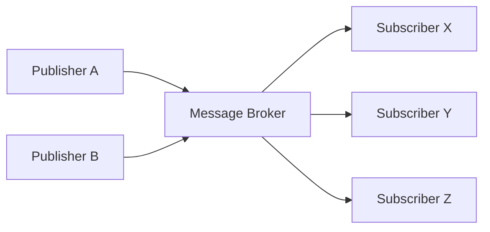
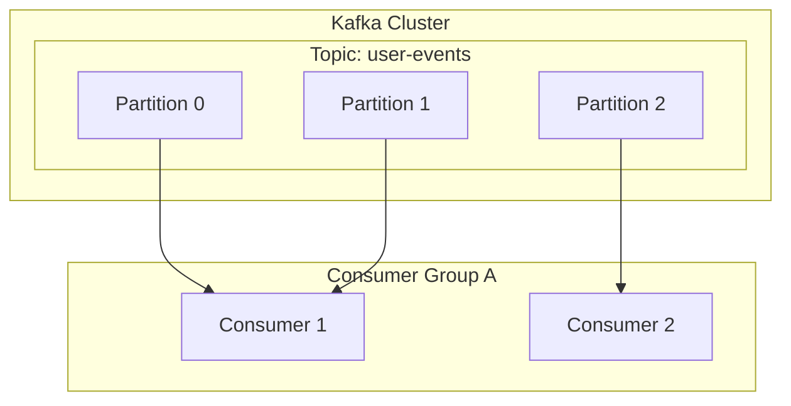

# 1. 事件驅動架構的引言

現代軟體系統擁有前所未有的規模與[複雜度](/zh-tw/p/time-space-complexity-big-o-notation-examples/)。在[微服務架構](/zh-tw/p/microservices-architecture-bff-api-gateway/)成為主流的當下，如何設計服務間的通訊，是左右整體系統效能、可用性及可維護性的極關鍵要素。在這樣的脈絡下， **事件驅動架構** (Event-Driven Architecture: EDA) 作為降低系統間耦合度、實現高擴展性的強大典範，已確立了其堅固的地位。

# 2. 同步通訊 (REST / gRPC) 的挑戰

在[分散式系統](/zh-tw/p/cap-theorem-distributed-systems-tradeoff/)中，服務間通訊最直覺的方法是使用 HTTP 請求/回應的 [REST API](/zh-tw/p/graphql-vs-rest-api-overfetching-type-safety/)，或是更高速的 gRPC 進行 **同步通訊** 。然而，同步通訊存在一些本質上的挑戰。

## 2.1 緊密耦合與串聯故障
在同步通訊中，呼叫端 (客戶端) 與被呼叫端 (伺服器) 在時間上是緊密耦合的。客戶端必須等待伺服器回傳回應，若伺服器發生故障或因高負載導致回應延遲，其影響將波及客戶端。若這種情況連鎖發生，就有可能引發導致整個系統停機的 **串聯故障** (Cascading Failure)。

## 2.2 延遲的累積
在依序呼叫多個服務的交易處理中，各呼叫的延遲時間會累加。例如，在訂單處理中同步呼叫「庫存確認」、「付款處理」、「配送安排」這 3 個服務時，各服務回應時間的總和就會成為使用者的等待時間。

## 2.3 擴展性的限制
當發生短暫的流量突增 (Burst Traffic) 時，同步通訊很難平滑流量，必須迅速擴展直接接收請求的服務資源。若寫入資料庫等操作成為瓶頸，系統整體的擴展性就會受到限制。

# 3. 事件驅動架構 (EDA) 的基礎

為了克服這些挑戰而出現的正是 **事件驅動架構** 。在 EDA 中，系統狀態的變化會被表現為「事件」，並在元件之間以非同步的方式進行交換。

## 3.1 發布/訂閱模型 (Pub/Sub)

構成 EDA 核心的是 **發布/訂閱模型** (Pub/Sub)。在這個模型中，產生事件的一方 (發布者) 與消耗事件的一方 (訂閱者) 之間，存在著作為訊息中介的「訊息代理 (Message Broker)」。發布者只需將事件傳送給代理即可，不需要知道誰會接收該事件。同樣地，訂閱者只需從代理接收感興趣的事件即可，不需要知道是誰發布的。



## 3.2 事件溯源模式

與 EDA 相關的重要設計模式之一是 **事件溯源** (Event Sourcing)。在傳統基於 CRUD 的應用程式中，資料庫僅儲存資料的「目前狀態」。相對地，事件溯源會將更改系統狀態的所有操作儲存為不可變 (Immutable) 的「事件序列」。

當需要目前狀態時，會透過從頭依序重播 (Replay) 過去的事件來重建。這樣一來，不僅能獲得完整的稽核日誌，還能還原到過去任意時間點的系統狀態。此外，它與分離讀取模型與寫入模型的 CQRS (Command Query Responsibility Segregation) 模式也非常契合。

# 4. 訊息佇列與串流：RabbitMQ 與 Kafka

為了實現事件的非同步傳遞，歷史上發展出了訊息佇列與事件串流平台這兩種中介軟體。在此我們將比較兩者的代表性產品 **RabbitMQ** 與 **Apache Kafka** ，並深入探討架構上的差異。

## 4.1 RabbitMQ：傳統且穩健的訊息佇列

RabbitMQ 是基於 AMQP (Advanced Message Queuing Protocol) 設計，擁有豐富實績的訊息代理。

### 4.1.1 路由的彈性 (Exchange 與 Queue)
RabbitMQ 最大的特色在於其極度豐富的訊息路由功能。發布者不會將訊息直接傳送到佇列，而是傳送到被稱為 **Exchange** 的元件。Exchange 會依照預先定義的規則 (綁定，Binding)，將訊息分發到適當的佇列。

- **Direct Exchange** : 訊息的路由鍵與佇列的綁定鍵完全一致時轉發。
- **Topic Exchange** : 使用萬用字元透過彈性的模式匹配進行轉發。
- **Fanout Exchange** : 無條件向所有綁定的佇列進行廣播。

### 4.1.2 訊息的生命週期與狀態管理
RabbitMQ 秉持「聰明的代理、笨拙的消費者 (Smart Broker, Dumb Consumer)」的哲學。訊息的傳遞確認 (ACK)、發生錯誤時的重試 (路由至 Dead Letter Queue) 等訊息狀態管理，都由代理端負責。當訊息被消費者正常處理並回傳 ACK 後，該訊息就會從佇列中刪除。

## 4.2 Apache Kafka：分散式事件串流

Kafka 最初由 LinkedIn 開發，專為以超高速、高吞吐量處理大規模日誌資料而設計。它具備與 RabbitMQ 截然不同的架構典範。

### 4.2.1 透過主題與分區的分散式結構
在 Kafka 中，訊息 (事件) 被分類到稱為 **主題** (Topic) 的邏輯類別。為了實現擴展性，單一個主題會在物理上被分割成多個 **分區** (Partition)。各個分區會作為有序、不可變的僅附加日誌檔 (Commit Log) 持久化至磁碟中。



### 4.2.2 位移與「笨拙的代理、聰明的消費者」
Kafka 不會進行訊息的狀態管理。訊息即使被消費者讀取也不會立即刪除，而是會保留在磁碟中，直到超過設定的保留期限 (Retention Period) 為止。由消費者端自行管理表示其已讀取到分區中哪個位置的 **位移** (Offset)。透過這種「笨拙的代理、聰明的消費者 (Dumb Broker, Smart Consumer)」模型，Kafka 將代理的負擔降到最低，達成了每秒數百萬條訊息的驚人吞吐量。

## 4.3 RabbitMQ 與 Kafka 的比較與使用案例

- **RabbitMQ 的適合使用案例** :
  需要複雜路由時，或是需要確保每條訊息被處理並管理 ACK 的工作佇列 (例如：發送電子郵件任務、繁重的圖片處理、訂單流程中的任務管理等)。
- **Kafka 的適合使用案例** :
  日誌聚合、使用者行為追蹤、串流處理、作為事件溯源的事件儲存區等，需要以高吞吐量處理大量資料，且日後可能需要重播事件的系統。

# 5. 實作範例：RabbitMQ 與 Kafka 的程式碼

讓我們來看看使用各個中介軟體的簡單程式碼實作。

## 5.1 RabbitMQ 的實作範例 (Node.js / amqplib)

### 發布者 (publisher.js)
```javascript
const amqp = require('amqplib');

async function send() {
    const connection = await amqp.connect('amqp://localhost');
    const channel = await connection.createChannel();
    const queue = 'task_queue';
    
    await channel.assertQueue(queue, { durable: true });
    const msg = 'Hello RabbitMQ!';
    
    channel.sendToQueue(queue, Buffer.from(msg), { persistent: true });
    console.log(" [x] Sent '%s'", msg);
    
    setTimeout(() => { connection.close(); process.exit(0) }, 500);
}
send();
```

### 消費者 (consumer.js)
```javascript
const amqp = require('amqplib');

async function receive() {
    const connection = await amqp.connect('amqp://localhost');
    const channel = await connection.createChannel();
    const queue = 'task_queue';
    
    await channel.assertQueue(queue, { durable: true });
    channel.prefetch(1); // 每次處理 1 個
    
    console.log(" [*] Waiting for messages in %s.", queue);
    channel.consume(queue, (msg) => {
        console.log(" [x] Received '%s'", msg.content.toString());
        setTimeout(() => {
            console.log(" [x] Done");
            channel.ack(msg);
        }, 1000);
    }, { noAck: false });
}
receive();
```

## 5.2 Kafka 的實作範例 (Node.js / kafkajs)

### 生產者 (producer.js)
```javascript
const { Kafka } = require('kafkajs');

const kafka = new Kafka({
  clientId: 'my-app',
  brokers: ['localhost:9092']
});

const producer = kafka.producer();

async function run() {
  await producer.connect();
  await producer.send({
    topic: 'test-topic',
    messages: [
      { value: 'Hello Kafka!' },
    ],
  });
  console.log("Message sent to Kafka");
  await producer.disconnect();
}
run();
```

### 消費者 (consumer.js)
```javascript
const { Kafka } = require('kafkajs');

const kafka = new Kafka({
  clientId: 'my-app',
  brokers: ['localhost:9092']
});

const consumer = kafka.consumer({ groupId: 'test-group' });

async function run() {
  await consumer.connect();
  await consumer.subscribe({ topic: 'test-topic', fromBeginning: true });

  await consumer.run({
    eachMessage: async ({ topic, partition, message }) => {
      console.log({
        partition,
        offset: message.offset,
        value: message.value.toString(),
      });
    },
  });
}
run();
```

# 6. 結語

事件驅動架構是讓系統保持彈性且具擴展性的強大手法。作為擔任其核心的訊息代理，RabbitMQ 與 Kafka 各自擁有不同的設計理念。若追求路由的彈性與確實的[狀態管理](/zh-tw/p/state-management-history-redux-context-recoil-zustand/)就選擇 RabbitMQ，若追求壓倒性的吞吐量與資料的持久化/可重播性則選擇 Kafka，配合專案的需求選擇適當的技術，是成功建構[分散式系統](/zh-tw/p/cap-theorem-distributed-systems-tradeoff/)的關鍵。

# 7. 事件驅動架構中的進階設計模式與維運

在實際的企業級系統中導入事件驅動架構時，將會浮現新的挑戰。這包含了資料一致性、錯誤處理，以及系統的可觀測性 (Observability) 等。在此我們將解說為了解決這些問題的進階模式。

## 7.1 使用 Saga 模式進行分散式交易

在[微服務架構](/zh-tw/p/microservices-architecture-bff-api-gateway/)中，以同步的二階層認可 (2PC) 來管理橫跨多個服務的交易，會導致可用性與效能下降。作為替代方案，會使用 **Saga 模式** 。

在 Saga 模式中，分散式交易會被表現為一連串的本地交易。每個服務會執行本地交易，並在完成時發布事件以觸發下一個步驟。若在某個步驟失敗，則發布事件以執行「補償交易 (Compensating [Transaction](https://kenji.blog/zh-tw/p/rdbms-transaction-acid-isolation-level-lock/))」，藉此取消已經完成的交易。

Saga 有由中央控制器指示步驟的「編排型 (Orchestration)」，以及各服務自主訂閱事件並採取行動的「編舞型 (Choreography)」。在使用如 Kafka 這種事件匯流排的 EDA 中，可以非常自然地實作編舞型 Saga。

## 7.2 Outbox 模式與冪等性

當服務更新自身的資料庫，同時又向 Kafka 或 RabbitMQ 發布事件時，必須將「資料庫更新與事件發布」以原子 (Atomic) 方式執行。若在更新資料庫後處理程序崩潰導致事件發布失敗，將會造成整個系統的不一致。

解決這個問題的就是 **交易式 Outbox 模式 (Transactional Outbox Pattern)** 。服務會在與原本資料更新相同的資料庫交易內，將應傳送的事件紀錄寫入「Outbox (寄件匣)」資料表。之後，另一個背景處理程序 (例如：Debezium 等 CDC 工具) 會監控 Outbox 資料表，並確保將事件傳遞給訊息代理 (At-Least-Once Delivery)。

伴隨於此，接收事件的消費者端必須被設計為具備即使多次接收相同事件也不會改變結果的特性，亦即 **冪等性 (Idempotency)** 。

## 7.3 Kafka 的詳細架構：效能的秘密

與 RabbitMQ 等傳統代理相比，為何 Kafka 能發揮如此高的效能？我們將探討更具技術性的深層原因。

### 7.3.1 零拷貝 (Zero-Copy) 技術與分頁快取
Kafka 針對從磁碟到網路的資料傳輸，使用了 OS 層級的「零拷貝」最佳化 (Linux 的 `sendfile` 系統呼叫)。藉此，資料無須從核心空間複製到使用者空間，便能直接傳送至網路 Socket。此外，Kafka 不使用 JVM 的記憶體，而是將 OS 的分頁快取發揮到極致，因此即使是龐大的資料，也能實現高速的循序存取。

### 7.3.2 訊息的批次處理與壓縮
Kafka 生產者不會逐一傳送訊息，而是將其打包成批次傳送給代理。進一步地，透過將整個批次以 LZ4 或 Snappy 等方式進行壓縮，可大幅減少網路頻寬與磁碟使用量。

## 7.4 確保可觀測性 (Observability)

在[非同步處理](/zh-tw/p/event-driven-architecture-async/)串聯的系統中，發生故障時的故障排除將變得極度困難。為了追蹤訊息停滯在哪個佇列中、在哪個服務發生了錯誤，必須導入 **分散式追蹤** (OpenTelemetry、Jaeger 等)。賦予每則訊息一個唯一的 `traceId`，並將其與日誌及指標 (Metrics) 關聯，以建立將事件流程視覺化的基礎設施，這正是 EDA 維運的最佳實踐。
