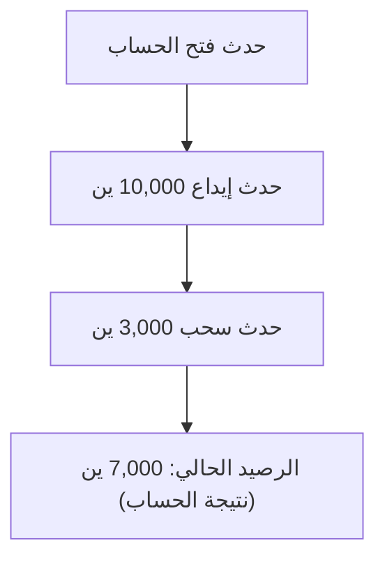
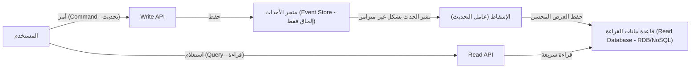

في تطوير البرمجيات المعقدة الحديثة، تعتبر كيفية إدارة البيانات والحالة موضوعاً أساسياً في البنية التحتية. لطالما اعتمدت العديد من الأنظمة على نمذجة البيانات استناداً إلى "CRUD" (إنشاء، قراءة، تحديث، حذف). ومع ذلك، مع ازدياد تعقيد متطلبات الأعمال، تتضح القيود المفروضة على CRUD في حالات متزايدة.

في هذا المقال، بدلاً من حفظ وتجاوز الحالة الحالية (State)، سنتعمق في نمط "تحديد المصدر من الأحداث" (Event Sourcing) الذي يستمر في تسجيل "الحقائق (Event) التي حدثت في النظام" كتاريخ غير قابل للتغيير، بالإضافة إلى "CQRS" (فصل مسؤولية الأوامر والاستعلامات) الذي يعد ضرورياً لذلك. سنستكشف هذه المفاهيم بدءاً من الفكرة الأساسية وصولاً إلى الفوائد وتحديات الاتساق النهائي.

## 1. قيود بنية CRUD: "فقدان الماضي" بسبب الكتابة فوق البيانات

في بنية CRUD النموذجية، تحتفظ جداول قاعدة البيانات بـ "أحدث حالة حالية". على سبيل المثال، عند تحديث معلومات المستخدم في موقع للتجارة الإلكترونية، إذا تغير العنوان، فسيتم عمل `UPDATE` لعمود "العنوان" في قاعدة البيانات بقيمة جديدة.

هذا النهج بديهي وسهل التنفيذ. ومع ذلك، فإنه يحتوي على عيب فادح: "البيانات السابقة تُفقد".

يؤدي استبدال الحالة بواسطة CRUD إلى محو المعلومات التالية تماماً من النظام:
* **ما هو القصد من هذا التغيير؟** (هل كان مجرد تصحيح لخطأ مطبعي، أم أن المستخدم قد انتقل بالفعل؟)
* **متى وبأي تغييرات وصلت البيانات إلى حالتها الحالية؟**
* **ما هي حالة البيانات في نقطة زمنية معينة في الماضي؟**

في الأنظمة ذات متطلبات التدقيق (Audit) الصارمة، أو في المجالات التي تتطلب تحليل البيانات التاريخية للتعلم الآلي أو تتبع قواعد العمل المعقدة، يشكل هذا "الفقدان للماضي" عقبة كبيرة. توجد حلول بديلة مثل إنشاء جداول السجل (History Table) بشكل منفصل، لكنها ليست حلاً جذرياً وغالباً ما تتسبب في تشغيل منطق معقد أو مكرر.

## 2. تحديد المصدر من الأحداث (Event Sourcing): نهج "الإلحاق فقط" المستوحى من الأنظمة المحاسبية

للتغلب على قيود CRUD، يتم تبني نمط "تحديد المصدر من الأحداث". الفكرة الأساسية لهذا النمط هي "بدلاً من حفظ الحالة الحالية، قم بحفظ تسلسل 'أحداث المجال' (Domain Events) التي تسببت في تغيير الحالة بنظام الإلحاق فقط (Append-only)".

المثال الكلاسيكي والأكثر وضوحاً هو "دفتر الأستاذ (Ledger)" في المحاسبة.
تخيل نظام حساب مصرفي. لا يوجد بنك يحتفظ برقم واحد يمثل "الرصيد الحالي" للحساب ويقوم بتحديثه فوق الرصيد السابق مع كل عملية إيداع أو سحب. بدلاً من ذلك، يسجل النظام كل **سجلات المعاملات (الأحداث)** مثل "إيداع 10,000 ين"، "سحب 3,000 ين"، و "خصم رسوم 200 ين". يتم استنتاج الرصيد الحالي عن طريق تجميع (إعادة تشغيل أو Replay) هذه الأحداث بالترتيب من البداية.

### الفوائد الرئيسية لتحديد المصدر من الأحداث

1. **ضمان سجل تدقيق (Audit Log) كامل**
   نظراً لاستمرار جميع التغييرات كأحداث، يتم الحصول على مسار تدقيق كامل بشكل طبيعي. يبقى سجل لا رجوع فيه يوضح "من فعل ماذا، ومتى".

2. **الاستعادة إلى أي نقطة زمنية (Time-Travel Debugging)**
   من خلال إعادة تشغيل تسلسل الأحداث إلى طابع زمني محدد، يمكن استعادة النظام بدقة إلى حالته في تلك النقطة الزمنية السابقة. هذا سلاح قوي في استكشاف الأخطاء وإصلاحها والتحقق من قواعد العمل في أوقات سابقة.

3. **حفظ النية (Intention)**
   لا يتم فقط حفظ أن "A تحول إلى B"، بل يتم تسجيل حقيقة واضحة تعبر عن النية التجارية، مثل "تمت إضافة منتج إلى العربة" أو "اكتملت عملية الدفع".

4. **أداء عالٍ بفضل الكتابة بالإلحاق فقط**
   نظراً لأنه لا يتم إجراء UPDATE أو DELETE، بل تتم دائماً عمليات INSERT (إلحاق) فقط، ينخفض تعارض القفل (Lock Contention) في قاعدة البيانات، مما يتيح إنتاجية كتابة عالية جداً.

## 3. حتمية CQRS: لماذا الفصل ضروري؟

بينما يتميز نمط تحديد المصدر من الأحداث بكفاءة استثنائية في الكتابة (تغيير الحالة وتسجيلها)، فإنه يتسبب في مشكلة خطيرة في "القراءة (الاستعلام)".

استجابةً لاستعلام بسيط مثل "ما هو العنوان الحالي للمستخدم؟"، يتطلب تحديد المصدر من الأحداث استرجاع جميع أحداث المستخدم، بدءاً من "حدث تسجيل المستخدم" وصولاً إلى كافة "أحداث تغيير العنوان"، ثم تطبيقها (Replay) في الذاكرة لبناء الحالة الحالية. إذا كان هناك ملايين الأحداث، فإن هذا الأداء غير واقعي.

هنا يأتي دور **CQRS (Command Query Responsibility Segregation: فصل مسؤولية الأوامر والاستعلامات)**.
CQRS هو نمط بنية يفصل تماماً بين "النموذج الذي يقوم بتحديث المعلومات (Command)" و "النموذج الذي يقرأ المعلومات (Query)" في النظام.

عند اعتماد Event Sourcing، يصبح CQRS **ضرورياً** تقريباً.
* **نموذج الكتابة (جانب الأوامر - Command)**: متجر الأحداث (Event Store). يختص فقط بتطبيق قواعد عمل المجال وحفظ/إلحاق الأحداث التي تم التحقق من صحتها.
* **نموذج القراءة (جانب الاستعلام - Query)**: الإسقاط (Projection). يشترك في استلام الأحداث المتدفقة من متجر الأحداث، ويقوم ببناء وتحديث عرض (View) محسن للحالة الحالية بالتنسيق الذي تطلبه واجهات المستخدم (UI) أو واجهات برمجة التطبيقات (API).

من خلال هذا الفصل، يمكن لجانب القراءة تحقيق استجابة سريعة للغاية ببساطة عن طريق إرجاع البيانات من عرض مبني مسبقاً، دون الحاجة إلى إجراء حسابات أو دمج معقد (JOIN).

## 4. الإسقاط غير المتزامن وتحدي الاتساق النهائي (Eventual Consistency)

تعد البنية التي تجمع بين CQRS و Event Sourcing قوية (ES/CQRS)، لكنها ليست "رصاصة فضية". التحدي الأكبر الذي يواجه هذا النظام هو **الاتساق النهائي (Eventual Consistency)**.

هناك تأخير زمني (غالباً ما يكون أجزاء من الثانية إلى بضع ثوانٍ) بين وقت حفظ الحدث في المتجر على جانب الأوامر، والوقت الذي يتم فيه تحديث قاعدة بيانات القراءة (الإسقاط) بشكل غير متزامن.
هذه هي مشكلة "القراءة القديمة" (Stale Read)، حيث بمجرد ضغط المستخدم على زر "تحديث" وإعادة تحميل الشاشة، قد لا تكون قاعدة بيانات القراءة قد تم تحديثها بعد، مما يؤدي إلى عرض بيانات قديمة.

### نُهج معالجة التحدي

يتطلب هذا الاتساق النهائي أساليب تقنية وتصميمية لتجربة المستخدم (UX).

1. **اعتماد واجهة المستخدم المتفائلة (Optimistic UI)**
   بدلاً من انتظار النتيجة المرجعة من الخادم، يقوم العميل (الواجهة الأمامية) بافتراض نجاح العملية وتحديث واجهة المستخدم فوراً.

2. **إشعارات التحديث عبر Polling أو WebSocket**
   بمجرد اكتمال الإسقاط وتحديث نموذج القراءة، يتم إرسال إشعار الدفع للعميل باستخدام تقنيات مثل WebSocket، مما يدفعه لتحديث الشاشة.

3. **التحقق من الإصدار (رقم المراجعة - Revision Number)**
   يحتفظ العميل برقم الإصدار للأمر الأخير الذي نفذه، وعند طلب Read API يشترط "أريد البيانات على الأقل من الإصدار X أو أحدث". إما أن تنتظر الخلفية (Backend) حتى تصل إلى هذا الإصدار، أو تطلب من العميل الاستمرار في الاستعلام (Polling).

## 5. الخلاصة

يعد تحديد المصدر من الأحداث و CQRS نماذج قوية تتجاوز قيود بنية CRUD، وتهدف إلى تحقيق قابلية التوسع، الاحتفاظ بالسجل الكامل، وتلبية متطلبات الأعمال المعقدة.

من خلال التعامل مع الحالة كـ "خطوط (مسار من الأحداث)" بدلاً من "نقاط"، ترتقي البيانات من مجرد سجل إلى مصدر ينطق بـ "حقيقة الأعمال". ومع ذلك، يجب على النظام في المقابل أن يواجه التحديات المرتبطة بالأنظمة الموزعة، كزيادة التعقيد العام ومشكلة الاتساق النهائي.

هذه البنية ليست مناسبة لجميع المشاريع. ولكن في المجالات التي تعتبر فيها الحقائق التاريخية ذات قيمة مطلقة، كإدارة الأنظمة المالية، الطلبات في التجارة الإلكترونية، والتتبع اللوجستي، فإنها ستكون سلاحاً لا مثيل له. إن التحدي الحقيقي للمعماري هو التقييم الدقيق لمتطلبات النظام وتعقيد المجال، وتطبيق هذا النمط في الأماكن المناسبة.
