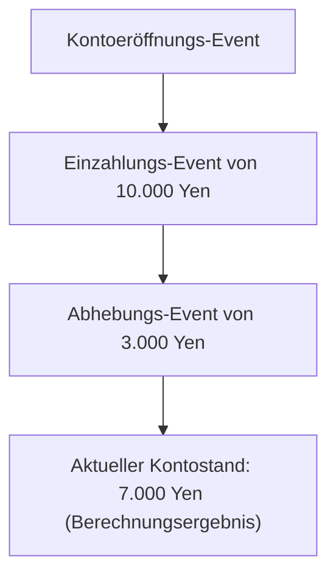
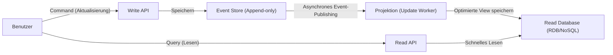

In der heutigen komplexen Softwareentwicklung ist die Verwaltung von Daten und Zuständen (State) ein zentrales Thema der Architektur. Viele Systeme haben traditionell die Datenmodellierung basierend auf "CRUD (Create, Read, Update, Delete)" übernommen. Da jedoch die geschäftlichen Anforderungen immer anspruchsvoller werden, gibt es immer mehr Fälle, in denen die Grenzen von CRUD deutlich werden.

In diesem Artikel werden wir "Event Sourcing" - das kontinuierliche Aufzeichnen von "Tatsachen, die im System aufgetreten sind (Events)" als unveränderliche Historie anstelle des Überschreibens des aktuellen Zustands (State) - und das dafür unerlässliche "CQRS (Command Query Responsibility Segregation)" tiefgehend beleuchten, angefangen bei ihren Konzepten über ihre Vorteile bis hin zu den Herausforderungen der Eventual Consistency (Schlussendliche Konsistenz).

## 1. Die Grenzen der CRUD-Architektur: "Verlust der Vergangenheit" durch Überschreiben

In einer typischen CRUD-Architektur enthalten Datenbanktabellen den "aktuellen, neuesten Zustand". Wenn man beispielsweise die Benutzerinformationen einer E-Commerce-Website aktualisiert und sich die Adresse ändert, wird die Spalte "Adresse" in der Datenbank mit dem neuen Wert per `UPDATE` überschrieben.

Dieser Ansatz ist intuitiv und einfach zu implementieren. Es gibt jedoch einen fatalen Fehler: "Vergangene Daten gehen verloren".

Das Überschreiben von Zuständen durch CRUD löscht die folgenden Informationen vollständig aus dem System:
* **Mit welcher Absicht wurde die Änderung vorgenommen?** (War es nur eine Tippfehlerkorrektur oder ist die Person wirklich umgezogen?)
* **Wann und durch welche Veränderungen wurde der aktuelle Zustand erreicht?**
* **Wie war der Zustand der Daten zu einem bestimmten Zeitpunkt in der Vergangenheit?**

In Systemen mit strengen Audit-Anforderungen, bei der Analyse von Vergangenheitsdaten für maschinelles Lernen oder in Domänen, in denen komplexe Geschäftsregeln verfolgt werden müssen, ist dieser "Verlust der Vergangenheit" ein großes Hindernis. Es gibt zwar Workarounds wie die Einrichtung einer separaten Historientabelle (History Table), aber dies ist keine fundamentale Lösung und führt oft zu komplexen Triggern und redundanter Logik.

## 2. Event Sourcing: Der "Append-only"-Ansatz nach dem Vorbild von Buchhaltungssystemen

Um die Grenzen von CRUD zu überwinden, wird "Event Sourcing" eingesetzt. Die grundlegende Idee dieses Musters besteht darin, "nicht den aktuellen Zustand zu speichern, sondern die Sequenz der 'Domänen-Events', die die Ursache für die Zustandsänderung waren, ausschließlich anhängend (Append-only) zu speichern".

Das klassischste und am leichtesten verständliche Beispiel ist das "Hauptbuch (Ledger)" in der Buchhaltung.
Stellen Sie sich das System eines Bankkontos vor. Es gibt keine Bank, die nur eine einzige Zahl namens "aktueller Kontostand" speichert und diese bei jeder Ein- oder Auszahlung überschreibt. Stattdessen wird die gesamte **Historie der Transaktionen (Events)** wie "Einzahlung von 10.000 Yen", "Abhebung von 3.000 Yen", "Abbuchung der Gebühr von 200 Yen" aufgezeichnet. Der aktuelle Kontostand wird abgeleitet, indem diese Ereignisse von Anfang an der Reihe nach aggregiert (replayed) werden.

### Hauptvorteile von Event Sourcing

1. **Sicherstellung eines vollständigen Audit-Logs**
   Da alle Änderungen als Ereignisse persistiert werden, entsteht auf natürliche Weise ein vollständiger Audit-Trail. "Wer hat wann was getan" bleibt in irreversibler Form erhalten.

2. **Wiederherstellung zu einem beliebigen Zeitpunkt (Time-Travel Debugging)**
   Durch das Replay der Event-Sequenz bis zu einem bestimmten Zeitstempel kann das System exakt auf den Zustand zu jedem beliebigen vergangenen Zeitpunkt wiederhergestellt werden. Dies ist eine mächtige Waffe bei der Fehleruntersuchung oder der Validierung von Geschäftsregeln zu einem vergangenen Zeitpunkt.

3. **Erhaltung der Absicht (Intention)**
   Es wird nicht einfach gespeichert "A hat sich in B geändert", sondern Tatsachen mit klarer geschäftlicher Absicht wie "Artikel zum Warenkorb hinzugefügt" oder "Checkout abgeschlossen".

4. **Hohe Performance durch reines Append-only-Schreiben**
   Da keine UPDATEs oder DELETEs durchgeführt werden und immer nur INSERTs (Anhängen) erfolgen, verringert sich die Konkurrenz um Datenbank-Sperren, wodurch ein extrem hoher Schreibdurchsatz erreicht werden kann.

## 3. Die Notwendigkeit von CQRS: Warum ist eine Trennung erforderlich?

Während Event Sourcing beim Schreiben (Ändern und Aufzeichnen von Zuständen) hervorragend ist, verursacht es beim "Lesen (Query)" ernsthafte Probleme.

Für eine einfache Abfrage wie "Bitte nennen Sie mir die aktuelle Adresse des Benutzers" müsste Event Sourcing jedes Mal beim "Benutzerregistrierungs-Event" beginnen, alle "Adressänderungs-Events" abrufen, sie im Speicher anwenden (Replay) und so den aktuellen Zustand rekonstruieren. Wenn es Millionen von Ereignissen gibt, ist dies keine realistische Performance.

Hier kommt **CQRS (Command Query Responsibility Segregation)** ins Spiel.
CQRS ist ein Architekturmuster, das das "Modell zur Informationsaktualisierung (Command)" und das "Modell zum Lesen von Informationen (Query)" eines Systems vollständig trennt.

Wenn man Event Sourcing einsetzt, ist CQRS fast **zwingend erforderlich**.
* **Write Model (Command-Seite)**: Event Store. Wendet die Geschäftsregeln der Domäne an und ist ausschließlich auf das Anhängen und Speichern validierter Events spezialisiert.
* **Read Model (Query-Seite)**: Projektion (Projection). Abonniert die aus dem Event Store fließenden Events und erstellt/aktualisiert eine für die UI oder API optimierte Ansicht (den aktuellen Zustand).

Durch diese Trennung muss die Leseseite keine komplexen JOINs oder Berechnungen durchführen, sondern gibt lediglich Daten aus der zuvor erstellten Ansicht zurück, wodurch extrem schnelle Antwortzeiten erreicht werden können.

## 4. Asynchrone Projektion und die Herausforderung der Eventual Consistency

Eine Architektur, die CQRS und Event Sourcing kombiniert (ES/CQRS), ist mächtig, aber keine "Silver Bullet" (Allheilmittel). Die größte Herausforderung ist die **Eventual Consistency (Schlussendliche Konsistenz)**, mit der das System konfrontiert wird.

Vom Moment an, in dem ein Event auf der Command-Seite im Store gespeichert wird, bis die Datenbank (Projektion) auf der Read-Seite asynchron aktualisiert wird, entsteht eine zeitliche Verzögerung (Time Lag, typischerweise einige Millisekunden bis Sekunden).
Das Problem des "Stale Read" tritt auf, wenn ein Benutzer auf den "Aktualisieren"-Button klickt und der Bildschirm neu geladen wird, aber die DB auf der Read-Seite noch nicht aktualisiert ist und somit alte Daten angezeigt werden.

### Ansätze zur Bewältigung der Herausforderung

Um dieser Eventual Consistency zu begegnen, sind technische und UX- (User Experience) basierte Ansätze erforderlich.

1. **Einsatz von Optimistic UI (UX-Optimierung)**
   Auf der Client-Seite (Frontend) wird nicht auf das vom Server zurückgegebene Ergebnis gewartet, sondern man geht von einem Erfolg aus und aktualisiert die UI sofort.

2. **Update-Benachrichtigungen per Polling oder WebSocket**
   Nachdem die Projektion abgeschlossen und das Read-Modell aktualisiert wurde, wird der Client per WebSocket (oder Ähnlichem) mit einer Push-Benachrichtigung informiert, woraufhin der Bildschirm aktualisiert wird.

3. **Versionsüberprüfung (Revisionsnummer)**
   Der Client speichert die Versionsnummer des zuletzt ausgeführten Commands und verlangt beim Aufruf der Read API: "Gib mir Daten mindestens ab Version X zurück". Das Backend wartet entweder, bis diese Version erreicht ist, oder fordert zum Polling auf.

## 5. Fazit

Event Sourcing und CQRS sind mächtige Paradigmen, um die Grenzen der CRUD-Architektur zu durchbrechen und Skalierbarkeit, die Beibehaltung einer vollständigen Historie sowie komplexe Geschäftsanforderungen zu erfüllen.

Indem man den Zustand nicht als "Punkt", sondern als "Linie (die Spur von Events)" betrachtet, werden Daten von einer bloßen Aufzeichnung zu einer Quelle, die die "Wahrheit des Unternehmens" erzählt. Als Gegenleistung müssen wir uns mit der zunehmenden Komplexität des Gesamtsystems und den für verteilte Systeme typischen Herausforderungen wie der Eventual Consistency auseinandersetzen.

Diese Architektur ist nicht für jedes Projekt geeignet. In Domänen wie dem Finanzwesen, der Bestellverwaltung im E-Commerce oder der Logistikverfolgung, in denen vergangene Fakten einen absoluten Wert haben, wird sie jedoch zur denkbar stärksten Waffe. Es ist die Kunst eines Architekten, die Systemanforderungen und die Komplexität der Domäne genau abzuschätzen und dieses Muster an den richtigen Stellen anzuwenden.
