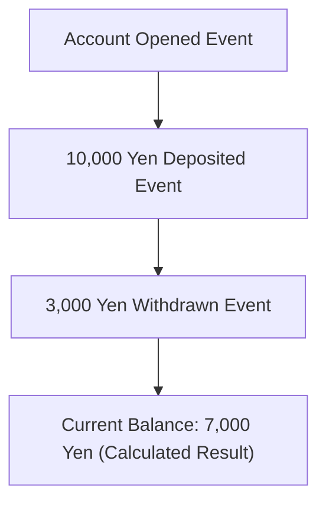
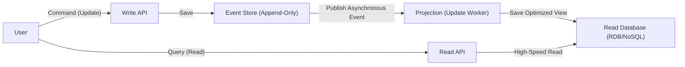

In modern, complex software development, how to manage data and state is a fundamental architectural theme. Historically, many systems have adopted data modeling based on "CRUD (Create, Read, Update, Delete)". However, as business requirements become increasingly sophisticated, the limitations of CRUD are surfacing more frequently.

This article deeply explores "Event Sourcing"—a pattern that continuously records the "facts (events) that occurred within the system" as an immutable history, rather than overwriting the current state—and "CQRS (Command Query Responsibility Segregation)", an indispensable counterpart. We will delve into their core concepts, their benefits, and even the challenges surrounding eventual consistency.

## 1. The Limitations of CRUD Architecture: "Loss of the Past" Through Overwriting

In a typical CRUD architecture, database tables maintain the "latest current state." For instance, when updating a user's information on an e-commerce site, if the user moves, the "address" column in the database is updated with the new value using `UPDATE`.

This approach is intuitive and straightforward to implement. However, it possesses a fatal flaw: "the loss of historical data."

Overwriting the state via CRUD completely erases the following information from the system:
* **What was the intent behind the change?** (Was it simply fixing a typo, or did they actually move?)
* **When and through what transitions did the system reach its current state?**
* **What exactly was the state of the data at a specific point in the past?**

In systems with strict audit requirements, domains that analyze historical data for machine learning, or applications that need to track complex business rules, this "loss of the past" poses a significant barrier. While workarounds like setting up separate History Tables exist, they do not inherently solve the problem and often lead to complex triggers or redundant logic.

## 2. Event Sourcing: An "Append-Only" Approach Learned from Accounting Systems

To overcome the limitations of CRUD, "Event Sourcing" is adopted. The fundamental idea behind this pattern is: "Instead of storing the current state, store the sequence of 'domain events' that caused the state to change in an append-only manner."

The most classical and intuitive example is an "Accounting Ledger."
Imagine a bank account system. No bank simply stores a single number representing the "current balance" of an account and overwrites it with every deposit or withdrawal. Instead, they record a complete **history of transactions (events)**, such as a "10,000 yen deposit," a "3,000 yen withdrawal," and a "200 yen fee deduction." The current balance is derived by aggregating (replaying) these events sequentially from the very beginning.

### Key Benefits of Event Sourcing

1. **Ensuring a Complete Audit Log**
   Because every modification is persisted as an event, a complete audit trail is naturally generated. "Who did what, and when" is preserved in an irreversible format.

2. **Restoring to Any Point in Time (Time-Travel Debugging)**
   By replaying the sequence of events up to a specific timestamp, the system can be accurately restored to its exact state at any point in the past. This serves as a powerful tool for investigating bugs and verifying business rules as they existed historically.

3. **Preserving Intent**
   Rather than simply recording that "State A changed to State B," it preserves the fact with a clear business intent, such as "An item was added to the cart" or "Checkout was completed."

4. **High Performance via Append-Only Writes**
   Since it never performs UPDATEs or DELETEs and exclusively executes INSERTs (appends), database lock contention is minimized, achieving extremely high write throughput.

## 3. The Inevitability of CQRS: Why is Segregation Necessary?

While Event Sourcing is exceptionally brilliant for writing (changing and recording state), it introduces severe problems for "reading (querying)."

For a simple query like "Tell me the user's current address," an Event Sourced system must fetch everything starting from the "User Registered Event" through all subsequent "Address Changed Events" and apply (replay) them in memory to reconstruct the current state. When the number of events scales into the millions, this is no longer a practically performant approach.

This is where **CQRS (Command Query Responsibility Segregation)** comes into play.
CQRS is an architectural pattern that completely separates the "model for updating information (Command)" from the "model for reading information (Query)" within a system.

When adopting Event Sourcing, CQRS becomes virtually **mandatory**.
* **Write Model (Command Side)**: The Event Store. It is exclusively dedicated to applying domain business rules and appending/storing validated events.
* **Read Model (Query Side)**: The Projection. It subscribes to the stream of events coming from the Event Store and constructs/updates optimized views (the current state) tailored to the formats requested by UIs or APIs.

By segregating responsibilities in this manner, the read side can deliver incredibly fast responses by simply returning data from pre-built views, without the need for complex JOINs or calculations on the fly.

## 4. Asynchronous Projections and the Challenge of Eventual Consistency

An architecture combining CQRS and Event Sourcing (ES/CQRS) is immensely powerful, but it is not a "silver bullet." The most significant challenge it faces is **Eventual Consistency**.

From the moment an event is saved in the store on the Command side to the time the database on the Read side (the projection) is asynchronously updated, there is a time lag (typically ranging from a few milliseconds to several seconds).
This causes the "Stale Read" problem, where a user presses the "Update" button, the screen reloads instantly, but the Read-side DB has not yet been updated, resulting in outdated data being displayed.

### Approaches to Address the Challenge

Addressing this eventual consistency requires a combination of technical and UX (User Experience) approaches.

1. **Adopting Optimistic UI (UX Enhancements)**
   On the client (frontend) side, instead of waiting for the server to return the result, the application assumes success and immediately updates the UI.

2. **Update Notifications via Polling or WebSockets**
   Once the projection is complete and the Read model is updated, the server sends a push notification to the client via WebSockets (or the client polls) to prompt a screen refresh.

3. **Version Checking (Revision Numbers)**
   The client retains the version number of its most recent Command. When hitting the Read API, it requests, "Return data that is at least version X or newer." The backend will either wait until it reaches that version or prompt the client to poll again.

## 5. Conclusion

Event Sourcing and CQRS represent a formidable paradigm for breaking through the limitations of CRUD architecture, enabling scalability, perfect historical retention, and the ability to meet complex business requirements.

By perceiving state not as a "point" but as a "line" (a trajectory of events), data is elevated from a mere record to a source that tells the "truth of the business." In exchange, architects must confront increased overall system complexity and the inherent challenges of distributed systems, such as eventual consistency.

This architecture is not suitable for every project. However, in domains where historical facts hold absolute value—such as finance, e-commerce order management, and logistics tracking—it serves as an unmatched, powerful weapon. Accurately assessing system requirements and domain complexity, and applying this pattern precisely where it belongs, is the true test of an architect's skill.
