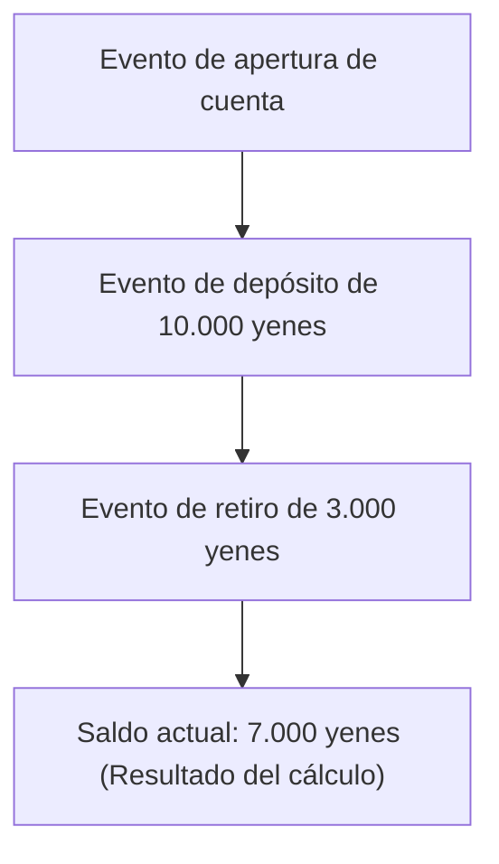
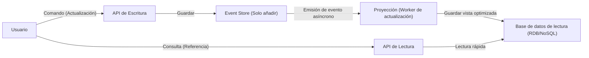

En el complejo desarrollo de software moderno, cómo gestionar los datos y el estado es un tema fundamental de la arquitectura. Muchos sistemas han adoptado tradicionalmente el modelado de datos basado en "CRUD (Crear, Leer, Actualizar, Eliminar)". Sin embargo, a medida que los requisitos empresariales se vuelven más sofisticados, aumentan los casos en los que se hacen evidentes las limitaciones del CRUD.

En este artículo, profundizaremos en el "Event Sourcing (Eventos como Fuente de Verdad)", que en lugar de sobrescribir el estado actual, registra los "hechos que ocurrieron en el sistema (Eventos)" como un historial inmutable, y el indispensable "CQRS (Separación de Responsabilidades de Comandos y Consultas)". Exploraremos desde sus conceptos y ventajas, hasta los desafíos de la consistencia eventual.

## 1. Los límites de la arquitectura CRUD: La "pérdida del pasado" por sobrescritura

En una arquitectura CRUD típica, las tablas de la base de datos mantienen el "estado actual más reciente". Por ejemplo, al actualizar la información de un usuario en un sitio de comercio electrónico, si cambia su dirección, la columna "dirección" de la base de datos se actualiza con un `UPDATE` al nuevo valor.

Este enfoque es intuitivo y fácil de implementar. Sin embargo, tiene un defecto fatal: "se pierden los datos del pasado".

La sobrescritura del estado mediante CRUD borra por completo la siguiente información del sistema:
* **¿Con qué intención se realizó el cambio?** (¿Fue solo la corrección de un error tipográfico o realmente se mudó?)
* **¿Cuándo y a través de qué transformaciones se llegó al estado actual?**
* **¿Cuál era el estado de los datos en un momento específico del pasado?**

En sistemas con requisitos estrictos de auditoría, análisis de datos históricos para aprendizaje automático, o dominios que requieren rastrear reglas de negocio complejas, esta "pérdida del pasado" es un gran obstáculo. Existen soluciones alternativas como la creación de tablas de historial (History Tables), pero no resuelven el problema de fondo y son la causa de disparadores (triggers) complejos y lógica redundante.

## 2. Event Sourcing: El enfoque de "solo añadir" aprendido de los sistemas contables

Para superar los límites de CRUD, se adopta el "Event Sourcing". La idea fundamental de este patrón es "en lugar de guardar el estado actual, se guarda una secuencia de los 'eventos de dominio' que causaron el cambio de estado, de forma exclusiva mediante adición (Append-only)".

El ejemplo más clásico y fácil de entender es el "libro mayor (Ledger)" de contabilidad.
Imagina el sistema de cuentas de un banco. Ningún banco guarda un solo número que represente el "saldo actual" de la cuenta y lo sobrescribe cada vez que hay un depósito o retiro. En su lugar, se registra un **historial de transacciones (eventos)** completo: "Depósito de 10.000 yenes", "Retiro de 3.000 yenes", "Cargo por comisión de 200 yenes". El saldo actual se deriva sumando (reproduciendo o "replaying") estos eventos en orden desde el principio.

### Principales ventajas del Event Sourcing

1. **Asegurar un registro de auditoría completo (Audit Log)**
   Dado que todos los cambios se persisten como eventos, se obtiene naturalmente una pista de auditoría completa. Queda registrado de forma irreversible "quién, cuándo y qué hizo".

2. **Restauración a cualquier momento en el tiempo (Time-Travel Debugging)**
   Al reproducir la secuencia de eventos hasta una marca de tiempo específica, el sistema puede restaurarse exactamente al estado de cualquier momento pasado. Esta es un arma poderosa para investigar errores y validar reglas de negocio en momentos anteriores.

3. **Preservación de la intención (Intention)**
   No se guarda simplemente que "A cambió a B", sino hechos con una intención empresarial clara, como "Se agregó un producto al carrito" o "Se completó el pago (checkout)".

4. **Alto rendimiento gracias a la escritura de "solo añadir"**
   Al no realizar UPDATE o DELETE y realizar siempre y únicamente INSERT (añadir), se reducen los conflictos de bloqueo en la base de datos, logrando un rendimiento de escritura (throughput) extremadamente alto.

## 3. La inevitabilidad de CQRS: ¿Por qué es necesaria la separación?

Aunque el Event Sourcing es excelente para la escritura (cambio y registro del estado), causa problemas graves en la "lectura (consultas)".

Para una consulta simple como "Dime la dirección actual del usuario", el Event Sourcing tendría que obtener todos los eventos comenzando desde el "evento de registro de usuario" hasta todos los "eventos de cambio de dirección", y aplicarlos (reproducirlos) en memoria para construir el estado actual en cada solicitud. Si los eventos alcanzan los millones, esto no es viable desde el punto de vista del rendimiento.

Aquí es donde entra en juego **CQRS (Command Query Responsibility Segregation: Separación de Responsabilidades de Comandos y Consultas)**.
CQRS es un patrón de arquitectura que separa completamente el "modelo que actualiza la información (Comando)" del "modelo que lee la información (Consulta)" del sistema.

Cuando se adopta Event Sourcing, CQRS se vuelve casi **obligatorio**.
* **Modelo de Escritura (Lado de Comandos)**: Almacén de eventos (Event Store). Se especializa únicamente en aplicar las reglas de negocio del dominio y en añadir y guardar los eventos validados.
* **Modelo de Lectura (Lado de Consultas)**: Proyección. Se suscribe a los eventos que fluyen desde el Event Store y construye/actualiza vistas optimizadas (el estado actual) en el formato requerido por la interfaz de usuario (UI) o API.

Al separar de esta manera, el lado de la lectura puede proporcionar respuestas extremadamente rápidas, ya que solo necesita devolver los datos desde vistas preconstruidas sin realizar cálculos o JOINs complejos.

## 4. Proyecciones asíncronas y el desafío de la consistencia eventual (Eventual Consistency)

La arquitectura que combina CQRS y Event Sourcing (ES/CQRS) es poderosa, pero no es una "bala de plata". El mayor desafío que enfrenta el sistema es la **consistencia eventual (Eventual Consistency)**.

Existe un retraso (normalmente de unos pocos milisegundos a varios segundos) desde que se guarda un evento en el Event Store en el lado de Comandos hasta que se actualiza asincrónicamente la base de datos (proyección) en el lado de Lectura.
Este es el problema de la "lectura obsoleta" (Stale Read), donde, en el momento en que un usuario presiona el "botón de actualizar" y la pantalla se recarga, la base de datos de lectura aún no se ha actualizado y se muestran datos antiguos.

### Enfoques para abordar este desafío

Para hacer frente a esta consistencia eventual, se necesitan enfoques tanto técnicos como de experiencia de usuario (UX).

1. **Adopción de UI optimista (Mejora de UX)**
   En el lado del cliente (frontend), no se espera el resultado devuelto por el servidor, sino que se asume el éxito y se actualiza la interfaz de usuario de inmediato.

2. **Notificaciones de actualización mediante Polling o WebSocket**
   Se notifica al cliente mediante push (por ejemplo, a través de WebSocket) de que la proyección se ha completado y el modelo de lectura se ha actualizado, para luego indicarle que refresque la pantalla.

3. **Verificación de versión (Número de revisión)**
   El cliente retiene el número de versión del último comando ejecutado, y al llamar a la API de lectura solicita: "Devuélveme los datos que sean al menos de la versión X o superior". El backend espera hasta alcanzar esa versión o incita al polling.

## 5. Conclusión

Event Sourcing y CQRS son paradigmas poderosos para superar las limitaciones de la arquitectura CRUD y responder a la escalabilidad, el mantenimiento de un historial completo y los requisitos empresariales complejos.

Al entender el estado no como "puntos" sino como "líneas (la trayectoria de los eventos)", los datos trascienden de un simple registro a convertirse en la fuente que relata la "verdad del negocio". A cambio, se debe enfrentar un aumento en la complejidad de todo el sistema y los desafíos propios de los sistemas distribuidos, como la consistencia eventual.

Esta arquitectura no es adecuada para todos los proyectos. Sin embargo, en dominios donde los hechos pasados tienen un valor absoluto, como en finanzas, gestión de pedidos en comercio electrónico, y seguimiento logístico, puede ser el arma más poderosa disponible. Determinar con precisión los requisitos del sistema y la complejidad del dominio, y aplicar este patrón en los lugares adecuados, es donde un arquitecto demuestra su verdadera habilidad.
