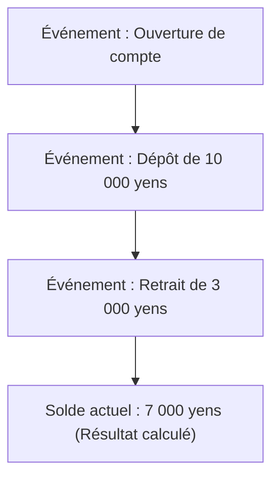
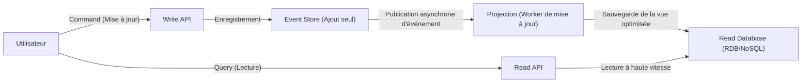

Dans le développement logiciel complexe moderne, la manière dont nous gérons les données et l'état est un thème fondamental de l'architecture. De nombreux systèmes ont traditionnellement adopté la modélisation des données basée sur le "CRUD (Create, Read, Update, Delete)". Cependant, à mesure que les exigences commerciales deviennent plus sophistiquées, les limites du CRUD deviennent de plus en plus apparentes.

Dans cet article, nous explorerons en profondeur l'"Event Sourcing", qui enregistre les "faits qui se sont produits dans le système (Events)" comme un historique immuable plutôt que d'écraser l'état actuel (State), et le "CQRS (Command Query Responsibility Segregation)", qui est essentiel à ce processus, de ses concepts à ses avantages, et même aux défis de la cohérence à terme.

## 1. Les limites de l'architecture CRUD : La "perte du passé" par écrasement

Dans une architecture CRUD typique, les tables de la base de données conservent l'"état actuel le plus récent". Par exemple, lors de la mise à jour des informations utilisateur sur un site de commerce électronique, si l'adresse change, la colonne "adresse" de la base de données est `UPDATE` avec la nouvelle valeur.

Cette approche est intuitive et facile à implémenter. Cependant, elle présente un défaut fatal : "les données du passé sont perdues".

L'écrasement de l'état par le CRUD efface complètement les informations suivantes du système :
* **Quelle était l'intention derrière le changement ?** (S'agissait-il d'une simple correction de faute de frappe, ou la personne a-t-elle vraiment déménagé ?)
* **Quand et par quelles transitions l'état actuel a-t-il été atteint ?**
* **Quel était l'état des données à un moment précis du passé ?**

Dans les systèmes ayant des exigences strictes en matière d'audit, dans l'analyse de données passées pour l'apprentissage automatique, ou dans les domaines nécessitant le suivi de règles métier complexes, cette "perte du passé" constitue un obstacle majeur. Bien qu'il existe des solutions de contournement consistant à créer des tables d'historique (History Table) séparées, ce n'est pas une solution fondamentale et cela cause souvent la création de déclencheurs (triggers) complexes ou d'une logique redondante.

## 2. Event Sourcing : L'approche "Append-only" (Ajout seul) inspirée des systèmes comptables

L'"Event Sourcing" est adopté pour surmonter les limites du CRUD. L'idée fondamentale de ce modèle n'est pas d'enregistrer l'état actuel, mais de sauvegarder la séquence des "événements du domaine (domain events)" qui ont causé le changement d'état uniquement par ajouts (Append-only).

L'exemple le plus classique et le plus simple à comprendre est le "grand livre comptable (Ledger)".
Imaginez un système de compte bancaire. Aucune banque ne sauvegarde uniquement un seul chiffre appelé "solde actuel" du compte et ne l'écrase à chaque dépôt ou retrait. Au lieu de cela, elle enregistre **l'historique de toutes les transactions (événements)** telles que "Dépôt de 10 000 yens", "Retrait de 3 000 yens" et "Déduction des frais de 200 yens". Le solde actuel est dérivé en agrégeant (rejouant) ces événements dans l'ordre depuis le début.

### Principaux avantages de l'Event Sourcing

1. **Garantie d'une piste d'audit complète (Audit Log)**
   Puisque tous les changements sont persistés sous forme d'événements, une piste d'audit complète est naturellement obtenue. "Qui a fait quoi, et quand" est enregistré de manière irréversible.

2. **Restauration à n'importe quel moment (Time-Travel Debugging)**
   En rejouant la séquence d'événements jusqu'à un horodatage spécifique, le système peut être restauré exactement dans l'état où il se trouvait à n'importe quel moment du passé. C'est une arme puissante pour la recherche de bugs et la vérification des règles métier à des moments précis du passé.

3. **Préservation de l'intention**
   Au lieu de simplement "A est devenu B", des faits avec des intentions commerciales claires tels que "Article ajouté au panier" ou "Paiement terminé" sont enregistrés.

4. **Hautes performances grâce aux écritures "Append-only"**
   Puisqu'aucune opération UPDATE ou DELETE n'est effectuée et que seules des opérations INSERT (ajout) sont systématiquement réalisées, la contention de verrouillage de la base de données est réduite, permettant un débit d'écriture extrêmement élevé.

## 3. La nécessité du CQRS : Pourquoi la séparation est-elle nécessaire ?

Bien que l'Event Sourcing soit exceptionnel en écriture (changement d'état et enregistrement), il pose de sérieux problèmes en "lecture (Query)".

Pour une simple requête telle que "Quelle est l'adresse actuelle de l'utilisateur ?", l'Event Sourcing nécessiterait de récupérer chaque événement en commençant par "l'événement d'inscription de l'utilisateur" jusqu'à tous les "événements de changement d'adresse", de les appliquer (rejouer) en mémoire, et de reconstruire l'état actuel à chaque fois. Si les événements se comptent par millions, cela n'est pas réaliste en termes de performances.

C'est là qu'intervient le **CQRS (Command Query Responsibility Segregation : Séparation des responsabilités de commande et requête)**.
Le CQRS est un modèle d'architecture qui sépare complètement le "modèle de mise à jour des informations (Command)" du système du "modèle de lecture des informations (Query)".

Lors de l'adoption de l'Event Sourcing, le CQRS devient presque **obligatoire**.
* **Write Model (Côté Command)** : Le magasin d'événements (Event Store). Il est exclusivement dédié à l'application des règles métier du domaine et à l'ajout/enregistrement des événements validés.
* **Read Model (Côté Query)** : Projections. Il s'abonne aux événements circulant depuis l'Event Store, construit et met à jour des vues optimisées (l'état actuel) dans le format requis par l'interface utilisateur (UI) ou l'API.

En séparant ces responsabilités, le côté lecture n'a plus besoin d'effectuer de JOIN complexes ou de calculs. Il lui suffit de renvoyer les données à partir d'une vue pré-construite, ce qui permet d'obtenir des temps de réponse extrêmement rapides.

## 4. Projections asynchrones et le défi de la cohérence à terme (Eventual Consistency)

L'architecture combinant CQRS et Event Sourcing (ES/CQRS) est puissante, mais ce n'est pas une "solution miracle". Le plus grand défi auquel le système est confronté est la **cohérence à terme (Eventual Consistency)**.

Il y a un décalage temporel (généralement de quelques millisecondes à quelques secondes) entre le moment où l'événement est sauvegardé dans le magasin côté Command et le moment où la base de données côté Read (projection) est mise à jour de manière asynchrone.
Si un utilisateur appuie sur le "bouton de mise à jour" et que la page est rechargée instantanément, la base de données côté Read pourrait ne pas être encore à jour, ce qui entraîne le problème de la "Stale Read" (lecture obsolète) où les anciennes données sont affichées.

### Approches pour relever le défi

Il faut des approches techniques et d'UX (expérience utilisateur) pour gérer cette cohérence à terme.

1. **Adoption d'une interface utilisateur optimiste (Optimistic UI - Amélioration UX)**
   Côté client (front-end), au lieu d'attendre la réponse du serveur, l'interface utilisateur est mise à jour immédiatement en supposant que l'action a réussi.

2. **Notifications de mise à jour via Polling ou WebSockets**
   Une fois la projection terminée et le modèle Read mis à jour, une notification push est envoyée au client via WebSocket, etc., après quoi l'écran est actualisé.

3. **Vérification de version (Numéro de révision)**
   Le client conserve le numéro de version de la dernière commande qu'il a effectuée, et lorsqu'il appelle l'API de lecture, il demande : "Veuillez renvoyer des données à partir d'au moins la version X". Le backend attend d'atteindre cette version ou invite le client à refaire une demande (polling).

## 5. Résumé

L'Event Sourcing et le CQRS sont des paradigmes puissants pour dépasser les limites de l'architecture CRUD et répondre aux exigences d'évolutivité, de conservation de l'historique complet et de règles métier complexes.

En considérant l'état non pas comme un "point" mais comme une "ligne (une trajectoire d'événements)", les données sont sublimées, passant de simples enregistrements à une source qui raconte la "vérité du métier". En contrepartie, vous devez faire face à la complexité accrue du système global et au défi inhérent de la cohérence à terme, propre aux systèmes distribués.

Cette architecture ne convient pas à tous les projets. Cependant, dans les domaines où les faits passés ont une valeur absolue, comme la finance, la gestion des commandes de commerce électronique et le suivi logistique, elle sera l'arme la plus puissante imaginable. Évaluer précisément les exigences du système et la complexité du domaine, et appliquer ce modèle aux bons endroits, voilà où un architecte peut véritablement démontrer son savoir-faire.
