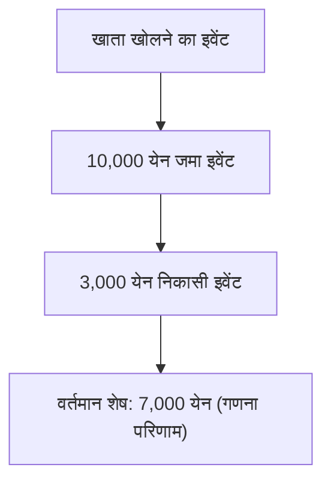
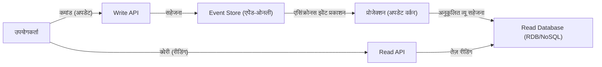

आधुनिक और जटिल सॉफ्टवेयर विकास में, डेटा और स्थिति (State) का प्रबंधन कैसे किया जाए, यह आर्किटेक्चर का एक मूलभूत विषय है। कई सिस्टम पारंपरिक रूप से "CRUD (क्रिएट, रीड, अपडेट, डिलीट)" पर आधारित डेटा मॉडलिंग अपनाते आए हैं। हालाँकि, जैसे-जैसे व्यावसायिक आवश्यकताएं अधिक परिष्कृत होती जा रही हैं, ऐसे मामलों की संख्या बढ़ रही है जहाँ CRUD की सीमाएं उजागर हो रही हैं।

इस लेख में, हम "इवेंट सोर्सिंग (Event Sourcing)" पर गहराई से विचार करेंगे - जो वर्तमान स्थिति (State) को ओवरराइट करने के बजाय "सिस्टम में घटित तथ्यों (Event)" को एक अपरिवर्तनीय इतिहास के रूप में रिकॉर्ड करता है। साथ ही, इसके लिए अपरिहार्य "CQRS (कमांड क्वेरी रिस्पॉन्सिबिलिटी सेग्रीगेशन)" की अवधारणा, इसके लाभ और इवेंचुअल कंसिस्टेंसी (Eventual Consistency) की चुनौतियों पर भी विस्तार से चर्चा करेंगे।

## 1. CRUD आर्किटेक्चर की सीमाएं: ओवरराइटिंग के कारण "अतीत का खो जाना"

सामान्य CRUD आर्किटेक्चर में, डेटाबेस टेबल "वर्तमान नवीनतम स्थिति" को बनाए रखती है। उदाहरण के लिए, जब किसी ई-कॉमर्स साइट पर उपयोगकर्ता की जानकारी अपडेट की जाती है, यदि पता बदलता है, तो डेटाबेस में "पता" कॉलम को एक नए मूल्य के साथ `UPDATE` कर दिया जाता है।

यह दृष्टिकोण सहज है और इसे लागू करना भी आसान है। लेकिन, इसमें एक गंभीर खामी मौजूद है: "पिछले डेटा का खो जाना"।

CRUD के माध्यम से स्थिति (State) को ओवरराइट करने से सिस्टम से निम्नलिखित जानकारी पूरी तरह से मिट जाती है:
* **परिवर्तन किस इरादे से किया गया था?** (क्या यह केवल टाइपो सुधार था, या उपयोगकर्ता वास्तव में नए पते पर चला गया?)
* **डेटा कब और किन बदलावों के माध्यम से अपनी वर्तमान स्थिति में पहुँचा?**
* **अतीत में एक विशिष्ट समय पर डेटा की स्थिति क्या थी?**

कड़े ऑडिट आवश्यकताओं वाले सिस्टम, मशीन लर्निंग के लिए पिछले डेटा के विश्लेषण, या जटिल व्यावसायिक नियमों को ट्रैक करने की आवश्यकता वाले डोमेन में, यह "अतीत का खो जाना" एक बड़ी बाधा बन जाता है। अलग से एक इतिहास तालिका (History Table) स्थापित करने का एक वर्कअराउंड (विकल्प) भी मौजूद है, लेकिन यह कोई मौलिक समाधान नहीं है, और यह जटिल ट्रिगर्स और निरर्थक लॉजिक उत्पन्न करने का कारण बनता है।

## 2. इवेंट सोर्सिंग: अकाउंटिंग सिस्टम से सीखा गया "एपेंड-ओनली (केवल जोड़ें)" दृष्टिकोण

CRUD की सीमाओं को दूर करने के लिए "इवेंट सोर्सिंग" को अपनाया जाता है। इस पैटर्न का मूलभूत विचार है: "वर्तमान स्थिति को सहेजने के बजाय, स्थिति में परिवर्तन का कारण बनने वाले 'डोमेन इवेंट्स' के अनुक्रम को केवल जोड़कर (Append-only) सहेजना।"

इसका सबसे क्लासिक और आसानी से समझा जाने वाला उदाहरण "लेखांकन का बहीखाता (Ledger)" है।
एक बैंक खाता प्रणाली की कल्पना करें। कोई भी बैंक खाते के "वर्तमान शेष (Balance)" के रूप में केवल एक संख्या को सहेज कर नहीं रखता है जिसे हर बार जमा या निकासी होने पर ओवरराइट किया जाए। इसके बजाय, यह "10,000 येन जमा", "3,000 येन की निकासी", और "200 येन शुल्क की कटौती" जैसे **लेन-देन (इवेंट्स) का इतिहास** पूरी तरह से रिकॉर्ड करता है। वर्तमान शेष राशि को इन इवेंट्स को शुरू से क्रमिक रूप से एकत्रित (रीप्ले) करके निकाला जाता है।

### इवेंट सोर्सिंग के प्रमुख लाभ

1. **संपूर्ण ऑडिट लॉग (Audit Log) सुरक्षित करना**
   चूँकि सभी परिवर्तन इवेंट्स के रूप में स्थायी रूप से सहेजे जाते हैं, इसलिए एक संपूर्ण ऑडिट ट्रेल स्वाभाविक रूप से प्राप्त हो जाती है। "किसने, कब, और क्या किया" एक अपरिवर्तनीय रूप में बना रहता है।

2. **किसी भी समय बिंदु पर पुनर्स्थापना (Time-Travel Debugging)**
   इवेंट्स के अनुक्रम को एक विशिष्ट टाइमस्टैम्प तक रीप्ले करके, सिस्टम को अतीत के किसी भी समय की सटीक स्थिति में पुनर्स्थापित किया जा सकता है। यह बग जांचने और पिछले समय के बिंदुओं पर व्यावसायिक नियमों को सत्यापित करने के लिए एक शक्तिशाली हथियार है।

3. **इरादे (Intention) का संरक्षण**
   यह केवल यह नहीं बताता कि "A, B में बदल गया", बल्कि यह व्यावसायिक दृष्टि से स्पष्ट इरादों वाले तथ्यों को सहेजता है, जैसे "कार्ट में उत्पाद जोड़ा गया" या "चेकआउट पूरा किया गया"।

4. **केवल-जोड़ने (Append-only) की विधि के कारण उच्च प्रदर्शन**
   चूँकि यह UPDATE या DELETE नहीं करता है और हमेशा केवल INSERT (जोड़ना) करता है, इससे डेटाबेस लॉक विवाद कम हो जाते हैं और बहुत उच्च राइट (write) थ्रूपुट प्राप्त किया जा सकता है।

## 3. CQRS की अनिवार्यता: पृथक्करण (Separation) क्यों आवश्यक है?

इवेंट सोर्सिंग राइटिंग (स्थिति बदलने और रिकॉर्ड करने) में उत्कृष्ट है, लेकिन यह "रीडिंग (क्वेरी)" के मामले में गंभीर समस्याएं पैदा करता है।

"कृपया उपयोगकर्ता का वर्तमान पता बताएं" जैसी सरल क्वेरी के लिए, इवेंट सोर्सिंग को हर बार "उपयोगकर्ता पंजीकरण इवेंट" से शुरू करके सभी "पता परिवर्तन इवेंट्स" प्राप्त करने होते हैं और वर्तमान स्थिति के निर्माण के लिए उन्हें मेमोरी में लागू (रीप्ले) करना होता है। यदि इवेंट्स लाखों की संख्या में हों, तो यह व्यावहारिक प्रदर्शन (Performance) नहीं देगा।

यहीं पर **CQRS (कमांड क्वेरी रिस्पॉन्सिबिलिटी सेग्रीगेशन)** सामने आता है।
CQRS एक ऐसा आर्किटेक्चर पैटर्न है जो सिस्टम के "सूचना अपडेट करने वाले मॉडल (कमांड)" और "सूचना पढ़ने वाले मॉडल (क्वेरी)" को पूरी तरह से अलग कर देता है।

जब इवेंट सोर्सिंग अपनाया जाता है, तो CQRS लगभग **अनिवार्य** हो जाता है।
* **राइट मॉडल (कमांड साइड)**: इवेंट स्टोर। यह डोमेन के व्यावसायिक नियमों को लागू करने और केवल सत्यापित इवेंट्स को जोड़ने और सहेजने में माहिर है।
* **रीड मॉडल (क्वेरी साइड)**: प्रोजेक्शन। यह इवेंट स्टोर से आने वाले इवेंट्स की सदस्यता लेता है (subscribe करता है) और UI या API द्वारा आवश्यक प्रारूप में अनुकूलित व्यू (वर्तमान स्थिति) बनाता और अपडेट करता है।

इस प्रकार अलग करने से, रीडिंग साइड (पढ़ने वाले हिस्से) को जटिल JOIN या गणना किए बिना केवल पूर्व-निर्मित व्यू से डेटा वापस करना होता है, जिससे अत्यंत तेज़ प्रतिक्रिया (Response) प्राप्त की जा सकती है।

## 4. एसिंक्रोनस प्रोजेक्शन और इवेंचुअल कंसिस्टेंसी की चुनौती (Eventual Consistency)

CQRS और इवेंट सोर्सिंग (ES/CQRS) का संयुक्त आर्किटेक्चर शक्तिशाली है, लेकिन यह कोई "सिल्वर बुलेट" (जादुई समाधान) नहीं है। सबसे बड़ी चुनौती जिसका सिस्टम को सामना करना पड़ता है, वह है **इवेंचुअल कंसिस्टेंसी (Eventual Consistency)**।

कमांड साइड पर स्टोर में इवेंट सहेजे जाने और असिंक्रोनस रूप से रीड साइड के डेटाबेस (प्रोजेक्शन) के अपडेट होने के बीच एक टाइम लैग (आमतौर पर कुछ मिलीसेकंड से लेकर कुछ सेकंड तक) होता है।
यह "स्टेल रीड (Stale Read)" की समस्या है, जहाँ उपयोगकर्ता "अपडेट बटन" दबाता है और उसी क्षण स्क्रीन पुनः लोड हो जाती है, जबकि रीड साइड का DB अभी तक अपडेट नहीं हुआ होता है और पुराना डेटा प्रदर्शित हो जाता है।

### चुनौतियों से निपटने के दृष्टिकोण

इस इवेंचुअल कंसिस्टेंसी के लिए तकनीकी और UX (उपयोगकर्ता अनुभव) दोनों ही दृष्टिकोणों की आवश्यकता होती है।

1. **ऑप्टिमिस्टिक UI को अपनाना (UX इनोवेशन)**
   क्लाइंट (फ्रंट-एंड) साइड पर, सर्वर से परिणाम वापस आने की प्रतीक्षा करने के बजाय, यह मान लिया जाता है कि क्रिया सफल हुई है और UI को तुरंत अपडेट कर दिया जाता है।

2. **पोलिंग या वेबसॉकेट द्वारा अपडेट नोटिफिकेशन**
   प्रोजेक्शन पूरा होने और रीड मॉडल अपडेट होने के बाद, वेबसॉकेट आदि के माध्यम से क्लाइंट को पुश नोटिफिकेशन भेजा जाता है, और फिर स्क्रीन रिफ्रेश की जाती है।

3. **संस्करण (Version) की जाँच (रिवीजन संख्या)**
   क्लाइंट सबसे हाल ही में निष्पादित कमांड का संस्करण नंबर रखता है, और रीड API को कॉल करते समय अनुरोध करता है कि "कम से कम संस्करण X या उसके बाद का डेटा वापस करें"। बैकएंड उस संस्करण तक पहुंचने तक प्रतीक्षा करता है या पोलिंग का संकेत देता है।

## 5. निष्कर्ष

इवेंट सोर्सिंग और CQRS CRUD आर्किटेक्चर की सीमाओं को पार करने और स्केलेबिलिटी, संपूर्ण इतिहास को बनाए रखने और जटिल व्यावसायिक आवश्यकताओं को पूरा करने के लिए शक्तिशाली प्रतिमान (पैराडाइम) हैं।

स्थिति (State) को केवल एक "बिंदु (Point)" के बजाय एक "रेखा (इवेंट्स का पथ)" के रूप में देखकर, डेटा केवल रिकॉर्ड होने से बढ़कर "व्यावसायिक सत्य" को बयां करने वाले स्रोत में उन्नत हो जाता है। इसकी कीमत के रूप में, पूरे सिस्टम की बढ़ती जटिलता और इवेंचुअल कंसिस्टेंसी जैसी वितरित प्रणालियों (Distributed Systems) की विशिष्ट चुनौतियों का सामना करना पड़ता है।

यह आर्किटेक्चर सभी परियोजनाओं के लिए उपयुक्त नहीं है। हालाँकि, वित्त, ई-कॉमर्स ऑर्डर प्रबंधन, और लॉजिस्टिक्स ट्रैकिंग जैसे डोमेन में, जहाँ पिछले तथ्यों का पूर्ण मूल्य होता है, यह एक बेहद शक्तिशाली हथियार साबित होगा। सिस्टम की आवश्यकताओं और डोमेन की जटिलता का सटीक आकलन करना, और इस पैटर्न को उपयुक्त स्थानों पर लागू करना ही एक आर्किटेक्ट के कौशल की सच्ची पहचान है।
