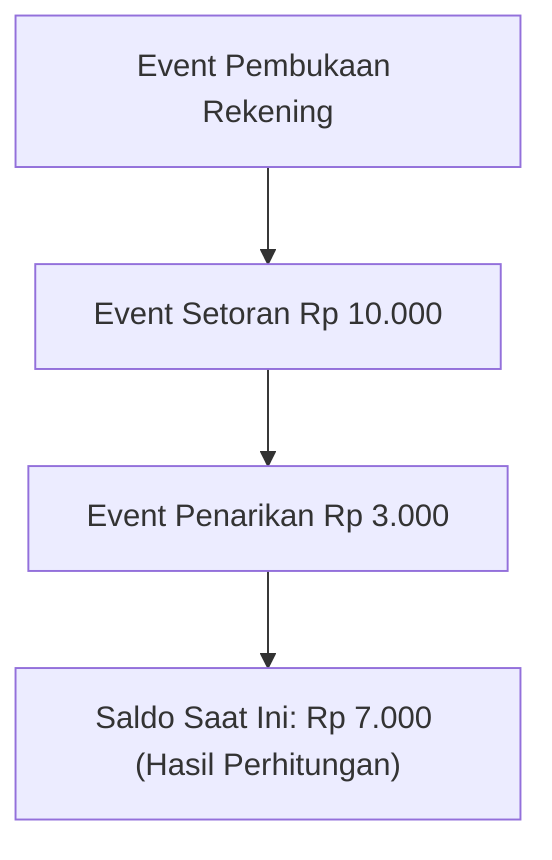
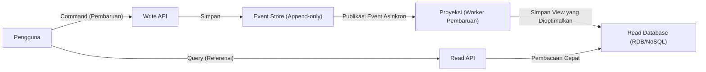

Dalam pengembangan perangkat lunak modern yang kompleks, cara mengelola data dan *state* (status) adalah tema fundamental dari sebuah arsitektur. Banyak sistem secara tradisional mengadopsi pemodelan data berdasarkan "CRUD (Create, Read, Update, Delete)". Namun, seiring dengan semakin kompleksnya kebutuhan bisnis, semakin banyak kasus di mana keterbatasan CRUD mulai terlihat dengan jelas.

Artikel ini akan membahas secara mendalam tentang "Event Sourcing", di mana kita tidak menimpa status (State) saat ini, melainkan terus merekam "fakta yang terjadi dalam sistem (Event)" sebagai riwayat yang tidak dapat diubah (immutable). Kita juga akan membahas "CQRS (Command Query Responsibility Segregation)" yang sangat penting untuk pendekatan ini, mulai dari konsepnya, keuntungannya, hingga tantangan konsistensi akhir (eventual consistency).

## 1. Keterbatasan Arsitektur CRUD: "Kehilangan Masa Lalu" akibat Penimpaan

Dalam arsitektur CRUD pada umumnya, tabel basis data menyimpan "status terbaru saat ini". Misalnya, saat memperbarui informasi pengguna di situs e-commerce, jika alamat berubah, kolom "alamat" di basis data akan diperbarui (`UPDATE`) dengan nilai baru.

Pendekatan ini sangat intuitif dan mudah diimplementasikan. Namun, terdapat kelemahan yang fatal: "data masa lalu akan hilang".

Penimpaan status dengan CRUD akan sepenuhnya menghapus informasi berikut dari sistem:
* **Apa niat di balik perubahan tersebut?** (Apakah sekadar perbaikan salah ketik, atau pengguna benar-benar pindah rumah?)
* **Kapan dan melalui proses perubahan seperti apa hingga mencapai status saat ini?**
* **Bagaimana status data pada titik waktu tertentu di masa lalu?**

Dalam sistem yang memiliki persyaratan audit yang ketat, analisis data masa lalu untuk *machine learning*, atau domain yang perlu melacak aturan bisnis yang kompleks, "kehilangan masa lalu" ini menjadi hambatan yang besar. Meskipun ada solusi alternatif (*workaround*) dengan membuat Tabel Riwayat (*History Table*) secara terpisah, itu bukanlah solusi mendasar dan justru menjadi penyebab munculnya *trigger* yang kompleks dan logika yang berlebihan.

## 2. Event Sourcing: Pendekatan "Append-Only" Belajar dari Sistem Akuntansi

Untuk mengatasi keterbatasan CRUD, kita dapat mengadopsi "Event Sourcing". Ide dasar dari pola ini adalah, "daripada menyimpan status saat ini, kita menyimpan urutan 'Domain Event' yang menjadi penyebab perubahan status secara *append-only* (hanya tambah/tulis-baru)".

Contoh paling klasik dan mudah dipahami adalah "Buku Besar Akuntansi (Ledger)".
Bayangkan sebuah sistem rekening bank. Tidak ada bank yang hanya menyimpan satu angka "saldo saat ini" dari sebuah rekening dan menimpanya setiap kali ada setoran atau penarikan. Sebaliknya, mereka merekam semua **riwayat transaksi (event)** seperti "Setoran Rp 10.000", "Penarikan Rp 3.000", dan "Potongan biaya Rp 200". Saldo saat ini didapatkan dengan menghitung (memutar ulang / *replay*) event-event tersebut secara berurutan dari awal.

### Keuntungan Utama Event Sourcing

1. **Jaminan Log Audit Lengkap (*Audit Log*)**
   Karena semua perubahan disimpan secara persisten sebagai *event*, jejak audit (*audit trail*) yang lengkap akan terbentuk secara otomatis. Fakta tentang "siapa, kapan, dan apa yang dilakukan" akan tersimpan dalam bentuk yang tidak dapat dibatalkan (irreversible).

2. **Pemulihan ke Titik Waktu Tertentu (*Time-Travel Debugging*)**
   Dengan memutar ulang urutan *event* hingga *timestamp* tertentu, kita dapat secara akurat mengembalikan sistem ke status pada titik waktu tertentu di masa lalu. Ini adalah alat yang sangat ampuh untuk investigasi *bug* atau memvalidasi aturan bisnis pada titik waktu yang lalu.

3. **Menyimpan Niat (Intention)**
   Bukan sekadar "A berubah menjadi B", tetapi fakta dengan niat bisnis yang jelas seperti "Barang ditambahkan ke keranjang" atau "*Checkout* diselesaikan" akan disimpan.

4. **Performa Tinggi berkat Penulisan yang Hanya *Append***
   Karena selalu melakukan *INSERT* (tambah baru) tanpa ada *UPDATE* atau *DELETE*, konflik penguncian (*lock contention*) pada basis data berkurang, memungkinkan *throughput* penulisan yang sangat tinggi.

## 3. Keniscayaan CQRS: Mengapa Pemisahan Itu Diperlukan?

Meskipun Event Sourcing sangat luar biasa dalam penulisan (mengubah dan merekam status), ia menimbulkan masalah serius dalam "pembacaan (query)".

Terhadap *query* sederhana seperti "Beri tahu saya alamat pengguna saat ini", Event Sourcing mengharuskan sistem untuk mengambil semua *event* mulai dari "Event Pendaftaran Pengguna" hingga "Event Perubahan Alamat", lalu menerapkannya (*replay*) di memori untuk membangun status saat ini. Jika jumlah *event* mencapai jutaan, ini jelas bukan performa yang realistis.

Di sinilah **CQRS (Command Query Responsibility Segregation / Pemisahan Tanggung Jawab Command dan Query)** masuk.
CQRS adalah pola arsitektur yang sepenuhnya memisahkan "model untuk memperbarui informasi (Command)" dan "model untuk membaca informasi (Query)" di dalam sistem.

Ketika mengadopsi Event Sourcing, CQRS hampir **wajib** digunakan.
* **Write Model (Sisi Command)**: Event Store. Didedikasikan khusus untuk menerapkan aturan bisnis domain dan menyimpan/menambah *event* yang telah divalidasi.
* **Read Model (Sisi Query)**: Proyeksi (Projection). Berlangganan (subscribe) terhadap *event* yang mengalir dari Event Store, kemudian membangun dan memperbarui sebuah *view* (status saat ini) yang dioptimalkan sesuai dengan format yang diminta oleh UI atau API.

Dengan pemisahan ini, sisi pembacaan hanya perlu mengembalikan data dari *view* yang sudah dibangun sebelumnya tanpa perlu melakukan perhitungan atau *JOIN* yang kompleks, sehingga menghasilkan respons yang sangat cepat.

## 4. Proyeksi Asinkron dan Tantangan Konsistensi Akhir (Eventual Consistency)

Arsitektur yang menggabungkan CQRS dan Event Sourcing (ES/CQRS) memang sangat kuat, tetapi ini bukanlah "peluru perak (silver bullet)". Tantangan terbesarnya adalah **konsistensi akhir (Eventual Consistency)** yang akan dihadapi oleh sistem.

Terdapat jeda waktu (*time lag*, biasanya beberapa milidetik hingga beberapa detik) dari saat *event* disimpan di *store* pada sisi Command, hingga basis data (proyeksi) di sisi Read diperbarui secara asinkron.
Momen ketika pengguna menekan "Tombol Perbarui" dan layar dimuat ulang, tetapi DB sisi Read belum diperbarui sehingga menampilkan data lama, inilah yang disebut masalah "Stale Read".

### Pendekatan untuk Mengatasi Tantangan

Untuk mengatasi konsistensi akhir ini, diperlukan pendekatan teknis maupun dari segi pengalaman pengguna (UX).

1. **Mengadopsi Optimistic UI (Trik UX)**
   Di sisi klien (front-end), alih-alih menunggu hasil yang dikembalikan oleh server, sistem mengasumsikan keberhasilan dan segera memperbarui UI.

2. **Notifikasi Pembaruan melalui Polling atau WebSocket**
   Setelah proyeksi selesai dan model Read telah diperbarui, server mengirimkan *push notification* ke klien melalui WebSocket atau sejenisnya, lalu meminta layar untuk dimuat ulang (refresh).

3. **Verifikasi Versi (Nomor Revisi)**
   Klien menyimpan nomor versi dari Command terbaru yang dijalankan, dan saat memanggil Read API, ia meminta: "Tolong kembalikan data dengan setidaknya versi X atau yang lebih baru." Backend akan menunggu hingga mencapai versi tersebut atau menyarankan klien untuk melakukan polling.

## 5. Kesimpulan

Event Sourcing dan CQRS menembus batas arsitektur CRUD, menjadi paradigma yang kuat untuk mencapai skalabilitas, pelestarian riwayat secara utuh, dan menjawab kebutuhan bisnis yang kompleks.

Dengan melihat status sebagai "garis (jejak event)" dan bukan sekadar "titik", data diangkat dari sebuah rekaman biasa menjadi sumber yang menceritakan "kebenaran bisnis". Sebagai gantinya, kita harus menghadapi peningkatan kompleksitas sistem secara keseluruhan serta tantangan khusus dari sistem terdistribusi, yaitu konsistensi akhir.

Arsitektur ini mungkin tidak cocok untuk semua proyek. Namun, dalam domain di mana fakta masa lalu memiliki nilai yang mutlak—seperti keuangan, manajemen pesanan e-commerce, atau pelacakan logistik—ini akan menjadi senjata terkuat. Kemampuan menilai kebutuhan sistem dan kompleksitas domain secara akurat, lalu menerapkan pola ini pada tempat yang tepat, adalah momen di mana seorang arsitek perangkat lunak menunjukkan kehebatannya.
